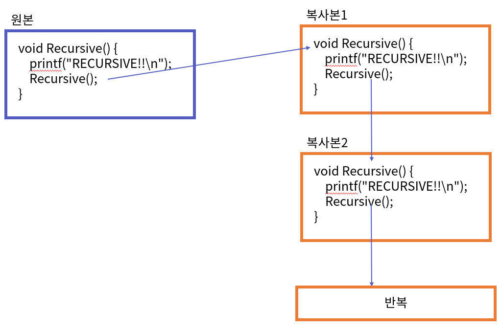
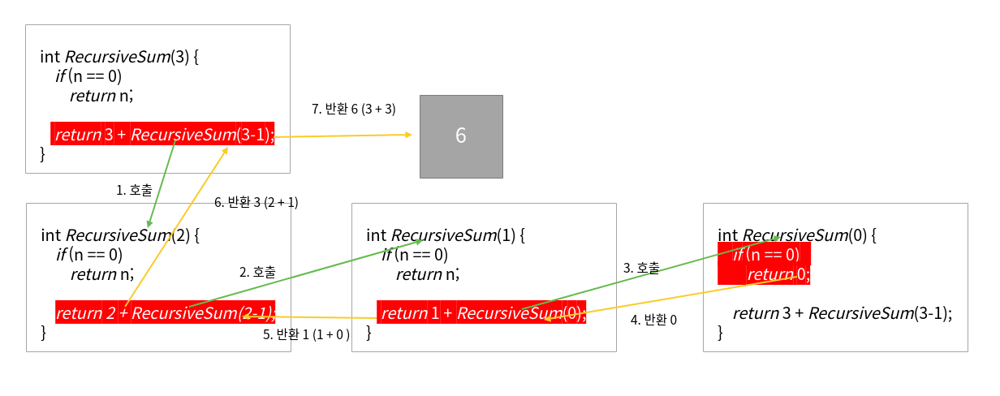
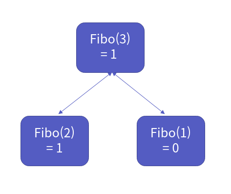
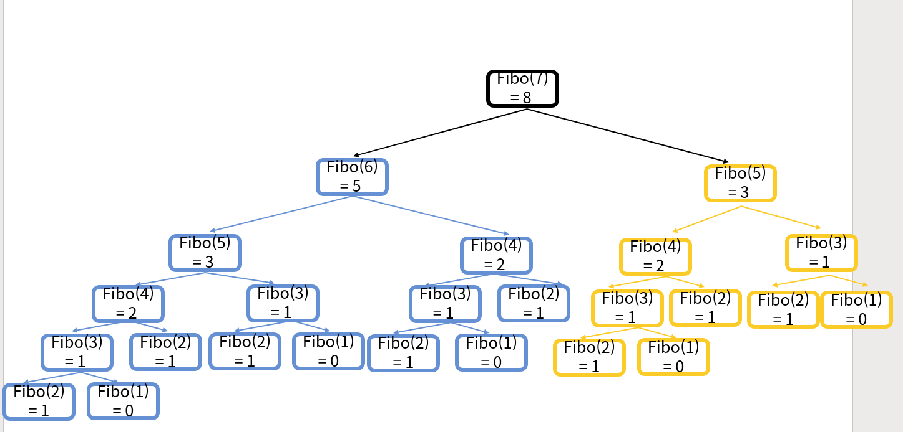

재귀
===========

Contents
-------------------

1. 시작하며...
2. 재귀 함수의 이해
3. 첫 번째 예제 - 팩토리얼
4. 두 번째 예제 - 피보나츠 수열
5. 세 번째 예제 - 이진 탐색
6. 네 번째 예제 - 하노이 탑
7. 마치며...


## 시작하며...

구르미의 "Computer Science 정복하기 - 자료구조"의 두 번째 장입니다. **이번 장의 대부분의 내용은 책 "윤성우의 열혈 자료구조"의 두번째 장 "재귀"의 요약이 주를 이루고 있습니다.**  혹시 이해가 안가는 부분이 있다면 책을 참고해주시면 좋겠습니다. 이 장의 대략적인 내용은 다음과 같습니다. 

* 함수의 재귀적 호출의 이해
* 여러 예제로 알아보는 재귀 함수.

이 장의 소스코드는 다음을 참고해주세요.

    url: https://github.com/gurumee92/datastructure 
    branch: ch02
    code directory: src/ch02

자 시작합시다!


## 재귀 함수의 이해

이번 장에서는 자료구조와 알고리즘의 기본 기법인 "재귀"에 대해서 알아보도록 하겠습니다. 먼저 재귀 함수 (Recursive Function)는 "**자기 자신을 부르는 함수**"입니다. 아주 간단한 예를 살펴볼까요?

src/ch02/ex01.c
```c
void Recursive(){
    printf("RECURSIVE!!\n");
    Recursive();
}
```

위 함수는 무한히 자기 자신을 호출하는 함수입니다. 개발자가 프로그램을 강제 종료하기 전까지 "RECURSIVE!!"라는 문자열을 계속 출력하지요. 어떻게 이런 일이 가능할까요? 

C를 아시는 분이라면, C코드가 추후에 기계어로 변경된다는 사실을 아실 겁니다. 이 기계어들은 1, 0으로 구성되어 있는, 명령어 셋의 집합입니다. 실제 함수가 호출될 때, 함수의 모든 명령어들이 CPU로 복사되어서 실행이 됩니다. 그래서 함수가 호출 될 때마다, 계속 명령어의 복사가 일어나지요. 

사실, 이렇게 말하면, 재귀 함수에 대해 알기가 쉽지 않습니다. 그래서 책은 다음과 같은 문구로 설명하고 있습니다.

    "Recursive 함수를 실행하는 중간에 Recursive 함수가 호출되면, Recursive 함수의 복사본을 하나 더 만들어서 복사본을 실행하게 됩니다."

대략적으로 이런 그림이라고 생각하시면 됩니다.



보통 재귀함수들은 위의 예제처럼 무한 반복되는 것을 벗어나기 위해, 재귀 탈출부와 재귀 호출부로 이루어져 있습니다. 다음 예제를 살펴보시죠.

src/ch02/ex02.c
```c
int RecursiveSum(unsigned int n) {
    // 아래 코드가 재귀 탈출부입니다
    // 만약 n이 0이라면 0을 반환하고 재귀를 멈춥니다.
    if (n == 0)
        return n;

    //재귀 호출부입니다. 재귀로 받은 결과들을 합산합니다.
    return n + RecursiveSum(n-1);
}
```

위 함수는 양수 n까지 즉, 1부터 n까지의 합계를 구하는 함수입니다. n=3 이라고 가정하고 어떻게 재귀 함수 호출이 이루어지는지 살펴보도록 하겠습니다. 

1. n=3, RecursiveSum(2)를 호출합니다.
2. n=2, RecursiveSum(1)를 호출합니다. 
3. n=1, RecursiveSum(0)를 호출합니다.
4. n=0, 0을 반환합니다.
5. n=1, 1과 RecursiveSum(0)의 반환 값 0을 더한 값 1을 반환합니다.
6. n=2, 2와 RecursiveSum(1)의 반환 값 1을 더한 값 3을 반환합니다.
7. n=3, 3과 RecursiveSum(2)의 반환 값 3을 더한 값 6을 반환합니다.

아래 그림은 위 흐름을 표현한 것입니다.



재귀 흐름이 어떻게 동작하는지 대충 감이 잡히셨나요? 그렇다면 이 장은 넘어가셔도 좋습니다! 아니신 분들은 다음 4개의 절의 각 예제를 통해서 재귀 함수 호출에 대해 더 감을 잡아보도록 하겠습니다.


## 첫 번째 예제 - 팩토리얼

팩토리얼을 혹시 아시나요? 수학 용어인데요. 아래는 `나무 위키`에서 따온 팩토리얼의 정의입니다.

    수학 용어. 보통 대한민국에서는 계승(階乗)[1]보다는 factorial [fӕk|tɔ:riəl]을 소리나는 대로 쓴 "팩토리얼"이라고 표기한다. 
    말할 때는 그냥 "팩"이라고 줄여 말한다. 기억이 안 나면 느낌표라고 표현하기도 한다. 문화어로는 차례곱이라고 하는데 1부터 차례대로 
    곱한다는 의미이므로 계승보다 이해하기가 쉽다.

쉽게 말해 다음과 같은 수식을 가집니다.

    n! = n x (n-1) x (n-2) x ... x 2 x 1

만약 n=5라면 3! = 3 x 2 x 1 = 6 이라는 값을 가지지요. 팩토리얼 정의에 따르면 다음과 같이 정의할 수 있습니다.

    n! = 1           [if n ==1]
         n x (n-1)!  [else]

이 수식을 프로그래밍으로 표현해보겠습니다. 팩토리얼의 경우, n=1이라면, 1을 그 외에는 n x (n-1)!을 반환하면 됩니다.

src/ch02/ex03.c
```c
int factorial(int n) {
    if (n == 1)
        return n;

    return n * factorial(n-1);
}
```

아까 본 예제 `RecursiveSum`과 유사한 흐름을 가지고 있습니다. 역시 n=3이라고 가정해보겠습니다.

1. n=3, factorial(2)를 호출합니다.
2. n=2, factorial(1)를 호출합니다.
3. n=1, 1을 반환합니다.
4. n=2, 2 * 1 = 2 (factorial(1) = 1 )을 반환합니다.
5. n=3, 3 * 2 = 6 (factorial(2) = 2 )을 반환합니다.

흐름에 대한 그림은 `RecursiveSum`과 거의 비슷하기 때문에 따로 그리지 않겠습니다. 여러분이 한 번 그려보세요!


## 두 번째 예제 - 피보나츠 수열

이번에는 `피보나츠 수열`에 대해서 프로그래밍적으로 표현해보겠습니다. 피보나츠 수열은 재귀적인 형태를 띠는 대표적인 수열입니다. 다음과 같이 전개되지요.

    0, 1, 1, 2, 3, 5, 8, 13, 21, ...

수열에서 이전 2개의 수를 더한 것이지요. 피보나츠 수열에 따르면, 다음과 같이 표현할 수 있습니다.

    fibonacci(n) = 0                                [n==1]
                   1                                [n==2]
                   fibonacci(n-1) + fibonacci(n-2)  [else]

이제 코드로 표현해볼까요?

src/ch02/ex04.c
```c
int Fibonacci(int n) {
    if (n == 1)
        return 0;
    else if (n == 2)
        return 1;
    else 
        return Fibonacci(n-1) + Fibonacci(n-2);
}
```

이번엔 피보나치 수열의 흐름을 파악해볼까요? 이번에도 n=3이라고 가정해보겠습니다.

1. n=3, Fibonacci(2)을 호출합니다.
2. n=2, 1을 반환합니다.
3. n=3, Fibonacci(1)를 호출합니다.
4. n=1, 0을 반환합니다.
5. n=3, 1 (Fibonacci(2) 반환 값) + 0 (Fibonacci(1) 반환 값) = 1을 반환합니다. 

그림으로 표현하면 다음과 같습니다.



이 경우 n의 크기가 작아서 구분하기가 쉽습니다. 그런데 n=7이라고 가정해볼까요? 쉽게 상상이 되시나요? 그림은 다음과 같습니다. 한 번 스스로 그려보시고 확인해보세요. 



엄청 복잡하지요? 이 정도까지에 순서까지 그리시는 분이라면, 재귀 함수 호출에 대해서 거의 이해를 하셨다고 해도 무방합니다. 

참고적으로 알아 두실 점은 재귀 방식의 피보나츠 수열은 n이 커질수록 엄청나게 느려집니다. 왜냐하면 숫자 n이 커지면 커질수록 반복되는 함수 호출이 엄청 많아지기 때문입니다. 

이럴 경우, 굉장히 성능이 떨어지는데 "Dynamic Programming(동적계획법)"이라고 해서 반복되는 부분을 다른 공간에 저장하여 재활용하는 기법으로 성능을 올릴 수 있습니다. 이거는 추후 알고리즘 파트에서 다루도록 하지요.


## 세 번째 예제 - 이진 탐색

우리가 지난 시간에 만들었던 이진 탐색 역시 재귀적 성격을 띠고 있습니다. 탐색 알고리즘을 확인해볼까요?

src/ch01/ex03.c
```c
int BinarySearch(int arr[], int len, int target){
    
    int start = 0;
    int last = len-1;

    while (start <= last){

        int mid = (start + last) / 2;
        int search = arr[mid];

        if (search == target) {
            return mid;
        } else if (search < target) {
            start = mid + 1;
        } else {
            last = mid - 1;
        }
    }
    
    return -1;
}
```

`반복문`! 즉 다음 부분이 반복됩니다.

1. 탐색 범위의 중앙에 목표 값이 있는지 확인.
2. 저장되지 않았다면, 탐색 범위를 반으로 줄여 다시 탐색.

이 부분을 잘 활용하면, 재귀 함수로 바꿀 수 있습니다. 즉, **반복문과 재귀함수는 동치**입니다. 함수 원형을 보여드릴테니 위 코드를 보시고 한 번 혼자서 재귀 함수 형태로 짜보세요. 참고적으로, 만약 `first > last`라면 반복문을 탈출했듯, 재귀 역시 탈출해야 합니다.

    함수 원형:
    int BinarySearch(int arr[], int first, int last, int target);

코드는 다음과 같습니다.

src/ch02/ex05.c
```c
int BinarySearch(int arr[], int first, int last, int target){
    if (first > last)
        return -1;

    int mid = (first + last) / 2;
    int search = arr[mid];

    if (search == target){
        return mid;
    } else if (search > target) {
        return BinarySearch(arr, first, mid-1, target);
    } else {
        return BinarySearch(arr, mid + 1, last, target);
    }   
}
```

위 코드와 아까 반복문 코드를 비교해서 확인해보세요. 거의 유사하다는 것을 알 수 있습니다. 한 번 이진 탐색에 대한 재귀 호출 순서 흐름도 그려보세요.


## 네 번째 예제 - 하노이 탑

**하노이 탑** 문제 역시 재귀를 대표하는 예제 중 하나입니다. 하노이 탑은 "하나의 막대에 쌓여 있는 원반을 다른 하나의 원반에 그대로 옮기는 방법"에 관한 문제입니다. 이 때 주요한 제약 조건들이 있습니다.

1. 원반은 한 번에 하나씩 옮길 수 있습니다.
2. 옮기는 과정에서 작은 원반 위에, 큰 원반이 올려질 수 없습니다.

따라서 이 문제를 풀기 위해서는 적어도 3개의 막대가 필요합니다. 결론부터 말씀드리면, 하노이 탑을 해결하기 위해서는 다음을 반복해야 합니다.

1. 작은 원반 n-1개를 A -> B로 이동
2. 큰 원반 1개를 A -> C로 이동
3. 작은 원반 n-1개를 B -> C로 이동

한번 3개의 원반이 있다고 가정해보겠습니다. 그러면 이렇게 되겠지요.

1. 원반 1을 A -> C로
2. 원반 2를 A -> B로
3. 원반 1을 C -> B로
4. 원반 3을 A -> C로
5. 원반 1을 B -> A로
6. 원반 2를 B -> C로
7. 원반 1을 A -> C로

여기서 작은 원반 n-1개를 A->B로 옮기는 과정은 1-3번까지입니다. 큰 원반을 목적지로 옮긴 후 나머지 원반을 B->C로 이동하는 것이 5-7번입니다. 이번엔 4개로 해볼까요?

01. 원반 1를 A -> B 이동 
02. 원반 2를 A -> C 이동 
03. 원반 1를 B -> C 이동 
04. 원반 3를 A -> B 이동 
05. 원반 1를 C -> A 이동 
06. 원반 2를 C -> B 이동 
07. 원반 1를 A -> B 이동 
08. 원반 4를 A -> C 이동 
09. 원반 1를 B -> C 이동 
10. 원반 2를 B -> A 이동 
11. 원반 1를 C -> A 이동 
12. 원반 3를 B -> C 이동 
13. 원반 1를 A -> B 이동 
14. 원반 2를 A -> C 이동 
15. 원반 1를 B -> C 이동

여기서 작은 원반 n-1개를 A->B로 옮기는 과정은 1-7번까지입니다. 큰 원반을 목적지로 옮긴 후 나머지 원반을 B->C로 이동하는 것이 9-15번까지입니다. 또한 1-7번은 A -> B로 원반 3개를 옮겨놓는 것입니다. 그래서 목적지만 다르고 앞의 3개로 하노이탑을 옮길 때와 같은 흐름이 나옵니다. 물론 9-15번 역시 B -> C로 목적지만 다르고 흐름은 마찬가지입니다. 여기서 중요한 것은 **흐름이 반복**된다는 것입니다. 이것을 알고리즘으로 표현하면 다음과 같습니다.

1. n==1 from(A) -> to(C)로 옮깁니다.
2. 그 외의 경우는 다음과 같습니다. 
    1. n-1개를 from(A) -> by(B)로 옮깁니다.
    2. 마지막 원반을 from(A) -> to(C)로 옮깁니다.
    3. n-1개를 by(B) -> to(C)로 옮깁니다.

코드는 다음과 같습니다.

src/ch02/ex06.c
```c
void HanoiTowerMove(int num, char from, char by, char to) {
    if (num == 1) {
        //가장 큰 원반을 A->C로
        printf ("원반%d를 %c -> %c 이동 \n", num, from, to);
    } else {
        //나머지 원반을 A->B로
        HanoiTowerMove(num-1, from, to, by);

        printf ("원반%d를 %c -> %c 이동 \n", num, from, to);

        //나머지 원반을 B->C로
        HanoiTowerMove(num-1, by, from, to);
    }
}
```

하노이 탑 역시, 재귀 순서 흐름을 그려보면 이해가 더욱 쉬울 것입니다. (3개까지만 해도 괜찮습니다. 4개 이후부터는 빡세서...)


## 마치며...

이번 장에서 **재귀**에 대해 알아보았습니다. 또한 많은 예제들을 통해서 재귀 호출 흐름이 어떻게 진행되는지 분석해보았습니다. 재귀는 자료구조, 알고리즘에서 자주 쓰이는 기법 중 하나입니다. 메모리 상으로 봤을 때, 함수 호출 스택이 좀 쓰이긴 합니다만, 알고리즘을 코드로 가독성 있게 표현할 수 있다는 것이 큰 장점이 있습니다. 그래서 자주 쓰이므로 익혀두면 좋습니다.

다음 시간에는 자료구조 "리스트"에 대해 공부해보겠습니다.