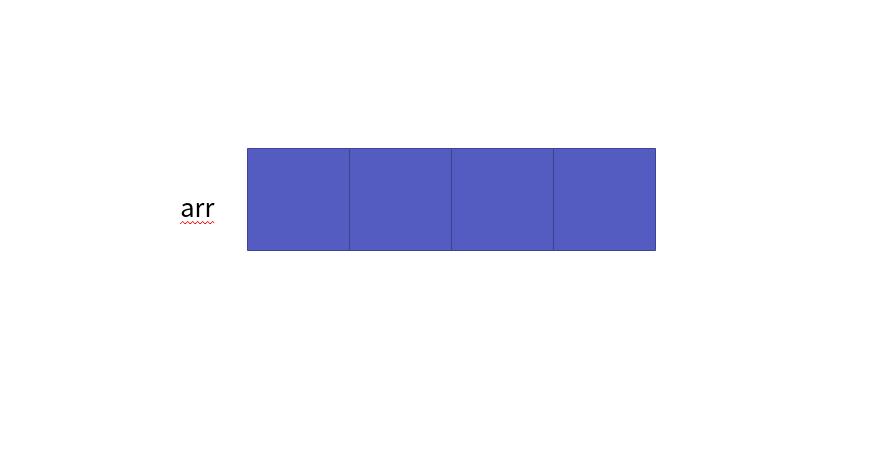
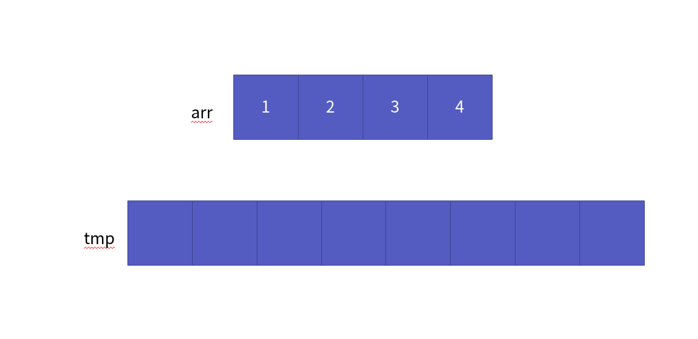
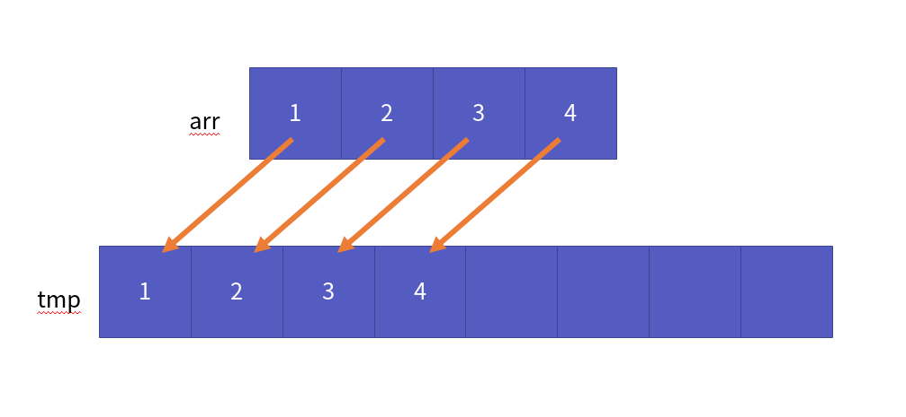
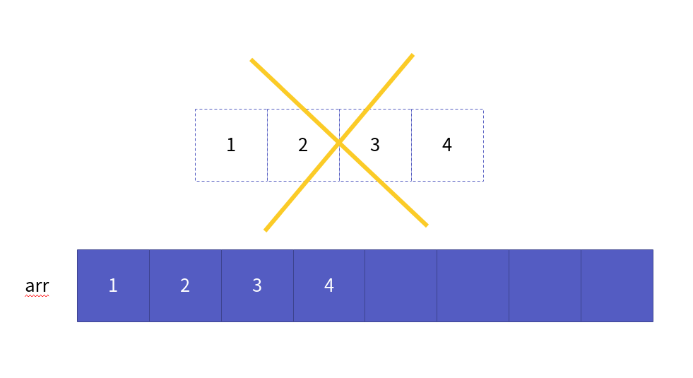
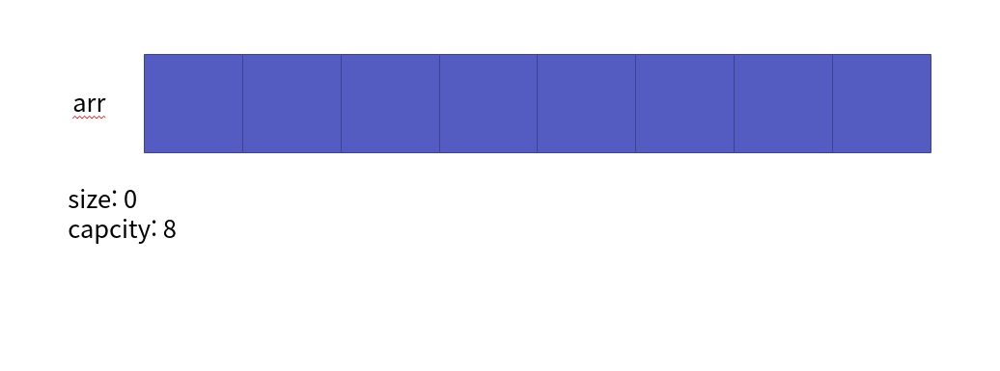
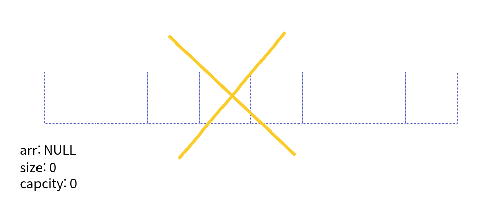
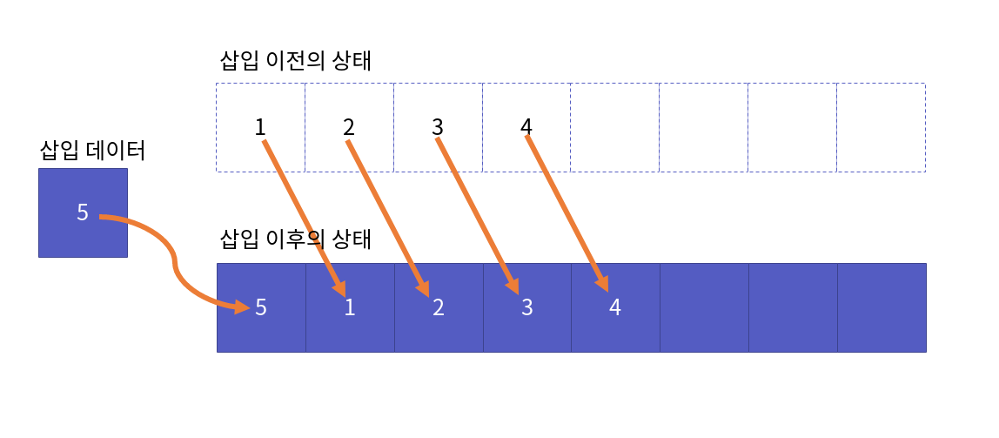
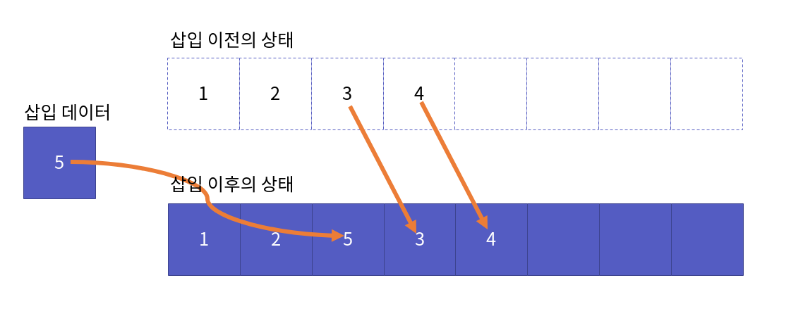
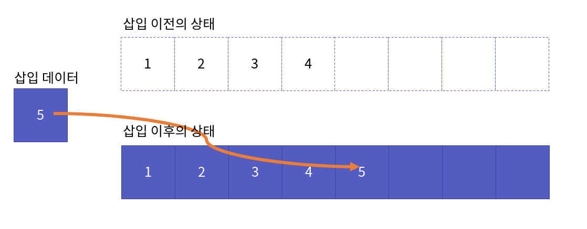
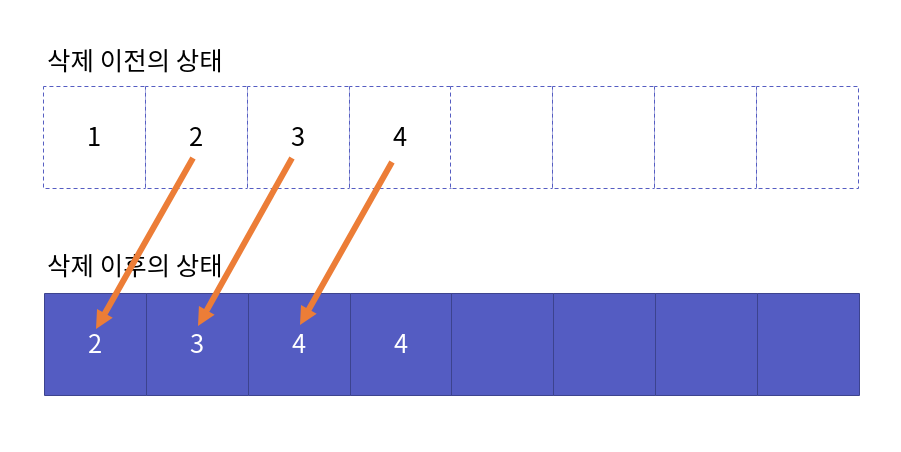

배열 리스트 구현
===========

Contents
-------------------

1. 시작하며...
2. 배열 리스트 정의
    * 배열 리스트의 핵심 원리 
    * 리스트 ADT 확인
    * 리스트의 공통 main 함수
3. 배열 리스트 구현
    * 배열 리스트 구조체 정의
    * 리스트 생성과 파괴
    * 리스트 크기 반환
    * 리스트 인덱스 요소 접근 
    * 삽입을 위한 resize 함수
    * 리스트 머리 삽입
    * 리스트 인덱스 삽입
    * 리스트 꼬리 삽입
    * 리스트 머리 삭제
    * 리스트 인덱스 삭제
    * 리스트 꼬리 삭제
4. 마치며...


## 시작하며...

구르미의 "Computer Science 정복하기 - 자료구조"의 네 번째 장입니다. 이 장의 대략적인 내용은 다음과 같습니다. 

* 배열 리스트의 정의
* 배열 리스트의 구현

이 장의 소스코드는 다음을 참고해주세요.

    url: https://github.com/gurumee92/datastructure 
    branch: ch04
    code directory: src/ch04

자 시작합시다!


## 배열 리스트 정의

이번 장에서는 리스트의 구현체 중 하나인 **동적 배열 기반인 배열 리스트**를 알아보고 구현해보도록 하겠습니다. 먼저 배열 리스트는 기본적으로 배열과 같은 장점을 지닙니다. 배열 리스트의 가장 큰 장점은 다음과 같습니다.

    "인덱스 연산이 빠르다."

인덱스 연산이란, 예를 들어 배열 `arr`이 있다고 가정해봅시다. 두 번째 요소를 접근하려면 어떻게 하나요? 다음은 배열을 선언한 후 두번째 요소를 출력하고 수정하는 간단한 코드입니다.

```cpp
int main() {
    int arr[] = { 1, 2, 3, 4, 5 };

    printf("%d\n", arr[2]);

    arr[2] = 99;
    printf("%d\n", arr[2]);

    return 0;
}
```

이 때, `arr[2]` 이 부분이 인덱스 연산입니다. 배열의 요소를 인덱스로 상수 시간 안에 접근이 가능하지요. 다만 배열은, 크기가 제한이 되어 있다는 큰 단점을 지닙니다. 이 단점을 배열 리스트는 **동적 배열**을 이용해서 극복했습니다.


#### 배열 리스트의 핵심 원리 

배열 리스트의 핵심은 앞서 말했듯, **동적 메모리 할당**을 이용하여 만든 **동적 배열**입니다. 개인적으로 "쓰고 버린다." 전략이라고 말하고 싶은데요. 핵심 흐름은 다음과 같습니다.


1. 먼저 적당한 크기의 배열을 할당 받습니다.


2. 해당 배열에 데이터를 저장합니다.


3. 배열의 크기가 꽉 차면 더 큰 배열을 할당 받습니다.


4. 이전 배열의 요소들을 더 큰 배열에 옮깁니다. 


5. 그 후 이전 배열을 버립니다.


이 흐름을 구현한 것이 `resize` 함수입니다. 그 때 더 자세히 살펴보도록 하죠.


#### 리스트 ADT 확인

본격적으로 구현하기 전에 리스트 ADT를 확인해 보겠습니다.

    ADT: List

    void LInit(List * pList);
        - 리스트를 초기화 합니다.
        - 리스트 생성 시 제일 먼저 호출됩니다.

    void LDestroy(List * pList);
        - 리스트를 제거합니다.
        - 할당된 메모리를 모두 회수합니다.

    LData LGet(List * pList, int index);
        - 해당 인덱스의 원소를 가져옵니다.
        - 인덱스의 원소가 없을 경우 에러를 반환합니다.

    void LSet(List * pList, int index, LData data);
        - 해당 인덱스의 원소를 data로 수정합니다.
        - 인덱스의 원소가 없을 경우 에러를 반환합니다.

    int LSize(List * pList);
        - 리스트의 크기를 반환합니다.

    void LInsertHeader(List * pList, LData data);
        - 리스트 머리 부분에 data를 삽입합니다.

    void LInsertIndex(List * pList, int index, LData data);
        - 리스트 index 위치에 data를 삽입합니다.
        - 만약 리스트 크기보다 크면 에러를 반환합니다.

    void LInsertTail(List * pList, LData data);
        - 리스트 꼬리 부분에 data를 삽입합니다.

    LData LRemoveHeader(List * pList);
        - 리스트 머리 부분에 위치한 data를 삭제합니다.

    LData LRemoveIndex(List * pList, int index);
        - 리스트 index에 위치한 data를 삭제합니다.
        - 만약 리스트 크기보다 크면 에러를 반환합니다.

    LData LRemoveTail(List * pList);
        - 리스트 꼬리 부분에 위치한 data를 삭제합니다.


#### 리스트의 공통 main 함수

위의 ADT를 토대로 만든 main 함수입니다. 이 main 함수는 거의 비슷하게 연결 리스트, 이중 연결 리스트 때에도 사용할 것입니다.

src/ch04/main.c
```cpp
#include<stdio.h>
#include<assert.h>

#include "ArrayList.h"

# define TEST_NUM 8

int main() {
    List list;

    LInit(&list);
    //출력 0 8 0
    printf("INIT %d %d %d\n", list.size, list.capacity, (list.arr == NULL));

    // 리스트 저장된 데이터 8 7 6 5 4 3 2 1 
    for (int i=0; i<TEST_NUM; i++) {
        LInsertHeader(&list, i + 1);
    }
    int size = LSize(&list);
    // 출력 8 7 6 5 4 3 2 1
    for (int i=0; i<size; i++) {
        printf("%d ", LGet(&list, i));
    }
    printf("\n");

    // 출력 8 7 6 5 4 3 2 1
    for (int i=0; i<size; i++) {
        printf("%d ", LRemoveHeader(&list));
    }
    printf("\n");

    //출력 0 8 0
    printf("INSERT-REMOVE HEADER %d %d %d\n", list.size, list.capacity, (list.arr == NULL));
    
    // 리스트 저장된 데이터 1 2 3 4 5 6 7 8 
    for (int i=0; i<TEST_NUM; i++) {
        LInsertTail(&list, i + 1);
    }

    // 리스트 저장된 데이터 5 2 3 4 5 6 7 8
    LSet(&list, 0, 5);

    // 리스트 저장된 데이터 5 2 3 99 4 5 6 7 8
    LInsertIndex(&list, 3, 99);
    // 리스트 저장된 데이터 5 2 3 100 99 4 5 6 7 8
    LInsertIndex(&list, 3, 100);
    // 리스트 저장된 데이터 5 2 3 100 99 5 6 7 8
    LRemoveIndex(&list, 5);

    // 출력 5 2 3 100 99 5 6 7 8
    size = LSize(&list);

    for (int i=0; i<size; i++) {
        printf("%d ", LGet(&list, i));
    }
    printf("\n");

    // 출력 8 7 6 5 99 100 3 2 5
    for (int i=0; i<size; i++) {
        printf("%d ", LRemoveTail(&list));
    }
    printf("\n");

    //출력 0 16 0
    printf("INSERT-REMOVE TAIL %d %d %d\n", list.size, list.capacity, (list.arr == NULL));

    LDestroy(&list);
    //출력 0 0 1
    printf("DESTROY %d %d %d\n", list.size, list.capacity, (list.arr == NULL));
    return 0;
}
```

코드를 살펴보시면, ADT에서 정의한 모든 함수들을 쓰고 있습니다. 본격적으로 구현해봅시다.


## 배열 리스트 구현

배열 리스트를 구현해봅시다.

#### 배열 리스트 구조체 정의

먼저 구조체 정의입니다.

src/ch04/ArrayList.h
```cpp
typedef int LData;

typedef struct _array_list {
    LData * arr;    // 동적 배열
    int size;       // 순차 리스트 크기
    int capacity;   // 순차 리스트 용량
} ArrayList;

typedef ArrayList List;
```

먼저 우리가 구현할 배열 리스트는 `정수형 데이터를 담는 배열 리스트`입니다. 추후 담는 데이터가 변경되더라도, 선언부는 그대로 쓸 수 있게 **typedef**를 통해서 `LData`로 재지정하였습니다.

그리고 구조체 `ArrayList`를 볼까요? 먼저 데이터를 저장하는 동적 배열을 가리키는 포인터 `arr`이 있습니다. **일차원 배열은 포인터와 동치이다**를 아시면, 이게 무슨 코드인지 아실겁니다. 이 `arr`에 동적 배열을 할당 받습니다. `size`는 배열에 저장된 데이터의 개수입니다. 그렇다면, `capacity`는 무엇일까요?

`capacity`는 할당 받은 동적 배열의 전체 크기입니다. 이것을 지정한 이유는 저장한 데이터의 개수 `size`가 `capacity`와 같아질 때, 삽입이 일어날 시, `resize` 연산을 해야하기 때문입니다.

다음은 `ArrayList.h` 코드 전문입니다.

src/ch04/ArrayList.h
```cpp
#ifndef  ARRAY_LIST_H
#define ARRAY_LIST_H

/* ArrayList 헤더입니다. */

// 배열 리스트 생성 시 동적 배열의 크기
#define INIT_SIZE 8

// 배열 리스트가 저장할 데이터 int를 LData라는 이름으로 재지정
typedef int LData;

// ArrayList 구조체 선언

typedef struct _array_list {
    LData * arr;    // 동적 배열
    int size;       // 순차 리스트 크기
    int capacity;   // 순차 리스트 용량
} ArrayList;

// ArrayList를 List로 타입 재지정

typedef ArrayList List;

// 아래 함수 원형들은 List ADT를 따른 것입니다.

void LInit(List * pList);

void LDestroy(List * pList);

LData LGet(List * pList, int index);

void LSet(List * pList, int index, LData data);

int LSize(List * pList);

void LInsertHeader(List * pList, LData data);

void LInsertIndex(List * pList, int index, LData data);

void LInsertTail(List * pList, LData data);

LData LRemoveHeader(List * pList);

LData LRemoveIndex(List * pList, int index);

LData LRemoveTail(List * pList);
    
#endif
```


#### 리스트 생성과 파괴

이제 배열 리스트를 생성하는 함수인 `LInit`과 파괴하는 함수인 `LDestroy`함수를 살펴보겠습니다. 먼저 `LInit` 함수입니다. `LInit` 함수는 배열 리스트의 초기 자원들을 할당하는 역할을 합니다. 저는 처음으로 할당되는 배열의 크기를 8로 만들겠습니다. 그러면 다음 그림처럼 만들어질 것입니다.



코드로 나타내면 다음과 같습니다.

src/ch04/ArrayList.c
```cpp
void LInit(List * pList){
    // 크기 0
    pList->size = 0;
    // 용량 초기 크기 8
    pList->capacity = INIT_SIZE;
    // 배열 동적 할당 (저장할 데이터 크기 * 총량)
    pList->arr = malloc(sizeof(LData) * (pList->capcity));
}
```

여기서, 중요한 코드가 나왔습니다. 바로 `arr`에 동적 배열을 할당하기 위해서 `malloc` 함수를 쓰는 부분인데요, 이렇게 하면 힙 메모리 영역에 동적 배열에 대한 메모리를 할당 받습니다.

이제 배열 리스트를 파괴하는, 즉 할당 받은 자원을 해제하는 역할을 하는 `LDestroy` 함수를 보겠습니다. 제일 중요한 것은 동적 메모리 할당을 받은 `arr`입니다. 힙 영역에 할당 받은 메모리는 개발자가 손수 제거해주지 않으면 **메모리 누수 문제**가 발생하기 때문입니다. 코드는 다음과 같습니다.

src/ch04/ArrayList.c
```cpp
void LDestroy(List * pList){
    // pList NULL 이면 수행 X
    if (pList == NULL) {
        return;
    }

    // 만약 arr이 할당 받은 자원이 있으면, 해제
    if (pList->arr != NULL) {
        free(pList->arr);
        pList->arr = NULL;
    }

    // pList 자원 해제
    pList->size = 0;
    pList->capacity = 0;
}
```

`malloc` 함수가 동적 메모리 할당이라면, `free` 함수는 힙 영역에 할당 받은 메모리를 회수하는 함수입니다. 그래서 `arr`이 할당 받은 자원이 있다면 (pList->arr != NULL) `free` 함수를 이용해 힙 영역에서 제거합니다. 그 후 명시적으로 `arr`에 NULL 값을 주는 것이지요.

`size`, `capacity`는 해제해주지 않아도 상관은 없습니다. 나중에 `pList`가 가리키는 리스트가 메모리 영역에서 지워질 때 같이 지워지기 때문입니다. 위의 코드는 명시적으로 모든 자원들을 해제시켜주는 코드입니다. 제거가 된 모습은 다음과 같습니다.



`LInit`, `LDestroy`는 중요한 함수이니 꼭 이해하고 넘어가셨으면 좋겠습니다.


#### 리스트 크기 반환

리스트의 크기를 반환하는 함수 `LSize`는 쉽습니다. `size`를 반환하기만 하면 되지요. 코드는 다음과 같습니다.

src/ch04/ArrayList.c
```cpp
int LSize(List * pList){
    return pList->size;
}
```

#### 리스트 인덱스 요소 접근 

ADT에 따르면, `index`는 무조건 `size`보다 작아야 합니다. 이 부분을 처리하기만 하면 굉장히 쉽습니다. 동적 배열은 배열과 똑같이 쓸 수 있기 때문에 바로 해당 인덱스에 접근할 수 있습니다. 다음은 인덱스 요소의 데이터를 얻는 `LGet`, 요소의 데이터를 수정하는 `LSet` 함수입니다.

src/ch04/ArrayList.c
```cpp
LData LGet(List * pList, int index){
    if (index >= pList->size) {
        printf("Index Out of Bound Exception\n");
        assert(index < pList->size);
    }

    LData ret = pList->arr[index];
    return ret;
}

void LSet(List * pList, int index, LData data){
    if (index >= pList->size) {
        printf("Index Out of Bound Exception\n");
        assert(index < pList->size);
    }

    pList->arr[index] = data;
}
```

위의 `if` 구문이 예외 처리를 하는 부분입니다. 그 이후에는 바로 `arr[index]`로 접근하는 것을 확인할 수 있을 겁니다.


#### 삽입을 위한 resize 함수

배열 리스트의 핵심 함수입니다. 모든 삽입 함수에서 사용하는데, 그 흐름은 다음과 같습니다.

1. 먼저 배열 리스트의 용량을 나타내는 값 `capacity`를 2배로 늘립니다.
2. 삭제를 위해서 동적 배열을 가리키는 포인터 `del`을 선언하고 그 값을 넣어줍니다.
3. 현재 배열보다 2배 용량이 큰 동적 배열을 `tmp`를 생성합니다.
4. 현재 배열 `arr`에서 생성한 배열 `tmp`로 데이터를 옮깁니다.
5. 현재 배열을 가리키는 `arr`을 `tmp`가 가리키는 동적 배열을 가리키게 만듭니다.
6. 이전 동적 배열을 가리키는 포인터 `del`을 이용해 쓸모 없어진 배열을 삭제합니다. 

다음은 이 흐름을 코드로 적은 것입니다.

src/ch04/ArrayList.c
```cpp
void resize(List * pList) {
    pList->capacity *= 2;

    LData * del = pList->arr;
    LData * tmp = malloc(sizeof(LData) * (pList->capacity));

    for (int i=0; i<pList->size; i++) {
        tmp[i] = pList->arr[i];
    }

    pList->arr = tmp;
    free(del);
}
```

잘 이해가 안되신다면, 위의 `배열리스트 정의` 부분에서 리사이즈 그림을 비교해서 봐보세요! 이해하는데, 도움이 될 겁니다.


#### 리스트 머리 삽입

이제 머리 삽입을 구현 보겠습니다. 흐름은 다음과 같습니다.

1. 함수 호출 시 `size`와 `capacity`가 같을 때, `resize` 함수를 호출하여 배열의 공간을 늘립니다.
2. 머리 삽입을 위해서 저장된 데이터들을 한칸씩 뒤로 땡깁니다.
3. 머리 부분 `arr[0]`에 데이터를 넣습니다.

그림으로 보면 다음과 같습니다.



이렇게 하기 위해서는 `size-1`부터 머리인 `0`까지 뒤로 1칸씩 데이터를 복사하는 작업이 필요합니다. 코드는 다음과 같습니다.

src/ch04/ArrayList.c
```cpp
void LInsertHeader(List * pList, LData data){
    if (pList->size == pList->capacity){
        resize(pList);
    }

    for (int i=pList->size-1; i>=0; i--) {
        pList->arr[i+1] = pList->arr[i];
    }

    pList->arr[0] = data;
    pList->size += 1;
}
```

#### 리스트 인덱스 삽입

인덱스 삽입은 머리 삽입과 유사합니다. 다만 1가지 제약 조건이 있습니다. `index < size` 이 조건을 만족해야 함수가 진행되야 하지요. 기본적인 흐름은 다음과 같습니다.

1. 함수 호출 시 `size`와 `capacity`가 같을 때, `resize` 함수를 호출하여 배열의 공간을 늘립니다.
2. 해당 index 위치에 데이터를 삽입하기 위해서, 현재 index 위치부터 저장된 데이터들을 한칸씩 뒤로 땡깁니다.
3. 해당 인덱스 `arr[index]`에 데이터를 넣습니다.

그림으로 보면 다음과 같습니다.



이렇게 하기 위해서는 `size-1`부터 머리인 `index`까지 뒤로 1칸씩 데이터를 복사하는 작업이 필요합니다. 코드는 다음과 같습니다.

src/ch04/ArrayList.c
```cpp
void LInsertIndex(List * pList, int index, LData data){
    if (index >= pList->size) {
        printf("Index Out of Bound Exception\n");
        assert(index < pList->size);
    }

    if (pList->size == pList->capacity){
        resize(pList);
    }

    for (int i=pList->size-1; i>=index; i--) {
        pList->arr[i+1] = pList->arr[i];
    }

    pList->arr[index] = data;
    pList->size += 1;
}
```

#### 리스트 꼬리 삽입

상대적으로 꼬리 삽입의 경우는 쉽습니다. 그냥 맨 끝 그러니까 `size`와 같은 크기의 인덱스에 데이터를 넣어주고 `size`를 올려주기만 하면 됩니다. 흐름은 다음과 같습니다.

1. 함수 호출 시 `size`와 `capacity`가 같을 때, `resize` 함수를 호출하여 배열의 공간을 늘립니다.
2. 배열에서 다음 들어갈 index는 `size` 크기 만큼입니다., 이 곳에 데이터를 넣습니다.

그림은 다음과 같습니다.



코드는 다음과 같습니다.

src/ch04/ArrayList.c
```cpp
void LInsertTail(List * pList, LData data){
    if (pList->size == pList->capacity){
        resize(pList);
    }

    pList->arr[pList->size] = data;
    pList->size += 1;
}
```

#### 리스트 머리 삭제

머리 삭제의 경우 머리 부분 (index=0)의 뒤에 데이터들을 1칸씩 땡겨오면 됩니다. 머리 삭제의 흐름은 다음과 같습니다.

1. 머리 부분 바로 뒤 (index=1)부터 `size`까지 앞으로 1칸씩 데이터를 복사합니다. 

그림은 다음과 같습니다.



이 때 그림에서 보듯이 배열에 데이터가 남습니다. 그러나 삭제 연산 이후 `size`를 1 줄이게 됩니다. 따라서, 실제 배열에서 끝에 데이터가 있더 하더라도, 접근할 수 없기 때문에 삭제의 효과가 납니다. 코드는 다음과 같습니다.

src/ch04/ArrayList.c
```cpp
LData LRemoveHeader(List * pList){
    LData ret = pList->arr[0];

    for (int i=1; i<pList->size; i++) {
        pList->arr[i-1] = pList->arr[i];
    }

    pList->size -= 1;
    return ret;
}
```

#### 리스트 인덱스 삭제

머리 삽입과, 인덱스 삽입이 비슷하듯, 인덱스 삭제 역시 머리 삭제와 아주 비슷합니다. 1칸씩 땡겨오는 범위를 머리 부분에서 인덱스 부분으로 바꾸면 됩니다. 다만, 인덱스 삽입 처럼, 인덱스 예외 처리를 해주어야 합니다. 흐름은 다음과 같습니다.

1. 해당 index 위치에 데이터를 삭제하기 위해서, 현재 index 1칸 뒤 위치로부터 저장된 데이터들을 한칸씩 앞으로 땡깁니다.

그림은 다음과 같습니다.

![인덱스] 삭제](../images/ch04/arraylist12.png)

코드는 다음과 같습니다.

src/ch04/ArrayList.c
```cpp
LData LRemoveIndex(List * pList, int index){
    if (index >= pList->size) {
        printf("Index Out of Bound Exception\n");
        assert(index < pList->size);
    }

    LData ret = pList->arr[index];

    for (int i=index + 1; i<pList->size; i++) {
        pList->arr[i-1] = pList->arr[i];
    }

    pList->size -= 1;
    return ret;
}
```


#### 리스트 꼬리 삭제

꼬리 삭제 역시, 꼬리 삽입과 마찬가지로 위의 2개의 함수보다 쉽습니다. 그냥 `size`를 줄여 버리기만 하면됩니다. 다른 삭제들과 마찬가지로, **size를 1 줄여버리면, 그 뒤로 데이터가 실제로 있더라도, 접근할 수가 없기 때문에 삭제 효과가 나는 것**을 기억하세요! 그림은 따로 바뀌는게 없기 때문에, 올리지는 않겠습니다. 코드는 다음과 같습니다.

src/ch04/ArrayList.c
```cpp
LData LRemoveTail(List * pList){
    LData ret = pList->arr[pList->size-1];

    pList->size -= 1;

    return ret;
}
```

자, 이렇게 해서 배열 리스트의 구현이 끝났습니다! 다음은 배열 리스트 구현 코드의 전문입니다.

src/ch04/ArrayList.c
```cpp
// 동적 메모리 할당/해제를 위한 임포트
#include<stdlib.h>
//에러 및 출력을 위한 임포트
#include<stdio.h>
#include<assert.h>

#include "ArrayList.h"

/** 
 * 리스트 생성 함수
 * @ param pList List * 리스트의 주소.
 * 해당 리스트를 생성합니다. 동적 배열의 크기는 8입니다.
 */ 
void LInit(List * pList){
    pList->arr = malloc(sizeof(LData) * INIT_SIZE);
    pList->size = 0;
    pList->capacity = INIT_SIZE;
}

/**
 * 리스트 제거 함수
 * @ param pList List * 리스트의 주소.
 * 해당 리스트를 제거합니다. `arr`의 경우 동적 배열이기 때문에 주소가 들어 있다면, 해제해야 합니다.
 */
void LDestroy(List * pList){
    if (pList == NULL) {
        return;
    }

    if (pList->arr != NULL) {
        free(pList->arr);
        pList->arr = NULL;
    }

    pList->size = 0;
    pList->capacity = 0;
}

/**
 * 리스트 인덱스 요소 얻기
 * @ param pList List * 리스트의 주소. 
 * @ param index int    접근할 인덱스
 * 
 * index < size, 함수 실행, 해당 인덱스 요소를 반환합니다.
 * return LData
 */
LData LGet(List * pList, int index){
    if (index >= pList->size) {
        printf("Index Out of Bound Exception\n");
        assert(index < pList->size);
    }

    LData ret = pList->arr[index];
    return ret;
}

/**
 * 리스트 인덱스 요소 수정
 * @ param pList List * 리스트의 주소. 
 * @ param index int    접근할 인덱스
 * @ param data LData   수정할 데이터
 * 
 * index < size, 함수 실행, 해당 인덱스 요소를 데이터로 수정합니다.
 */
void LSet(List * pList, int index, LData data){
    if (index >= pList->size) {
        printf("Index Out of Bound Exception\n");
        assert(index < pList->size);
    }

    pList->arr[index] = data;
}

/**
 * 리스트 크기 
 * @ param pList List * 리스트의 주소. 
 * 
 * 해당 리스트의 크기를 반환합니다.
 * return int
 */
int LSize(List * pList){
    return pList->size;
}

/**
 * 리스트 리사이즈 함수
 * @ param pList List * 리스트의 주소. 
 * 
 * 현재 가진 배열보다, 2배 큰 동적 배열을 새로이 할당 받습니다.
 */
void resize(List * pList) {
    pList->capacity *= 2;

    LData * del = pList->arr;
    LData * tmp = malloc(sizeof(LData) * (pList->capacity));

    for (int i=0; i<pList->size; i++) {
        tmp[i] = pList->arr[i];
    }

    pList->arr = tmp;
    free(del);
}

/**
 * 리스트 머리 삽입 함수
 * @ param pList List * 리스트의 주소.
 * @ param data LData   삽입할 데이터 
 * 
 * 현재 리스트의 첫 부분에 데이터를 넣습니다.
 */
void LInsertHeader(List * pList, LData data){
    if (pList->size == pList->capacity){
        resize(pList);
    }

    for (int i=pList->size-1; i>=0; i--) {
        pList->arr[i+1] = pList->arr[i];
    }

    pList->arr[0] = data;
    pList->size += 1;
}

/**
 * 리스트 인덱스 삽입 함수
 * @ param pList List * 리스트의 주소.
 * @ param index int    삽입할 인덱스
 * @ param data LData   삽입할 데이터 
 * 
 * 현재 리스트의 인덱스 위치에 데이터를 넣습니다.
 */
void LInsertIndex(List * pList, int index, LData data){
    if (index >= pList->size) {
        printf("Index Out of Bound Exception\n");
        assert(index < pList->size);
    }

    if (pList->size == pList->capacity){
        resize(pList);
    }

    for (int i=pList->size-1; i>=index; i--) {
        pList->arr[i+1] = pList->arr[i];
    }

    pList->arr[index] = data;
    pList->size += 1;
}

/**
 * 리스트 꼬리 삽입 함수
 * @ param pList List * 리스트의 주소.
 * @ param data LData   삽입할 데이터 
 * 
 * 현재 리스트의 마지막 부분에 데이터를 넣습니다.
 */
void LInsertTail(List * pList, LData data){
    if (pList->size == pList->capacity){
        resize(pList);
    }

    pList->arr[pList->size] = data;
    pList->size += 1;
}

/**
 * 리스트 머리 삭제 함수
 * @ param pList List * 리스트의 주소.
 * 
 * 현재 리스트의 첫 부분에 데이터를 삭제합니다.
 * 
 * return LData 머리 부분에 데이터
 */
LData LRemoveHeader(List * pList){
    LData ret = pList->arr[0];

    for (int i=1; i<pList->size; i++) {
        pList->arr[i-1] = pList->arr[i];
    }

    pList->size -= 1;
    return ret;
}

/**
 * 리스트 인덱스 삭제 함수
 * @ param pList List * 리스트의 주소.
 * @ param index int    삭제할 인덱스
 * 
 * 현재 리스트의 인덱스 위치에 데이터를 삭제합니다.
 * 
 * return LData 인덱스 부분에 데이터
 */
LData LRemoveIndex(List * pList, int index){
    if (index >= pList->size) {
        printf("Index Out of Bound Exception\n");
        assert(index < pList->size);
    }

    LData ret = pList->arr[index];

    for (int i=index + 1; i<pList->size; i++) {
        pList->arr[i-1] = pList->arr[i];
    }

    pList->size -= 1;
    return ret;
}

/**
 * 리스트 꼬리 삭제 함수
 * @ param pList List * 리스트의 주소.
 * 
 * 현재 리스트의 마지막 부분에 데이터를 삭제합니다.
 * 
 * return LData 마지막 부분에 데이터
 */
LData LRemoveTail(List * pList){
    LData ret = pList->arr[pList->size-1];

    pList->size -= 1;

    return ret;
}
```


## 마치며...

이렇게 해서 "배열 리스트 구현" 파트를 마치도록 하겠습니다. 배열 리스트는 **상수 시간의 인덱스 연산**이라는 장점을 가져갔지만, 반대로 포기한 부분도 있습니다. **꼬리 삽입/삭제를 제외한 삽입/삭제시 시간 복잡도가 O(N)이라는 것**이지요. 다음 장에서는 배열의 저장 공간의 한계를 극복하면서도, 삽입/삭제 성능을 올린 "연결 리스트"를 구현해보도록 하겠습니다.

