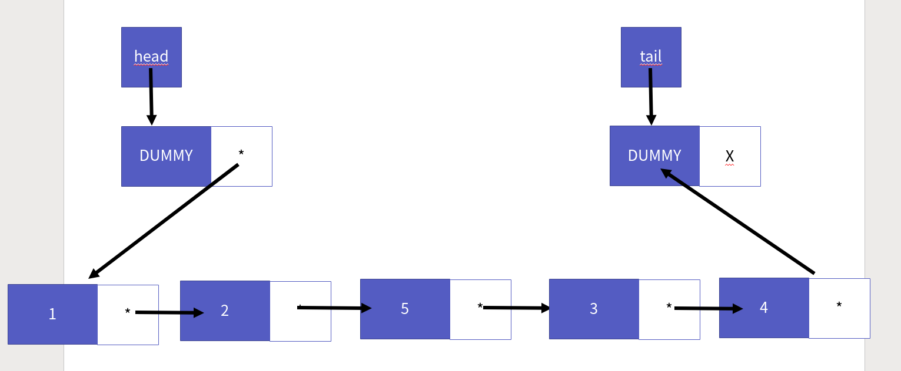
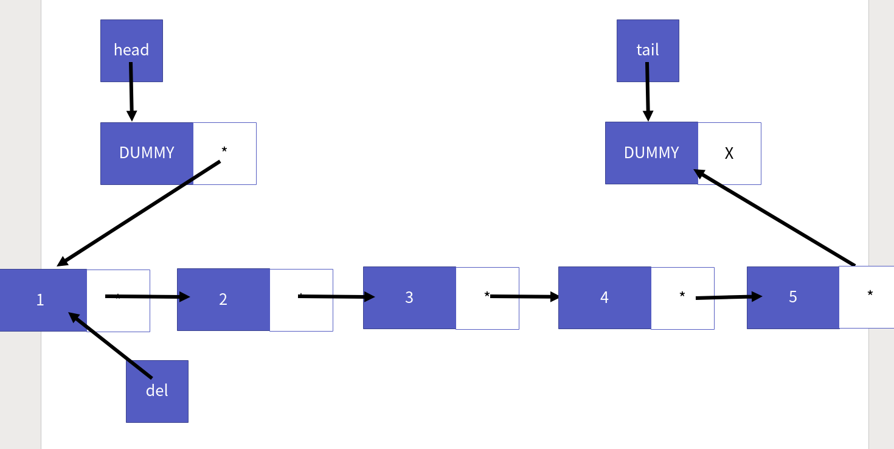

연결 리스트 구현
===========

Contents
-------------------

1. 시작하며...
2. 연결 리스트 정의
    * 연결 리스트의 핵심 원리 
    * 리스트 ADT 확인
    * 리스트의 공통 main 함수
3. 연결 리스트 구현
    * 연결 리스트 구조체 정의
    * 리스트 생성과 파괴
    * 리스트 크기 반환
    * 리스트 인덱스 요소 접근 
    * 리스트 머리 삽입
    * 리스트 꼬리 삽입
    * 리스트 인덱스 삽입
    * 리스트 머리 삭제
    * 리스트 꼬리 삭제
    * 리스트 인덱스 삭제
4. 마치며...


## 시작하며...

구르미의 "Computer Science 정복하기 - 자료구조"의 다섯 번째 장입니다. 이 장의 대략적인 내용은 다음과 같습니다. 

* 연결 리스트의 정의
* 연결 리스트의 구현

이 장의 소스코드는 다음을 참고해주세요.

    url: https://github.com/gurumee92/datastructure 
    branch: ch05
    code directory: src/ch05

자 시작합시다!


## 연결 리스트 정의

이번 장에서는 리스트의 구현체 중 하나인 **연결 리스트**에 대해서 알아보도록 하겠습니다. 연결 리스트의 장점은 다음과 같습니다.

    "머리 삽입/삭제 연산이 빠르다."

배열 리스트에서는 머리 삽입/삭제 시, O(N)의 시간 복잡도를 가졌습니다. 하지만 연결 리스트에서는 이를 상수 시간에 해결할 수 있습니다. 또한, 연결 리스트 역시 배열의 한계였던 저장 공간의 한계를 **노드**라는 자료구조체의 동적 할당을 통해서 극복하고 있습니다. 


#### 연결 리스트의 핵심 원리 

연결 리스트의 핵심은 **자기 참조 구조체인 노드**와 **동적 메모리 할당**에 있습니다. 결론을 먼저 말하면, 연결 리스트는 노드를 연달아 이어서 만든 리스트 형태의 자료구조입니다. 다음 형태이지요.


개인적으로 삽입/삭제 연산의 동작 원리도 매우 중요하다고 보는데, 이거는 함수를 설명할 때 같이 설명하도록 하겠습니다.


#### 리스트 ADT 확인

본격적으로 구현하기 전에 리스트 ADT를 확인해 보겠습니다.

    ADT: List

    void LInit(List * pList);
        - 리스트를 초기화 합니다.
        - 리스트 생성 시 제일 먼저 호출됩니다.

    void LDestroy(List * pList);
        - 리스트를 제거합니다.
        - 할당된 메모리를 모두 회수합니다.

    LData LGet(List * pList, int index);
        - 해당 인덱스의 원소를 가져옵니다.
        - 인덱스의 원소가 없을 경우 에러를 반환합니다.

    void LSet(List * pList, int index, LData data);
        - 해당 인덱스의 원소를 data로 수정합니다.
        - 인덱스의 원소가 없을 경우 에러를 반환합니다.

    int LSize(List * pList);
        - 리스트의 크기를 반환합니다.

    void LInsertHeader(List * pList, LData data);
        - 리스트 머리 부분에 data를 삽입합니다.

    void LInsertIndex(List * pList, int index, LData data);
        - 리스트 index 위치에 data를 삽입합니다.
        - 만약 리스트 크기보다 크면 에러를 반환합니다.

    void LInsertTail(List * pList, LData data);
        - 리스트 꼬리 부분에 data를 삽입합니다.

    LData LRemoveHeader(List * pList);
        - 리스트 머리 부분에 위치한 data를 삭제합니다.

    LData LRemoveIndex(List * pList, int index);
        - 리스트 index에 위치한 data를 삭제합니다.
        - 만약 리스트 크기보다 크면 에러를 반환합니다.

    LData LRemoveTail(List * pList);
        - 리스트 꼬리 부분에 위치한 data를 삭제합니다.


#### 리스트의 공통 main 함수

위의 ADT를 토대로 만든 main 함수입니다. 이 main 함수는 연결 리스트, 이중 연결 리스트에 쓰일 수 있습니다.

src/ch05/main.c
```cpp
#include<stdio.h>
#include<assert.h>

#include "LinkedList.h"

# define TEST_NUM 8

int main() {
    List list;

    LInit(&list);

    // 리스트 저장된 데이터 8 7 6 5 4 3 2 1 
    for (int i=0; i<TEST_NUM; i++) {
        LInsertHeader(&list, i + 1);
    }
    int size = LSize(&list);
    // 출력 8 7 6 5 4 3 2 1
    printf("LInsertHeader: ");
    for (int i=0; i<size; i++) {
        printf("%d ", LGet(&list, i));
    }
    printf("\n");

    // 출력 8 7 6 5 4 3 2 1
    printf("LRemoveHeader: ");
    for (int i=0; i<size; i++) {
        printf("%d ", LRemoveHeader(&list));
    }
    printf("\n");
    
    // 리스트 저장된 데이터 1 2 3 4 5 6 7 8 
    for (int i=0; i<TEST_NUM; i++) {
        LInsertTail(&list, i + 1);
    }

    printf("LInsertTail: ");
    for (int i=0; i<list.size; i++) {
        printf("%d ", LGet(&list, i));
    }
    printf("\n");

    // 리스트 저장된 데이터 5 2 3 4 5 6 7 8
    LSet(&list, 0, 5);
    printf("LSet: ");
    for (int i=0; i<list.size; i++) {
        printf("%d ", LGet(&list, i));
    }
    printf("\n");

    // 리스트 저장된 데이터 5 2 3 99 4 5 6 7 8
    LInsertIndex(&list, 3, 99);
    printf("LInsertIndex: ");
    for (int i=0; i<list.size; i++) {
        printf("%d ", LGet(&list, i));
    }
    printf("\n");

    // 리스트 저장된 데이터 5 2 3 100 99 4 5 6 7 8
    LInsertIndex(&list, 3, 100);
    printf("LInsertIndex: ");
    for (int i=0; i<list.size; i++) {
        printf("%d ", LGet(&list, i));
    }
    printf("\n");

    // 리스트 저장된 데이터 5 2 3 100 99 5 6 7 8
    LRemoveIndex(&list, 5);
    printf("LRemoveIndex: ");
    for (int i=0; i<list.size; i++) {
        printf("%d ", LGet(&list, i));
    }
    printf("\n");

    size = LSize(&list);

    // 출력 5 2 3 100 99 5 6 7 8
    printf("LGet LAST: ");
    for (int i=0; i<size; i++) {
        printf("%d ", LGet(&list, i));
    }
    printf("\n");

    // 출력 8 7 6 5 99 100 3 2 5
    printf("LRemoveTail: ");
    for (int i=0; i<size; i++) {
        printf("%d ", LRemoveTail(&list));
    }
    printf("\n");

    LDestroy(&list);
    return 0;
}
```

코드를 살펴보시면, ADT에서 정의한 모든 함수들을 쓰고 있습니다. 본격적으로 구현해봅시다.


## 연결 리스트 구현

연결 리스트를 구현해봅시다.


#### 연결 리스트 구조체 정의

먼저 연결 리스트를 알기 전에 "노드"를 알아야 합니다. 노드는 "데이터와", "자기 참조 포인터"로 구성되어 있습니다. 데이터는 실제 리스트가 저장할 데이터가, 포인터는 자기 다음 노드의 주소를 가리키는 포인터가 존재합니다. 

이를 통해 알 수 있는것은 **배열 리스트의 경우에는 메모리가 붙어 있습니다**. 그러나 **연결 리스트는 메모리 상에서도, 노드끼리 떨어져 있다는 것**입니다. 포인터를 통해서 노드를 연결하지요. 그리고 연결 리스트는 이 노드들을 관리하기 위해서, 머리 노드를 가리키는 `head`, 꼬리 노드를 가리키는 `tail`을 가지고 있습니다. 구조체 선언부는 다음과 같지요.

src/ch05/LinkedList.h
```c
// 연결 리스트가 저장할 데이터 int를 LData라는 이름으로 재지정
typedef int LData;

// 연결 리스트에 쓰일 노드
typedef struct _node {
    LData data;          // 노드의 데이터
    struct _node * next; // 자기 참조 포인터. 다음 노드를 가리킵니다.
} Node;

// LinkedList 구조체 선언
typedef struct _linked_list {
    Node * head;    // 연결 리스트의 헤더
    Node * tail;    // 연결 리스트의 꼬리
    int size;       // 연결 리스트의 크기
} LinkedList;

// LinkedList List로 타입 재지정
typedef LinkedList List;
```

다음은 연결 리스트 헤더 코드의 전문입니다.

src/ch05/LinkedList.h
```c
#ifndef  LINKED_LIST_H
#define LINKED_LIST_H

/* LinkedList 헤더입니다. */

// 연결 리스트가 저장할 데이터 int를 LData라는 이름으로 재지정
typedef int LData;

// 연결 리스트에 쓰일 노드
typedef struct _node {
    LData data;          // 노드의 데이터
    struct _node * next; // 자기 참조 포인터. 다음 노드를 가리킵니다.
} Node;

// LinkedList 구조체 선언
typedef struct _linked_list {
    Node * head;    // 연결 리스트의 헤더
    Node * tail;    // 연결 리스트의 꼬리
    int size;       // 연결 리스트의 크기
} LinkedList;

// LinkedList List로 타입 재지정
typedef LinkedList List;

// 아래 함수 원형들은 List ADT를 따른 것입니다.

void LInit(List * pList);

void LDestroy(List * pList);

LData LGet(List * pList, int index);

void LSet(List * pList, int index, LData data);

int LSize(List * pList);

void LInsertHeader(List * pList, LData data);

void LInsertIndex(List * pList, int index, LData data);

void LInsertTail(List * pList, LData data);

LData LRemoveHeader(List * pList);

LData LRemoveIndex(List * pList, int index);

LData LRemoveTail(List * pList);
    
#endif
```


#### 리스트 생성과 파괴

자 이제 리스트 생성 함수와 파괴 함수를 살펴봅시다. 먼저, 연결 리스트 생성 시에, `head`, `tail` 같은 포인터에 쓰레기 노드를 가리키게 만들 것입니다. 이런 연결 리스트를 **더미 노드 기반 연결 리스트**라고 부릅니다. 이 연결 리스트를 사용하는 이유는 삽입/삭제 시에, 같은 방식으로 노드를 접근하기 위함입니다. 생성 함수의 흐름은 다음과 같습니다.

1. `head`, `tail`의 더미 노드 생성
2. `tail`이 가리키는 더미 노드의 다음은 NULL입니다.
3. `head`가 가리키는 더미 노드의 `next`는 `tail`이 가리키는 노드입니다.


다음은 연결 리스트 생성 시, 모습입니다.


다음은 생성 함수의 코드입니다.

src/ch05/LinkedList.c
```c
void LInit(List * pList){
    pList->head = (Node *) malloc(sizeof(Node));
    pList->head->data = -123456;

    pList->tail = (Node *) malloc(sizeof(Node));
    pList->tail->data = -123456;

    pList->tail->next = NULL;
    pList->head->next = pList->tail;

    pList->size = 0;
}
```

리스트 제거 함수는 연결 리스트의 할당된 모든 자원들을 반납하면 됩니다. 즉, 모든 노드를 제거하면 됩니다. 더미 노드 생성하는 것처럼, 노드들은 모두 **동적 메모리 할당**을 통해서 생성됩니다. 즉 `free` 함수를 통해서 할당된 메모리를 반납해야 하지요. 흐름은 다음과 같습니다.

1. `size`가 0이 될 때까지 모든 노드를 삭제합니다. 
2. `head`, `tail`에 붙어있는 더미 노드를 삭제합니다.

리스트 제거 함수는 삭제 연산을 빼면, 쉽기 때문에 그림 설명은 따로 없습니다. 코드는 다음과 같습니다.

src/ch05/LinkedList.c
```c
void LDestroy(List * pList){

    while (pList->size > 0) {
        LRemoveHeader(pList);
    }

    if (pList->head != NULL) {
        free(pList->head);
        pList->head = NULL;
    }
    
    if (pList->tail != NULL) {
        free(pList->tail);
        pList->tail = NULL;
    }
    
    pList->size = 0;
}
```


#### 리스트 크기 반환

리스트 크기 반환 함수는 매우 쉽습니다. 배열 리스트와 마찬가지로 `size`를 반환하면 됩니다. 코드는 다음과 같습니다.

src/ch05/LinkedList.c
```c
int LSize(List * pList){
    return pList->size;
}
```


#### 리스트 인덱스 요소 접근 

배열 리스트의 인덱스 요소 접근과 비슷합니다. 마찬가지로 `index < size`라는 전제 조건이 붙습니다. 다만, 배열에서 `index`로 바로 접근하는 것과 달리 노드 포인터를 통해서 `index`만큼 계속 움직여주어야 합니다. 먼저 3개의 데이터가 저장된 연결 리스트와 index=2를 접근하는 상황을 가정해보겠습니다.


그러면, 첫 번째 요소는 `head->next`입니다. 그러니까 `head`가 가리키는 더미 노드의 `next`는 데이터가 1인 첫 노드를 가리키고 있습니다. 노드 포인터 `curr`에 이 노드를 가리키게 합니다. 그럼 그림은 다음과 같습니다.


이제 인덱스 크기만큼, `curr`이 가리키는 노드의 `next`를 통해서 이동하면 됩니다. 인덱스의 크기가 2니까 `curr`은 노드 2개를 지나쳐 마지막 노드인 3을 가리키게 될 것입니다. 다음처럼 말이죠.


이해가 되시나요? 코드와 비교해서 보면 더 이해가 쉬울 것입니다. `LGet`의 경우는 `curr`이 가리키는 노드의 데이터를 반환하면 되고 `LSet`의 경우는 `curr`이 가리키는 노드의 데이터를 파라미터로 받은 데이터로 수정하면 됩니다. 코드는 다음과 같습니다.

src/ch05/LinkedList.c
```c
LData LGet(List * pList, int index){
    if (index >= pList->size) {
        printf("Index Out of Bound Exception\n");
        assert(index < pList->size);
    }

    Node * curr = pList->head->next;

    for (int i=0; i<index; i++) {
        curr = curr->next;
    }

    return curr->data;
}

void LSet(List * pList, int index, LData data){
    if (index >= pList->size) {
        printf("Index Out of Bound Exception\n");
        assert(index < pList->size);
    }

    Node * curr = pList->head->next;

    for (int i=0; i<index; i++) {
        curr = curr->next;
    }

    curr->data = data;
}
```


#### 리스트 머리 삽입

자 이제 머리 삽입 함수를 살펴보겠습니다. 연결 리스트의 경우, 머리 삽입은 1가지만 생각하면 됩니다. **새로운 노드를 첫 노드로 만든다!** `리스트 인덱스 요소 접근` 때 쓰던 상황을 그대로 이어서 사용해보겠습니다.


위 상황일 때 데이터가 4인 새로운 노드를 만든다고 가정하겠습니다. 그럼 그림은 다음과 같습니다.


어떻게 하면, 연결 리스트 앞에 생성한 노드를 위치시킬 수 있을까요? 답은 쉽습니다. 먼저 생성한 노드의 `next`, 그러니까 다음 노드의 주소를 현재 연결 리스트의 맨 앞 노드를 가리키게 합니다. 즉 `newNode->next = pList->head->next`입니다.


그리고 `head`가 가리키는 더미 노드의 `next`즉, 더미 노드의 다음 노드의 주소를 새로운 노드로 지정하면 됩니다.


결국 연결 리스트의 삽입 후 모습은 다음과 같습니다.


코드는 다음과 같습니다. 그림과 함께 비교해서 봐보시면 이해하는데 크게 도움이 될 것입니다.

src/ch05/LinkedList.c
```c
void LInsertHeader(List * pList, LData data){
    Node * newNode = (Node *) malloc(sizeof(Node));
    newNode->data = data;
    newNode->next = pList->head->next;
    pList->head->next = newNode;

    pList->size += 1;
}
```


#### 리스트 꼬리 삽입

꼬리 삭제는 `tail`이 가리키는 노드의 이전 위치에 노드를 옮기면 됩니다. 이 때 2가지를 생각해봐야 합니다.

1. 연결 리스트의 데이터가 없을 때 (curr == pList->tail)
2. 연결 리스트의 데이터가 있을 때

**데이터가 없을 때**

먼저 연결 리스트의 데이터가 하나도 없을 때를 살펴볼까요? 데이터가 없다면, 다음 그림과 같겠죠?


이 때, 데이터 4를 가진 노드를 생성합니다.


꼬리 삽입이니, 새로운 노드의 `next`를 `tail`을 가리키는 노드로 합니다.


연결 리스트의 데이터가 없을 때는 머리 삽입처럼, `head`가 가리키는 더미 노드의 `next`를 새 노드로 연결시킵니다.


**데이터가 있을 때**

이제는 데이터가 여러 개 있을 때를 가정해볼까요? 삽입 이전에 데이터가 3개 있을 때로 가정해보겠습니다.


이 때, 데이터 4를 가진 노드를 생성합니다.


역시 꼬리 삽입이니, 새로운 노드의 `next`를 `tail`을 가리키는 노드로 합니다.


이제 `tail`이 가리키는 더미 노드 이전 노드의 노드 정보가 필요합니다. 그래서 인덱스 접근 때 처럼 `curr`을 이용합니다. **이 때 `curr`이 가리키는 노드는 `tail`이 가리키는 더미 노드가 아니어야 하며 `curr`이 가리키는 노드의 `next` 즉, 다음 노드 역시 `tail`이 가리키는 노드가 아니어야 합니다.** 다음 그림은 `curr`이 `tail`이 가리키는 더미 노드의 이전 노드를 가리키는 모습을 나타냅니다.


이제 `curr`이 가리키는 노드, 그러니까 `tail`이 가리키는 더미 노드의 이전 노드이자, 실제 데이터를 가진 마지막 노드의 `next`에 새로운 노드를 할당시켜주면 됩니다.


그럼 결국 다음 모습이 됩니다.


코드는 다음과 같습니다.

src/ch05/LinkedList.c
```c
void LInsertTail(List * pList, LData data){
    Node * curr = pList->head->next;

    while (curr != pList->tail && curr->next != pList->tail) {
        curr = curr->next;
    }

    Node * newNode = (Node *) malloc(sizeof(Node));
    newNode->data = data;
    newNode->next = pList->tail;

    if (curr == pList->tail) {
        pList->head->next = newNode;
    } else {
        curr->next = newNode;
    }
    pList->size += 1;
}
```


#### 리스트 인덱스 삽입

배열 리스트의 인덱스 삽입과 마찬가지로 `index > size`라는 전제 조건이 붙습니다. 또한, 인덱스 삽입의 경우 크게 3가지를 생각해봐야 합니다.

1. index == 0
2. index == size-1
3. 그 외

첫 번째 경우 머리 삽입과 같습니다. 두 번째 경우는 꼬리 삽입과 같습니다. 그 외의 경우를 살펴보겠습니다. 먼저 데이터 상황은 다음과 같고  2번째 인덱스에 데이터를 삽입한다고 가정하겠습니다.


이 때, 데이터 5를 가진 노드를 생성합니다.


이제 `head`가 가리키는 더미 노드의 `next`, 즉, 실제 데이터를 가진 첫 노드부터, `인덱스 요소 접근`처럼 `curr`을 움직여 줍니다. 다만, `index-1`만큼 움직입니다. 여기서는 데이터 2를 가진 노드까지 움직여집니다.


이제 새로운 노드의 `next`의 `curr`이 가리키는 노드의 `next` 즉, 2를 가진 노드의 다음 노드, 인덱스 2위치에 존재하는 데이터 3을 가진 노드를 가리키게 합니다.


이제 `curr`의 `next`에 새로운 노드를 가리키게 합니다.


이 경우 완성된 연결 리스트의 모습은 다음과 같습니다.



코드는 다음과 같습니다.

src/ch05/LinkedList.c
```c
void LInsertIndex(List * pList, int index, LData data){
    if (index >= pList->size) {
        printf("Index Out of Bound Exception\n");
        assert(index < pList->size);
    }

    if (index == 0) {
        return LInsertHeader(pList, data);
    }

    if (index == pList->size - 1) {
        return LInsertTail(pList, data);
    }

    Node * curr = pList->head->next;

    for (int i=0; i<index-1; i++) {
        curr = curr->next;
    }

    Node * newNode = (Node *) malloc(sizeof(Node));
    newNode->data = data;
    newNode->next = curr->next;
    curr->next = newNode;

    pList->size += 1;
}
```

#### 리스트 머리 삭제

머리 삭제 역시 삽입처럼 별로 신경 쓸 것은 없습니다. 다만, 배열 리스트가 그랬듯이, 데이터가 존재해야 함수가 정상적으로 진행되야 합니다. 즉, 데이터가 없을 때는 에러가 나야 합니다. 이제 흐름을 살펴보죠. 먼저 다음의 데이터가 있다고 가정하겠습니다.


이 때 삭제할 노드를 가리키는 포인터 `del`은 `head`가 가리키는 더미 노드의 `next` 즉 다음 노드인 1을 가리키게 만듭니다.



이제 `head`가 가리키는 더미 노드의 `next`를 현재 자신이 가리키는 `next`, 즉 1의 노드의 다음 노드를 가리키게 합니다.


이제 `del`이 가리키는 노드를 삭제합니다.


코드는 다음과 같습니다.

src/ch05/LinkedList.c
```c
LData LRemoveHeader(List * pList){
    if (pList->size <= 0) {
        printf("List Empty Exception\n");
        assert(pList->size > 0);
    }

    Node * del = pList->head->next;
    pList->head->next = del->next;

    LData ret = del->data;
    free(del);

    pList->size -= 1;
    return ret;
}
```

#### 리스트 꼬리 삭제

꼬리 삭제의 경우 꼬리 삽입과 마찬가지로 2가지 경우를 생각해야 합니다.

1. 데이터가 1개 있을 때 (prev == NULL)
2. 그 외

**데이터가 1개 있을 때 (prev == NULL)**

먼저 데이터가 1개 있을 때를 살펴볼까요? 다음과 같은 상황일 겁니다.


이제 삭제할 노드를 가리키는 포인터 `del`을 `head`가 가리키는 더미 노드의 `next`인 데이터 4를 가진 노드를 가리키게 합니다.


그리고 `head`가 가리키는 더미 노드의 `next`를 `tail`이 가리키는 더미 노드로 만들어줍니다.


이제 `del`이 가리키는 노드를 삭제해줍니다. 그럼 다음과 같아집니다.


**그 외**

이제 그 외의 상황을 볼까요? 이 경우 `인덱스 요소 접근`과 비슷합니다. 다만, `curr`외에도 `prev`라는 노드 포인터를 주어, 이전 노드의 정보를 알게 합니다. 다음의 상황이라고 가정해보겠습니다.


이제 `curr`은 `head`가 가리키는 더미 노드의 `next` 즉, 2를 가진 데이터 노드를, `prev`는 NULL로 만들어줍니다.


꼬리 삽입과 마찬가지로  **이 때 `curr`이 가리키는 노드는 `tail`이 가리키는 더미 노드가 아니어야 하며 `curr`이 가리키는 노드의 `next` 즉, 다음 노드 역시 `tail`이 가리키는 노드가 아니어야 합니다.** 이 조건을 만족할 때까지 `curr`, `prev`를 다음 노드로 계속 옮겨줍니다. 그럼 후에는 이런 모습이 됩니다.


그 후 `curr`이 가리키는 노드를 삭제할 것이니 `del`을 여기에 가리키게 합니다.


이제 `prev`가 가리키는 노드의 `next`를 `tail`이 가리키는 더미 노드로 위치를 옮깁니다.


그 후 `del`이 가리키는 노드를 삭제합니다. 그러면 다음 모습이 됩니다.


이제 코드를 살펴볼까요?

src/ch05/LinkedList.c
```c
LData LRemoveTail(List * pList){
    if (pList->size <= 0) {
        printf("List Empty Exception\n");
        assert(pList->size > 0);
    }
    
    Node * curr = pList->head->next;
    Node * prev = NULL;

    while (curr != pList->tail && curr->next != pList->tail) {
        prev = curr;
        curr = curr->next;
    }

    Node * del = curr;
    LData ret = del->data;

    if (prev == NULL) {
        pList->head->next = pList->tail;
    } else {
        prev->next = curr->next;
    }
    
    free(del);
    pList->size -= 1;
    return ret;
}
```


#### 리스트 인덱스 삭제

인덱스 삭제 역시 크게 3가지를 살펴봐야 합니다.

1. index == 0
2. index == size-1
3. 그 외

인덱스 삽입과 유사하게, 첫 번째 상황의 경우 `머리 삭제 함수`를 두 번째 상황에는 `꼬리 삭제 함수`를 호출하면 됩니다. 그 후, 꼬리 삭제 함수를 참고해서 `curr`을 적절하게 옮겨준 후 노드를 삭제하면 됩니다. 이 경우는 비슷하기 때문에 따로 그림 설명은 하지 않겠습니다.

코드는 다음과 같습니다.

src/ch05/LinkedList.c
```c
LData LRemoveIndex(List * pList, int index){
    if (pList->size <= 0) {
        printf("List Empty Exception\n");
        assert(pList->size > 0);
    }

    if (index >= pList->size) {
        printf("Index Out of Bound Exception\n");
        assert(index < pList->size);
    }

    if (index == 0) {
        return LRemoveHeader(pList);
    }

    if (index == pList->size - 1) {
        return LRemoveTail(pList);
    }

    Node * curr = pList->head->next;

    for (int i=0; i<index-1; i++) {
        curr = curr->next;
    }

    Node * del = curr->next;
    curr->next = curr->next->next;

    LData ret = del->data;
    free(del);

    pList->size -= 1;
    return ret;
}
```

다음은 연결 리스트 구현부 코드의 전문입니다.

src/ch05/LinkedList.c
```c
// 동적 메모리 할당/해제를 위한 임포트
#include<stdlib.h>
//에러 및 출력을 위한 임포트
#include<stdio.h>
#include<assert.h>

#include "LinkedList.h"

/** 
 * 리스트 생성 함수
 * @ param pList List * 리스트의 주소.
 * 해당 리스트를 생성합니다. 동적 배열의 크기는 8입니다.
 */ 
void LInit(List * pList){
    pList->head = (Node *) malloc(sizeof(Node));
    pList->head->data = -123456;

    pList->tail = (Node *) malloc(sizeof(Node));
    pList->tail->data = -123456;

    pList->tail->next = NULL;
    pList->head->next = pList->tail;

    pList->size = 0;
}

/**
 * 리스트 제거 함수
 * @ param pList List * 리스트의 주소.
 * 해당 리스트를 제거합니다. 
 */
void LDestroy(List * pList){

    while (pList->size > 0) {
        LRemoveHeader(pList);
    }

    if (pList->head != NULL) {
        free(pList->head);
        pList->head = NULL;
    }
    
    if (pList->tail != NULL) {
        free(pList->tail);
        pList->tail = NULL;
    }
    
    pList->size = 0;
}

/**
 * 리스트 인덱스 요소 얻기
 * @ param pList List * 리스트의 주소. 
 * @ param index int    접근할 인덱스
 * 
 * index < size, 함수 실행, 해당 인덱스 요소를 반환합니다.
 * return LData
 */
LData LGet(List * pList, int index){
    if (index >= pList->size) {
        printf("Index Out of Bound Exception\n");
        assert(index < pList->size);
    }

    Node * curr = pList->head->next;

    for (int i=0; i<index; i++) {
        curr = curr->next;
    }

    return curr->data;
}

/**
 * 리스트 인덱스 요소 수정
 * @ param pList List * 리스트의 주소. 
 * @ param index int    접근할 인덱스
 * @ param data LData   수정할 데이터
 * 
 * index < size, 함수 실행, 해당 인덱스 요소를 데이터로 수정합니다.
 */
void LSet(List * pList, int index, LData data){
    if (index >= pList->size) {
        printf("Index Out of Bound Exception\n");
        assert(index < pList->size);
    }

    Node * curr = pList->head->next;

    for (int i=0; i<index; i++) {
        curr = curr->next;
    }

    curr->data = data;
}

/**
 * 리스트 크기 
 * @ param pList List * 리스트의 주소. 
 * 
 * 해당 리스트의 크기를 반환합니다.
 * return int
 */
int LSize(List * pList){
    return pList->size;
}


/**
 * 리스트 머리 삽입 함수
 * @ param pList List * 리스트의 주소.
 * @ param data LData   삽입할 데이터 
 * 
 * 현재 리스트의 첫 부분에 데이터를 넣습니다.
 */
void LInsertHeader(List * pList, LData data){
    Node * newNode = (Node *) malloc(sizeof(Node));
    newNode->data = data;
    newNode->next = pList->head->next;
    pList->head->next = newNode;

    pList->size += 1;
}

/**
 * 리스트 인덱스 삽입 함수
 * @ param pList List * 리스트의 주소.
 * @ param index int    삽입할 인덱스
 * @ param data LData   삽입할 데이터 
 * 
 * 현재 리스트의 인덱스 위치에 데이터를 넣습니다.
 */
void LInsertIndex(List * pList, int index, LData data){
    if (index >= pList->size) {
        printf("Index Out of Bound Exception\n");
        assert(index < pList->size);
    }

    if (index == 0) {
        return LInsertHeader(pList, data);
    }

    if (index == pList->size - 1) {
        return LInsertTail(pList, data);
    }

    Node * curr = pList->head->next;

    for (int i=0; i<index-1; i++) {
        curr = curr->next;
    }

    Node * newNode = (Node *) malloc(sizeof(Node));
    newNode->data = data;
    newNode->next = curr->next;
    curr->next = newNode;

    pList->size += 1;
}

/**
 * 리스트 꼬리 삽입 함수
 * @ param pList List * 리스트의 주소.
 * @ param data LData   삽입할 데이터 
 * 
 * 현재 리스트의 마지막 부분에 데이터를 넣습니다.
 */
void LInsertTail(List * pList, LData data){
    Node * curr = pList->head->next;

    while (curr != pList->tail && curr->next != pList->tail) {
        curr = curr->next;
    }

    Node * newNode = (Node *) malloc(sizeof(Node));
    newNode->data = data;
    newNode->next = pList->tail;

    if (curr == pList->tail) {
        pList->head->next = newNode;
    } else {
        curr->next = newNode;
    }
    pList->size += 1;
}

/**
 * 리스트 머리 삭제 함수
 * @ param pList List * 리스트의 주소.
 * 
 * 현재 리스트의 첫 부분에 데이터를 삭제합니다.
 * 
 * return LData 머리 부분에 데이터
 */
LData LRemoveHeader(List * pList){
    if (pList->size <= 0) {
        printf("List Empty Exception\n");
        assert(pList->size > 0);
    }

    Node * del = pList->head->next;
    pList->head->next = del->next;

    LData ret = del->data;
    free(del);

    pList->size -= 1;
    return ret;
}

/**
 * 리스트 인덱스 삭제 함수
 * @ param pList List * 리스트의 주소.
 * @ param index int    삭제할 인덱스
 * 
 * 현재 리스트의 인덱스 위치에 데이터를 삭제합니다.
 * 
 * return LData 인덱스 부분에 데이터
 */
LData LRemoveIndex(List * pList, int index){
    if (pList->size <= 0) {
        printf("List Empty Exception\n");
        assert(pList->size > 0);
    }

    if (index >= pList->size) {
        printf("Index Out of Bound Exception\n");
        assert(index < pList->size);
    }

    if (index == 0) {
        return LRemoveHeader(pList);
    }

    if (index == pList->size - 1) {
        return LRemoveTail(pList);
    }

    Node * curr = pList->head->next;

    for (int i=0; i<index-1; i++) {
        curr = curr->next;
    }

    Node * del = curr->next;
    curr->next = curr->next->next;

    LData ret = del->data;
    free(del);

    pList->size -= 1;
    return ret;
}

/**
 * 리스트 꼬리 삭제 함수
 * @ param pList List * 리스트의 주소.
 * 
 * 현재 리스트의 마지막 부분에 데이터를 삭제합니다.
 * 
 * return LData 마지막 부분에 데이터
 */
LData LRemoveTail(List * pList){
    if (pList->size <= 0) {
        printf("List Empty Exception\n");
        assert(pList->size > 0);
    }
    
    Node * curr = pList->head->next;
    Node * prev = NULL;

    while (curr != pList->tail && curr->next != pList->tail) {
        prev = curr;
        curr = curr->next;
    }

    Node * del = curr;
    LData ret = del->data;

    if (prev == NULL) {
        pList->head->next = pList->tail;
    } else {
        prev->next = curr->next;
    }
    
    free(del);
    pList->size -= 1;
    return ret;
}
```

## 마치며...

꽤 양이 많네요.. 함수마다, 그림 설명이 붙어있는 것들은 되도록이면 그림과 코드를 비교해서 봐주셨으면 좋겠습니다. 또한, 참고적으로 **연결 리스트는 머리 삽입/삭제의 경우 상수 시간에 해결**할 수 있습니다. 하지만 인덱스 연산이 필요한 경우 배열 리스트와는 반대로 O(N)의 시간 복잡도를 가집니다. 다음 장에서는 머리 삽입/삭제 외에도 꼬리 삽입/삭제 연산에서도 상수 시간에 해결할 수 있는 **이중 연결 리스트**를 구현해보도록 하겠습니다. 이렇게 해서 "연결 리스트 구현" 파트를 마치도록 하겠습니다. 