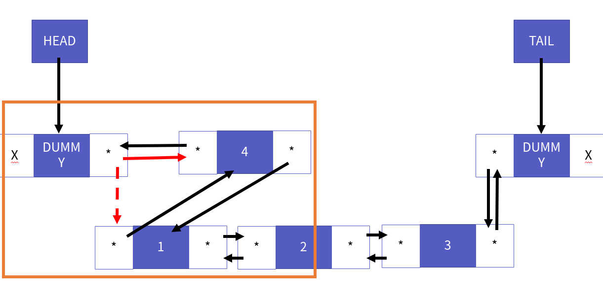
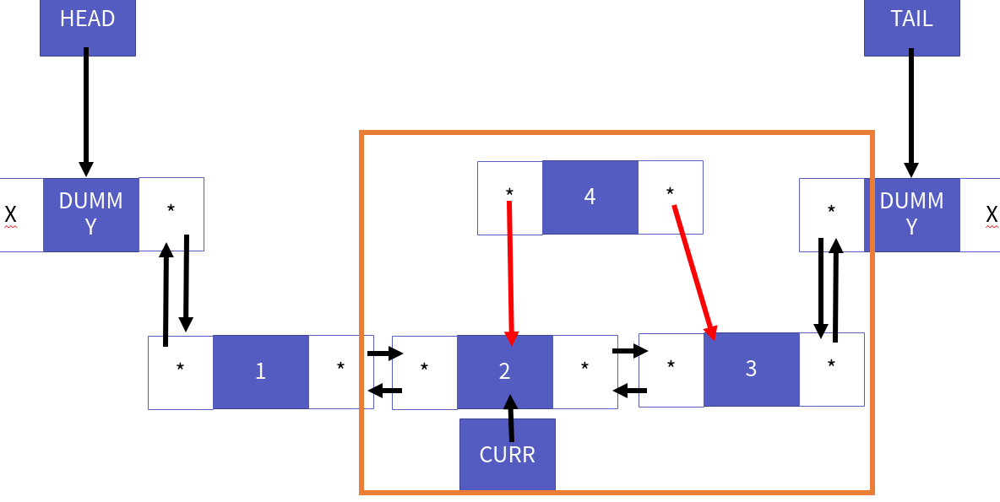
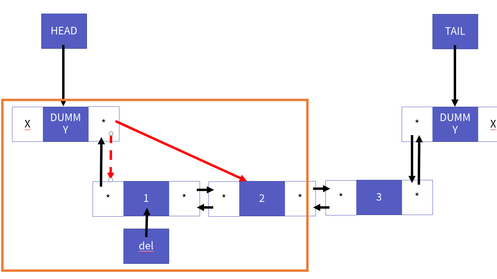
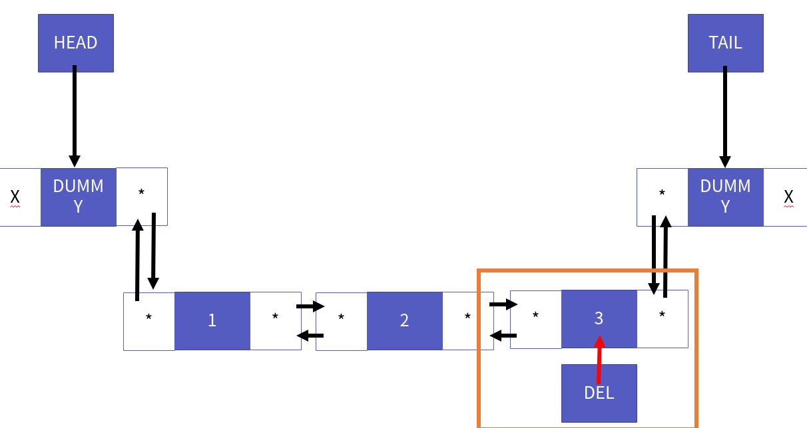
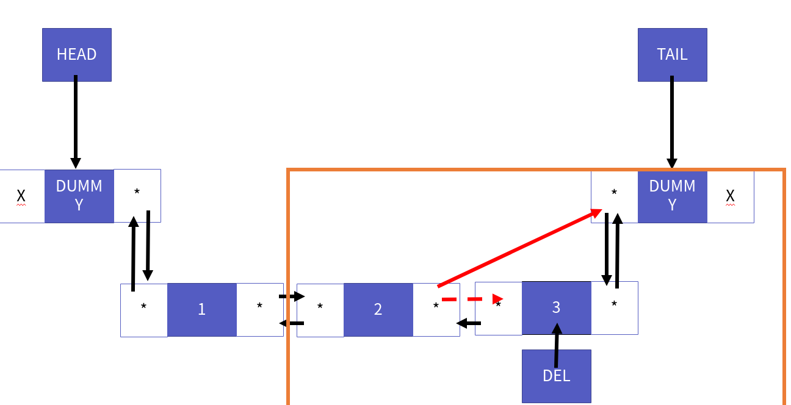
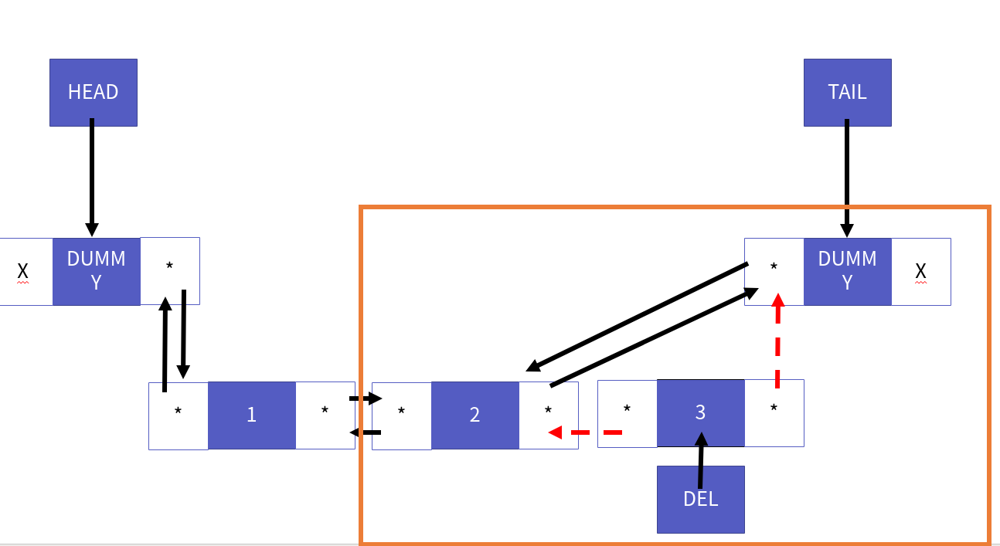

이중 연결 리스트 구현
===========

Contents
-------------------

1. 시작하며...
2. 이중 연결 리스트 정의
    * 이중 연결 리스트의 핵심 원리 
    * 리스트 ADT 확인
    * 리스트의 공통 main 함수
3. 이중 연결 리스트 구현
    * 이중 연결 리스트 구조체 정의
    * 리스트 생성과 파괴
    * 리스트 크기 반환
    * 리스트 인덱스 요소 접근 
    * 리스트 머리 삽입
    * 리스트 꼬리 삽입
    * 리스트 인덱스 삽입
    * 리스트 머리 삭제
    * 리스트 꼬리 삭제
    * 리스트 인덱스 삭제
4. 마치며...


## 시작하며...

구르미의 "Computer Science 정복하기 - 자료구조"의 엿섯 번째 장입니다. 이 장의 대략적인 내용은 다음과 같습니다. 

* 이중 연결 리스트의 정의
* 이중 연결 리스트의 구현

이 장의 소스코드는 다음을 참고해주세요.

    url: https://github.com/gurumee92/datastructure 
    branch: ch06
    code directory: src/ch06

자 시작합시다!


## 이중 연결 리스트 정의

이번 장에서는 리스트의 구현체 중 하나인 **이중 연결 리스트**에 대해서 알아보도록 하겠습니다. 이중 연결 리스트는 연결 리스트의 장점을 그대로 이어 받고 한 가지 더 장점을 가집니다.

    "머리, 꼬리 삽입/삭제 연산이 빠르다."

이중 연결 리스트는 머리 삽입/삭제 연산 말고도 꼬리 삽입/삭제 연산 역시 상수 시간에 해결할 수 있습니다. 이렇게 하기 위해서 **노드의 구조를 수정**해야 합니다. 이는 핵심 원리에서 살펴보도록 하죠.


#### 이중 연결 리스트의 핵심 원리 

이중 연결 리스트의 핵심 원리는 연결 리스트와 같이 **노드**입니다. 연결 리스트의 노드 모습은 어땠습니까? 제가 생각하는 노드의 모습은 다음과 같습니다.


데이터 부분이 있고, 다음 노드의 주소를 가리키는 포인터 부분이 있습니다. 이중 연결 리스트는 여기에 이전 노드의 주소를 가리키는 포인터가 하나 더 추가됩니다. 즉 다음의 구조를 가지고 있지요.

* 데이터
* 이전 노드를 가리키는 포인터
* 다음 노드를 가리키는 포인터

이중 연결 리스트의 노드의 모습은 다음과 같습니다.


이 노드 구조의 변화만으로 꼬리 삽입/삭제의 연산을 어떻게 상수 시간으로 바꿀 수 있을까요? 정답은 이중 연결 리스트의 `tail`에 있습니다. 이전 연결 리스트에서는 마지막 더미 노드를 가리키는 **`tail`이 있더하더라도 마지막 노드의 이전 노드를 접근할 방법이 없었습니다**. 그래서 불가피하게 반복문을 돌아야 했지요. 

반면 이중 연결 리스트에서는 더미 노드의 이전 노드를 가리키는 포인터 `prev`로 접근이 가능합니다. 즉, `tail->prev` 라는 문구를 통해서 마지막 노드로 바로 접근이 가능합니다. 이 노드를 통해서 바로 삭제 연산을 하는 것이지요. 이는 연결 리스트 파트 때처럼, 함수마다 흐름을 그림을 통해서 자세히 살펴보겠습니다.

이중 연결 리스트의 전체적인 모습은 다음과 같습니다.


#### 리스트 ADT 확인

본격적으로 구현하기 전에 리스트 ADT를 확인해 보겠습니다.

    ADT: List

    void LInit(List * pList);
        - 리스트를 초기화 합니다.
        - 리스트 생성 시 제일 먼저 호출됩니다.

    void LDestroy(List * pList);
        - 리스트를 제거합니다.
        - 할당된 메모리를 모두 회수합니다.

    LData LGet(List * pList, int index);
        - 해당 인덱스의 원소를 가져옵니다.
        - 인덱스의 원소가 없을 경우 에러를 반환합니다.

    void LSet(List * pList, int index, LData data);
        - 해당 인덱스의 원소를 data로 수정합니다.
        - 인덱스의 원소가 없을 경우 에러를 반환합니다.

    int LSize(List * pList);
        - 리스트의 크기를 반환합니다.

    void LInsertHeader(List * pList, LData data);
        - 리스트 머리 부분에 data를 삽입합니다.

    void LInsertIndex(List * pList, int index, LData data);
        - 리스트 index 위치에 data를 삽입합니다.
        - 만약 리스트 크기보다 크면 에러를 반환합니다.

    void LInsertTail(List * pList, LData data);
        - 리스트 꼬리 부분에 data를 삽입합니다.

    LData LRemoveHeader(List * pList);
        - 리스트 머리 부분에 위치한 data를 삭제합니다.

    LData LRemoveIndex(List * pList, int index);
        - 리스트 index에 위치한 data를 삭제합니다.
        - 만약 리스트 크기보다 크면 에러를 반환합니다.

    LData LRemoveTail(List * pList);
        - 리스트 꼬리 부분에 위치한 data를 삭제합니다.


#### 리스트의 공통 main 함수

다음은 main 함수 부분입니다. 헤더 삽입부를 제외하고 "연결 리스트"의 main 함수와 같습니다.

src/ch06/main.c
```c
#include<stdio.h>
#include<assert.h>

#include "DoubleLinkedList.h"

# define TEST_NUM 8

int main() {
    List list;

    LInit(&list);

    // 리스트 저장된 데이터 8 7 6 5 4 3 2 1 
    for (int i=0; i<TEST_NUM; i++) {
        LInsertHeader(&list, i + 1);
    }
    int size = LSize(&list);
    // 출력 8 7 6 5 4 3 2 1
    printf("LInsertHeader: ");
    for (int i=0; i<size; i++) {
        printf("%d ", LGet(&list, i));
    }
    printf("\n");

    // 출력 8 7 6 5 4 3 2 1
    printf("LRemoveHeader: ");
    for (int i=0; i<size; i++) {
        printf("%d ", LRemoveHeader(&list));
    }
    printf("\n");
    
    // 리스트 저장된 데이터 1 2 3 4 5 6 7 8 
    for (int i=0; i<TEST_NUM; i++) {
        LInsertTail(&list, i + 1);
    }

    printf("LInsertTail: ");
    for (int i=0; i<list.size; i++) {
        printf("%d ", LGet(&list, i));
    }
    printf("\n");

    // 리스트 저장된 데이터 5 2 3 4 5 6 7 8
    LSet(&list, 0, 5);
    printf("LSet: ");
    for (int i=0; i<list.size; i++) {
        printf("%d ", LGet(&list, i));
    }
    printf("\n");

    // 리스트 저장된 데이터 5 2 3 99 4 5 6 7 8
    LInsertIndex(&list, 3, 99);
    printf("LInsertIndex: ");
    for (int i=0; i<list.size; i++) {
        printf("%d ", LGet(&list, i));
    }
    printf("\n");

    // 리스트 저장된 데이터 5 2 3 100 99 4 5 6 7 8
    LInsertIndex(&list, 3, 100);
    printf("LInsertIndex: ");
    for (int i=0; i<list.size; i++) {
        printf("%d ", LGet(&list, i));
    }
    printf("\n");

    // 리스트 저장된 데이터 5 2 3 100 99 5 6 7 8
    LRemoveIndex(&list, 5);
    printf("LRemoveIndex: ");
    for (int i=0; i<list.size; i++) {
        printf("%d ", LGet(&list, i));
    }
    printf("\n");

    size = LSize(&list);

    // 출력 5 2 3 100 99 5 6 7 8
    printf("LGet LAST: ");
    for (int i=0; i<size; i++) {
        printf("%d ", LGet(&list, i));
    }
    printf("\n");

    // 출력 8 7 6 5 99 100 3 2 5
    printf("LRemoveTail: ");
    for (int i=0; i<size; i++) {
        printf("%d ", LRemoveTail(&list));
    }
    printf("\n");

    LDestroy(&list);
    return 0;
}
```


## 이중 연결 리스트 구현

자 이제 이중 연결 리스트를 구현해 봅시다.


#### 이중 연결 리스트 구조체 정의

이중 연결 리스트의 노드는 앞서 말했듯이 3부분으로 나타낼 수 있습니다.

* 데이터
* 이전 노드를 가리키는 포인터
* 다음 노드를 가리키는 포인터

또한, 앞선 그림에서 봤듯이 이중 연결 리스트 자체는 연결하는 노드 구조만 다를 뿐 연결 리스트와 그 구조가 똑같습니다. 즉 이들을 코드로 표현하면 다음과 같습니다.

src/ch06/DoubleLinkedList.h
```c
// 이중 연결 리스트가 저장할 데이터 int를 LData라는 이름으로 재지정
typedef int LData;

typedef struct _dNode {
    LData data;           // 노드의 데이터
    struct _dNode * prev; // 자기 참조 포인터. 이전 노드를 가리킵니다.
    struct _dNode * next; // 자기 참조 포인터. 다음 노드를 가리킵니다.
} Node;

// LinkedList 구조체 선언
typedef struct _double_linked_list {
    Node * head;    // 연결 리스트의 헤더
    Node * tail;    // 연결 리스트의 꼬리
    int size;       // 연결 리스트의 크기
} DoubleLinkedList;

// LinkedList List로 타입 재지정
typedef DoubleLinkedList List;
```

함수 선언부는 배열 리스트, 연결 리스트와 같습니다.

    참고!
    이번 장 부터는 코드 전문을 보여주지 않습니다. 소스 코드는 해당 브랜치를 확인해주세요!


#### 리스트 생성과 파괴

리스트 생성 함수의 큰 흐름은 다음과 같습니다. 

1. 더미 노드 2개를 만듭니다.
2. 더미 노드 1(head)의 포인터들을 prev=NULL, next=더미노드2의 주소로 가리키게 합니다.
3. 더미 노드 2(tail)의 포인터들을 next=NULL, prev=더미노드1의 주소를 가리키게 합니다.

코드는 다음과 같습니다.

src/ch06/DoubleLinkedList.c
```c 
void LInit(List * pList){
    // head 더미 노드 생성
    Node * head = (Node *) malloc(sizeof(Node));
    head->data = -123456;
    head->prev = NULL;
    head->next = NULL;
    // tail 더미 노드 생성
    Node * tail = (Node *) malloc(sizeof(Node));
    tail->data = -123456;
    tail->prev = NULL;
    tail->next = NULL;
    // head <-> tail 연결
    head->next = tail;
    tail->prev = head;
    // 연결 리스트의 해당 노드들 연결
    pList->head = head;
    pList->tail = tail;

    pList->size = 0;
}
```

`LInit` 함수가 호출된 후 이중 연결 리스트의 모습은 다음과 같습니다.


리스트를 파괴하는 함수 `LDestroy`는 연결 리스트와 다를게 없습니다. 모든 데이터 노드를 지우고 `head`, `tail`에 할당된 더미 노드들을 삭제하면 됩니다. 흐름은 다음과 같습니다.

1. 모든 데이터 노드를 삭제합니다.
2. head의 더미 노드를 삭제합니다.
3. tail의 더미 노드를 삭제합니다.

코드는 다음과 같습니다.

src/ch06/DoubleLinkedList.c
```c
void LDestroy(List * pList){

    while (pList->size > 0) {
        LRemoveHeader(pList);
    }

    if (pList->head != NULL) {
        free(pList->head);
        pList->head = NULL;
    }
    
    if (pList->tail != NULL) {
        free(pList->tail);
        pList->tail = NULL;
    }
    
    pList->size = 0;
}
```


#### 리스트 크기 반환

리스트 크기를 반환하는 함수 `LSize` 역시 다를게 없습니다. 이중 연결 리스트의 `size`를 반환하면 됩니다. 코드는 다음과 같습니다.

src/ch06/DoubleLinkedList.c
```c
int LSize(List * pList){
    return pList->size;
}
```


#### 리스트 인덱스 요소 접근 

인덱스 연산 함수들인 `LGet`, `LSet` 함수들 역시 연결 리스트와 코드는 같습니다. 인덱스만큼, 데이터 노드들을 순회하면 됩니다. 

즉, **이중 연결 리스트 역시 인덱스 연산의 시간 복잡도는 O(N)입니다.** 코드는 다음과 같습니다.

src/ch06/DoubleLinkedList.c
```c
LData LGet(List * pList, int index){
    if (index >= pList->size) {
        printf("Index Out of Bound Exception\n");
        assert(index < pList->size);
    }

    Node * curr = pList->head->next;

    for (int i=0; i<index; i++) {
        curr = curr->next;
    }

    return curr->data;
}

void LSet(List * pList, int index, LData data){
    if (index >= pList->size) {
        printf("Index Out of Bound Exception\n");
        assert(index < pList->size);
    }

    Node * curr = pList->head->next;

    for (int i=0; i<index; i++) {
        curr = curr->next;
    }

    curr->data = data;
}
```


#### 리스트 머리 삽입

이제 머리 삽입 함수 `LInsertHeader`를 살펴보겠습니다. 연결 리스트와 달리, 이중 연결 리스트의 노드에는 `prev`가 있습니다. 이들 역시 관리해주어야 합니다. 그림으로 흐름을 살펴보겠습니다. 먼저 다음의 연결 리스트가 존재한다고 가정하겠습니다.


이제 새로운 노드를 생성합니다. 


이 새로운 노드를 첫 노드로 연결시켜주기 위해서 노드의 `prev`를 `head`가 가리키는 더미노드로, `next`를 `head`가 가리키는 다음 노드로 연결시켜줍니다.


이제 `head`가 가리키는 더미 노드의 `next`, 즉 현재, 이중 연결 리스트에 저장된 첫 노드의 `prev`를 새로운 노드로 향하게 합니다.


그 후 `head`가 가리키는 더미 노드의 `next`를 새로운 노드로 향하게 합니다.



결국 다음의 모습이 됩니다.


코드로 표현하면 다음과 같습니다. 그림과 코드를 번갈아가면서 흐름을 파악하시면 이해하는데 도움이 되실겁니다.

src/ch06/DoubleLinkedList.c
```c
void LInsertHeader(List * pList, LData data){

    //1. 새로운 노드 생성
    Node * newNode = (Node *) malloc(sizeof(Node));
    newNode->data = data;

    //2. 새로운 노드의 포인터 연결
    newNode->prev = pList->head;
    newNode->next = pList->head->next;

    //3. 기존 노드들의 포인터를 새로운 노드로 연결
    pList->head->next->prev = newNode;
    pList->head->next = newNode;

    pList->size += 1;
}
```


#### 리스트 꼬리 삽입

이번엔 꼬리 삽입을 살펴보겠습니다. 이중 연결 리스트에서는 연결 리스트처럼 여러 상황을 고려할 필요가 없습니다. 왜냐하면, 바로 `tail`이 가리키는 더미 노드의 이전 노드를 `prev`로 접근할 수 있기 때문이죠.

또한 이 특성 때문에 **상수 시간에 꼬리 삽입/삭제 연산이 가능**합니다. 자 이제 흐름을 살펴보도록 하겠습니다.

머리 삽입과 상황은 같습니다. 다음의 데이터가 있다고 가정하겠습니다.


새로운 노드를 생성합니다.


이제 새로운 노드를 마지막 노드 위치로 연결하기 위해서, `next`는 `tail`이 가리키는 더미 노드로, `prev`는 `tail`이 가리키는 노드의 이전 노드, 즉 더미 노드의 `prev`로 연결합니다.


이제 `tail`이 가리키는 더미 노드의 `prev`, 즉 더미 노드의 이전 노드의 `next`를 새로운 노드로 향하게 합니다.


이제 `tail`이 가리키는 더미 노드의 이전 노드의 주소를 가리키는 포인터 `prev`를 새로운 노드로 향하게 합니다.


그러면 다음 모습이 됩니다. `prev`를 이용해서 반복문 없이도, 머리 삽입처럼 단 번에 꼬리 삽입을 가능하게 됐습니다. 이제 코드를 살펴보도록 하겠습니다. **역시 그림과 함께 흐름을 이해하면서 보면 좋을 것 같습니다**.

src/ch06/DoubleLinkedList.c
```c
void LInsertTail(List * pList, LData data){
    
    //1. 새로운 노드 생성
    Node * newNode = (Node *) malloc(sizeof(Node));
    newNode->data = data;

    //2. 새로운 노드의 포인터 연결
    newNode->prev = pList->tail->prev;
    newNode->next = pList->tail;

    //3. 기존 노드들의 포인터를 새로운 노드로 연결
    pList->tail->prev->next = newNode;
    pList->tail->prev = newNode;
    
    pList->size += 1;
}
```


#### 리스트 인덱스 삽입

인덱스 삽입은 연결 리스트와 마찬가지로 다음의 3가지 상황을 고려해야 합니다.

1. index == 0
2. index == size-1
3. 그 외

첫 번째 상황에서는 머리 삽입 함수 `LInsertHeader`를 호출하면 됩니다. 두 번째 상황에서는 꼬리 삽입 함수 `LInsertTail`을 호출하면 됩니다. 그럼 그 외 상황은 어떻게 할까요?

기본적으로 연결 리스트 흐름과 똑같습니다. 다만 `prev` 포인터를 다루는 것만 기억하시면 됩니다. 역시 그림으로 흐름을 이해하겠습니다. 다음의 연결 리스트가 있다고 가정하겠습니다.


인덱스는 2로 가정해보겠습니다. 즉 데이터 2를 가진 노드 다음 자리에 데이터를 삽입하는 것입니다. 

노드를 순회하는 포인터 `curr`을 `head`가 가리키는 더미 노드의 다음 노드, 즉 `next`의 위치로 연결합니다.


이제, index-1 만큼 `curr`을 움직입니다. 횟수만큼 `curr=curr->next`를 반복하면 됩니다.


이제 새로운 노드를 생성합니다.


이제 인덱스 2의 위치로 연결하기 위해서 새로운 노드의 `prev`를 `curr`이 가리키는 노드로, `next`를 `curr`이 가리키는 노드의 다음 노드 즉, `next`로 연결합니다.



그 후 `curr`이 가리키는 노드의 `next`, 즉 다음 노드의 `prev`를 새로운 노드로 향하게 합니다.


이제 `curr`이 가리키는 노드의 다음 노드의 주소 가리키는 포인터 `next`를 새로운 노드와 연결시킵니다.


인덱스 삽입 후 이중 연결 리스트의 모습은 다음과 같습니다.


코드는 다음과 같습니다. 역시 코드와 그림을 번갈아서 보시면 이해가 더 잘 될 것입니다.

src/ch06/DoubleLinkedList.c
```c
void LInsertIndex(List * pList, int index, LData data){
    if (index >= pList->size) {
        printf("Index Out of Bound Exception\n");
        assert(index < pList->size);
    }

    if (index == 0) {
        return LInsertHeader(pList, data);
    }

    if (index == pList->size - 1) {
        return LInsertTail(pList, data);
    }

    //1. 순회할 노드 포인터 curr을 가장 맨 앞의 노드를 가리키게 합니다.
    Node * curr = pList->head->next;

    //2. curr을 index-1 만큼 순회합니다.
    for (int i=0; i<index-1; i++) {
        curr = curr->next;
    }

    //3. 새로운 노드를 생성합니다.
    Node * newNode = (Node *) malloc(sizeof(Node));
    newNode->data = data;

    //4. 새로운 노드의 포인터들을 연결합니다.
    newNode->prev = curr;
    newNode->next = curr->next;

    //5. 기존 노드들의 포인터를 새로운 노드로 연결
    curr->next->prev = newNode;
    curr->next = newNode;

    pList->size += 1;
}
```


#### 리스트 머리 삭제

이번엔 머리 삭제 함수인 `LRemoveHeader`를 보겠습니다. 삭제 연산 역시 연결 리스트와 비슷합니다. `prev` 포인터를 관리하기만 하면 되죠. 바로 흐름으로 들어갑시다. 다음의 데이터가 있다고 가정하겠습니다.


이제 데이터 노드 중 가장 앞에 있는 노드, 그러니까 `head`가 가리키는 더미 노드의 다음 노드, 즉 `next`가 가리키는 노드를 가리키는 포인터 `del`을 만듭니다.


이제 삭제 노드의 이전 노드 즉 `prev`가 가리키는 노드의 `next`를 삭제 노드의 다음 노드 즉, 삭제 노드의 `next`가리키는 노드로 연결합니다.



그 후 삭제 노드의 다음 노드 즉 `next`가 가리키는 노드의 `prev`를 삭제 노드의 이전 노드 즉, 삭제 노드의 `prev`가리키는 노드로 연결합니다.


이제 삭제 노드의 `prev`, `next`의 연결 선을 끊습니다.


이제 노드를 삭제합니다.


머리 삭제 후 이중 연결 리스트는 다음과 같습니다.


코드는 다음과 같습니다.

src/ch06/DoubleLinkedList.c
```c
LData LRemoveHeader(List * pList){
    if (pList->size <= 0) {
        printf("List Empty Exception\n");
        assert(pList->size > 0);
    }

    //1. 가장 맨 앞의 노드를 가리키는 포인터 del
    Node * del = pList->head->next;
    LData ret = del->data;

    //2. 삭제 노드 전 후로, 노드 연결
    del->prev->next = del->next;
    del->next->prev = del->prev;

    //3. 삭제 노드 연결선 끊기
    del->prev = NULL;
    del->next = NULL;

    //4. 노드 삭제
    free(del);

    pList->size -= 1;
    return ret;
}
```


#### 리스트 꼬리 삭제

이제 꼬리 삭제를 보겠습니다. 꼬리 삽입과 마찬가지로, `prev`를 통해 한 번에 접근해서 삭제가 가능합니다. 흐름을 살펴볼까요? 먼저 데이터가 다음과 같다고 가정하겠습니다.


이제 데이터 노드 중 가장 마지막에 있는 노드, 그러니까 `tail`이 가리키는 더미 노드의 이전 노드, 즉 `prev`가 가리키는 노드를 가리키는 포인터 `del`을 만듭니다.



이제 삭제 노드의 이전 노드 즉 `prev`가 가리키는 노드의 `next`를 삭제 노드의 다음 노드 즉, 삭제 노드의 `next`가리키는 노드로 연결합니다.



그 후 삭제 노드의 다음 노드 즉 `next`가 가리키는 노드의 `prev`를 삭제 노드의 이전 노드 즉, 삭제 노드의 `prev`가리키는 노드로 연결합니다.


이제 삭제 노드의 `prev`, `next`의 연결 선을 끊습니다.



이제 노드를 삭제합니다.


꼬리 삭제 후 이중 연결 리스트는 다음과 같습니다.


살펴보시면, **삭제 흐름이 머리 삽입과 유사합니다**. 단지, `head`가 가리키는 다음 노드, `tail`이 가리키는 이전 노드의 차이일 뿐입니다. 다음은 코드입니다.

src/ch06/DoubleLinkedList.c
```c
LData LRemoveTail(List * pList){
    if (pList->size <= 0) {
        printf("List Empty Exception\n");
        assert(pList->size > 0);
    }

    //1. del 꼬리 노드가 가리키는 더미 노드의 이전 노드 = 마지막 노드
    Node * del = pList->tail->prev;
    LData ret = del->data;

    //2. 삭제 노드 전 후로, 노드 연결
    del->prev->next = del->next;
    del->next->prev = del->prev;

    //3. 삭제 노드 연결선 끊기
    del->prev = NULL;
    del->next = NULL;

    //4. 노드 삭제
    free(del);

    pList->size -= 1;
    return ret;
}
```


#### 리스트 인덱스 삭제

인덱스 삭제 역시, 인덱스 삽입과 마찬가지로 3가지 상황을 고려해야 합니다.

1. index == 0
2. index == size-1
3. 그 외

역시 첫 번째 상황에선, `LRemoveHeader` 두 번째 상황에선 `LRemoveTail` 함수를 호출하면 됩니다. 그 외의 흐름은 다음과 같습니다.

1. 삽입처럼 `curr`로 index-1 까지 순회합니다.
2. 삭제할 노드를 가리키는 `del`을 `curr->next`의 위치로 합니다.
3. del->prev->next = del->next
4. del->next->prev = del->prev
5. del->prev = del->next = NULL
6. del 삭제

흐름은 이전까지의 모든 함수들을 참고해서 직접 그려보세요. 이해하는데 크게 도움이 될 겁니다.  다음은 코드입니다.

src/ch06/DoubleLinkedList.c
```c
LData LRemoveIndex(List * pList, int index){
    if (pList->size <= 0) {
        printf("List Empty Exception\n");
        assert(pList->size > 0);
    }

    if (index >= pList->size) {
        printf("Index Out of Bound Exception\n");
        assert(index < pList->size);
    }

    if (index == 0) {
        return LRemoveHeader(pList);
    }

    if (index == pList->size - 1) {
        return LRemoveTail(pList);
    }

    //1. curr 머리 노드부터 시작해서 index-1까지 위치를 옮김
    Node * curr = pList->head->next;

    for (int i=0; i<index-1; i++) {
        curr = curr->next;
    }

    //2. del = curr->next
    Node * del = curr->next;
    LData ret = del->data;

    //3. 삭제 노드의 이전 노드와 다음 노드 연결
    del->prev->next = del->next;
    del->next->prev = del->prev;

    //4. 삭제 노드의 prev, next 연결 해제
    del->prev = NULL;
    del->next = NULL;

    //5. 노드 삭제
    free(del);

    pList->size -= 1;
    return ret;
}
```


## 마치며...

이렇게 해서 이중 연결 리스트 구현 파트를 마치겠습니다. 연결리스트보다 양이 더 많네요. 마지막으로 다음 표로 리스트를 정리해보겠습니다.

| 구분 | 배열 리스트 | 연결 리스트 | 이중 연결 리스트 |
| :--: | :--: | :--: | :--: |
| 인덱스 연산 | O(1) | O(N) | O(N) |
| 머리 삽입/삭제 | O(N) | O(1) | O(1) |
| 꼬리 삽입/삭제 | O(1) | O(N) | O(1) |

즉, 순차 리스트(배열 리스트)와 연결 리스트는 각각의 장단점이 있습니다. 순차 리스트는 인덱스 연산 시 성능이 우세하며, 연결 리스트는 머리,꼬리 삽입/삭제 연산 시 성능이 우세합니다. 무엇을 선택할지는 개발자가 선택하면 됩니다.

다음 장에서는 스택을 알아보도록 하겠습니다.
