자료구조 스택과 구현
===========

Contents
-------------------

1. 시작하며...
2. 스택 정의
    * 스택 
    * 스택 ADT
    * 스택 main 함수
3. 스택 구현
    * 기존 자료구조를 활용하자!
    * 스택 생성과 파괴
    * IsEmpty
    * Push
    * Pop
    * Peek
4. 마치며...


## 시작하며...

구르미의 "Computer Science 정복하기 - 자료구조"의 일곱 번째 장입니다. 이 장의 대략적인 내용은 다음과 같습니다. 

* 자료구조 스택의 정의
* 배열리스트 기반 스택 구현

이 장의 소스코드는 다음을 참고해주세요.

    url: https://github.com/gurumee92/datastructure 
    branch: ch07
    code directory: src/ch07

자 시작합시다!

## 스택 정의

이번 장에서는 **스택**이란 자료구조를 알아보겠습니다.


#### 스택 

**스택**이란 자료구조는 전형적인 `LIFO(Last In First Out)구조` 입니다. 쉽게 생각해서 **프링글스** 과자통이라고 생각하면 됩니다. 

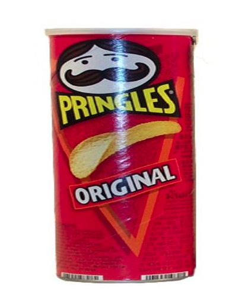

다음과 같이 프링글스 과자를 번호를 붙여 통에 넣는다고 생각해보겠습니다.

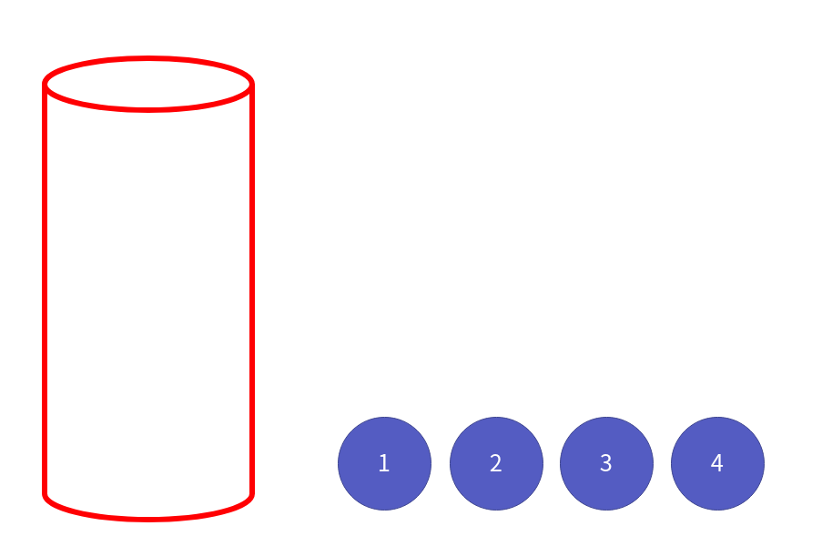

먼저 차례대로 1, 2, 3, 4 과자를 넣습니다.

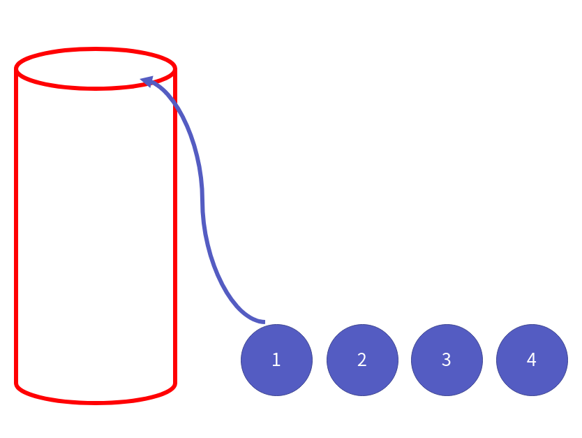

그럼 결과적으로 다음 모습을 띄게 될 겁니다. 

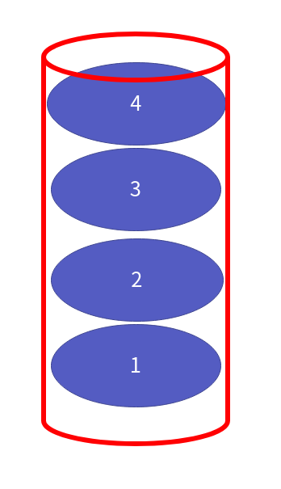

이렇게 프링글스 통에 과자를 넣는 것처럼 스택도 이런식으로 데이터가 쌓입니다. 이를 `push` 연산이라고 합니다. 이제 프링글스 통 위에서 한 번 살펴볼까요?

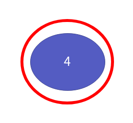

바로 4번 과자가 보이죠? 이렇게 스택의 맨 위의 데이터를 확인하는 것을 `peek` 연산이라고 합니다. 이제 데이터를 꺼내보도록 하죠.

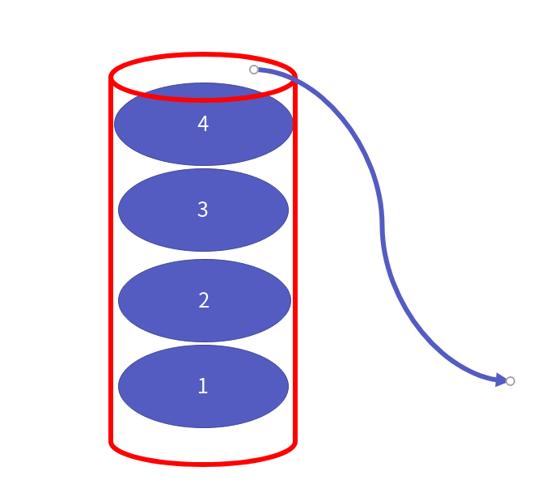

이 경우 들어간 순서 1, 2, 3, 4와 반대로 4, 3, 2, 1 순으로 나오게 됩니다. 다음 그림처럼 말이죠.

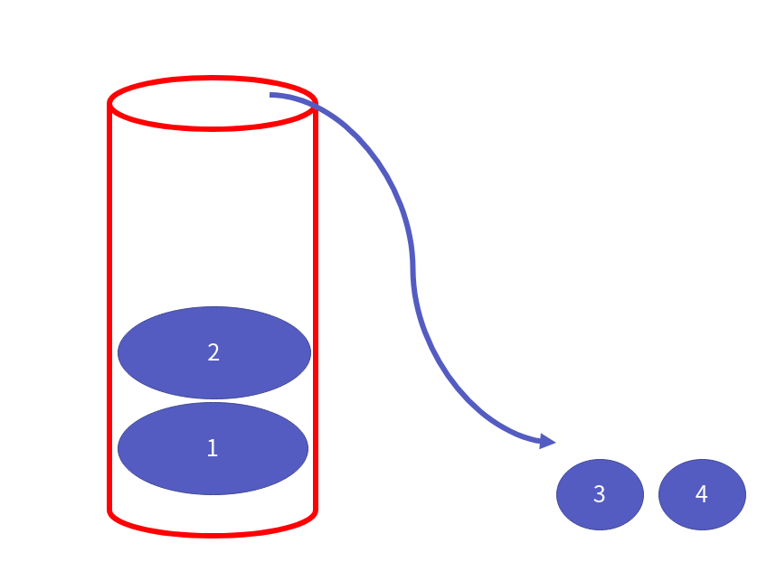

이렇게 스택에서 데이터를 빼내는 연산은 `pop` 연산이라고 합니다. 즉 `LIFO 구조`는 마지막에 들어간 4가 제일 먼저 나온 것처럼, 마지막에 들어간 데이터가 제일 먼저 나가는 구조를 뜻합니다.

이제 스택이 어떤 자료구조인지 대충 감이 오시나요? 참고적으로 스택의 `pop`, `peek`, `push` 연산은 모두 상수 시간의 시간 복잡도를 가지게 됩니다.


#### 스택 ADT

이제 스택의 ADT를 살펴보겠습니다. 위의 나온 3가지 연산외에 스택 생성, 스택 파괴, 빈 스택 검사에 대한 연산도 추가적으로 만들기로 하죠. 제가 정의한 스택의 ADT는 다음과 같습니다.

    ADT: Stack

    void SInit(Stack * pStack);
    - 스택을 생성합니다.

    void SDestroy(Stack * pStack);
    - 스택을 파괴합니다.

    int SIsEmpty(Stack * pStack);
    - 스택이 비어 있는지 확인합니다.
    - 비었으면 1을, 데이터가 있으면 0을 반환합니다.

    void SPush(Stack * pStack, SData data);
    - 스택에 데이터를 넣습니다.
    - 데이터는 들어간 순서대로 쌓입니다.

    SData SPop(Stack * pStack);
    - 스택의 맨 위의 데이터를 삭제합니다.

    SData SPeek(Stack * pStack);
    - 스택의 맨 위의 데이터를 확인합니다.


#### 스택 main 함수

다음은 제가 작성한 main 함수입니다. 스택 코드를 잘 작성했다면, 문제 없이 돌아야 합니다.

src/ch07/main.c
```c
#include<stdio.h>
#include<assert.h>

#include "Stack.h"

int main() {
    Stack stack;

    SInit(&stack);

    // 출력 empty: 1
    printf("Before insert data, isEmpty: %d\n", SIsEmpty(&stack)); 

    for (int i=0; i<5; i++){
        SPush(&stack, i+1);
    }

    // 출력 empty: 0
    printf("After push data, isEmpty: %d\n", SIsEmpty(&stack)); 

    // 출력 TOP: 5
    printf("TOP: %d\n", SPeek(&stack));


    // 출력 5 4 3 2 1
    while (!SIsEmpty(&stack)) {
        printf("%d ", SPop(&stack));
    }
    printf("\n");

    printf("After pop data, isEmpty: %d\n", SIsEmpty(&stack)); 

    SDestroy(&stack);
    return 0;
}
```


## 스택 구현

이제 스택을 구현해봅시다.


#### 기존 자료구조를 활용하자!

원래 자료구조마다, 각각을 정의해도 되지만, 잘 정의된 자료구조로 새로운 자료구조를 만드는 것도 가능합니다. 이번 스택을 구현할 때는 지난 시간에 만들었던 **배열 리스트**를 이용해보겠습니다. 소스 디렉토리를 보시면, ch04 디렉토리에서 ArrayList.h, ArrayList.c를 복사해온 것을 알 수 있습니다.

그리고 이들을 이용하기 위해서 `Stack.h`에서 배열 리스트와, 배열 리스트가 저장하는 데이터 타입을 다시 지정한 코드를 볼 수 있습니다.

src/ch07/Stack.h
```c
// 배열 리스트 import
#include "ArrayList.h"

// 배열 리스트가 저장하는 데이터 타입을 스택이 저장하는 데이터 타입으로 지정
typedef LData SData;

// 배열 리스트를 스택으로 지정
typedef ArrayList Stack;
```

또한 ADT를 참고해서 함수 선언부를 선언해두었습니다.

src/ch07/Stack.h
```c
void SInit(Stack * pStack);
void SDestroy(Stack * pStack);

int SIsEmpty(Stack * pStack);
void SPush(Stack * pStack, SData data);
SData SPop(Stack * pStack);
SData SPeek(Stack * pStack);
```


#### 스택 생성과 파괴

스택의 생성과 파괴는 쉽습니다. 기존 배열 리스트를 이용하기 때문에, 배열 리스트의 생성 함수 `LInit`, 파괴 함수 `LDestroy`를 호출하기만 하면 됩니다. 다음은 코드입니다.

src/ch07/Stack.c
```c
void SInit(Stack * pStack){
    LInit(pStack);
}

void SDestroy(Stack * pStack){
    LDestroy(pStack);
}
```

#### IsEmpty

이제 스택이 비어있는지 여부를 확인해보겠습니다. 간단합니다. 배열 리스트의 `size`가 0인가를 따지면 됩니다. 0이라면 1을, 아니라면 0을 반환하면 됩니다.

    참고! 왜 0일 때 1을 반환하는가?
    비어있는지 여부는 데이터 개수가 0이라면, 비어 있다고 할 수 있습니다. 즉 `size`==0 이면 비어있는 것입니다. 근데 왜 1을 반환하는지 궁금할 것입니다. 이것은 C/C++의 언어적 특성인데, 만약 조건 연산에서 참이라면 1을 아니라면 0을 반환하기 때문입니다.

 따라서, 배열 리스트의 크기 반환 함수 `LSize`를 호출한 후, 0인지 따져보면 됩니다. 다음은 코드입니다.

src/ch07/Stack.c
```c
int SIsEmpty(Stack * pStack){
   return ( LSize(pStack) == 0 );
}
```


#### Push

이번에는 스택에 있어 중요한 연산 중 하나인 `push` 연산입니다. 데이터를 넣을 때, 차례대로 쌓이게 해야 합니다. 또한 상수 시간에 이를 해결해야 하지요. 어떻게 할 수 있을까요?

정답은 간단합니다. **배열 리스트의 꼬리 부분에 데이터를 삽입하면 됩니다.** 생각해보면, 배열 리스트의 삽입 연산은 꼬리 삽입 외에, 모두 O(N)이 걸리기 때문에, 꼭 꼬리 부분에 데이터를 넣어야 합니다.

코드는 다음과 같습니다.

src/ch07/Stack.c
```c
void SPush(Stack * pStack, SData data){
    LInsertTail(pStack, data);
}
```


#### Pop

스택에 있어 다른 중요한 연산 `pop` 연산을 구현해보도록 하겠습니다. 저장된 데이터를 어떻게 역순으로 꺼내올까요? 먼저 삽입 후 데이터 형태를 보죠. 1, 2, 3, 4 를 넣어보겠습니다.

Push(1)

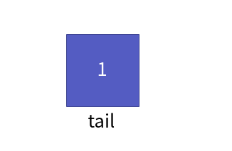

Push(2)

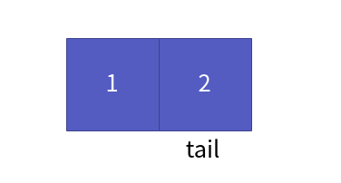

Push(3)

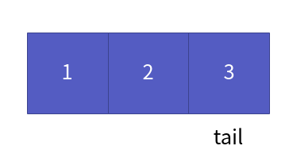

Push(4)

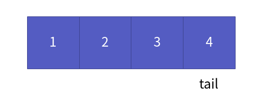

이제 pop 연산을 해보겠습니다. 그냥 간단합니다. 삽입과 마찬가지로 꼬리부터 삭제하면 됩니다. 

Pop()


Pop()


Pop()


Pop()

이제, 데이터가 없습니다. 즉 pop 연산 역시 꼬리 삭제 함수 LRemoveTail을 이용하면 됩니다. 대충 흐름을 알았으니 코드를 작성해볼까요?

src/ch07/Stack.c
```c
SData SPop(Stack * pStack){

    if (SIsEmpty(pStack)) {
        printf("Stack is Empty! ContainerEmptyException!");
        assert(! SIsEmpty(pStack));
    }

    SData ret = LRemoveTail(pStack);
    return ret;
}
```

`pop` 연산 시 코드를 작성할 때 주의할 점은, 스택이 비어있을 때, `pop` 연산이 호출되면 안됩니다. 그래서 예외 처리 코드를 넣어줍니다. 또한, 배열 리스트는 꼬리 삽입말고 삭제 역시 O(1)의 시간 복잡도를 가지기 때문에, 연산 조건을 충족합니다.


#### Peek

이젠 맨 위의 데이터를 확인하는 `peek` 연산을 구현해보겠습니다. 가장 간단한 방법은 배열 리스트의 크기를 구한 후, 크기-1을 하면 가장 마지막에 들어온 데이터를 확인할 수 있습니다. 코드는 다음과 같습니다.

src/ch07/Stack.c
```c
SData SPeek(Stack * pStack){

    if (SIsEmpty(pStack)) {
        printf("Stack is Empty! ContainerEmptyException!");
        assert(! SIsEmpty(pStack));
    }

    int size = LSize(pStack);
    SData ret = LGet(pStack, size-1);
    return ret;
}
```


## 마치며...

이번 챕터에서는 `LIFO 구조`의 대표주자 스택에 대해 알아보았습니다. 또한, 기존 만들었던 `배열 리스트`를 통해 스택을 구현해보았습니다. 어떤가요? 스택에 대해서 이해가 되셨나요? 자료구조 스택의 활용은 비교적 빈번하게 나타납니다. 대표적인 예제로 계산기가 있습니다. 다음 장에서는 **스택을 응용해서 계산기를 만들어보겠습니다.**