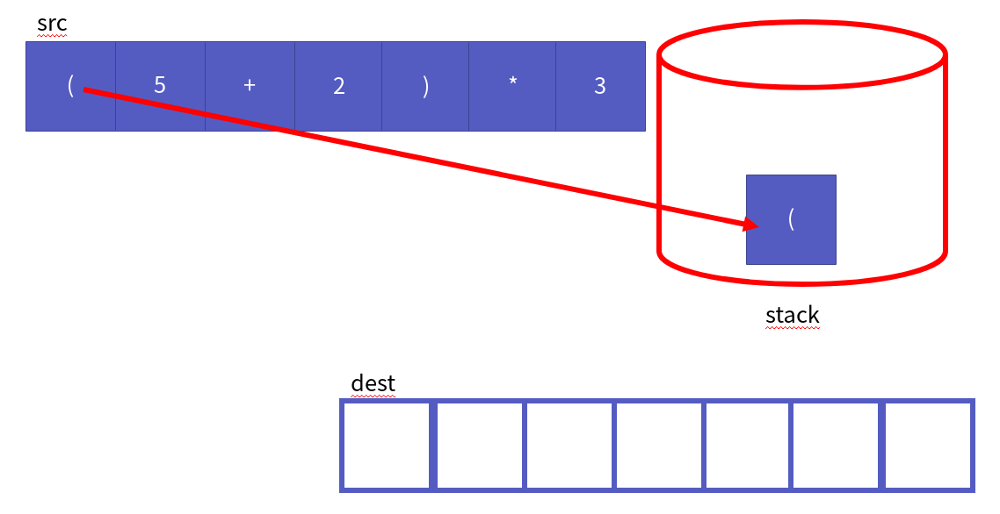
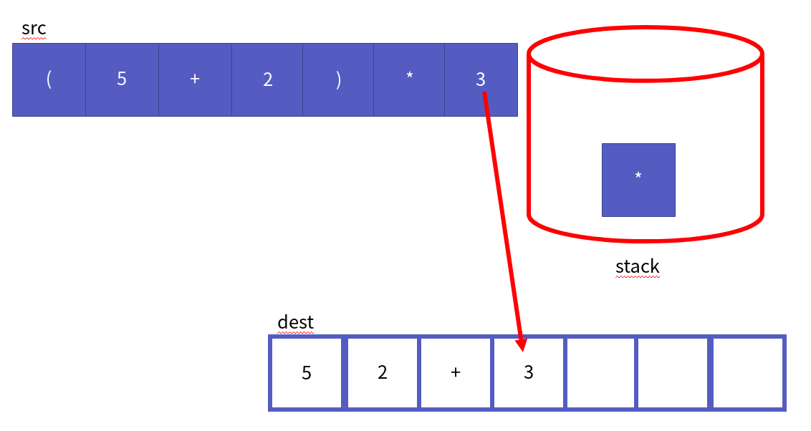

스택 응용 - 계산기
===================

Contents
-----------------

1. 시작하며...
2. 계산기 핵심 원리
    * 전위 표현식? 중위 표현식? 후위 표현식?
    * 중위 표현식을 후위 표현식으로
    * 후위 표현식 계산하기
3. 계산기 구현 코드
4. 마치며...


## 시작하며...

구르미의 "Computer Science 정복하기 - 자료구조"의 여덟 번째 장입니다. 이 장의 대략적인 내용은 다음과 같습니다. 

* 계산기를 구현하는데 필요한 핵심 원리
* 스택을 활용한 계산기 구현

이 장의 소스코드는 다음을 참고해주세요.

    url: https://github.com/gurumee92/datastructure 
    branch: ch08
    code directory: src/ch08

자 시작합시다!


## 계산기 핵심 원리

계산기 프로그램은 **스택이란 자료구조를 응용**해서 만드는 대표적인 예제입니다. **우리가 만들 계산기는 1의 자리 숫자들과 연산자를 입력받아 결과를 계산하는 계산기입니다.** 이렇게 제약 사항을 두는 것은 오로지 "스택을 활용한 계산", 이 한 가지에 집중하기 위해서입니다. 스택을 응용해서 계산기를 만들면 다음의 복잡한 수식도 계산할 수 있습니다.

    ( ( (7 + 2) * 3 ) - (5 / (2 + 3) ) ) / 3

이번 절에서, 계산기를 구현하는데 필요한 핵심 원리에 대해서 알아보도록 하겠습니다.


#### 전위 표현식? 중위 표현식? 후위 표현식?

먼저 계산기의 핵심 원리를 알기 전에 **표현식**이라는 것을 알아야 합니다. 먼저 우리가 자주 쓰는 중위 표현식을 살펴보죠.

    5 - 6 / 3 = 3

중위 표현식은 **연산자마다 우선 순위를 근거로 연산을 수행**합니다. 그러나 우리에게 생소한 전위 표현식과 후위 표현식은 연산자의 우선 순위가 아닌 **배치 순서를 근거로 연산**을 수행합니다. 위의 중위 표현식을 바꾸면 다음과 같습니다.

* 전위 표현식 -> 5 / 6 3
* 후위 표현식 -> 5 6 3 / -

위 두 표현식은 계산 할 때, 배치 순서를 근거로 연산을 하기 때문에, **연산자의 우선 순위를 생각할 필요가 없습니다**. 그래서, 우리는 이를 이용할 건데요, 우리가 집중할 표현식은 **후위 표현식**입니다. 이는 **컴파일러**에서 주로 쓰이는 방식인데요, 만약 다음의 연산 순서가 있다고 가정하겠습니다.

    피연산자1 피연산자2 피연산자3 연산자1 연산자2

그럼 먼저 피연산자2, 3 그리고 연산자1에 대해서 연산이 일어납니다.

    피연산자2 피연산자3 연산자1 = 결과값1

그 후 피연산자1과 결과값1 그리고 연산자2에 대해서 연산이 일어납니다.

    피연산자1 결과값1 연산자2 = 결과값2

이 결과값2가 우리가 구하는 값이지요. 한 번, 수식에 대입을 해보겠습니다.

    5 6 3 / - 

위의 수식에서 먼저 피연산자2인 6, 피연산자3인 3, 연산자1인 / 을 계산합니다.

    6 / 3 = 2

이제 피연산자1인 5와 결과값 2 연산자2 - 를 계산합니다.

    5 - 2 = 3

즉, 중위 표현식 5 - 6 / 3 의 결과값인 3이 나왔습니다. 결론부터 말씀드리면, 우리가 구현할 "스택을 활용하는 계산기"는 크게 다음의 2가지 기능을 구현하면 됩니다.

* 중위 표현식을 후위 표현식으로 바꾸는 기능.
* 후위 표현식을 계산하는 기능.

이 2가지 기능 모두 스택을 활용해서 만들 수 있는데요, 이제 그 원리들을 하나씩 살펴보죠.


#### 중위 표현식을 후위 표현식으로

먼저 중위 표현식을 후위 표현식으로 바꿔는 원리에 대해 알아보겠습니다. 꽤 어려우니 그림으로 흐름을 살펴보도록 하겠습니다.

**(1) 괄호가 없는 수식 - 연산자 우선 순위도 순서대로**

먼저 가장 쉬운 것부터 진행하겠습니다. 우리가 생각할 수식은 괄호도 없고, 중위 표현식으로 쓸 때 연산자의 우선 순위도 순서대로 쓰여진 수식입니다. 예는 다음과 같습니다.

    "5 - 6 / 3" (데이터에서 공백은 없습니다.)

중위 표현식에서 후위 표현식으로 바꾸려면 다음의 데이터들이 필요합니다.

* 중위 표현식을 표현하는 문자열 src
* 연산자를 저장하는 스택 stack
* 후위 표현식을 표현할 문자열 dest

그림으로 나타내면 다음과 같습니다.


src 첫 번째 데이터 '5'는 dest의 첫 번째 위치로 옮깁니다.


src 두 번째 데이터 '-'는 연산자이므로 스택에 저장합니다.


src 세 번째 데이터 '6'는 dest의 두 번째 위치로 옮깁니다.


src 네 번째 데이터 '/'는 연산자이므로 스택에 저장합니다.


src 다섯 번째 데이터 '3'은 dest의 세 번째 위치로 옮깁니다.


src 순회를 마쳤으면 스택에서 순서대로 연산자를 빼냅니다. 


그림에서 표현하듯이, 중위 표현식 "5 - 6 / 3"을 후위 표현식으로 바꾸면, "5 6 3 / -"가 됩니다. 아까 표현식을 바꿀 때랑 같죠? 자 다음으로 넘어갑시다.


(2) 괄호가 없는 수식 - 우선 순위 높을 때?

이번에는 다음 수식으로 해보겠습니다.

    "5 * 2 + 1"

이번에도 바꾸면, "5 2 1 * +"가 될까요? 아까처럼 계산해보면, 바로 틀리다는 것을 알 수 있습니다. 그림으로 쭉 살펴보죠. 이번에는 데이터가 다음과 같을 겁니다.


src 첫 번째 데이터 '5'는 dest의 첫 번째 위치로 옮깁니다.


src 두 번째 데이터 '*'는 연산자이므로 스택에 저장합니다.


src 세 번째 데이터 '2'는 dest의 두 번째 위치로 옮깁니다.


src 네 번째 데이터 '+'는 연산자이므로 스택에 저장합니다. 이 때, 만약 **스택에서 자신보다 높은 우선 순위의 연산자가 있다면**, 저장된 연산자를 스택에서 dest로 옮긴 후 저장합니다. 


src 다섯 번째 데이터 '3'은 dest의 세 번째 위치로 옮깁니다.


src 순회를 마쳤으면 스택에서 순서대로 연산자를 빼냅니다. 


정답은 "5 2 * 1 +" 입니다. 이 때 연산은 다음과 같습니다.

    5 2 * => 5 * 2 = 10
    10 1 + => 10 + 1 = 11


(3) 괄호가 없는 수식 - 우선 순위 같을 때?

만약 우선 순위가 같은 수식이 나란히 붙어 있다면 어떻게 될까요? 예는 다음과 같습니다.

    "5 - 2 + 3"

(1), (2) 둘 중의 하나의 순서와 같습니다. 한 번 생각해보세요. 어떤 과정가 같을까요?

정답은 (2)번입니다. 그림으로 살펴보겠습니다. "5 - 2 + 3"의 초기 상황은 다음과 같습니다.


src 첫 번째 데이터 '5'는 dest의 첫 번째 위치로 옮깁니다.


src 두 번째 데이터 '-'는 연산자이므로 스택에 저장합니다.


src 세 번째 데이터 '2'는 dest의 두 번째 위치로 옮깁니다.


src 네 번째 데이터 '+'는 연산자이므로 스택에 저장합니다. 이 때, 만약 **스택에서 자신보다 높거나 같은 우선 순위의 연산자가 있다면**, 저장된 연산자를 스택에서 dest로 옮긴 후 저장합니다. 


src 다섯 번째 데이터 '3'은 dest의 세 번째 위치로 옮깁니다.


src 순회를 마쳤으면 스택에서 순서대로 연산자를 빼냅니다. 


그래서 위의 수식은 후위 표현식으로 "5 2 - 3 +" 입니다. 계산 순서는 다음과 같습니다.

    5 2 - => 5 - 2 = 3
    3 3 + => 3 + 3 = 6


(4) 괄호가 있는 수식

이제 괄호가 있는 수식을 살펴보도록 하겠습니다. 수식은 다음과 같습니다.

    "( 5 + 2 ) * 3"

이 경우 어떻게 할까요? 바로 그림으로 들어가겠습니다. 첫 데이터 상황은 다음과 같습니다.


src 첫 번째 데이터 '('는 연산자이므로 스택에 저장합니다.



src 두 번째 데이터 '5'는 dest 첫 번째 위치로 옮깁니다.


src 세 번째 데이터 '+'는 연산자이므로 스택에 저장합니다. 이 때, 만약 **스택에서 자신보다 높거나 같은 우선 순위의 연산자가 있다면**, 저장된 연산자를 스택에서 dest로 옮긴 후 저장합니다. 

지금 앞에 "(" 있습니다. 누가 더 우선 순위가 높다고 생각할까요? 여기서는 **"(" 연산자는 "+"의  우선순위보다 낮습니다.** 따라서 스택에서 "("를 옮기지 않고 저장합니다.


src 네 번째 데이터 '2'는 dest 두 번째 위치로 옮깁니다.


src 다섯 번째 데이터 ')'는 연산자입니다. 그러나 이 연산자는 스택에서 저장하지 않습니다. 대신, **스택 맨 위의 데이터가 "(" 나올 때까지, 연산자를 빼내서 dest로 옮깁니다**. 그리고 "(" 스택에서 빼서 버립니다. 


src 여섯 번째 데이터 '*'은 연산자입니다. **스택에서 자신보다 높거나 같은 우선 순위의 연산자가 있다면**, 저장된 연산자를 스택에서 dest로 옮긴 후 저장합니다. 그러나 스택이 비어있으니 바로, 스택에 저장합니다.


src 여섯 번째 데이터 '3'은 dest의 네 번째 위치로 옮깁니다.



src 순회를 마쳤으면 스택에서 순서대로 연산자를 빼냅니다. 


중위 표현식 "(5 + 2) * 3"은 후위 표현식으로 위 그림에서 봤듯이, "5 2 + 3 *"로 표현할 수 있습니다. 계산 순서는 다음과 같습니다.

    5 2 + => 5 + 2 = 7
    7 3 * => 7 * 3 = 21

위 4가지만 고려하면 어떤 복잡한 수식이 나와도 모두 후위 표현식으로 가능합니다. 


#### 후위 표현식 계산하기

이제 스택을 활용해서 후위 표현식을 계산해보도록 하겠습니다. 후위 표현식을 계산을 위해 필요한 데이터는 다음이 필요합니다.

* 후위 표현식을 표현하는 문자열 src
* 피 연산자를 저장하는 스택 stack

앞서 구했던 예제의 후위 표현식을 예를 들어 설명해보겠습니다.

    "5 2 + 3 *"

먼저 데이터는 다음과 같을 것입니다.


src 첫 번째 데이터 "5"는 피연산자입니다. 따라서 스택에 저장합니다.


src 두 번째 데이터 "2"는 피연산자입니다. 따라서 스택에 저장합니다.


src 세 번째 데이터 "+"는 연산자입니다. 그러면 스택에서 데이터 2개를 뽑습니다. 스택에서 첫 번째로 뽑은 데이터는 피연산자2, 두 번째로 뽑은 데이터는 피연산자1입니다. 이 둘에 대해서 연산자 + 연산을 수행합니다.

    5(피연산자1) +(연산자) 2(피연산자2) = 7

결과 값 7을 다시 스택에 저장합니다.


src 네 번째 데이터 "3"은 피 연산자입니다. 따라서 스택에 저장합니다.


src 네 번째 데이터 "*"은 연산자입니다. 그러면 스택에서 데이터 2개를 뽑습니다. 스택에서 첫 번째로 뽑은 데이터는 피연산자2, 두 번째로 뽑은 데이터는 피연산자1입니다. 이 둘에 대해서 연산자 * 연산을 수행합니다.

    7(피연산자1) +(연산자) 3(피연산자2) = 21

결과 값 21을 다시 스택에 저장합니다.


src를 모두 순회했으면, 스택에서 데이터를 꺼냅니다. 


그러면 우리가 원하는 답 21이 나옵니다. 이 계산은 모든 후위 표현식에 대해서 유효합니다.


## 계산기 구현 코드

계산기를 구현하는데, 우리가 이전 시간에 활용했던 스택을 사용합니다. 즉 `ArrayList.h`, `ArrayList.c`, `Stack.h`, `Stack.c` 파일이 필요합니다. 각각 .h 파일은 header 디렉토리에, .c 파일은 source 파일에 존재합니다. 그리고 제가 작성한 main 파일은 다음과 같습니다.

src/ch08/main.c
```c
#include<stdio.h>
#include <stdlib.h>

#include "header/Calculator.h"

#define BUFFER_SIZE 10000

int main() {    
    char input[BUFFER_SIZE];
    scanf("%s", input);
    
    int result = Calculate(input);
    printf("result: %d\n", result);
    return 0;
}
```

계산기의 핵심 원리를 다 이해하셨다면, 구현하는데 어려움은 없을 것입니다. 그래서 별 다른 설명은 없고 코드만 첨부하겠습니다. 한 번 스스로 구현하신 후, 코드를 확인해보세요.

`ExpressionConverter` 파일들은 중위 표현식을 후위 표현식으로 바꾸는데 필요한 함수들의 원형과 구현 코드가 들어있습니다.

src/ch08/header/ExpressionConverter.h
```c
#ifndef  EXPRESSION_CONVERTER_H
#define EXPRESSION_CONVERTER_H

char * ConvertExpressionInfixToPostfix(char infixExp[]);

#endif
```
src/ch08/source/ExpressionConverter.c
```c
#include <stdlib.h>
#include <string.h>
#include <ctype.h>

#include "../header/Stack.h"
#include "../header/ExpressionConverter.h"

/**
 * 산술 연산자에 대해서 우선 순위를 반환하는 함수.
 * 
 * @param operator char 연산자를 표현하는 문자
 * 
 * 연산자 우선순위는 다음과 같다.
 * 1. *, / 
 * 2. +, -
 * 3. (
 * 
 * return int 연산자에 따른 우선 순위
 */ 
int getOperationPriority(char operator) {
    switch (operator){

    case '*':
    case '/':
        return 3;
    case '+':
    case '-':
        return 2;
    case '(':
        return 1;
    default:
        return -1;
    }
}


/**
 * 연산자 비교 함수
 * 
 * @param op1 char 연산자1
 * @param op2 char 연산자2
 * 
 * return int 연산자1이 연산자2의 우선순위보다 높거나 같으면 1 아니면 0
 */ 
int compareOperation(char op1, char op2) {
    int op1Priority = getOperationPriority(op1);
    int op2Priority = getOperationPriority(op2);
    return op1Priority >= op2Priority;
}

/**
 * data를 후위 표현식 문자열에 옮기는 함수
 * 
 * @param data char     저장될 문자
 * @param dest char[]   data가 저장된 문자열 (후위 표현식)
 * @param pOffset int * 문자가 저장될 offset의 주소
 * 
 * data를 문자열 dest의 offset 위치에 저장한다. 그 후 offset 1 증가시킨다.
 */ 
void moveDataToDest(char data, char dest[], int * pOffset) {
    dest[*pOffset] = data;
    (*pOffset) += 1;
}

/**
 * 연산자가 ')' 일 때, 쓰이는 함수
 * 
 * @param pStack Stack * 연산자가 저장되는 스택의 주소
 * @param dest char[]    후위 표현식을 저장하는 문자열
 * @param pOffset int *  dest에 저장될 offset의 주소
 * 
 * 스택에서 '(' 연산자가 나올때까지 스택의 저장된 연산자를 dest에 옮긴다.
 * 그 후 '('는 버린다.
 */
void convertExpressionWhenOperatorIsClose(Stack * pStack, char dest[], int * pOffset) {
    while( SPeek(pStack) != '(' ) {
        moveDataToDest(SPop(pStack), dest, pOffset);
    }

    SPop(pStack);
}

/**
 * 연산자가 산술 연산자의 경우 쓰이는 함수
 * 
 * @param operator char  현재 연산자
 * @param pStack Stack * 연산자가 저장되는 스택의 주소
 * @param dest char[]    후위 표현식을 저장하는 문자열
 * @param pOffset int *  dest에 저장될 offset의 주소
 * 
 * 스택이 비지 않고, 스택에 맨 위의 저장된 연산자가 현재 연산자보다 우선 순위가 같거나 높을 때까지, 스택에 저장된 연산자를 `dest`에 옮긴다.
 * 그리고 현재 연산자를 스택에 저장한다.
 */ 
void convertExpressionWhenOperatorIsArithmetic(char operator, Stack * pStack, char dest[], int * pOffset) {
    while (!SIsEmpty(pStack) && compareOperation(SPeek(pStack), operator)){
        moveDataToDest(SPop(pStack), dest, pOffset);
    }
    
    SPush(pStack, operator);
}

/**
 * 연산자의 경우 후위 표현식으로 바꾸는 함수
 * 
 * @param operator char  현재 연산자
 * @param pStack Stack * 연산자가 저장되는 스택의 주소
 * @param dest char[]    후위 표현식을 저장하는 문자열
 * @param pOffset int *  dest에 저장될 offset의 주소
 * 
 * '(' 연산자일 경우 묻지도 따지지도 않고 스택에 저장한다.
 * ')' 연산자일 경우 스택의 맨 위의 저장된 데이터가 '('일 때까지 저장된 연산자를 dest에 옮긴다.
 * 산술 연산자일 경우, 스택에 데이터가 있고, 스택 맨 위의 저장된 데터가 현재 연산자보다 우선순위가 높을 때까지 저장된 연산자를 dest에 옮긴다.
 */ 
void convertExpressionIsOperator(char op, Stack * pStack, char dest[], int * pOffset) {
    if (op == '(') {
        SPush(pStack, op);
        return;
    }

    if (op == ')') {
        convertExpressionWhenOperatorIsClose(pStack, dest, pOffset);
        return;
    }

    convertExpressionWhenOperatorIsArithmetic(op, pStack, dest, pOffset);
}

/**
 * 후위 표현식으로 바꿀 때 호출되는 함수
 * 
 * @param data char      중위 표현식의 문자 1개
 * @param pStack Stack * 연산자를 저장할 스택
 * @param dest char[]    후위 표현식을 표현할 문자열
 * @param pOffset int *  data 가 dest 에 저장될 offset의 주소
 * 
 * data가 만약 숫자라면, 후위 표현식 dest로 옮긴다. 연산자라면, 연산자에 맞게 데이터를 처리한 후 dest로 옮긴다.
 */ 
void processDataWhenConvertExpression(char data, Stack *pStack, char dest[], int * pOffset) {
    if (isdigit(data)) {
        moveDataToDest(data, dest, pOffset);
        return;
    } 

    convertExpressionIsOperator(data, pStack, dest, pOffset);
}

/**
 * 사용자가 입력한 중위 표현식을 후위 표현식으로 바꿔주는 함수
 * 
 * @param infixExp char[] 중위 표현식을 나타내는 문자열
 * 
 * return char * 후위 표현식으로 바꿔진 문자열
 * 
 * 스택을 이용하여 입력한 중위 표현식을 후위 표현식으로 바꾼다. 반환된 문자열은 heap 영역에 할당된 메모리이기 때문에 꼭 해제가 필요하다.
 */
char * ConvertExpressionInfixToPostfix(char infixExp[]){
    Stack stack;
    SInit(&stack);
    int size = strlen(infixExp);
    char * postfixExp = (char *) malloc( sizeof(char) * (size + 1) ); 
    int offset = 0;

    for (int i=0; i<size; i++) {
        char data = infixExp[i];
        processDataWhenConvertExpression(data, &stack, postfixExp, &offset);
    }

    while (!SIsEmpty(&stack)){
        moveDataToDest(SPop(&stack), postfixExp, &offset);
    }
    
    SDestroy(&stack);
    return postfixExp;
}
```

`PostfixCalculator` 파일들은 후위 표현식을 계산하는데 필요한 함수 원형들과 구현 코드들이 들어있습니다.

src/ch08/header/PostfixCalculator.h
```c
#ifndef  POSTFIX_CALCULATOR_H
#define POSTFIX_CALCULATOR_H

int CalculatePostfixExpression(char postfixExp[]); 

#endif
```

src/ch08/source/PostfixCalculator.c
```c
#include <assert.h>
#include <ctype.h>
#include <string.h>

#include "../header/Stack.h"
#include "../header/PostfixCalculator.h"

/**
 * 산술 연산자에 따른 피 연산자 결과 값을 나타냅니다.
 * 산술 연산자가 아니면 에러를 뱉습니다.
 * 
 * @param op1 int 피연산자1
 * @param op2 int 피연산자2
 * @param opeeartor char 연산자
 * 
 * return int 수식 "피연산자1 연산자 피연산자2"에 대한 결과 값
 */ 
int calculateOperandsByOperator(int op1, int op2, char opearator) {
    if (opearator == '+')
        return op1 + op2;
    
    if (opearator == '-')
        return op1 - op2;

    if (opearator == '*')
        return op1 * op2;

    if (opearator == '/') 
        return op1 / op2;

    assert("Error: NotDefiendOperatorError");
}

/** 
 * data 가 연산자의 경우, 데이터 처리 함수.
 * @param operator char  산술 연산자
 * @param pStack Stack * 피연산자를 저장하는 스택의 주소
 * 
 * 1. 피연산자2 = 스택에서 첫 번째로 꺼낸 수
 * 2. 피연산자1 = 스택에서 두 번째로 꺼낸 수
 * 3. 연산
 * 4. 그 결과를 스택에 다시 저장
 */ 
void processDataIsOperator(char operator, Stack * pStack) {
    int op2 = SPop(pStack);
    int op1 = SPop(pStack);
    int res = calculateOperandsByOperator(op1, op2, operator);
    SPush(pStack, res);
}

/**
 * 후위 표현식을 계산을 위해 반복 호출되는 함수
 * 
 * @param data char      후위 표현식 문자열에 저장된 문자
 * @param pStack Stack * 피 연산자를 저장하는 스택
 * 
 * 만약 데이터가 숫자라면, 스택에 피연산자 저장,
 * 만약 데이터가 연산자라면, 스택에서 2개의 피 연산자를 꺼내온 후 연산자에 대한 연산 후 그 값을 다시 스택에 저장
 */
void processDataWhenCalculatePostfix(char data, Stack * pStack) {
    if (isdigit(data)) {
        SPush(pStack, (data-'0'));
        return;
    }

    processDataIsOperator(data, pStack);
}

/**
 * 후위 표현식 계산 함수.
 * 
 * @param postfixExp char[] 후휘 표현식이 저장된 문자열.
 * 
 * 스택을 이용해서, 후위 표현식을 계산한다.
 * 
 * return int 계산된 결과 값.
 */ 
int CalculatePostfixExpression(char postfixExp[]){
    Stack stack;
    SInit(&stack);
    int size = strlen(postfixExp);

    for (int i=0; i<size; i++) {
        char data = postfixExp[i];
        processDataWhenCalculatePostfix(data, &stack);
    }

    int result = SPop(&stack);
    SDestroy(&stack);
    return result;
}
```

`Calculator` 파일들은 사용자 입력을 `ExpressionConverter`, `PostfixCalculator` 코드를 이용해서 값을 계산하는 함수들의 원형과, 구현 코드들이 들어 있습니다. 

src/ch08/header/Calculator.h
```c
#ifndef  CALCULATOR_H
#define CALCULATOR_H

int Calculate(char exp[]);

#endif
```

src/ch08/source/Calculator.c
```c
#include <stdlib.h>

#include "../header/ExpressionConverter.h"
#include "../header/PostfixCalculator.h"
#include "../header/Calculator.h"

/**
 *  사용자의 입력을 계산합니다.
 *  @param exp char[] 사용자가 입력한 중위 표현식
 * 
 *  return int 사용자가 입력한 표현식에 대한 결과 값입니다.
 */ 
int Calculate(char exp[]){
    char * postfixExp = ConvertExpressionInfixToPostfix(exp);
    int result = CalculatePostfixExpression(postfixExp);
    free(postfixExp);
    return result; 
}
```


## 마치며...

이번 시간에는 자료구조 "스택"을 활용해서 복잡한 수식도 후위 표현식으로 바꾸어 결과를 계산하는 계산기 프로그램을 작성해 보았습니다. 생각보다 쉬운 사람들도 있을 것이고, 어려운 사람들도 있을 것입니다. 이런 계산기처럼 스택을 활용한 알고리즘 문제들이 정말 많습니다. 하지만 이 원리를 안다면, 충분히 해결할 수 있을 것입니다.

다음 시간에는 자료구조 큐에 대해서 공부해보도록 하겠습니다.
