자료구조 큐와 구현
===========

Contents
-------------------

1. 시작하며...
2. 큐 정의
    * 큐 
    * 큐 ADT
    * 큐 main 함수
3. 큐 구현
    * 기존 자료구조를 활용하자!
    * 큐 생성과 파괴
    * IsEmpty
    * Enqueue
    * Dequeue
    * Peek
4. 마치며...


## 시작하며...

구르미의 "Computer Science 정복하기 - 자료구조"의 아홉 번째 장입니다. 이 장의 대략적인 내용은 다음과 같습니다. 

* 자료구조 큐의 정의
* (이중)연결리스트 기반 큐 구현

이 장의 소스코드는 다음을 참고해주세요.

    url: https://github.com/gurumee92/datastructure 
    branch: ch09
    code directory: src/ch09

자 시작합시다!


## 큐 정의

이번 장에서는 자료구조 **큐**에 대해서 살펴보도록 하겠습니다.

### 큐 

자료구조 큐는 스택과 정반대로 **FIFO 구조**입니다. FIFO(First In First Out)은 LIFO 구조와 달리 "가장 먼저 들어간 데이터가 가장 먼저 나오는 구조"입니다. 

    참고! LIFO 구조
    LIFO(Last In First Out) 구조는 가장 먼저 들어간 데이터가 나중에 나옵니다.

큐의 대표적인 예는 "대기열"입니다. 


자 큐를 이해하기 위해서 "맥도날드 드라이브 스루"(일반적인 맥도날드랑은 다릅니다만...)를 예를 들어 설명하겠습니다. 여기서는 자, 제 앞엔 이미 차가 1대가 서 있네요. 

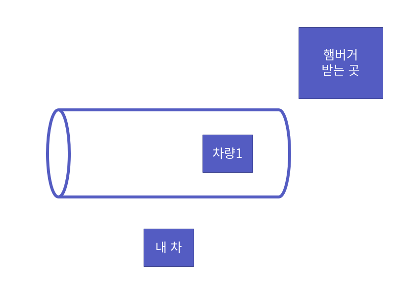

이제 제가 들어감으로써, 대기하는 차는 2개가 되었습니다. 이것처럼 큐에 데이터가 들어오는 것을 "Enqueue" 연산이라고 합니다. 삽입 연산이지요.

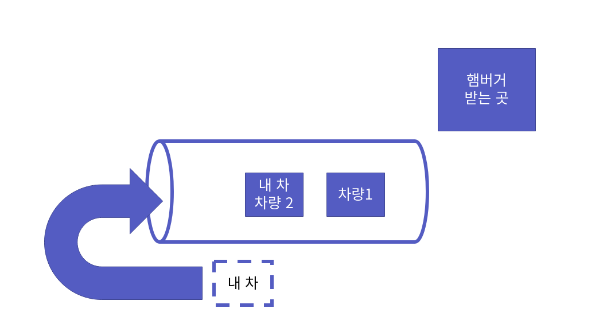

이제 점원이 제일 앞에 차량 1번을 부릅니다. 이것처럼 큐의 제일 앞에 데이터를 확인하는 것을 "Peek" 혹은 "Front" 연산이라고 합니다.

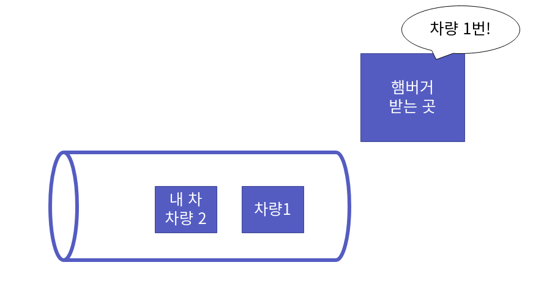

이제 제일 앞에 차량이 햄버거를 받고 나갑니다. 이것처럼 큐에서 데이터가 나가는 것을 "Dequeue" 연산이라고 합니다. 삭제 연산이죠.

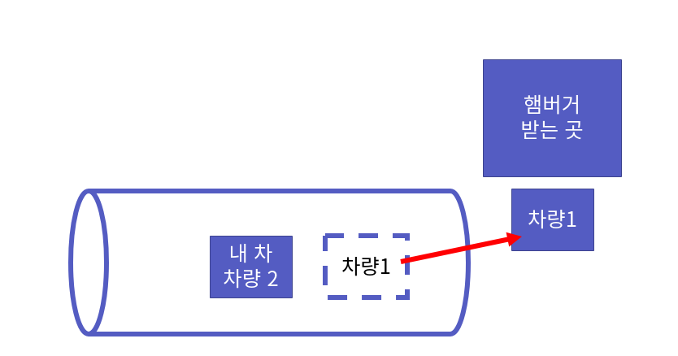

중요한 것은 "일반 큐"에서는 새치기를 할 수 없습니다. 그래서 제일 먼저 들어온 차가 제일 먼저 나가게 되는 것이죠. 큐에서 중요한 3가지 연산 "Enqueue", "Dequeue", "Peek"을 예시를 들어 살펴보았습니다. **큐의 이 3가지 연산은 모두 상수 시간 즉, O(1)의 시간 복잡도를 갖습니다.**


### 큐 ADT

이제 ADT를 정의해보도록 하죠. 위의 연산을 토대로 제가 생각한 큐의 ADT는 다음과 같습니다.

    ADT: Queue

    void QInit(Queue * pQueue);
    - 큐를 초기화합니다. 큐를 생성하면, 제일 먼저 호출합니다.

    void QDestroy(Queue * pQueue);
    - 큐를 파괴합니다. 큐에 들어 있는 모든 자원을 회수합니다.

    int QIsEmpty(Queue * pQueue);
    - 큐가 비어있는지 확인합니다. 비었으면 1, 아니면 0을 반환합니다.

    void Enqueue(Queue * pQueue, QData data);
    - 큐에 데이터를 삽입합니다.

    QData QPeek(Queue * pQueue);
    - 큐의 가장 먼저 삽입된 데이터를 반환합니다.
    - 삭제는 일어나지 않습니다.
    - 이 때 큐가 비어있으면 에러를 뱉습니다.

    QData Dequeue(Queue * pQueue);
    - 큐의 가장 먼저 삽입된 데이터를 삭제합니다. 삭제한 데이터를 반환합니다.
    - 이 때 큐가 비어있으면 에러를 뱉습니다.


### 큐 main 함수

제가 작성한 큐의 main 함수는 다음과 같습니다. 이것을 토대로 먼저 큐를 작성해보세요. 그 후 다음 절인 "큐 구현"에서 코드를 비교해보세요!

src/ch09/main.c
```c
#include<stdio.h>
#include<assert.h>

#include "Queue.h"

int main() {
    Queue queue;

    QInit(&queue);

    // 출력 empty: 1(true)
    printf("Before insert data, isEmpty: %d\n", QIsEmpty(&queue)); 

    for (int i=0; i<5; i++){
        Enqueue(&queue, i+1);
    }

    // 출력 empty: 0(false)
    printf("After push data, isEmpty: %d\n", QIsEmpty(&queue)); 

    // 출력 Front: 1
    printf("Front: %d\n", QPeek(&queue));

    // 출력 Front: 1
    printf("Front: %d\n", QPeek(&queue));

    // 출력 1 2 3 4 5
    while (!QIsEmpty(&queue)) {
        printf("%d ", Dequeue(&queue));
    }
    printf("\n");

    // 출력 empty: 1(true)
    printf("After pop data, isEmpty: %d\n", QIsEmpty(&queue)); 

    QDestroy(&queue);
    return 0;
}
```


## 큐 구현

자 이제 큐를 구현해봅시다.

### 기존 자료구조를 활용하자!

이번 장에서도 역시 기존 자료구조를 이용해보겠습니다. 우리가 만들었던 "이중 연결 리스트"를 이용할 것인데요. 왜냐하면, 스택에서는 정확히 한 곳에서 데이터의 삽입과 삭제가 이루어집니다.

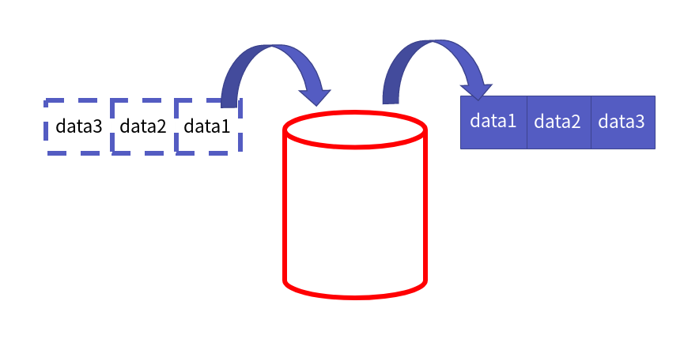

그러나 큐는 다음 그림처럼 삽입은 앞에서, 삭제는 뒤에서 이루어집니다.

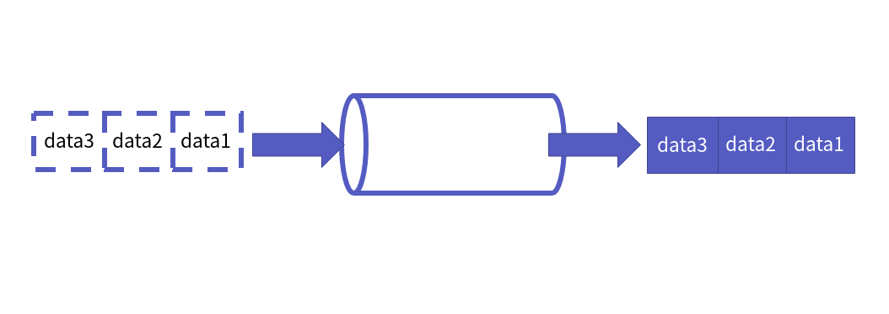

따라서 양쪽에 삽입/삭제 연산이 상수시간을 만족해야 합니다. 그래서 우리는 이를 충족시키는 이중 연결 리스트를 사용하겠습니다.

    참고! 연결 리스트, 순차 리스트의 연산 시간 복잡도
    연결 리스트: 머리 삽입/삭제 O(1), 꼬리 삽입/삭제 O(1), 인덱스 연산 O(N)
    순차 리스트: 머리 삽입/삭제 O(N), 꼬리 삽입/삭제 O(1), 인덱스 연산 O(1)

다음은 이중 연결리스트를 불러와 큐로 타입을 지정한 코드입니다.

src/ch09/Queue.h
```c
#include "DoubleLinkedList.h"

typedef LData QData;            // 연결 리스트가 담는 데이터들의 타입을 큐가 담는 데이터들의 타입으로 지정
typedef DoubleLinkedList Queue; // (이중) 연결 리스트를 큐로 타입 지정
```

그리고 ADT에 따라 함수 원형들을 선언하였습니다.

src/ch09/Queue.h
```c
void QInit(Queue * pQueue);
void QDestroy(Queue * pQueue);
int QIsEmpty(Queue * pQueue);
void Enqueue(Queue * pQueue, QData data);
QData QPeek(Queue * pQueue);
QData Dequeue(Queue * pQueue);
```


### 큐 생성과 파괴

큐의 생성과 파괴는 이중 연결 리스트의 생성 함수 `LInit`, 파괴 함수 `LDestory`를 호출하기만 하면 됩니다. 코드는 다음과 같습니다.

src/ch09/Queue.c
```c
void QInit(Queue * pQueue){
    LInit(pQueue);
}

void QDestroy(Queue * pQueue){
    LDestroy(pQueue);
}
```

### IsEmpty

큐가 비어있는지 확인하는 함수를 구현해보겠습니다. 스택과 같습니다. 순차 리스트, 연결 리스트 모두 같은 ADT를 쓰고 있습니다. 따라서 `LSize` 함수를 이용해서 크기가 0인지를 비교하면 됩니다. 코드는 다음과 같습니다.

src/ch09/Queue.c
```c
int QIsEmpty(Queue * pQueue){
    return (LSize(pQueue) == 0);
}
```


### Enqueue

이제 삽입 연산 `Enqueue` 함수를 구현할 차례입니다. 우리는 이를 위해서 연결 리스트의 `LInsertTail` 함수를 이용하겠습니다. 그러면, 여기서 의문점이 들 수도 있습니다. 
    
    "왜 꼬리 부분에 데이터를 삽입하나요? 머리 삽입도 상수 시간에 연산을 할 수 있잖아요"

이 부분에 대해서는 `Peek` 연산에서 한 꺼번에 다루도록 하겠습니다. 코드는 다음과 같습니다.

src/ch09/Queue.c
```c
void Enqueue(Queue * pQueue, QData data){
    LInsertTail(pQueue, data);
}
```


### Dequeue

이제 삭제 연산 `Dequeue` 함수를 구현하겠습니다. 우리는 이를 위해서 연결 리스트의 `LRemoveHeader` 함수를 이용하겠습니다. 또한, ADT에서, 큐가 비어 있다면, 에러를 뱉게끔 정의를 해 두었습니다. 이에 대한 코드입니다.

src/ch09/Queue.c
```c
QData Dequeue(Queue * pQueue){
    if (QIsEmpty(pQueue)) {
        printf("Queue is Empty! ContainerEmptyException!");
        assert(!QIsEmpty(pQueue));
    }

    return LRemoveHeader(pQueue);
}
```


### Peek

자 이제 큐의 가장 앞의 데이터를 확인하는 `Peek` 함수입니다. 함수 구현 이전에 왜 삽입은 `LInsertTail` 삭제는 `LRemoveHeader` 함수를 썼는지 궁금하실겁니다. 그 이유를 알려드리죠.

먼저 큐가 있고 데이터 1, 2, 3를 순서대로 있다고 가정하겠습니다.

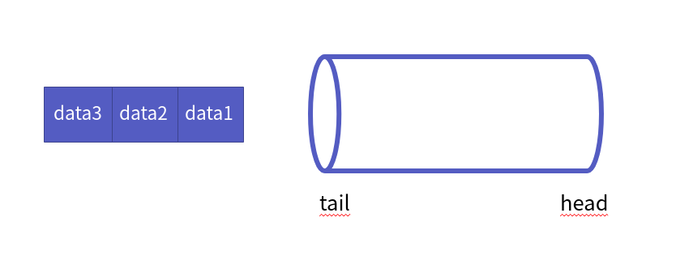

자 이제 큐의 꼬리 부분에 1을 삽입합니다.

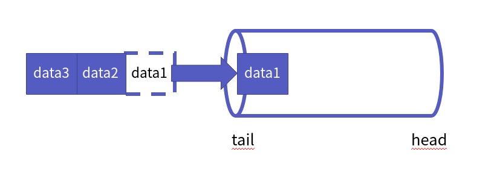

순서대로 2, 3를 큐의 꼬리 부분에 삽입합니다.

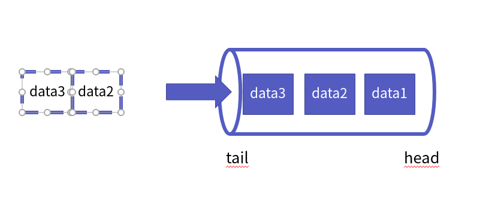

자, 이때, 메모리 상황은 다음과 같습니다. 

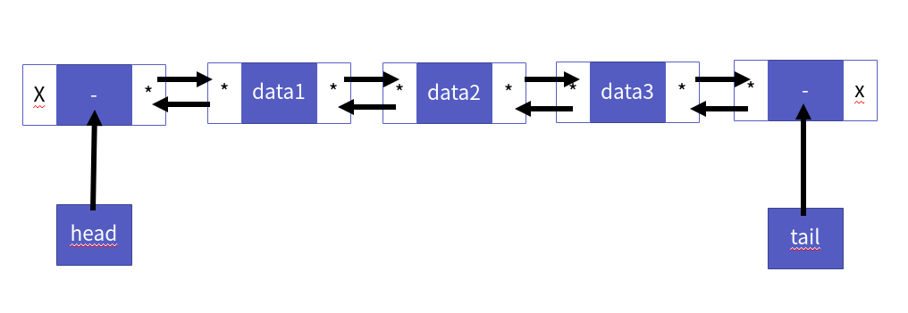

가장 앞에 데이터를 확인해볼까요? 어떻게 할 수 있을까요? 큐 그러니까 이중 연결 리스트의 앞 부분을 호출하면 되겠죠? 이런 식으로요

```c
QData QPeek(Queue * pQueue) {
    ...
    Node * head = pQueue->head->next;
    return head->data;
}
```

우리는 이중 연결 리스트 내부가 어떻게 구현되어 있는지 알고 있습니다. 그래서 위의 코드를 사용할 수 있는 것입니다. 그러나 일반적으로는 그 내부를 알 수 없습니다. 공개되는 건 ADT 즉, 자료구조를 어떻게 쓰는지에 대한 **인터페이스** 뿐입니다. 그래서 자료구조의 함수들로만 코드를 짤 수 있어야 합니다.

우리는 이중 연결 리스트의 데이터를 반환하는 `LGet`을 제공 받습니다. 그래서 이 함수를 통해서 큐의 가장 앞의 데이터를 반환해야 하지요. 근데 여기서 문제가 있습니다. LGet 함수는 인덱스 연산입니다. 즉, 이중 연결 리스트의 **LGet 함수는 O(N)의 시간 복잡도를 가진다는 것이지요.**

그러나 `Peek` 연산은 상수 시간에 해결해야 합니다. 그렇기 때문에, head 부분에서 삭제가 이루어져야 하는 것입니다. 만약, 큐의 데이터 흐름이 지금처럼 "꼬리 삽입/머리 삭제" 방식이 아닌 "**머리 삽입/꼬리 삭제**" 였다면, 가장 앞에 데이터는 큐의 꼬리 부분에 있을 것입니다.

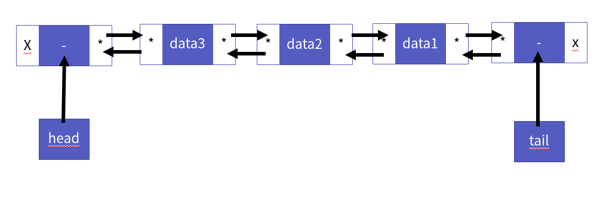

따라서 가장 먼저 들어간 데이터, 그러니까 연결 리스트의 마지막 노드로 접근하기 위해 LGet 을 이용하면 큐의 크기만큼, 반복문을 돌아야 합니다. 다음처럼 말이죠.

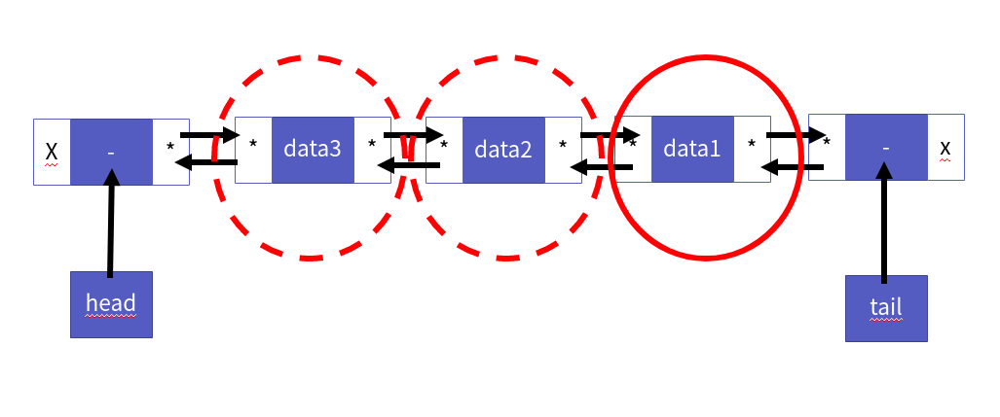

그러면 O(N)의 시간 복잡도를 가지게 되지요. 반면, 지금 상태의 경우는 어느 경우에서든 딱 1번만에 데이터를 얻어올 수 있는 것이지요.

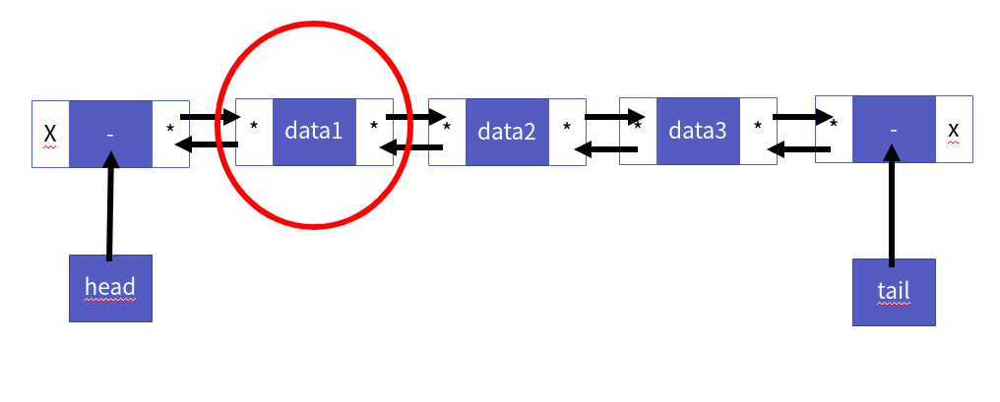

이제 왜 "꼬리 삽입/머리 삭제" 방식을 쓰는지 이해가 되셨나요? 이제 Peek 연산의 흐름에 대해 알아봅시다. 굉장히 쉽습니다. 거의 삭제 연산과 동일하죠.

1. 큐가 비어있는지 확인
2. 데이터가 있다면, LGet 함수를 이용해서 첫 번째 데이터 반환

다음은 코드입니다.

src/ch09/Queue.c
```c
QData QPeek(Queue * pQueue){
    if (QIsEmpty(pQueue)) {
        printf("Queue is Empty! ContainerEmptyException!");
        assert(!QIsEmpty(pQueue));
    }

    return LGet(pQueue, 0);
}
```

이렇게 해서 큐 구현을 마치겠습니다.


## 마치며...

이번 챕터에서는 `FIFO 구조`의 대표주자 큐에 대해 알아보았습니다. 또한, 기존 만들었던 `(이중)연결 리스트`를 통해 큐를 구현해보았습니다. 어떤가요? 큐에 대해서 이해가 되셨나요? 자료구조 큐의 활용은 스택과 마찬가지로 비교적 빈번하게 나타납니다. 

대표적인 예제로 "큐 시뮬레이션 - 조세푸스 문제" 등이 있습니다. 이는 알고리즘 성격이 강하기 때문에 넘어가겠습니다. 다음 장에서는 "자료구조 트리"에 대해서 알아보겠습니다.

