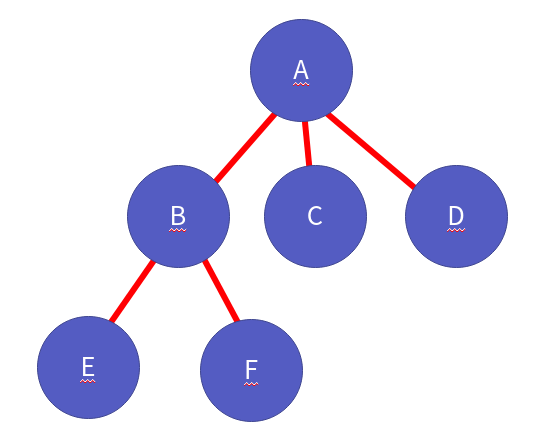
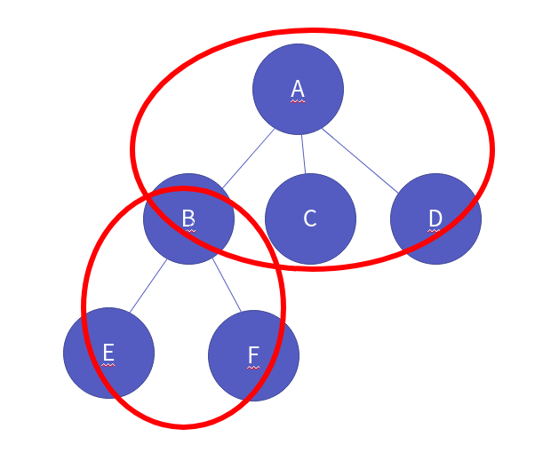

자료구조 이진 트리와 구현
===========

Contents
-------------------

1. 시작하며...
2. 이진 트리 정의
    * 트리와 이진 트리 
    * 이진 트리 ADT
    * 트리 main 함수
3. 이진 트리 구현
    * TreeNode
    * 노드의 생성
    * 노드 데이터 Get/Set
    * Get 자식 노드
    * Make 자식 노드
    * 순회 함수들
    * 후위 순회를 이용한 삭제 함수
4. 마치며...

## 시작하며...

구르미의 "Computer Science 정복하기 - 자료구조"의 열 번째 장입니다. 이 장의 대략적인 내용은 다음과 같습니다. 

* 자료구조 트리
* 자료구조 이진 트리
* 노드 기반 이진 트리 구현
* 트리 순회

이 장의 소스코드는 다음을 참고해주세요.

    url: https://github.com/gurumee92/datastructure 
    branch: ch10
    code directory: src/ch10

자 시작합시다!


## 이진 트리 정의

우리는 이번 시간에 **이진 트리**란 자료구조에 대해서 공부할 것입니다. 


### 트리와 이진 트리

먼저 이진 트리에 대해 알기 전에, 우리는 **트리**가 무엇인지 알아야 합니다. 트리란 무엇일까요? 책에 따르면, 트리를 다음과 같이 표현하고 있습니다.

> "트리는 계층적 관계를 표현하는 자료구조이다"

계층적 자료구조란 무엇일까요?


계층적 자료구조의 예는 회사의 조직도가 대표적인 예입니다. 또한 디렉토리 구조 역시 계층적 구조라고 말할 수 있지요. 이제 트리의 용어에 대해 설명하도록 하겠습니다. 다음은 트리를 표현한 그림입니다.


자 이제부터 용어에 대해서 알아보겠습니다. 먼저 **노드(Node)**라는 것이 있습니다. 트리를 이루는 가장 중요한 요소이지요. 아래 그림처럼, 빨간색으로 쳐져 있는 동그라미 즉, A, B, C, D, E, F를 노드라고 부릅니다.


그리고 아래 그림처럼 노드와 노드 사이를 잇는 선을 **간선(Edge)**이라고 부릅니다.



트리에서 가장 맨 위의 속한 노드, 최상위 노드를 **루트 노드(Root Node)**라고 합니다. 아래 트리에서 루트 노드는 A입니다.


그리고 가장 맨 밑의 노드, 최하위 노드를 **단말 노드(Terminal Node)** 혹은 **잎사귀 노드(Leaf Node)**라고 합니다. 여기서 최하위 노드라는 것은 자식이 없는 노드를 뜻하기도 합니다. 아래 트리에선, C, D, E, F 가 단말 노드입니다.


루트와, 단말 노드 사이에 존재하는 노드들, 즉 중간 노드들을 **내부 노드(Internal Node)**라고 부릅니다. 즉, 부모도 있고, 자식도 있는 노드지요. 아래 트리에서, B만이 내부 노드입니다.


또한, 노드간, 관계들이 존재하는데, 먼저 A 그리고 B, C, D 는 부모 관계의 노드입니다. 여기서 A가 **부모 노드(Parent Node)** B, C, D가 **자식 노드(Child Node)**라고 부릅니다. 물론 B - E, F 도 부모 관계입니다.



그리고 형제관계의 노드들이 있습니다. 바로 같은 부모를 가지고 있는 노드를 뜻하죠. 여기서는 B, C, D 또는 E, F를 두고 형제 노드라고 말할 수 있습니다.


또한, 다음 그림처럼 루트 노드와 단말 노드의 최대 길이를 **높이**, 각 층을 **레벨** 이라고 표현합니다.


이제 트리에 대해서 대충 알았으니 **이진 트리**에 대해서 알아볼까요? 이진 트리는 아래 그림처럼 "노드의 자식이 2개 존재하는 트리"를 의미합니다.


노드의 자식은 2개이며, 서브 트리 역시 모두 이진 트리여야 합니다. 이진 트리의 조건을 정리하면 다음과 같습니다.

1. 루트 노드를 중심으로 두 개의 서브 트리로 나뉘어진다.
2. 나뉘어진 서브 트리 역시, 이진 트리여야 한다.

이 때, 자식 노드가 없다 하더라도, 자식이 있는 것처럼 생각해야 합니다. 아래 트리들처럼 말이죠.


또한, 포화 이진 트리와 완전 이진 트리라는 것들이 있습니다. 각각의 정의를 살펴볼까요?

포화 이진 트리란, "레벨이 모두 꽉 찬 이진 트리"를 말합니다. 다음 그림 처럼 말이죠.


완전 이진 트리란, 노드들이 레벨에 꽉차있진 않지만 "아래로, 왼쪽에서 오른쪽 순으로 순서대로 채워진 트리"를 말합니다. 아래 그림처럼 말이죠.


### 이진 트리 ADT

이제 이진 트리에 대해서 공부해보았으니, ADT를 정의합시다. 이진 트리의 ADT는 다음과 같습니다.

    ADT: BinaryTreeNode

    BinaryTreeNode * MakeBinaryTreeNode();
    - BinaryTreeNode를 생성합니다.
    - 노드는 노드이자, 트리를 표현합니다.

    BTData GetData(BinaryTreeNode * node);
    - 노드의 데이터를 반환합니다.

    void SetData(BinaryTreeNode * node, BTData data);
    - 노드의 데이터를 주어진 파라미터로 설정합니다.

    BinaryTreeNode * GetLeftSubTree(BinaryTreeNode * node)
    - 왼쪽 자식 노드의 주소를 반환합니다.

    BinaryTreeNode * GetRightSubTree(BinaryTreeNode * node);
    - 오른쪽 자식 노드의 주소를 반환합니다.

    void MakeLeftSubTree(BinaryTreeNode * parent, BinaryTreeNode * child);
    - 왼쪽 자식 노드를 child로 갈아 끼웁니다.

    void MakeRightSubTree(BinaryTreeNode * parent, BinaryTreeNode * child);
    - 오른쪽 자식 노드를 child로 갈아 끼웁니다.

    void RemoveTreeNode(BinaryTreeNode * root)
    - 주어진 노드를 삭제합니다.
    - 후위 순회 방식으로 자식들을 삭제한 후 자신을 삭제합니다.

    void PreOrderTraverse(BinaryTreeNode * root, TraversalFuctionPtr action);
    - 전위 순회 함수입니다.
    - 먼저 자신을 action 한 후, 왼쪽, 오른쪽 순으로 순회합니다.

    void InOrderTraverse(BinaryTreeNode * root, TraversalFuctionPtr action);
    - 중위 순회 함수입니다.
    - 먼저 왼쪽을 순회한 후 자신을 action, 그 후 오른쪽으로 순회합니다.

    void PostOrderTraverse(BinaryTreeNode * root, TraversalFuctionPtr action);
    - 후위 순회 함수입니다.
    - 먼저 왼쪽, 오른쪽 순회 후 자신을 action 합니다.


### 이진 트리 main 함수

제가 작성한 main 함수는 다음과 같습니다.

src/ch10/main.c
```c
#include <stdio.h>

#include "BinaryTree.h"

void ShowData(BTData data) {
    printf("%d ", data);
}

int main() {

    BinaryTreeNode * bt1 = MakeBinaryTreeNode();
    SetData(bt1, 1);

    BinaryTreeNode * bt2 = MakeBinaryTreeNode();
    SetData(bt2, 2);

    BinaryTreeNode * bt3 = MakeBinaryTreeNode();
    SetData(bt3, 3);

    BinaryTreeNode * bt4 = MakeBinaryTreeNode();
    SetData(bt4, 4);

    BinaryTreeNode * bt5 = MakeBinaryTreeNode();
    SetData(bt5, 5);

    BinaryTreeNode * bt6 = MakeBinaryTreeNode();
    SetData(bt6, 6);

    BinaryTreeNode * bt7 = MakeBinaryTreeNode();
    SetData(bt7, 7);

    MakeLeftSubTree(bt2, bt3);   
    MakeRightSubTree(bt2, bt4);

    MakeLeftSubTree(bt5, bt6);   
    MakeRightSubTree(bt5, bt7);

    MakeLeftSubTree(bt1, bt2);   
    MakeRightSubTree(bt1, bt5);

    // 출력 1 2 3 4 5 6 7
    PreOrderTraverse(bt1, ShowData);
    printf("\n");

    // 출력 3 2 4 1 6 5 7
    InOrderTraverse(bt1, ShowData);
    printf("\n");

    // 출력 3 4 2 6 7 5 1
    PostOrderTraverse(bt1, ShowData);
    printf("\n");

    RemoveTreeNode(bt1);

    return 0;
}
```

이 때 중요한 점은 "RemoveTreeNode" 함수 호출 이후, 모든 노드가 삭제되어야 한다는 점입니다. 확인하기 위해서 디버거를 사용해 보세요!


## 이진 트리 구현

이진 트리를 구현해봅시다. 이진 트리는 배열 기반, 연결 리스트 기반으로 작성할 수 있습니다. 


우리는 연결 리스트 기반으로 트리를 작성하겠습니다.

### TreeNode

트리를 구성하는 노드 역시, 연결 리스트의 노드와 유사합니다. 데이터 부분이 있고, 다음 노드를 가리키는 포인터들이 있지요. 이진 트리 노드는 저장하는 data와 왼쪽 자식인 left, 오른쪽 자식인 right를 가리키는 포인터들로 구성됩니다.


코드는 다음과 같습니다.

src/ch10/BinaryTree.h
```c
typedef int BTData;

typedef struct _binary_tree_node {
    BTData data;                       //data
    struct _binary_tree_node * left;   //left child
    struct _binary_tree_node * right;  //right child
} BinaryTreeNode;
```

다음은 ADT에 따른 함수 원형 선언부입니다.

src/ch10/BinaryTree.h
```c
// 순회 함수에 쓰일 함수 포인터, 
// void func(BTData data) 의 함수 원형을 가리킨다.
typedef void TraversalFuctionPtr(BTData data);

BinaryTreeNode * MakeBinaryTreeNode();
BTData GetData(BinaryTreeNode * node);
void SetData(BinaryTreeNode * node, BTData data);
BinaryTreeNode * GetLeftSubTree(BinaryTreeNode * node);
BinaryTreeNode * GetRightSubTree(BinaryTreeNode * node);
void MakeLeftSubTree(BinaryTreeNode * parent, BinaryTreeNode * child);
void MakeRightSubTree(BinaryTreeNode * parent, BinaryTreeNode * child);
void RemoveTreeNode(BinaryTreeNode * root);
void PreOrderTraverse(BinaryTreeNode * root, TraversalFuctionPtr action);
void InOrderTraverse(BinaryTreeNode * root, TraversalFuctionPtr action);
void PostOrderTraverse(BinaryTreeNode * root, TraversalFuctionPtr action);
```

### 노드 생성

노드 생성은 연결리스트와 같습니다. `malloc`을 이용해서 동적 할당을 하면 됩니다. 코드는 다음과 같습니다.

src/ch10/BinaryTree.c
```c
BinaryTreeNode * MakeBinaryTreeNode() {
    BinaryTreeNode * node = (BinaryTreeNode *) malloc (sizeof(BinaryTreeNode));
    node->data = 0;
    node->left = NULL;
    node->right = NULL;
    return node;
}
```


### 노드 데이터 Get/Set

다음은 노드의 데이터를 반환하는 함수와, 설정하는 함수입니다. 노드 구조체의 `data` 부분을 조작하면 됩니다. 코드는 다음과 같습니다.

src/ch10/BinaryTree.c
```c
BTData GetData(BinaryTreeNode * node) {
    return node->data;
}

void SetData(BinaryTreeNode * node, BTData data) {
    node->data = data;
}
```

### Get 자식 노드

다음은 노드의 자식, `left`, `right`의 노드 주소를 반환하는 함수들입니다. 코드는 다음과 같습니다.

src/ch10/BinaryTree.c
```c
BinaryTreeNode * GetLeftSubTree(BinaryTreeNode * node) {
    return node->left;
}

BinaryTreeNode * GetRightSubTree(BinaryTreeNode * node) {
    return node->right;
}

```

### Make 자식 노드

다음은 자식 노드를 갈아끼우는 함수입니다. `Make-`로 해서 노드를 만드는건가라고 생각할 수도 있는데, 해당 자식 노드를 파라미터로 받은 노드로 갈아끼우는 겁니다. 여기서 우리는 **노드는 노드이자 트리이다**라는 것을 기억해야 합니다.

`BinaryTreeNode` 구초체는 데이터를 저장하는 노드이자, 거대하게 봐서는 트리입니다. 


결국 이것은 자신 밑의 서브트리를 바꾸는 것과 같습니다. 바꿀 때, 기존에 존재했던 트리(혹은 노드)를 삭제해주어야 합니다. 이 부분은 `RemoveTreeNode` 함수에서 자세히 살펴보겠습니다. 여기서는 **기존에 트리가 존재하면, 삭제해준다**라고 기억해주세요.

코드는 다음과 같습니다.

src/ch10/BinaryTree.c
```c
void MakeLeftSubTree(BinaryTreeNode * parent, BinaryTreeNode * child) {
    if (parent->left != NULL) {
        RemoveTreeNode(parent->left);
    }

    parent->left = child;
}

void MakeRightSubTree(BinaryTreeNode * parent, BinaryTreeNode * child) {
    if (parent->right != NULL) {
        RemoveTreeNode(parent->right);
    }

    parent->right = child;
}
```

### 순회 함수들

트리의 순회는 다음의 3가지 방식이 있습니다. 

1. 전위 순회
2. 중위 순회
3. 후위 순회

먼저 **전위 순회** 방식입니다. 전위 순회는 **부모 노드부터!!** 라고 생각하시면 됩니다. 다음의 트리가 있다고 가정해보죠.


전위 순회는 부모 노드부터 액션이 일어납니다.


그 후 `left` 왼쪽 자식으로 이동합니다.


이제 그 위치에서 액션이 일어납니다.


터미널 노드이므로 다시 이제 부모 노드로 돌아옵니다.


이제 `right` 오른쪽 자식으로 이동합니다.


이제 그 위치에서 액션이 일어납니다.


이제 해당 노드의 `left`가 존재하므로 이동합니다.


이제 그 위치에서 액션이 일어납니다.


터미널 노드이므로 다시 이제 부모 노드로 돌아옵니다. 


현재 오른쪽 노드가 없으므로 부모로 돌아갑니다.


 
모든 노드를 순회했기 때문에 순회를 종료합니다. 여기서 중요한 점은 **트리는 재귀적 구조이므로 순회는 재귀를 이용**해야 한다는 것입니다. 코드로는 다음과 같습니다.

src/ch10/BinaryTree.c
```c
void PreOrderTraverse(BinaryTreeNode * node, TraversalFuctionPtr action) {
    if (node == NULL) {
        return;
    }

    action(node->data);
    PreOrderTraverse(node->left, action);
    PreOrderTraverse(node->right, action);
}
```

이제 **중위 순회**를 알아보죠. **중위 순회는 왼쪽 노드 먼저!!** 라고 생각하면 됩니다. 역시 다음의 트리가 있다고 가정해보죠.


맨 처음 `left`로 이동합니다.


터미널 노드이기 때문에 해당 위치에서 액션이 일어납니다.


그 위치는 터미널 노드이므로 다시 부모 노드로 이동합니다.


이제 액션이 일어납니다.


이제 `right`로 이동합니다.


이제 다시 그 노드의 `left`로 이동 합니다.


그 위치에서 액션이 일어납니다.


터미널 노드이므로 부모 노드로 이동합니다.


이제 그 위치에서 액션이 일어납니다.


해당 노드의 `right`가 없으므로 이제 부모 노드로 올랍니다.
 


모든 노드를 순회했기 때문에 순회를 종료합니다. 코드는 다음과 같습니다.

src/ch10/BinaryTree.c
```c
void InOrderTraverse(BinaryTreeNode * node, TraversalFuctionPtr action) {
    if (node == NULL) {
        return;
    }

    InOrderTraverse(node->left, action);
    action(node->data);
    InOrderTraverse(node->right, action);
}
```

마지막으로 **후위 순회**를 알아보죠. **후위 순회는 자식 노드 먼저!!** 라고 생각하면 됩니다. 역시 다음의 트리가 있다고 가정해보죠.


맨 처음 `left`로 이동합니다.


터미널 노드이기 때문에 해당 위치에서 액션이 일어납니다.


터미널 노드이므로 다시 부모 노드로 이동합니다.


이제 `right`로 이동합니다.


이제 다시 그 노드의 `left`로 이동 합니다.


터미널 노드이기 때문에 그 위치에서 액션이 일어납니다.


터미널 노드이므로 부모 노드로 이동합니다.


오른쪽 노드가 비었기 때문에 이제 그 위치에서 액션이 일어납니다.


이제 다시 부모 노드로 갑니다.


이제 다시 부모 노드로 갑니다. 그리고 액션이 일어납니다.


모든 노드를 순회했기 때문에 순회를 종료합니다. 코드는 다음과 같습니다.

src/ch10/BinaryTree.c
```c
void PostOrderTraverse(BinaryTreeNode * node, TraversalFuctionPtr action) {
    if (node == NULL) {
        return;
    }

    PostOrderTraverse(node->left, action);
    PostOrderTraverse(node->right, action);
    action(node->data);
}
```


### 후위 순회를 이용한 삭제 함수

삭제 함수는 후위 순회 방식을 이용해야 합니다. 왜냐하면, 전위, 중위 방식응 이용하면, 자식이 남아있는데, `parent` 노드가 지워지므로 자식 노드들에게 접근할 수 있는 방법이 사라지게 됩니다.

다음은 전위 방식일때, 생기는 문제 흐름입니다. 다음의 트리가 있다고 가정해보죠.


그러면, 전위 순회 순서에 따라 부모 노드를 삭제합니다. 


그럼 부모 노드를 가리키는 포인터에 NULL이 되기 때문에, 힙 영역에 존재하는 `left`, `right`에 접근 할 수 없는 것이죠.


따라서 삭제 시 전위 방식을 쓰면 안됩니다. 이번에는 중위 방식일 때를 살펴보겠습니다. 역시  다음의 트리가 있다고 가정해보죠.


그러면, 중위 순회 순서에 따라 `left`에 있는 노드로 이동합니다.


`left`는 단말 노드이기 때문에 삭제합니다. 


함수 호출이 끝남에 따라 다시 그 실행흐름으로 돌아와서 부모 노드로 이동합니다.


이제 부모 노드를 삭제합니다.


그럼 부모 노드를 가리키는 포인터에 NULL이 되기 때문에, 힙 영역에 존재하는 `right`에 접근 할 수 없는 것이죠. 


따라서, 중위 방식 역시 쓰면 안됩니다. 결론적으로 삭제할 때는 **후위 순회**를 써야 합니다. 흐름을 살펴볼까요? 역시 다음 트리를 예를 들겠습니다.


그러면, 후위 순회 순서에 따라 `left`에 있는 노드로 이동합니다.


`left`는 단말 노드이기 때문에 삭제합니다. 


여기서 더 순회할 노드가 없으므로 부모 노드로 이동합니다. 


이제 `right`로 이동합니다.


`right` 노드 역시 단말 노드이기 때문에 바로 삭제 연산이 일어납니다. 


더 이상 순회할 노드가 없으므로 부모 노드로 돌아갑니다.


이제 삭제 연산이 이루어집니다.


그럼 다음처럼 깔끔하게 트리의 노드들이 모두 삭제가 된 것을 확인할 수 있습니다.


이렇게 해서 완벽한 트리의 삭제가 일어납니다. 한 번 이런 단순한 트리가 아닌 더 거대한 트리로 실행 흐름을 따져보세요. 그럼 삭제 연산이 어떻게 일어나는가에 대해서 이해가 보다 쉬울 것입니다. 코드는 다음과 같습니다.

src/ch10/BinaryTree.c
```c
void RemoveTreeNode(BinaryTreeNode * node) {
    if (node == NULL) {
        return;
    }

    RemoveTreeNode(node->left);
    RemoveTreeNode(node->right);
    free(node);
    node = NULL;
}
```


## 마치며...

이번 챕터에서는 계층 구조를 표현하는 트리, 특히 **이진 트리**에 대해 알아보았습니다. 트리에 대해서 이해가 되셨나요? 사실 이진 트리는 부족한 점이 많은 트리입니다. 이 트리의 부족한 점을 극복하기 위해 만든 자료구조들이 있습니다.

* 이진 탐색 트리
* AVL 트리
* Red-Black 트리

이들은 추후에 살펴보도록 하겠습니다. 다음 시간에는 우리가 만든 이진 트리를 응용하는 시간을 갖겠습니다. 다음 장 "이진 트리 응용 - 수식 트리"에서 만나요!
