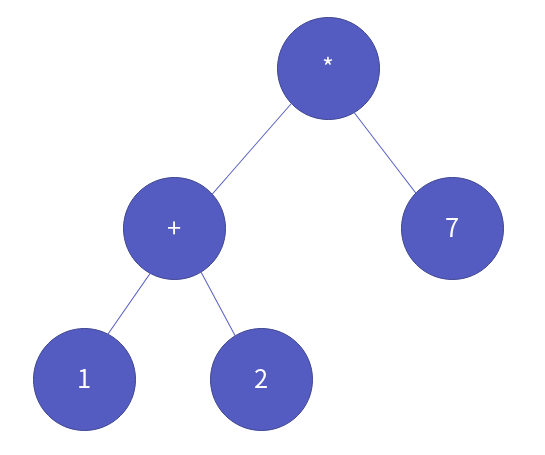
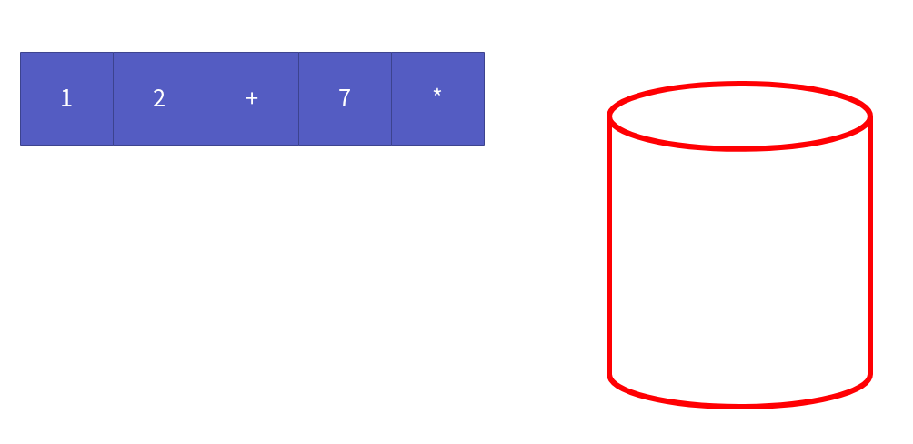

이진 트리 응용 - 수식 트리
==================

Contents
-------------------

1. 시작하며...
2. 수식 트리의 원리
3. 수식 트리의 구현
    * 수식 트리의 생성
    * 수식 트리의 값 계산
    * 수식 트리의 표현식 출력
    * 수식 트리의 파괴
4. 마치며...

## 시작하며...

구르미의 "Computer Science 정복하기 - 자료구조"의 열 한 번째 장입니다. 이 장의 대략적인 내용은 다음과 같습니다. 

* 수식 트리 핵심 원리
* 수식 트리 구현

이 장의 소스코드는 다음을 참고해주세요.

> url: https://github.com/gurumee92/datastructure 
> branch: ch11
> code directory: src/ch11

자 시작합시다!


## 수식 트리의 원리

수식 트리는 말 그대로 수식을 표현한 트리입니다. 만약 다음 수식이 있다고 가정하겠습니다.

> ( 1 + 2 ) * 7

이를, 수식 트리로 표현하면, 다음과 같습니다.



이번 장에서 우리는 수식을 특히, **후위 수식**을 수식 트리로 바꾸는 것을 해보겠습니다. 수식 트리의 원리는 이전 "스택 응용 - 계산기"에서 **후위 표현식을 계산하는 원리**와 비슷합니다. 복습 차원에서 한 번 살펴볼까요?

위의 수식을 후위 수식으로 바꿔보겠습니다. 위의 수식을 후위 표현식으로 바꾸면 다음과 같습니다.

> 1 2 + 7 *

이를 계산해 보겠습니다. 메모리는 다음 그림과 같을 것입니다.



이제 1을 스택에 넣습니다.


2를 스택에 넣습니다.


연산자 "+"가 나왔으니 스택에서 2개의 피연산자를 꺼내 계산합니다.


그 결과를 다시 스택에 저장합니다.


7을 스택에 저장합니다.


연산자 "*"이 나왔으니 스택에서 2개의 피연산자를 꺼내 계산합니다.


그 결과를 다시 스택에 저장합니다.


수식을 표현하는 문자열 `src`를 다 순회했으면, 스택에 남아있는 최종 결과를 꺼냅니다.


이제 기억이 나시나요? ㅎㅎ 후위 표현식의 수식을 수식 트리로 만드는 것도 이와 비슷합니다. 숫자를 저장하는 노드라면, 스택에 저장하고, 연산자를 저장하는 노드라면, 스택에서 저장된 2개의 노드를 빼내서 트리로 만든 후, 다시 저장합니다. 역시 같은 수식으로 수식 트리로 만들어보겠습니다.


이제 1을 노드로 만들어서 스택에 저장합니다.


2를 노드로 만들어서 스택에 저장합니다.


+를 노드로 만든 후, 스택에서 저장된 노드 2개를 빼옵니다. 그리고 다음과 같이 트리로 만듭니다. 이 때 스택 계산과 마찬가지로, 스택에서 처음으로 빼는게 op2, 나중에 빼는게 op1입니다. 노드 왼쪽에 op1을 노드 오른쪽에 op2를 위치 시킵니다.


그 후 만들어진 트리를 스택에 저장합니다. **노드는 트리 그 자체**라는 것을 기억하세요!


이제 7을 노드로 만들어서 스택에 저장합니다.


+를 노드로 만든 후, 스택에서 저장된 노드 2개를 빼옵니다. 그리고 다음과 같이 트리로 만듭니다. 


이제 그 트리를 스택에 저장합니다.


수식을 다 순회했으면, 스택에서 그 트리를 빼옵니다.


이것이 수식 트리를 만드는 핵심 원리입니다. 그래서 수식 트리가 무엇이 좋은가에 대해서 궁금하실 수 있을 것 같습니다. 음 개인적으로, 해당 수식을 순회 방식에 따라 여러가지로 표현할 수 있습니다.

* 전위 방식 순회 = 전위 수식
* 중위 방식 순회 = 중위 수식
* 후위 방식 순회 = 후위 수식

또한 후위 순회 방식을 이용하여, 결과도 낼 수 있지요. 이는 구현 부에서 더 자세한 설명을 하도록 하겠습니다.


## 수식 트리의 구현

이제 수식 트리를 구현해보도록 하겠습니다. 수식 트리는 기존에 우리가 만든 **이진 트리**를 이용합니다. 다음은 헤더의 전문입니다.

src/ch11/header/ExpressionTree.h
```c
#ifndef __EXPRESSION_TREE_H__
#define __EXPRESSION_TREE_H__

#include "BinaryTree.h"

BinaryTreeNode * MakeExpressionTree(char exp[]);
int EvaluateExpressionTree(BinaryTreeNode * bt);

void ShowPrefixTypeExp(BinaryTreeNode * bt);
void ShowInfixTypeExp(BinaryTreeNode * bt);
void ShowPostfixTypeExp(BinaryTreeNode * bt);

void DestroyExpressionTree(BinaryTreeNode * bt);

#endif
```

그리고 스택을 이용하기 위해서 `ArrayList.h`의 LData 타입 지정 부를 다음과 같이 바꿔주세요.

src/ch11/ArrayList.h
```c
//same code

// 저장되는 타입을 "노드 포인터" 로 합니다.
typedef BinaryTreeNode * LData;
//same code
```

이제 본격적으로 함수를 구현해보겠습니다.


### 수식 트리의 생성

수식 트리의 생성은 핵심 원리에서 설명드렸기 때문에, 코드 흐름만 살펴보겠습니다. 이후 코드와, 그림 설명을 번갈아 보시면 이해하는데 많은 도움이 될것입니다. 코드 흐름은 다음과 같습니다.

1. 스택을 생성합니다.
2. 문자열 str(exp)를 순회합니다.
    1. 노드를 생성합니다.
    2. 문자열의 현재 순회하는 문자에 따라 다음으로 분기합니다.
        * 만약 현재 문자가 숫자일 때 
            1. 노드에 저장합니다.
        * 숫자가 아닐 때
            1. 스택에서 노드 2개를 꺼냅니다.
            2. 현재 노드에 대해서 제일 먼저 꺼낸 노드를 right, 나중에 꺼낸 노드를 left의 위치로 저장합니다.
    3. 노드를 스택에 저장합니다.
3. 문자열 순회가 끝나면, 저장된 수식 트리를 스택에서 꺼낸 후 반환합니다.

코드는 다음과 같습니다.

src/ch11/source/ExpressionTree.c
```c
BinaryTreeNode * MakeExpressionTree(char exp[]) {
    Stack stack;
    SInit(&stack);

    int expLen = strlen(exp);
    for (int i=0; i<expLen; i++) {
        BinaryTreeNode * node = MakeBinaryTreeNode();
        char data = exp[i];
        
        if (isdigit(data)) {
            SetData(node, data - '0');
        } else {
            BinaryTreeNode * right = (BinaryTreeNode *) SPop(&stack);
            BinaryTreeNode * left = (BinaryTreeNode *) SPop(&stack);

            MakeLeftSubTree(node, left);
            MakeRightSubTree(node, right);
            SetData(node, data);
        }

        SPush(&stack, node);
    }

    BinaryTreeNode * expTree = (BinaryTreeNode *) SPop(&stack);
    SDestroy(&stack);
    return expTree;
}
```


### 수식 트리의 값 계산

수식 트리를 이용해서 수식에 대한 결과를 반환하기 위해선, **후위 순회 방식**을 이용해야 합니다. 먼저 우리가 예시로 만들었던 수식 트리를 예로 살펴보겠습니다. 


먼저 루트 노드의 `left`를 이동합니다. 


또 `left`로 이동합니다.


이제 해당 노드의 `left`, `right`가 없기 때문에, 이제 저장한 값을 반환합니다.


이제 `right`로 이동합니다.


역시, 노드의 `left`, `right`가 없기 때문에, 이제 저장한 값을 반환합니다.


현재 노드에 저장된 값은 연산자이므로 다음 방식으로 계산합니다.

> "right 반환 값" 연산자 "left 반환 값"


이 값을 반환합니다.


이제 `right`로 이동합니다.


노드의 `left`, `right`가 없기 때문에, 이제 저장한 값을 반환합니다.


현재 노드에 저장된 값은 연산자이므로 다음 방식으로 계산합니다.

> "right 반환 값" 연산자 "left 반환 값"


모든 트리를 순회했으니, 이제 이 값을 반환합니다. 


코드는 다음과 같습니다.

src/ch11/source/ExpressionTree.c
```c
int EvaluateExpressionTree(BinaryTreeNode * bt) {

    BinaryTreeNode * left = GetLeftSubTree(bt);
    BinaryTreeNode * right = GetRightSubTree(bt);

    if (left == NULL && right == NULL) {
        return GetData(bt);
    }

    int op1 = EvaluateExpressionTree(left);
    int op2 = EvaluateExpressionTree(right);
    char operator = GetData(bt);

    switch (operator)
    {
    case '+':
        return op1 + op2;
    case '-':
        return op1 - op2;
    case '*':
        return op1 * op2;
    case '/':
        return op1 / op2;
    
    default:
        assert("Operator Error! You should input +, -, * /");
        return -1;
    }
}
```

### 수식 트리의 표현식 출력

앞서 언급한 것처럼 수식 트리에 저장된 수식에 대해서 순회 방식에 따라 그 표현식을 다르게 출력할 수 있습니다. 먼저, 순회 시, 출력을 위한 함수를 만들어줍니다.

src/ch11/source/ExpressionTree.c
```c
void ShowData(BTData data) {
    if (0 <= data && data <= 9) {
        printf("%d ", data);
    } else {
        printf("%c ", data);
    }
}
```

이제 수식 트리에 대해서 **전위 표현식**으로 수식을 출력하겠습니다. 쉽습니다. 그냥 수식 트리에 대해 **전위 순회**를 하면 됩니다. 코드는 다음과 같습니다.

src/ch11/source/ExpressionTree.c
```c
void ShowPrefixTypeExp(BinaryTreeNode * bt) {
    PreOrderTraverse(bt, ShowData);
}
```

다음으로 수식 트리에 대해서 **후위 표현식**으로 수식을 출력하겠습니다. 전위 표현식을 출력한 것과 마찬가지로 수식 트리에 대해 **후위 순회**를 하면 됩니다. 코드는 다음과 같습니다.

src/ch11/source/ExpressionTree.c
```c
void ShowPostfixTypeExp(BinaryTreeNode * bt) {
    PostOrderTraverse(bt, ShowData);
}
```

마지막으로 **중위 표현식**을 출력해 보겠습니다. 중위 표현식은 **중위 순회**만으로 이를 출력시킬 수 없습니다. 왜냐하면, 중위 표현식은 연산자 우선 순위를 근거로 수식을 표현해야 합니다. 즉,
연산 순서에 따라 **중괄호**가 존재해야 하지요. 어떻게 할 수 있을까요?

생각외로 간단합니다. 중위 순회를 하되, 다음 순서 흐름으로 코드를 작성하면 됩니다.

1. 노드가 NULL 이면, return
2. 만약, left, right 있다면 "(" 출력
3. 중위 순회
4. 만약, left, right 있다면 ")" 출력

이렇게 하면 중괄호가 포함된 **중위 표현식**이 다음과 같이 훌륭하게 표현됩니다.

> ( ( 1 + 2 ) * 7 )

코드는 다음과 같습니다.

src/ch11/source/ExpressionTree.c
```c
void ShowInfixTypeExp(BinaryTreeNode * bt) {
    if (bt == NULL) 
        return;
    
    BinaryTreeNode * left = GetLeftSubTree(bt);
    BinaryTreeNode * right = GetRightSubTree(bt);

    if (left != NULL && right != NULL) {
        printf("( ");
    }

    ShowInfixTypeExp(left);
    ShowData(GetData(bt));
    ShowInfixTypeExp(right);

    if (left != NULL && right != NULL) {
        printf(") ");
    }
}
```


### 수식 트리의 파괴

수식 트리의 파괴는, 이진 트리의 파괴와 같습니다. 코드는 다음과 같습니다.

src/ch11/source/ExpressionTree.c
```c
void DestroyExpressionTree(BinaryTreeNode * bt) {
    RemoveTreeNode(bt);
}
```

**이를 토대로, 다시 계산기를 만들 수 있습니다. 그러나, 설명은 생략하겠습니다.** 여러분이 직접 한 번 다시 만들어보세요. 간략하게 다음 과정을 거치면 됩니다.

1. 중위 표현식을 입력 받는다.
2. 중위 표현식을 후위 표현식으로 만든다.
3. 후위 표현식을 수식 트리로 만든다.
4. 수식 트리를 이용해 결과를 반환한다.

> 참고! 제네릭 기법
> 소스 코드에서는 제네릭 기법을 위해서 "ArrayList.h" 데이터 타입을 "void *"로 지정하였습니다. 왜냐하면, 계산 기능을 구현하기 위해선 2개의 스택이 필요합니다.  하나는, 문자를 저장하는 스택, 다른 하나는 트리를 저장하는 스택입니다. 이 문제를 해결하기 위해서 제네릭 기법을 사용합니다. 
> 이는 배열 리스트에서 어떤 타입이든 저장할 수 있게끔 도와줍니다. C++을 아신다면, 템플릿, 자바를 아신다면, 제네릭 문법과 같다고 보면 됩니다. 이렇게 헤더 부분이 바뀜으로써, 소스 코드에 어떤 변화가 생겼는지, 여러분의 눈으로 직접 확인해보세요!


## 마치며...

이번 챕터에서는 이진 트리의 응용인 **수식 트리**에 대해 알아보았습니다. 다음 시간에는 우리가 만든 "힙"이란 자료구조를 이용하는 **우선순위 큐**에 대해 알아보도록 하겠습니다.
