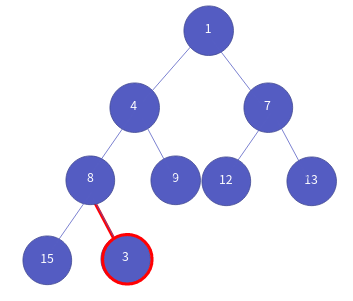
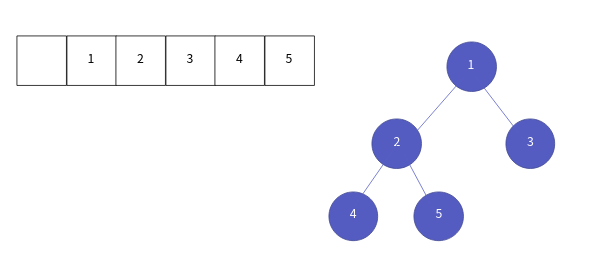

자료구조 우선순위 큐와 구현
==================

Contents
-------------------

1. 시작하며...
2. 우선 순위 큐의 이해
3. 힙의 이해와 구현
    * 자료구조 힙이란?
    * 힙의 ADT와 헤더
    * 힙의 생성과 파괴
    * 힙의 데이터 확인
    * 힙의 인덱스 조정
    * 힙의 데이터 추가
    * 힙의 데이터 삭제
4. 우선순위 큐의 구현
    * 우선순위 큐의 ADT와 헤더
    * 우선순위 큐의 생성과 파괴
    * 우선순위 큐의 데이터 확인
    * 우선순위 큐의 데이터 추가
    * 우선순위 큐의 데이터 삭제
5. 제네릭을 사용하기 위한 코드
6. 마치며...


## 시작하며...

구르미의 "Computer Science 정복하기 - 자료구조"의 열 두 번째 장입니다. 이 장의 대략적인 내용은 다음과 같습니다. 

* 우선순위 큐의 이해
* 힙의 이해와 구현
* 우선순위 큐의 구현

이 장의 소스코드는 다음을 참고해주세요.

    url: https://github.com/gurumee92/datastructure 
    branch: ch12
    code directory: src/ch12

자 시작합시다!


## 우선 순위 큐의 이해

우선 순위 큐는 "병원의 수술실"과 같습니다.


예를 들어서 생각해보자면, 병원에서는 환자를 먼저 순서대로 받습니다.


온 순서대로 차근 차근 수술을 진행합니다.


근데, 정말 수술이 급한 환자가 생깁니다. 이 때는, 이 환자가 우선적으로 수술을 받게 됩니다. 


이렇게 환자의 상태에 따라 우선순위를 매겨 수술을 하게 되는 것이지요. 우선순위도 이와 같습니다. 우선 순위 큐는 큐와 동작이 유사하지만, **우선 순위를 판단해서** 데이터 삽입/삭제가 일어납니다. 

우선 순위 큐를 구현하는 방법은 다음의 3가지가 존재합니다.

1. 배열 기반
2. 연결 리스트 기반
3. 힙 기반

힙이란 자료구조는 이따가 설명을 하겠습니다. 다음은 각 자료구조 기반으로 작성된 우선 순위 큐의 성능입니다.

| 우선 순위 큐 구현 / 함수 | 데이터 저장 | 데이터 삭제 |
| :--: | :--: | :--: |
| 배열 기반 | O(N) | O(1) |
| 연결 리스트 기반 | O(N) | O(1) |
| 힙 기반 | O(log(N)) | O(log(N)) |

우리는 이번 챕터에서 힙 기반의 우선순위 큐를 다룹니다.


## 힙의 이해와 구현

이제 **힙(Heap)**이란 자료구조에 대해서 알아보겠습니다.


### 자료구조 힙이란?

**힙이란 자료구조는 "완전 이진 트리"와 같습니다.** 대신 노드로 갈 수록 우선순위가 높게끔 저장이 되는 자료구조입니다. 다음 그림처럼 노드로 올라갈수록 데이터의 값이 높은 힙을 "최대 힙"이라 합니다.


반대로 아래 그림처럼 노드로 올라갈 수록, 값이 낮아지는 힙을 "최소 힙"이라고 부릅니다.


여기서 중요한 건, 노드의 저장된 값이 **특정 기준의 우선순위**를 따른다는 것입니다. 최대 힙은 정수가 클수록, 최소 힙은 정수가 작을 수록 우선순위가 높은 것이지요. 힙은 **데이터를 근거로 우선순위를 판단** 할 수 있어야 합니다. 이번에는 힙의 데이터 삽입과 삭제 연산을 살펴보겠습니다.

**힙의 데이터 삽입**

힙의 데이터 삽입은 완전 이진 트리에서 가장 마지막 노드에 데이터를 삽입 후, 부모 노드와 우선 순위를 따져서 노드의 구조를 변경합니다. 예를 들어 살펴보죠. 아래 그림처럼 힙에 데이터들이 저장되어 있다고 가정하겠습니다. 힙은 최소 힙입니다.


새로운 데이터 3을 넣습니다.



이제 새 노드와 부모 노드의 우선 순위를 비교합니다.


3 < 8 이므로 3이 우선순위고 높으므로 둘의 위치를 바꿉니다.


이제 바뀐 위치에서 부모 노드와 비교합니다.


3 < 4 이므로 3이 우선순위고 높으므로 둘의 위치를 바꿉니다.


다시 바뀐 위치에서 부모 노드와 비교합니다.


1 < 3 이므로 자리를 바꾸지 않고 삽입 연산을 마칩니다.


**힙의 데이터 삭제**

이제 힙의 데이터 삭제 연산을 살펴보겠습니다. 힙의 데이터 삭제는 곧, 루트 노드를 삭제하는 것입니다. 루트 노드 삭제 후. 가장 맨 밑에 노드를 루트 노드로 바꾼 후, 삽입과 반대로 자식 노드들과 우선 순위를 비교해서, 노드의 구조를 변경합니다. 삽입의 결과 힙을 예를 들어보겠습니다.


이제 루트 노드의 1을 삭제합니다.


이제 비워진 루트의 위치에, 가장 맨 아래 노드인 8을 루트 노드로 옮깁니다.


이 때, 왼쪽, 오른쪽 자식 중 우선순위가 높은 자식 노드와 우선 순위를 비교합니다. 즉, 3과 8을 비교하는 것이죠.


3 < 8이므로 자식 노드가 우선순위가 높습니다. 따라서 자리를 바꿉니다.


그 자리에서 왼쪽, 오른쪽 자식 중 우선순위가 높은 자식 노드와 우선 순위를 비교합니다. 즉, 4과 8을 비교하는 것이죠.


4 < 8이므로 자식 노드가 우선 순위가 높습니다. 따라서 자리를 바꿉니다.


이제 유일한 자식 노드인 15와 비교를 합니다.


8 < 15이므로 모든 자식 노드보다 자신이 우선순위가 높으므로 연산을 마칩니다. 결과적으로 이런 구조가 되지요.


참고적으로 힙은 트리이므로, 다음의 2가지 방식으로 구현이 가능합니다.

1. 배열 기반
2. 연결 리스트 기반

그러나 암묵적으로는 배열 기반으로 힙을 구현합니다. 왜냐하면, **연결 리스트의 경우, 보통 자식 노드는 부모 노드에 접근할 수 없기 때문에 데이터 삽입/삭제 후 노드의 구조를 변경하는 것이 어렵기 때문**입니다. 따라서 우리는 동적 배열 기반의 힙을 사용하겠습니다. 배열 기반의 힙은 보통 0의 인델스를 비워두고 트리를 구성합니다. 아래 그림처럼 1이 루트노드 2, 3 이 1의 자식 노드, 4, 5는 2의 자식 노드입니다. 다음 그림처럼 말이죠.




### 힙의 ADT와 헤더

힙의 가장 중요한 삽입/삭제 연산을 살펴보았으니 본격적인 구현에 들어가겠습니다. 먼저 제가 정의한 힙의 ADT는 다음과 같습니다.

    ADT: Heap

    void HInit(Heap * ph, PriorityComp pc)
    - 힙을 생성합니다.

    void HDestroy(Heap * ph)
    - 힙을 파괴합니다.

    int HIsEmpty(Heap * ph)
    - 힙이 비었는지 여부를 반환합니다. 힙이 비었다면 1, 아니라면 0을 반환합니다.

    void HInsert(Heap * ph, HData data)
    - 힙에 데이터를 삽입합니다.
    - 가장 마지막 노드에 데이터를 넣고, 자신보다 우선순위가 높은 부모노드가 나올 때까지, 부모 노드와 비교해서 자리를 바꿉니다.

    HData HDelete(Heap * ph)
    - 힙의 루트 노드를 삭제후 반환합니다.
    - 가장 마지막 노드가 루트를 차지하고 자신보다 우선 순위가 낮은 자식 노드가 나올 때까지, 자식 노드와 비교해서 자리를 바꿉니다.

    HData HGetRoot(Heap * ph)
    - 힘의 루트 노드의 데이터를 반환합니다.

ADT 기반으로 만든 힙은 다음과 같습니다.

src/ch12/Heap.h
```c
#ifndef __HEAP_H__
#define __HEAP_H__

#define HEAP_INIT_CAPACITY 8
// 힙에 저장될 데이터 타입
typedef void * HData;

// 힙의 데이터를 비교할 함수
typedef int PriorityComp(HData d1, HData d2);

typedef struct _heap {
    PriorityComp * comp;    //데이터의 우선순위를 비교하는 함수 포인터
    HData * heapArr;        //힘의 데이터를 저장하는 동적 배열
    int numOfData;          //힙의 데이터 개수
    int capacity;           //힙의 총량
} Heap;

void HInit(Heap * ph, PriorityComp pc);
void HDestroy(Heap * ph);

int HIsEmpty(Heap * ph);
void HInsert(Heap * ph, HData data);
HData HDelete(Heap * ph);
HData HGetRoot(Heap * ph);

#endif // !__HEAP_H__
```


### 힙의 생성과 파괴

힙의 생성과 파괴는 동적 배열리스트의 생성과 파괴와 비슷합니다. 역시 총량이 저장한 데이터 개수와 같아질 때, resize하는 방식을 사용하겠습니다.

생성과 파괴 함수의 코드는 다음과 같습니다.

src/ch12/Heap.c
```c
void HInit(Heap * ph, PriorityComp pc) {
    ph->comp = pc;
    ph->capacity = HEAP_INIT_CAPACITY;
    ph->numOfData = 0;
    ph->heapArr = (HData *) malloc( sizeof(HData) * (ph->capacity) );
}

void HDestroy(Heap * ph) {
    free(ph->heapArr);
    ph->comp = NULL;
    ph->numOfData = -1;
    ph->capacity = -1;
}
```


### 힙의 데이터 확인

먼저 힙이 비어있는지 여부를 확인하는 `HIsEmpty`입니다. `numOfData`가 0인지 여부를 확인하면 됩니다. 코드는 다음과 같습니다.

src/ch12/Heap.c
```c
int HIsEmpty(Heap * ph) {
    return (ph->numOfData == 0);
}
```

그리고 루트 노드의 데이터를 반환하는 함수, `HGetRoot`입니다. 만약 힙이 비어있다면 에러를 뱉게 만들었습니다. 배열 기반 힙은 인덱스 1부터 데이터를 저장하기 때문에, 인덱스 1의 요소를 반환하면 됩니다. 코드는 다음과 같습니다.

src/ch12/Heap.c
```c
HData HGetRoot(Heap * ph) {
    if (HIsEmpty(ph)) {
        assert("Heap Is Empty! ContainerEmptyException");
    }

    int idx = 1;
    HData root= ph->heapArr[idx];
    return root;
}
```

### 힙의 인덱스 조정

힙은 배열 기반입니다. 따라서 자식 노드로 이동할 때, 혹은 부모 노드로 이동할 때, 노드의 인덱스가 필요합니다. 먼저 자식 노드에 접근해봅시다. 먼저, 특정 index의 위치한 노드의 왼쪽 자식을 접근하려면 어떻게 할까요? 아래 그림을 보고 생각해보세요.


맞습니다. 다음 방식으로 접근할 수 있습니다.

> 왼쪽 자식 인덱스 = 자신 인덱스 * 2

따라서 코드는 다음과 같습니다.

src/ch12/Heap.c
```c
int getLeftChildIdx(int idx) {
    return idx * 2;
}
```

이번엔 오른쪽 자식에 대한 인덱스 접근을 살펴볼까요? 다시 한 번 그림을 보고 생각해보세요.


왼쪽 인덱스 접근을 생각할 수 있다면, 손쉽게 생각할 수 있습니다. 오른쪽 자식의 인덱스는 다음 수식을 성립합니다.

> 오른쪽 자식 인덱스 = 왼쪽 자식 인덱스 + 1 = 자신 인덱스 * 2)+ 1

코드는 다음과 같습니다.

src/ch12/Heap.c
```c
int getRightChildIdx(int idx) {
    return getLeftChildIdx(idx) + 1;
}
```

이번에는 자식 노드 중 우선순위가 높은 자식 노드의 인덱스를 따지는 함수를 구현하겠습니다. 이 때, 다음의 상황들을 생각해야 합니다.

1 왼쪽 자식의 인덱스 > 노드 개수
2 왼쪽 자식의 인덱스 == 노드 개수
3 왼쪽 자식의 인덱스 < 노드 개수

먼저 **왼쪽 자식의 인덱스가 현재 힙에 저장된 노드 개수보다 클 경우**, 해당 노드에는 저장된 노드가 없는 것입니다. 


그 경우, 예외 상황을 나타내는 0을 반환합니다. 

두 번째 상황 **왼쪽 자식 인덱스와 노드 개수가 같을 경우** 이 때는, 해당 노드에 왼쪽 자식만 저장이 된 경우입니다.


이 때는, 자식이 하나이므로 왼쪽 자식 인덱스를 반환합니다. 

세 번째 상황 **왼쪽 자식 인덱스가 노드 개수보다 작을 경우** 이 때는 해당 노드에 양쪽 자식이 저장된 경우입니다.


이 경우는 양쪽 자식의 우선순위를 따져서, 높은 자식의 인덱스를 반환하면 됩니다.


코드는 다음과 같습니다.

src/ch12/Heap.c
```c
int getHighPriorityChildIdx(Heap * ph, int idx) {
    int left = getLeftChildIdx(idx);
    int right = getRightChildIdx(idx);

    if ( left > ph->numOfData ) {
        return 0;
    }

    if ( left == ph->numOfData ) {
        return left;
    }

    HData leftData = ph->heapArr[left];
    HData rightData = ph->heapArr[right];

    if ( ph->comp(leftData, rightData) >= 0 ) {
        return left;
    }

    return right;
}
```

마지막으로 자식 노드에서 부모 노드를 접근해 봅시다. 왼쪽 자식에서 부모를 접근할 땐 어떻게 해야 할까요? 부모 노드에서 왼쪽 자식 노드로 접근하는 수식을 떠올려봅시다.

> 왼쪽 자식 인덱스 = 자신 인덱스 * 2

이를 역으로 돌려버리면 됩니다.

> 부모 인덱스 = 자신 인덱스 / 2 (왼쪽 자식일 때)

오른쪽 자식 노드의 경우는 어떻게 할까요? 한 번 생각해보세요. 오른쪽 자식 노드에서 부모 노드로 접근하는 수식은 왼쪽 자식 노드와 같습니다.

> 부모 인덱스 = 자신 인덱스 / 2 (오른쪽 자식일 때)

왜냐하면, C에서는 정수 나눗셈 시, 몫만 반환하기 때문입니다. 이 점을 유의 깊게 생각하고 따져보세요. 코드는 다음과 같습니다.

src/ch12/Heap.c
```c
int getParentIdx(int idx) {
    return idx / 2;
}
```


### 힙의 데이터 추가

힙의 데이터 추가의 경우 이미 원리에서 살펴보았기 때문에, 코드 흐름과 코드만 기술하겠습니다. 코드 흐름은 다음과 같습니다.

1. 힙에 저장될 노드의 인덱스를 구합니다. (idx == numOfData + 1)
2. 만약 idx == capacity라면, 동적 배열의 크기를 늘려줍니다.
3. 인덱스가 1이 될때까지 다음을 반복합니다.
    1. 부모 노드의 인덱스와 데이터를 확인합니다.
    2. 만약, 삽입될 데이터가 부모 노드의 데이터보다 우선 순위가 낮을 경우, 반복문을 멈춥니다.
    3. 만약 우선순위가 높가면, 현재 인덱스 위치에 부모 노드의 데이터를 저장합니다.
    4. 인덱스를 부모 인덱스로 갱신합니다.
4. 반복문을 거쳐 갱신된 인덱스에, 데이터를 넣습니다.
    
그림과 함께 살펴보시면, 이해가 더욱 잘 될 것입니다. 코드는 다음과 같습니다.

src/ch12/Heap.c
```c
void resize(Heap * ph) {
    ph->capacity *= 2;

    HData * del = ph->heapArr;
    ph->heapArr = (HData *) malloc (sizeof(HData) * ph->capacity);

    for (int i=0; i <= ph->numOfData; i++) {
        ph->heapArr[i] = del[i];
    }

    free(del);
}

void HInsert(Heap * ph, HData data) {
    int idx = ph->numOfData + 1;

    if (idx == ph->capacity) {
        resize(ph);
    }

    while (idx != 1) {

        int parentIdx =getParentIdx(idx);
        HData parentData = ph->heapArr[parentIdx];

        if (ph->comp(data, parentData) <= 0) {
            break;
        }

        ph->heapArr[idx] = parentData;
        idx = parentIdx;
    }

    ph->heapArr[idx] = data;
    ph->numOfData += 1;
}
```

### 힙의 데이터 삭제

힙의 데이터 삭제 역시 이미 원리에서 살펴보았기 때문에, 코드 흐름과 코드만 기술하겠습니다. 코드 흐름은 다음과 같습니다.

1. 먼저 루트 노드에 대한 데이터를 가져옵니다.
2. 가장 마지막 노드에 대한 데이터를 가져옵니다.
3. 루트 노드부터 다음을 반복합니다.
    1. 우선순위가 높은 자식의 데이터를 가져옵니다.
    2. 만약, 자식 노드가 없거나, 우선순위가 마지막 노드 데이터가 높을 경우 반복문을 멈춥니다.
    3. 그 외의 경우, 현재 인덱스에 자식 데이터를 넣ㅎ습니다.
    4. 인덱스을 자식의 인덱스로 갱신합니다.
4. 반복문을 거쳐 갱신된 인덱스에 마지막 노드의 데이터를 넣습니다.
    
그림과 함께 살펴보시면, 이해가 더욱 잘 될 것입니다. 코드는 다음과 같습니다.

src/ch12/Heap.c
```c
HData HDelete(Heap * ph) {

    if (HIsEmpty(ph)) {
        assert("Heap Is Empty! ContainerEmptyException");
    }

    int idx = 1;
    HData root= ph->heapArr[idx];
    HData last = ph->heapArr[ph->numOfData];

    while (1) {
        int childIdx = getHighPriorityChildIdx(ph, idx);
        HData childData = ph->heapArr[childIdx];
        
        if ( childIdx == 0 || ph->comp(last, childData) >= 0 ) {
            break;
        }

        ph->heapArr[idx] = childData;
        idx = childIdx;
    }

    ph->heapArr[idx] = last;
    ph->numOfData -= 1;
    return root;
}
```


## 우선순위 큐의 구현

우선순위 큐의 구현은 힙의 이해와 구현을 제대로 했다면 굉장히 쉽습니다. 자 구현을 시작하죠.

### 우선순위 큐의 ADT와 헤더

일단 우선순위 큐 역시, 큐이기 때문에 큐와 같은 ADT를 갖습니다.

    ADT: PriorityQueue

    void QInit(PriorityQueue * pq);
    - 우선순위 큐를 초기화합니다. 

    void QDestroy(PriorityQueue * pq);
    - 우선순위 큐를 파괴합니다. 

    int QIsEmpty(PriorityQueue * pq);
    - 우선순위 큐가 비어있는지 확인합니다. 비었으면 1, 아니면 0을 반환합니다.

    void Enqueue(PriorityQueue * pq, PQData data);
    - 우선순위 큐에 데이터를 삽입합니다.

    PQData QPeek(PriorityQueue * pq);
    - 우선순위 큐에서 우선순위가 가장 높은 데이터를 반환합니다.
    - 삭제는 일어나지 않습니다.
    - 이 때 큐가 비어있으면 에러를 뱉습니다.

    PQData Dequeue(Queue * pq);
    - 우선순위 큐에서 우선순위가 가장 높은 데이터를 삭제합니다. 삭제한 데이터를 반환합니다.
    - 이 때 큐가 비어있으면 에러를 뱉습니다.

우선순위 큐는 힙을 기반으로 만들 수 있습니다. 그래서 제가 작성한 헤더의 모습은 다음과 같습니다.

src/ch12/PriorityQueue.h
```c
#ifndef __PRIORITY_QUEUE_H__
#define __PRIORITY_QUEUE_H__

#include "Heap.h"

typedef HData PQData;
typedef Heap PriorityQueue;

void QInit(PriorityQueue * pq, PriorityComp pc);
void QDestory(PriorityQueue * pq);

int QIsEmpty(PriorityQueue * pq);
void Enqueue(PriorityQueue * pq, PQData data);
HData Dequeue(PriorityQueue * pq);
HData QPeek(PriorityQueue * pq);

#endif // !__PRIORITY_QUEUE_H__
```

코드를 보시면 힙의 데이터를 우선순위 큐의 데이터로, 힙을 우선순위 큐로 타입을 재지정한 것을 볼 수 있습니다.


### 우선순위 큐의 생성과 파괴

우선순위 큐의 생성과 파괴는 힙의 생성과 파괴와 같습니다. 코드는 다음과 같습니다.

src/ch12/PriorityQueue.c
```c
void QInit(PriorityQueue * pq, PriorityComp pc) {
    HInit(pq, pc);
}

void QDestory(PriorityQueue * pq) {
    HDestroy(pq);
}
```


### 우선순위 큐의 데이터 확인

우선순위 큐가 비어있는지 여부는 힙이 비어있는지 여부와 같습니다. 코드는 다음과 같습니다.

src/ch12/PriorityQueue.c
```c
int QIsEmpty(PriorityQueue * pq) {
    return HIsEmpty(pq);
}
```

우선 순위 큐의 가장 맨 위의 데이터는, 즉 우선 순위가 가장 높은 데이터를 반환하면 됩니다. 따라서, 힙의 루트 노드를 반환하면 됩니다. 코드는 다음과 같습니다.

src/ch12/PriorityQueue.c
```c
HData QPeek(PriorityQueue * pq) {
    if (QIsEmpty(pq)) {
        assert("Queue is Empty! ContainerEmptyException");
    }

    return HGetRoot(pq);
}
```


### 우선순위 큐의 데이터 추가

우선순위 큐의 데이터 추가는 힙의 데이터 추가와 같습니다. 코드는 다음과 같습니다.

src/ch12/PriorityQueue.c
```c
void Enqueue(PriorityQueue * pq, PQData data) {
    HInsert(pq, data);
}
```

### 우선순위 큐의 데이터 삭제

우선순위 큐의 데이터 삭제는 힙의 데이터 삭제와 같습니다. 코드는 다음과 같습니다.

src/ch12/PriorityQueue.c
```c
HData Dequeue(PriorityQueue * pq) {
    if (QIsEmpty(pq)) {
        assert("Queue is Empty! ContainerEmptyException");
    }

    return HDelete(pq);
}
```


## 제네릭을 사용하기 위한 코드

일단 우리가 작성한 우선 순위 큐는 제네릭 기법을 이용하였습니다. void * 라는 데이터 타입을 지정해서, 추후에 어떤 데이터도 받을 수 있게 만들었습니다. 제가 작성한 main 함수 코드를 살펴보겠습니다.

src/ch12/main.c
```c
#include "PriorityQueue.h"

#include <stdio.h>

int DataPrioirtyComp(void * pc1, void * pc2) {
    char c1 = *( (char *) pc1 );
    char c2 = *( (char *) pc2);
    return c2 - c1;
}

void enqueue(PriorityQueue * pq, char * data) {
    Enqueue(pq, data);
}

char dequeue(PriorityQueue * pq) {
    char ret = *( (char *) Dequeue(pq) );
    return ret;
}

int main () {
    PriorityQueue pq;
    QInit(&pq, DataPrioirtyComp);

    char input[] = "ABCDEFHI";

    for (int i=0; i<8; i++) {
        enqueue(&pq, input + i);
    }

    printf("%c\n", dequeue(&pq));

    for (int i=0; i<8; i++) {
        enqueue(&pq, input + i);
    }

    printf("%c\n", dequeue(&pq));

    while (!QIsEmpty(&pq)){
        printf("%c\n", dequeue(&pq));
    }

    QDestory(&pq);
    return 0;
}
```

여기서 `DataPrioirtyComp`, `enqueue`, `dequeue` 함수는 제네릭으로 작성된 우선순위 큐에 char 타입의 데이터를 삽입/삭제/비교하게끔 만드는 코드입니다. 한 번 유의깊게 살펴보세요.

제네릭 기법이란 결국 포인터와, 타입 형 변환을 이용합니다. void * 니까 어떤 타입의 포인터로도 타입 캐스팅이 가능합니다. **C에선 어떤 타입의 포인터든, 포인터는 결국 같습니다.** 

따라서 제네릭 기법을 사용하기 위해서는 자신이 원하는 타입을 넣기 위해서 그 타입의 포인터들을 저장합니다. 그리고 꺼낼 때, 타입의 형 변환을 이용하는 것입니다. 

제네릭 기법은 C에서도 고급 기법에 속합니다. 저 스스로가 설명하기가 어려워서, 넘어갔는데요. 아무래도, 간략하게나마 설명을 해야 할 것 같아서 첨부하였습니다.


## 마치며...

이번 챕터에서는 자료구조 **힙 기반의 우선순위 큐**에 대해 알아보았습니다. 힙 기반 우선순위 큐는 성능이 O(logN)으로 준수한 성능을 지닙니다. 이를 응용해서, **힙 정렬**을 할 때 사용할 수 있습니다. 

다음 장에서는 이 힙 정렬외에 많은 정렬 알고리즘을 살펴보도록 하겠습니다. 안뇽~!


