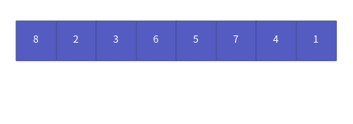
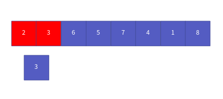
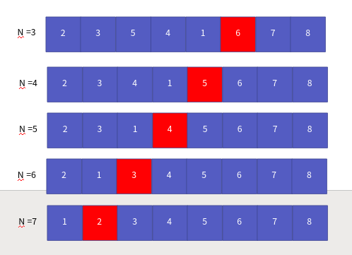

정렬 알고리즘 1부 버블 정렬
==================

Contents
-------------------

1. 시작하며...
2. 버블 정렬의 이해와 구현
3. 버블 정렬의 성능 분석
4. 마치며...


## 시작하며...

구르미의 "Computer Science 정복하기 - 자료구조"의 열 세 번째 장입니다. 이 장의 대략적인 내용은 다음과 같습니다. 

* 버블 정렬의 이해와 구현
* 버블 정렬의 성능 분석

이 장의 소스코드는 다음을 참고해주세요.

    url: https://github.com/gurumee92/datastructure 
    branch: ch13
    code directory: src/ch13

자 시작합시다!


## 버블 정렬의 이해와 구현

이번 장에서는 정렬 알고리즘 중 가장 쉬운 **버블 정렬**에 대해서 살펴보도록 하겠습니다. 버블 정렬은 정말 쉽습니다. 다음의 배열을 버블 정렬을 통해 오름차순으로 정렬해보겠습니다.



먼저, 배열의 첫번째 위치의 요소 8, 두 번째 위치의 요소 2를 비교합니다. 


2 < 8 이고 우리는 오름차순 정렬이기 때문에, 8과 2의 위치를 바꿉니다.


이제 두 번째 위치의 요소 8과 세 번째 위치의 요소 3을 비교합니다.


3 < 8 이기 때문에 둘의 위치를 바꿉니다


이 과정을 배열의 끝까지, 순서대로 비교합니다. 8은 배열 중 가장 큰 요소이기 때문에, 맨 마지막으로 이동합니다.


이 과정을 계속 반복하면 됩니다. 근데 왜 버블 정렬이냐. 이는 두 번째 과정을 살펴보도록 하지요. 밑에 "비교 기준의 숫자"의 변화를 잘 살펴보세요.

이제 또 다시 첫 요소 2, 두번째 요소 3을 비교합니다. 


2 < 3 이기 때문에, 위치 변화는 일어나지 않습니다. 대신 비교 기준 수가 2 -> 3으로 변화합니다.



이제 두 번째 요소 3, 세번 째 요소 6과 비교합니다.


3 < 6 이기 때문에 위치 변화는 일어나지 않습니다. 역시 비교 기준 수가 3 -> 6으로 변화합니다.


이제 세번째 요소 6, 네 번째 요소 5와 비교합니다.


5 < 6 이기 때문에 서로 위치를 바꿉니다.


이제 네 번째 요소 6과 다섯 번째 요소 7을 비교합니다.


6 < 7 이기 때문에 위치 변화는 일어나지 않습니다. 이 때 비교 기준 수가 6 -> 7 로 변화합니다.


이제 다섯 번째 요소 7과 여섯 번째 요소 4를 비교합니다.


4 < 7 이기 때문에 서로의 위치를 바꿉니다.


이제 여섯 번째 요소 7과 일곱 번째 요소 1을 비교합니다.


1 < 7 이기 때문에 서로의 위치를 바꿉니다.


이 일련의 과정, 비교 시, **비교 기준 보다 수가 크면 위치는 바꾸지 않고 비교 기준의 수가 변화합니다**. 이 과정이 마치 "거품이 일어나는 모습과 유사하다"라는 점에서 **버블 정렬**이라고 부르게 되었습니다. 다음은 정렬되기까지의 과정을 표현합니다.



이를 토대로 만든 코드는 다음과 같습니다.

src/ch13/main.c
```c
void BubbleSort(int arr[], int n) {
    for (int i=0; i<n-1; i++) { 

        for (int j=0; j< (n-1); j++) {
            if (arr[j] > arr[j + 1]) {
                int temp = arr[j];
                arr[j] = arr[j + 1];
                arr[j + 1] = temp;
            }
        }
    }
}
```

## 버블 정렬의 성능 분석

이제 버블 정렬 알고리즘의 성능 분석을 해보겠습니다. 알고리즘에서 가장 중요한 연산은 **비교 연산**입니다. 

실제, 위 코드에서 일어나는 비교 횟수는 처음에는 7번, 두 번째에는 6번 세 번째에는 5번, 결국에는 8번째에는 0번의 비교 연산이 일어납니다. 다음 그림처럼 말이죠.


총, 7 + 6 + 5 + .. + 1 + 0 번의 연산이 일어나죠. 이를 일반화했을 때, 크기 n에 대해서, 알고리즘에서 연산의 횟수는 다음과 같습니다.

> (n-1) + (n-2) + (n-3) + ... + (1)

즉, 다음의 수식으로 표현할 수 있습니다.

> n * (n-1) / 2

이를 빅-오 표현식으로 바꾸면 다음과 같습니다.

> O(n ^ 2)

즉, 버블 정렬의 성능은 O(n ^ 2) 입니다.


## 마치며...

이번 시간에는 정렬 알고리즘 중 가장 쉬운 버블 정렬에 대해서 살펴보았습니다. 다음 장에서는 **선택 정렬**에 대해서 살펴보도록 하겠습니다.
