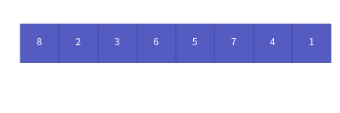
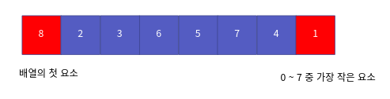
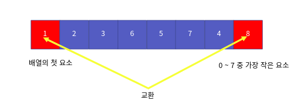
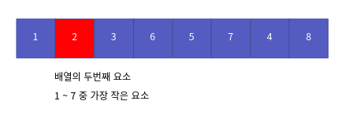
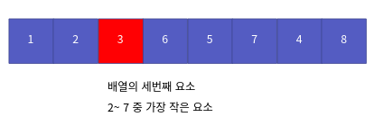
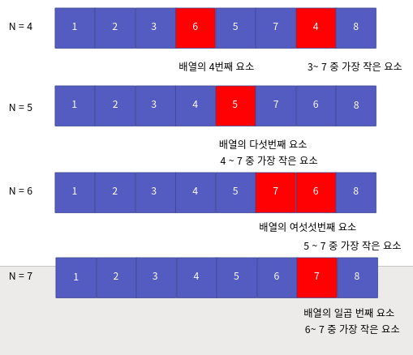
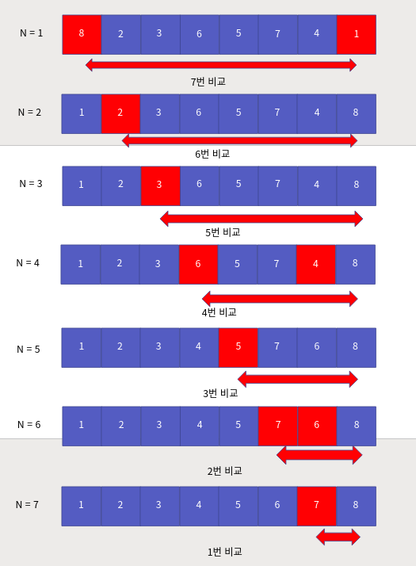

정렬 알고리즘 2부 선택 정렬
==================

Contents
-------------------

1. 시작하며...
2. 선택 정렬의 이해와 구현
3. 선택 정렬의 성능 분석
4. 마치며...


## 시작하며...

구르미의 "Computer Science 정복하기 - 자료구조"의 열 네 번째 장입니다. 이 장의 대략적인 내용은 다음과 같습니다. 

* 선택 정렬의 이해와 구현
* 선택 정렬의 성능 분석

이 장의 소스코드는 다음을 참고해주세요.

    url: https://github.com/gurumee92/datastructure 
    branch: ch14
    code directory: src/ch14

자 시작합시다!


## 선택 정렬의 이해와 구현

이번 장에서는 정렬 알고리즘 중 가장 쉬운 **선택 정렬**에 대해서 살펴보도록 하겠습니다. 선택 정렬 역시 정말 쉽습니다. 역시 다음 배열을 오름차순으로 정렬한다고 가정합니다.



선택 정렬의 메인 아이디어는 **선택 정렬은 배열에서 가장 작은 수(우선 순위 중 가장 높은 요소)를 선택해서 그 위치를 이동하는 것**입니다. 

먼저 처음 위치부터 시작해서 배열 중 가장 작은 요소 1을 찾습니다. 



1과 현재 배열의 처음 위치의 요소인 8괴 그 위치를 바꿉니다.



이제 두 번째 위치부터 시작해서 배열 중 가장 작은 요소 2를 찾습니다. 



2는 두 번째 위치에 존재하기 때문에 넘어갑니다.


이제 세 번째 위치부터 시작해서, 가장 작은 요소 3을 찾습니다.



3은 세 번째 위치에 존재하기 때문에 넘어갑니다.


이 과정을 계속 반복합니다. 다음은 일련의 과정을 표현한 것입니다.



이를 토대로 만든 코드는 다음과 같습니다.

src/ch14/main.c
```c
void SelectionSort(int arr[], int n) {

    for (int i=0; i<n-1; i++) { 

        int minIdx = i;

        for (int j=i+1; j<n; j++) {
            if (arr[j] < arr[i]) {
                minIdx = j;
            }
        }

        int temp = arr[i];
        arr[i] = arr[minIdx];
        arr[minIdx] = temp;
    }
}
```

## 선택 정렬의 성능 분석

이제 선택 정렬 알고리즘의 성능 분석을 해보겠습니다. 알고리즘에서 가장 중요한 연산은 **비교 연산**입니다. 

실제, 위 코드에서 일어나는 비교 횟수는 처음에는 7번, 두 번째에는 6번 세 번째에는 5번, 결국에는 8번째에는 0번의 비교 연산이 일어납니다. 다음 그림처럼 말이죠.



총, 7 + 6 + 5 + .. + 1 + 0 번의 연산이 일어나죠. 이를 일반화했을 때, 크기 n에 대해서, 알고리즘에서 연산의 횟수는 다음과 같습니다.

> (n-1) + (n-2) + (n-3) + ... + (1)

즉, 다음의 수식으로 표현할 수 있습니다.

> n * (n-1) / 2

이를 빅-오 표현식으로 바꾸면 다음과 같습니다.

> O(n ^ 2)

즉, 선택 정렬의 성능은 O(n ^ 2) 입니다.


## 마치며...

이번 시간에는 정렬 알고리즘 중 선택 정렬에 대해서 살펴보았습니다. 다음 장에서는 **삽입 정렬**에 대해서 살펴보도록 하겠습니다.
