정렬 알고리즘 3부 삽입 정렬
==================

Contents
-------------------

1. 시작하며...
2. 삽입 정렬의 이해와 구현
3. 삽입 정렬의 성능 분석
4. 마치며...


## 시작하며...

구르미의 "Computer Science 정복하기 - 자료구조"의 열 다섯 번째 장입니다. 이 장의 대략적인 내용은 다음과 같습니다. 

* 삽입 정렬의 이해와 구현
* 삽입 정렬의 성능 분석

이 장의 소스코드는 다음을 참고해주세요.

    url: https://github.com/gurumee92/datastructure 
    branch: ch15
    code directory: src/ch15

자 시작합시다!


## 삽입 정렬의 이해와 구현

이번 장에서는 정렬 알고리즘 중 가장 쉬운 **삽입 정렬**에 대해서 살펴보도록 하겠습니다. 삽입 정렬 역시 정말 쉽습니다. 역시 다음 배열을 오름차순으로 정렬한다고 가정합니다.

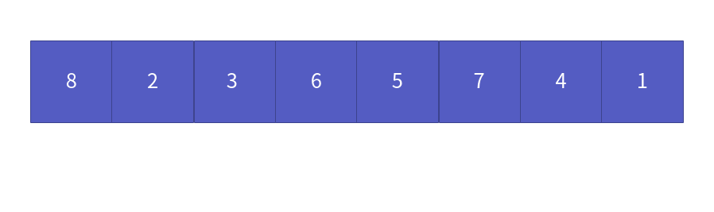

삽입 정렬의 키 포인트는 **왼쪽은 정렬된 공간, 오른쪽은 정렬해야 하는 구간으로 논리적으로 나누는 것**입니다.

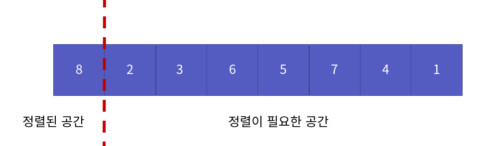

이제 시작해봅시다. 먼저 두 번째 위치(정렬된 공간까지의 바로 다음 위치) 2를 비교수로 합니다. 이 와 첫 번째 위치 8과 비교합니다.

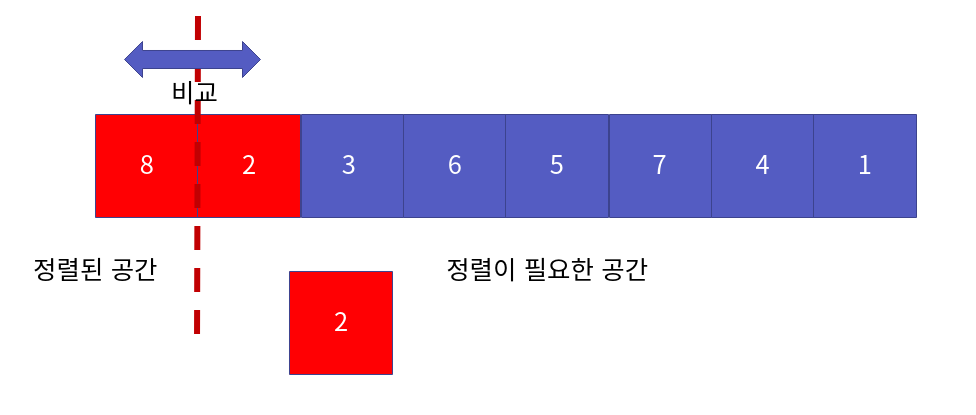

이제 2 < 8 이므로, 서로의 위치를 바꿉니다.

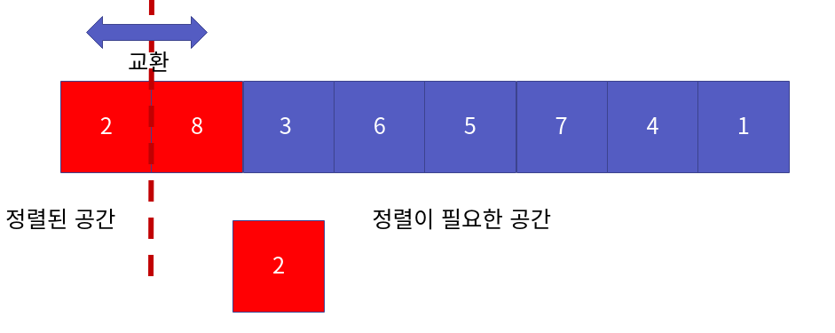

이로써 정렬된 공간은 하나 더 늘게 되었습니다.

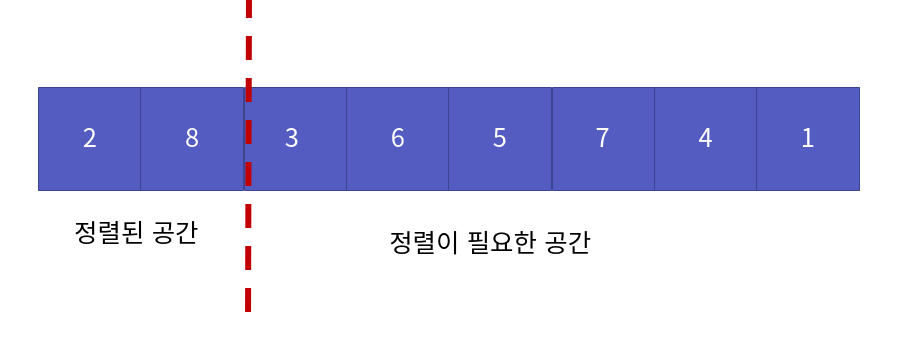

이제 세 번째 위치(정렬된 공간까지의 바로 다음 위치) 3을 비교수로 합니다. 두 번째 위치 8을 비교합니다.

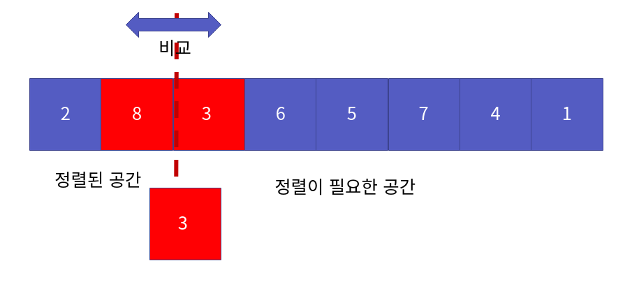

3 < 8이므로 서로 위치를 바꿉니다.

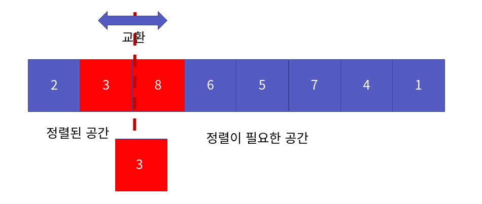

이제 비교 수 3과 첫 번째 위치의 수 2를 비교합니다.

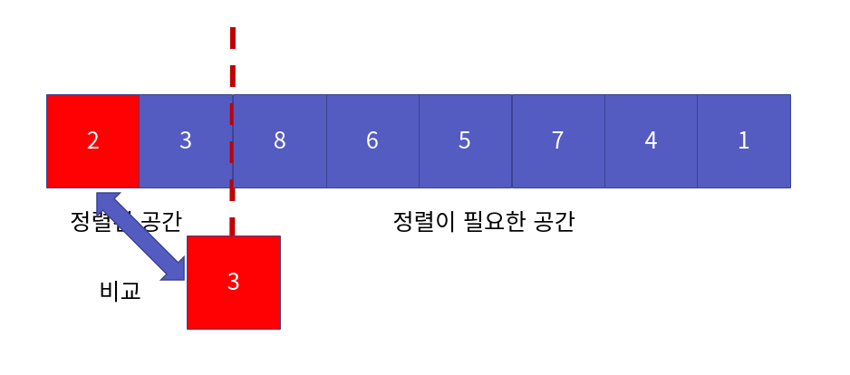

2 < 3 이므로 교환은 일어나지 않습니다. 이로써 정렬된 공간은 하나 더 늘게 되었습니다. 

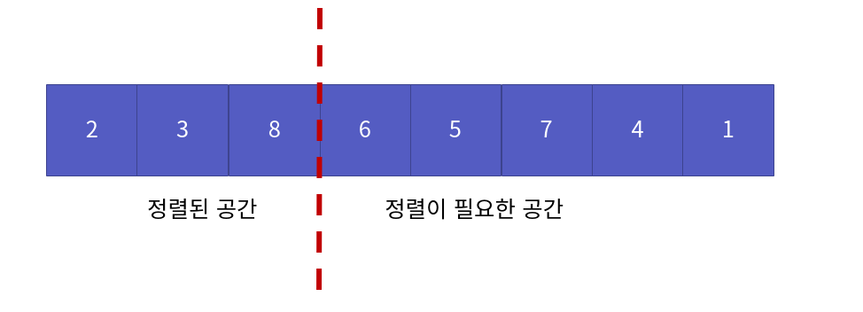

삽입 정렬은 결국 이 과정의 반복입니다. 다음은 반복 횟수에 따른 정렬된 결과입니다. 빨간 색 네모는, 이동한 칸을 나타내는 것입니다.

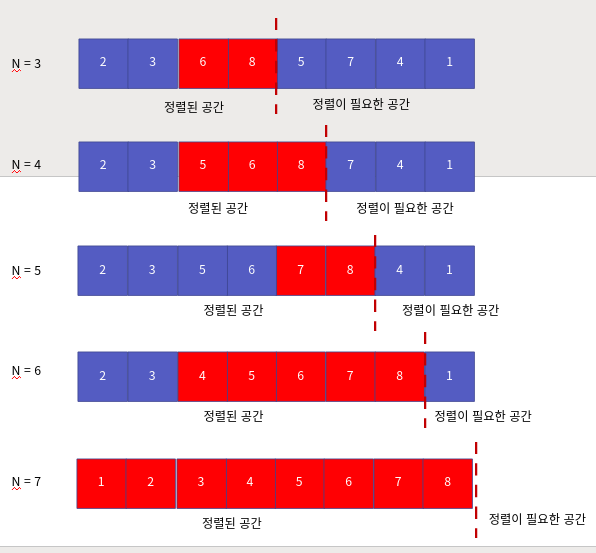

이를 토대로 만든 코드는 다음과 같습니다.

src/ch15/main.c
```c
void InsertionSort(int arr[], int n) {

    for (int i=1; i<n; i++) { 

        int insertion = arr[i];
        int j = i-1;

        while ( j >= 0 && arr[j] > insertion ) {
            arr[j + 1] = arr[j];
            j -= 1;
        }

        arr[j + 1] = insertion;
    }
}
```

## 삽입 정렬의 성능 분석

이제 삽입 정렬 알고리즘의 성능 분석을 해보겠습니다. 알고리즘에서 가장 중요한 연산은 **비교 연산**입니다. 

실제, 위 코드에서 일어나는 비교 횟수는 처음에는 1번, 두 번째에는 2번 세 번째에는 2번, 결국에는 8번째에는 7번의 비교 연산이 일어납니다. 다음 그림처럼 말이죠.

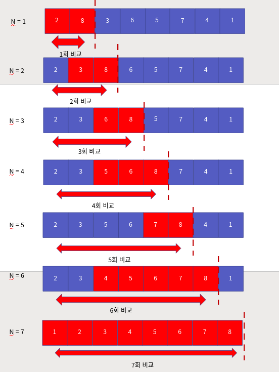

총, 1 + 2 + 3 + .. + 7 번의 연산이 일어나죠. 이를 일반화했을 때, 크기 n에 대해서, 알고리즘에서 연산의 횟수는 다음과 같습니다.

> 1 + 2 + 3 + ... + (n-1)

즉, 다음의 수식으로 표현할 수 있습니다.

> n * (n-1) / 2

이를 빅-오 표현식으로 바꾸면 다음과 같습니다.

> O(n ^ 2)

즉, 삽입 정렬의 성능은 O(n ^ 2) 입니다.


## 마치며...

이번 시간에는 정렬 알고리즘 중 삽입 정렬에 대해서 살펴보았습니다. 다음 장에서는 **힙 정렬**에 대해서 살펴보도록 하겠습니다.
