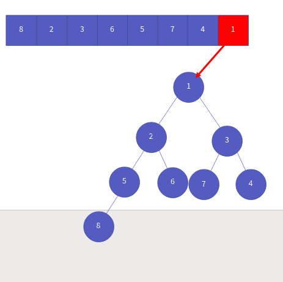
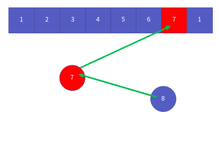

정렬 알고리즘 4부 힙 정렬
==================

Contents
-------------------

1. 시작하며...
2. 힙 정렬의 이해와 구현
3. 힙 정렬의 성능 분석
4. 마치며...


## 시작하며...

구르미의 "Computer Science 정복하기 - 자료구조"의 열 엿섯 번째 장입니다. 이 장의 대략적인 내용은 다음과 같습니다. 

* 힙 정렬의 이해와 구현
* 힙 정렬의 성능 분석

이 장의 소스코드는 다음을 참고해주세요.

    url: https://github.com/gurumee92/datastructure 
    branch: ch16
    code directory: src/ch16

자 시작합시다!


## 힙 정렬의 이해와 구현

우리는 지난 세 장(13 ~ 15장)에 걸쳐서 **버블 정렬, 선택 정렬, 삽입 정렬**을 배웠습니다. 이들의 시간 복잡도는 O(N^2)입니다. 이제부터는 조금 복잡하지만, 조금 더 성능이 좋은 정렬 알고리즘에 대해서 배우도록 하겠습니다. 이번 장에서는 조금 더 높은 성능을 지닌 알고리즘 중 하나인 **힙 정렬**에 대해 공부하도록 하겠습니다. 역시 다음 배열을 오름차순으로 정렬한다고 가정합니다.


힙 정렬의 키 포인트는 **배열의 모든 원소를 힙에 넣고, 다시 힙에서 꺼내기**입니다. 먼저 배열을 순회하며, 차례대로, 힙에 넣습니다. 다음은 일련의 과정을 표현합니다.

첫 번째 원소 8을 넣었을 때, 


두 번째 원소 2을 넣었을 때, 


세 번째 원소 3을 넣었을 때, 


네 번째 원소 6을 넣었을 때, 


다섯 번째 원소 5을 넣었을 때, 


여섯 번째 원소 7을 넣었을 때,


일곱 번째 원소 4을 넣었을 때, 


마지막 원소 1을 넣었을 때,



이제 힙에 저장된 원소를 모두 빼내어, 원 배열에 다시 저장합니다.

힙에서 첫 번째로 데이터를 빼낼 때,


힙에서 두 번째로 데이터를 빼낼 때,


힙에서 세 번째로 데이터를 빼낼 때,


힙에서 네 번째로 데이터를 빼낼 때,


힙에서 다섯 번째로 데이터를 빼낼 때,


힙에서 여섯 번째로 데이터를 빼낼 때,


힙에서 일곱 번째로 데이터를 빼낼 때,



힙에서 마지막으로로 데이터를 빼낼 때,


쉽죠? ㅎㅎ 힙은, **루트 노드가 가장 우선 순위가 높게끔 데이터를 저장하는 자료구조**입니다. 즉, 모든 배열의 원소를 넣어 힙을 만들고, 힙에서 차례대로 데이터를 꺼내면, 우선순위에 맞게 정렬이 된다는 것입니다. 여기서는 우리가 12장에서 만든 힙을 이용합시다. 이를 토대로 만든 코드는 다음과 같습니다.

src/ch16/main.c
```c
#include <stdlib.h>

#include "Heap.h"

// 힙 초기화시, 힙에서 다루는 데이터의 우선순위를 정하는 함수
int compare(void * pData1, void * pData2) {
    int d1 = *((int *) pData1);
    int d2 = *((int *) pData2);
    return d2 - d1;
}

// 정수형 데이터를 힙에 저장
void insert(Heap * pHeap, int * element) {
    HInsert(pHeap, element);
}

// 저장된 정수형 데이터를 힙에서 빼내옴
int delete(Heap * pHeap) {
    int data = *((int *)HDelete(pHeap));
    return data;
}

void HeapSort(int arr[], int n) {

    int * sortedArr = (int *) malloc(sizeof(int) * n);
    Heap heap;
    HInit(&heap, compare);

    for (int i=0; i<n; i++){
        insert(&heap, arr + i);
    }

    for (int i=0; i<n; i++) {
        sortedArr[i] = delete(&heap);
    }

    for (int i=0; i<n; i++) {
        arr[i] = sortedArr[i];
    }

    HDestroy(&heap);
    free(sortedArr);
}
```

    참고! 왜 동적 배열을 사용하는가?
    현재 힙은 제네릭 기법을 사용하고 있습니다. 배열의 원소를 저장하는 것이 아닌, 배열의 원소의 주소를 저장하기 때문에, 바로 대입을 하면, 연산 시 꼬이게 됩니다. 이를 해결하기 위해서는 그래서 동적 배열을 생성하고 거기에다, 배열 원소의 주소가 가지고 있는 값을 저장해야 합니다. 한 번, 동적 배열 없이 바로 데이터를 옮겨보세요. 무슨 뜻인지 알 수 있을 겁니다.


## 힙 정렬의 성능 분석

이제 힙의 성능을 알아봅시다. **힙의 경우 추가/삭제 연산의 경우 O(log(N))의 시간 복잡도**를 가집니다. 제가 만든 힙 정렬의 경우 이를 **배열 크기 N 만큼 3번 순회**하고 있습니다. 이 중 한 번은 그냥 배열에서 데이터를 옮기는 것이지만, **두 번은 순회하는 동안 힙에서 삽입 혹은 삭제 연산**이 같이 일어납니다. 결국 시간 복잡도는 다음과 같습니다.

> N + 2 * N * log(N) = N (1 + 2 * log(N)) = O( N * log(N) )

그리고 알고리즘 성능 분석 시, 새로운 메모리를 쓸 때, 공간 복잡도를 따져야 합니다. 위의 코드에서 우리는 N 크기만큼의 힙과, 동적 배열을 사용합니다. 따라서 공간복잡도는 다음과 같습니다.

> 2 * N = O(N)

**즉 시간 복잡도는 O(N * log(N)), 공간 복잡도는 O(N)입니다.**


## 마치며...

이번 시간에는 정렬 알고리즘 중 힙 정렬에 대해서 살펴보았습니다. 다음 장에서는 **병합 정렬**에 대해서 살펴보도록 하겠습니다.
