정렬 알고리즘 5부 병합 정렬
==================

Contents
-------------------

1. 시작하며...
2. 병합 정렬의 이해와 구현
3. 병합 정렬의 성능 분석
4. 마치며...


## 시작하며...

구르미의 "Computer Science 정복하기 - 자료구조"의 열 일곱 번째 장입니다. 이 장의 대략적인 내용은 다음과 같습니다. 

* 병합 정렬의 이해와 구현
* 병합 정렬의 성능 분석

이 장의 소스코드는 다음을 참고해주세요.

    url: https://github.com/gurumee92/datastructure 
    branch: ch17
    code directory: src/ch17

자 시작합시다!


## 병합 정렬의 이해와 구현

우리는 지난 세 장(13 ~ 15장)에 걸쳐서 **버블 정렬, 선택 정렬, 삽입 정렬**을 배웠습니다. 이들의 시간 복잡도는 O(N^2)입니다. 이제부터는 조금 복잡하지만, 조금 더 성능이 좋은 정렬 알고리즘에 대해서 배우도록 하겠습니다. 이번 장에서는 조금 더 높은 성능을 지닌 알고리즘 중 하나인 **병합 정렬**에 대해 공부하도록 하겠습니다. 역시 다음 배열을 오름차순으로 정렬한다고 가정합니다.

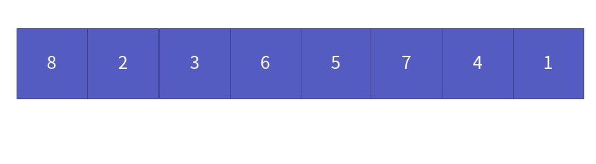

병합 정렬은 배열 중앙을 기준으로, 왼쪽 오른쪽으로 나눕니다.

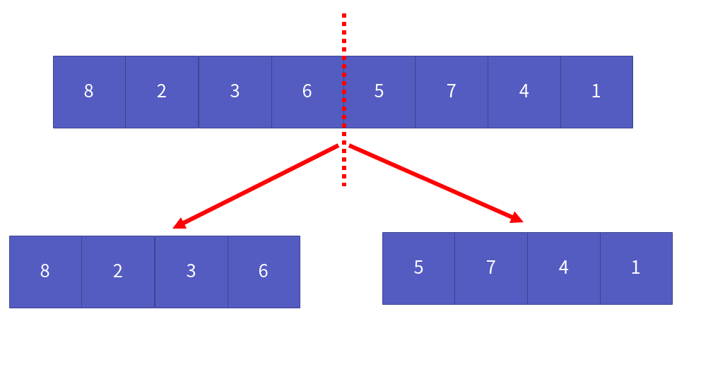

배열들을 쪼갤수 없을 때까지, 즉 공간이 1개일 때까지 쪼갭니다.

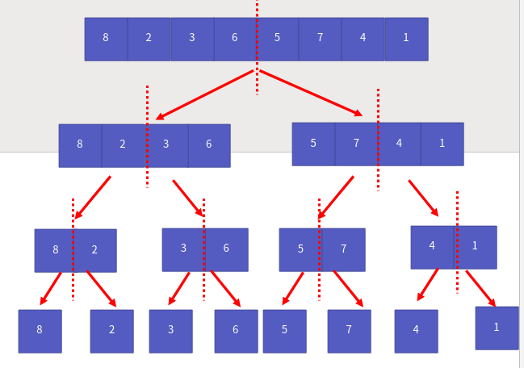

이제, 공간들을 합치면서, 정렬합니다.

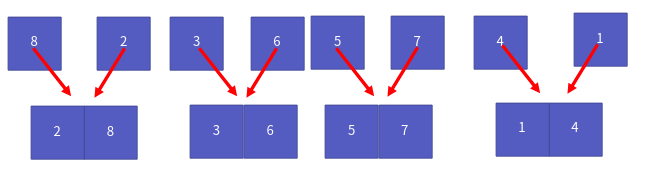

원래 공간 크기가 될 때까지 계속 합칩니다.

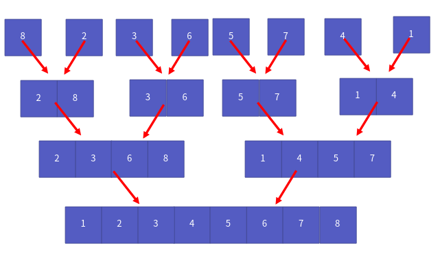

그림만 보면 쉽지만, 생각보다 쉽지 않습니다. 어떻게 쪼개고 합칠 수 있을까요? 먼저 쪼개기부터 알아보겠습니다.

먼저 중앙 지점을 찾습니다. 그리고 시작 지점부터 중간지점까지, 중간지점 + 1 부터 끝 지점까지 쪼개면 됩니다.

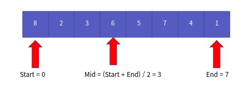

이것을 start >= end가 될 때까지 재귀적으로 호출해서 쪼개면 됩니다.

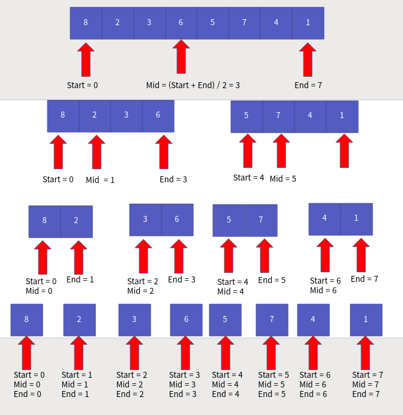

합칠 땐, 어떻게 할까요? 다음은 마지막으로 합쳐지기 전 상황입니다.

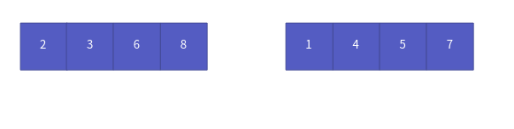

가장 쉽게, 합치는 공간만큼 새로운 공간을 만드는 방식으로 구현하겠습니다. 먼저 합치는 공간 크기 만큼 새로운 공간을 만듭니다.

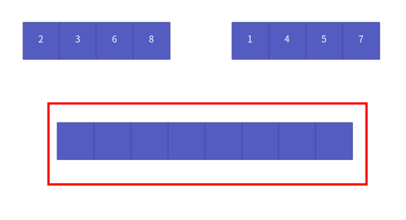

이제, `lStart = 0, rStart = mid + 1 = 5` 위치에 인덱스를 만듭니다.

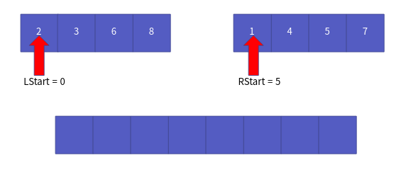

그리고 서로를 비교합니다.

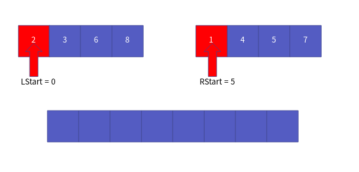

1 < 2 이므로, 새로운 공간에 1을 넣고, rStart를 하나 오른쪽으로 옮깁니다.

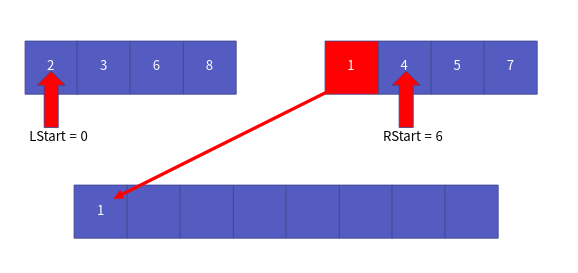

이 과정을 **lStart <= mid 혹은 rStart <= end** 이 조건을 만족할 때까지 반복합니다. 그럼 다음과 같습니다.

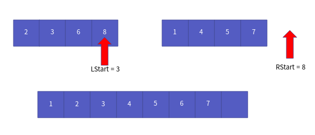

이 때 공간이 남았으니, 그 크기만큼 새로운 배열에 데이터를 넣으면 됩니다.

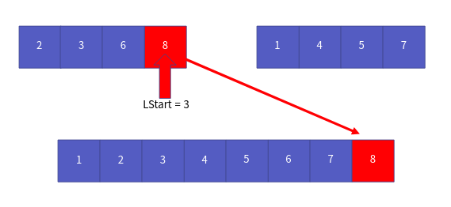

이 때, **왼쪽이 남았을 땐, lStart <= mid 만족할 때까지, 왼쪽 공간을 순회하고, 오른쪽이 남았을 땐, rStart <= end 만족할 때까지 오른쪽 공간을 순회**하면 됩니다. 

이렇게, 분할하고 합치는 과정, 알고리즘을 일컬어 **분할 정복**이라고 합니다. 결국 병합 정렬은 분할 정복 알고리즘을 써서 성능을 올린 것이라고 할 수 있습니다.

이를 토대로 만든 코드는 다음과 같습니다.

src/ch17/main.c
```c
#include <stdlib.h>

void Merge(int arr[], int start, int mid, int end) {
    int size = end - start + 1;
    int * sortedArr = (int *) malloc( sizeof(int) * size );
    int lStart = start, rStart = mid + 1;
    int idx = 0;

    while (lStart <= mid && rStart <= end) {

        if (arr[lStart] < arr[rStart]) {
            sortedArr[idx] = arr[lStart];
            lStart += 1;
        } else {
            sortedArr[idx] = arr[rStart];
            rStart += 1;
        }

        idx += 1;
    }

    while (lStart <= mid){
        sortedArr[idx] = arr[lStart];
        lStart += 1;
        idx += 1;
    }
    
    while (rStart <= end){
        sortedArr[idx] = arr[rStart];
        rStart += 1;
        idx += 1;
    }

    for (int i=0; i<size; i++) {
        arr[start + i] = sortedArr[i];
    }

    free(sortedArr);
}

void MergeSort(int arr[], int start, int end) {
    if (start >= end) {
        return;
    }

    int mid = (start + end) / 2;
    
    MergeSort(arr, start, mid);
    MergeSort(arr, mid+1, end);

    Merge(arr, start, mid, end);
}
```


## 병합 정렬의 성능 분석

이제 병합 정렬의 성능을 알아봅시다. 일단, 쪼개는 연산이 (logN) 입니다. 그리고 비교하는 연산이 N입니다. 따라서 시간 복잡도는 다음을 만족합니다.

> N * log(N) = O(N * log(N))

다만, 공간 복잡도 역시 엄청 크게 됩니다. 쪼개는 연산 만큼, 쪼개지는 공간의 크기만큼 필요하죠. 결국 공간 복잡도는 O(N * log(N)) 입니다. 

**즉 시간 복잡도는 O(N * log(N)), 공간 복잡도는 O(N)입니다.**

다만, 연결 리스트의 경우, 임시 공간이 필요하지 않기 때문에, 이 공간 복잡도에 대해 줄일 수 있습니다. 따라서, 병합 정렬은 일반 배열, 배열 리스트보다, 연결 리스트에 보다 적합한 정렬 알고리즘입니다.


## 마치며...

이번 시간에는 정렬 알고리즘 중 병합 정렬에 대해서 살펴보았습니다. 다음 장에서는 **퀵 정렬**에 대해서 살펴보도록 하겠습니다.
