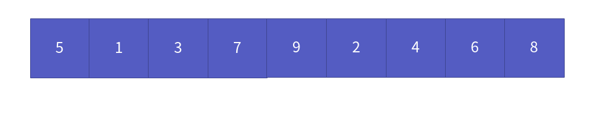
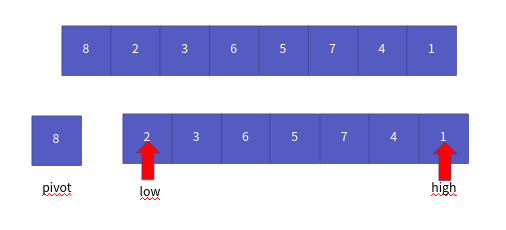
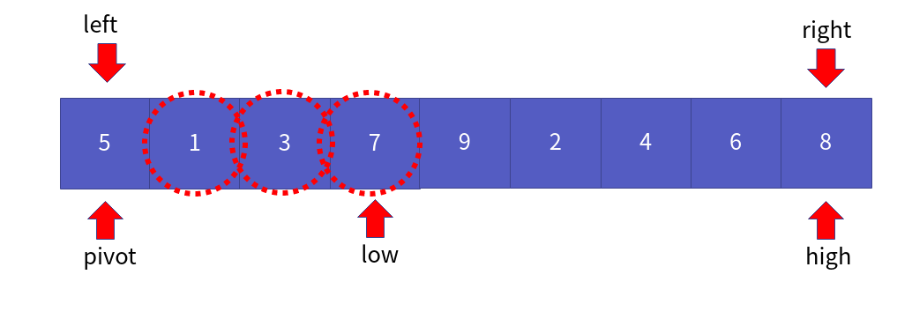
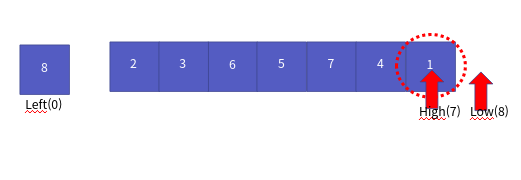
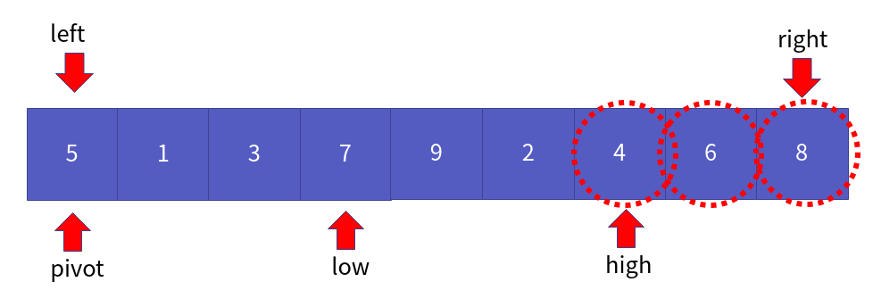
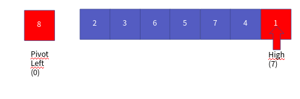
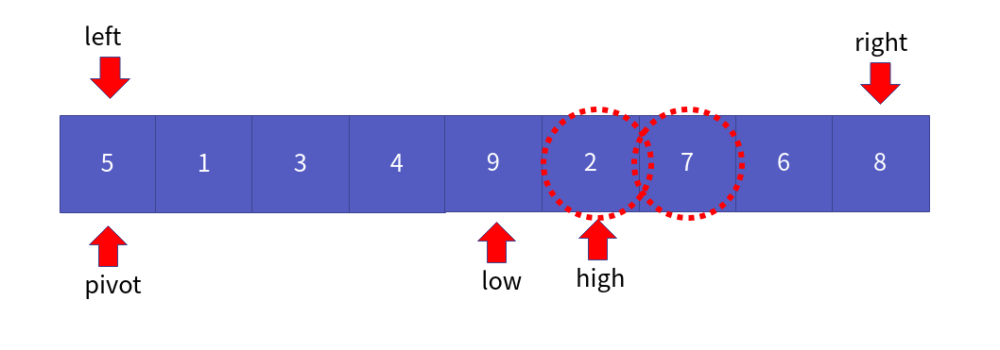

정렬 알고리즘 6부 퀵 정렬
==================

Contents
-------------------

1. 시작하며...
2. 퀵 정렬의 이해와 구현
3. 퀵 정렬의 성능 분석
4. 마치며...


## 시작하며...

구르미의 "Computer Science 정복하기 - 자료구조"의 열 여덟 번째 장입니다. 이 장의 대략적인 내용은 다음과 같습니다. 

* 퀵 정렬의 이해와 구현
* 퀵 정렬의 성능 분석

이 장의 소스코드는 다음을 참고해주세요.

    url: https://github.com/gurumee92/datastructure 
    branch: ch18
    code directory: src/ch18

자 시작합시다!


## 퀵 정렬의 이해와 구현

우리는 지난 세 장(13 ~ 15장)에 걸쳐서 **버블 정렬, 선택 정렬, 삽입 정렬**을 배웠습니다. 이들의 시간 복잡도는 O(N^2)입니다. 이제부터는 조금 복잡하지만, 조금 더 성능이 좋은 정렬 알고리즘에 대해서 배우도록 하겠습니다. 이번 장에서는 조금 더 높은 성능을 지닌 알고리즘 중 하나인 **퀵 정렬**에 대해 공부하도록 하겠습니다. 

역시 다음 배열을 오름차순으로 정렬한다고 가정합니다.



이제 첫 번째 위치를 분리합니다. 이를 `pivot`이라고 합니다. 그리고 low, high를 다음의 위치로 잡습니다. (low = 1, high = 7)



이제 pivot 보다 작은 수가 나올 때까지 low를 1씩 증가시킵니다.



이제 반대로 pivot보다 큰 수가 나올 때까지 high를 1씩 감소시킵니다. 



8은 가장 크기 때문에, low = 8, high = 7이 됩니다.



**low <= high 일 경우, low와 high 위치의 값을 바꿉니다.** 같은 low가 크기 때문에, 바뀌진 않습니다.

이 과정을 low <= high 조건을 만족할 때까지, 반복하면 됩니다. 

이를 만족하지 않기 때문에, 반복 과정을 끝내고 **가장 맨 처음 0 과 high 7 위치의 값을 맞바꿉니다.**




이제 high 위치에서, 또 이 과정을 반복합니다. 다음은 퀵 정렬의 흐름입니다.



이를 토대로 만든 코드는 다음과 같습니다. 퀵 정렬의 경우, 코드 흐름에 따라 그림을 그려 보는 것을 추천드립니다. 이렇게 하면, 어떻게 동작하는지 이해가 더욱 쉬울 것입니다.

src/ch18/main.c
```c
void Swap(int arr[], int i, int j) {
    int temp = arr[i];
    arr[i] = arr[j];
    arr[j] = temp;
}

int Partition(int arr[], int left, int right) {
    int pivot = arr[left];
    int low = left + 1;
    int high = right;

    while (low <= high) {
        while (low <= right && pivot > arr[low]){
            low += 1;
        }

        while(high >= left + 1 && pivot < arr[high]) {
            high -= 1;
        }

        if (low <= high) {
            Swap(arr, low, high);
        }
    }

    Swap(arr, left, high);
    return high;
}

void QuickSort(int arr[], int start, int end) {

    if (start > end) {
        return;
    }

    int pivot = Partition(arr, start, end);
    QuickSort(arr, start, pivot-1);
    QuickSort(arr, pivot + 1, end);
}
```


## 퀵 정렬의 성능 분석

이제 퀵 정렬의 성능을 알아봅시다. 퀵 정렬도 병합 정렬과 마찬가지로, log(N)의 시간 복잡도를 갖는 쪼개기 연산이 들어갑니다. 각 쪼개기 연산 시 N번의 비교 연산이 들어갑니다.

**즉 시간 복잡도는 O(N * log(N)) 입니다.**

다만, 병합 정렬과 달리 별도의 공간은 필요하지 않습니다.


## 마치며...

이번 시간에는 정렬 알고리즘 중 퀵 정렬에 대해서 살펴보았습니다. 다음 장에서는 **기수 정렬**에 대해서 살펴보도록 하겠습니다.
