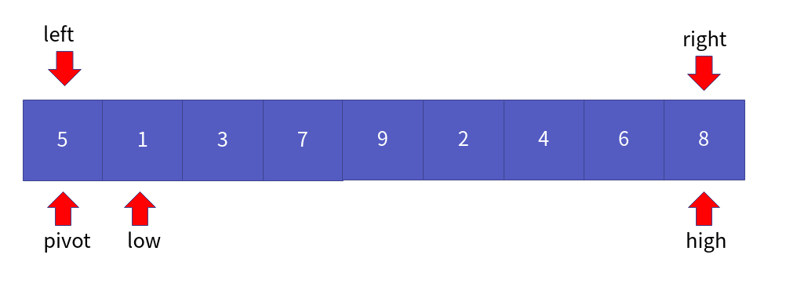
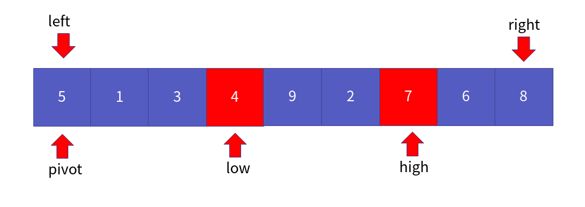

정렬 알고리즘 6부 퀵 정렬
==================

Contents
-------------------

1. 시작하며...
2. 퀵 정렬의 이해와 구현
3. 퀵 정렬의 성능 분석
4. 마치며...


## 시작하며...

구르미의 "Computer Science 정복하기 - 자료구조"의 열 여덟 번째 장입니다. 이 장의 대략적인 내용은 다음과 같습니다. 

* 퀵 정렬의 이해와 구현
* 퀵 정렬의 성능 분석

이 장의 소스코드는 다음을 참고해주세요.

    url: https://github.com/gurumee92/datastructure 
    branch: ch18
    code directory: src/ch18

자 시작합시다!


## 퀵 정렬의 이해와 구현

우리는 지난 세 장(13 ~ 15장)에 걸쳐서 **버블 정렬, 선택 정렬, 삽입 정렬**을 배웠습니다. 이들의 시간 복잡도는 O(N^2)입니다. 이제부터는 조금 복잡하지만, 조금 더 성능이 좋은 정렬 알고리즘에 대해서 배우도록 하겠습니다. 이번 장에서는 조금 더 높은 성능을 지닌 알고리즘 중 하나인 **퀵 정렬**에 대해 공부하도록 하겠습니다. 

다음 배열을 퀵 정렬을 통해서 오름차순으로 정렬한다고 가정합니다.


배열에서 각 위치가 표현하는 것은 다음과 같습니다.



* left 정렬 대상의 가장 왼쪽 지점을 가리킵니다.
* right 정렬 대상의 가장 오른쪽 지점을 가리킵니다.
* pivot 현재 정렬의 중심점입니다.
* low 피벗을 제외한 가장 왼쪽에 위치한 지점을 가리킵니다.
* high 피벗을 제외한 가장 오른쪽에 위치한 지점을 가리킵니다.

이제 low가 가리키는 원소가 pivot 보다 작은 수가 나올 때까지 low를 1씩 증가시킵니다. 즉 pivot보다 큰 수인 7을 가리키는 지점에서 멈춥니다.


이제 반대로 pivot보다 큰 수가 나올 때까지 high를 1씩 감소시킵니다. 즉 pivot 보다 작은 수인 4를 가리키는 지점에서 멈춥니다. 


low <= high 라면 두 위치를 바꿉니다.



또한, low <= high를 만족할 때까지 위의 과정을 반복합니다. 이제 low가 가리키는 원소가 pivot 보다 작은 수가 나올 때까지 low를 1씩 증가시킵니다. 즉 pivot보다 큰 수인 9을 가리키는 지점에서 멈춥니다.


이제 반대로 pivot보다 큰 수가 나올 때까지 high를 1씩 감소시킵니다. 즉 pivot 보다 작은 수인 2를 가리키는 지점에서 멈춥니다. 


low <= high 라면 두 위치를 바꿉니다.


low <= high를 만족하기 때문에 또 low, high를 움직입니다. low가 가리키는 원소가 pivot 보다 작은 수가 나올 때까지 low를 1씩 증가시킵니다. 즉 pivot보다 큰 수인 9을 가리키는 지점에서 멈춥니다.


이제 반대로 pivot보다 큰 수가 나올 때까지 high를 1씩 감소시킵니다. 즉 pivot 보다 작은 수인 2를 가리키는 지점에서 멈춥니다. 


바로 이 순간, high < low 인 순간, 위 반복을 멈추고 high 위치의 원소와 pivot과 교환합니다.


이제 high 위치에서 왼쪽 오른쪽으로 재귀적으로 퀵 정렬을 수행하면 됩니다.


한 번 다음에 일어나는 과정들을 직접 손으로 그려 보세요! 이를 토대로 만든 코드는 다음과 같습니다.

src/ch18/main.c
```c
void Swap(int arr[], int i, int j) {
    int temp = arr[i];
    arr[i] = arr[j];
    arr[j] = temp;
}

int Partition(int arr[], int left, int right) {
    int pivot = arr[left];
    int low = left + 1;
    int high = right;

    while (low <= high) {
        while (low <= right && pivot > arr[low]){
            low += 1;
        }

        while(high >= left + 1 && pivot < arr[high]) {
            high -= 1;
        }

        if (low <= high) {
            Swap(arr, low, high);
        }
    }

    Swap(arr, left, high);
    return high;
}

void QuickSort(int arr[], int start, int end) {

    if (start > end) {
        return;
    }

    int pivot = Partition(arr, start, end);
    QuickSort(arr, start, pivot-1);
    QuickSort(arr, pivot + 1, end);
}
```


## 퀵 정렬의 성능 분석

이제 퀵 정렬의 성능을 알아봅시다. 퀵 정렬도 병합 정렬과 마찬가지로, log(N)의 평균 시간 복잡도를 갖는 쪼개기 연산이 들어갑니다. 각 쪼개기 연산 시 N번의 비교 연산이 들어갑니다.

**즉 시간 복잡도는 O(N * log(N)) 입니다.**

퀵 정렬의 경우 평균 시간 복잡도 O(N * log(N))입니다만, 최악의 경우는 O(N^2)입니다. 다만, 데이터가 커질 수록, 최악의 경우의 수가 나오기가 매우 힘들기 때문에, 평균 시간 복잡도를 통해 성능을 분석하는 것입니다. 또한 병합 정렬과 달리 별도의 공간은 필요하지 않습니다.


## 마치며...

이번 시간에는 정렬 알고리즘 중 퀵 정렬에 대해서 살펴보았습니다. 다음 장에서는 **기수 정렬**에 대해서 살펴보도록 하겠습니다.
