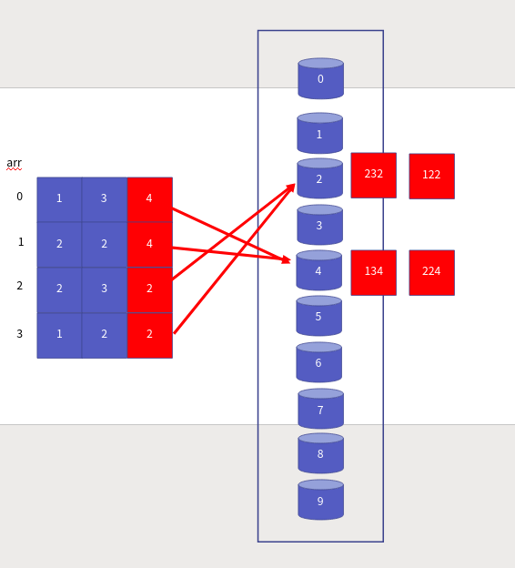
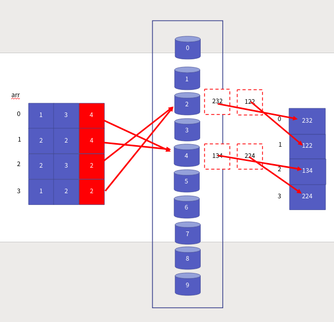

정렬 알고리즘 7부 기수 정렬
==================

Contents
-------------------

1. 시작하며...
2. 기수 정렬의 이해와 구현
3. 기수 정렬의 성능 분석
4. 마치며...


## 시작하며...

구르미의 "Computer Science 정복하기 - 자료구조"의 열 아홉 번째 장입니다. 이 장의 대략적인 내용은 다음과 같습니다. 

* 기수 정렬의 이해와 구현
* 기수 정렬의 성능 분석
* 현재까지 공부한 정렬 알고리즘들의 성능 비교

이 장의 소스코드는 다음을 참고해주세요.

    url: https://github.com/gurumee92/datastructure 
    branch: ch19
    code directory: src/ch19

자 시작합시다!


## 기수 정렬의 이해와 구현

**보통 정렬 알고리즘의 최고 성능의 한계는 O(N * logN)이라고 합니다.** 이번 장에서는 **특정 제약 조건 속에서 이 한계를 뛰어넘는 정렬 알고리즘 기수 정렬**에 대해서 공부하도록 하겠습니다. 

여태까지 배운 정렬 알고리즘은 **비교 연산**이 핵심 연산이었습니다. 그러나 기수 정렬은 비교를 하지 않습니다. 그렇기 때문에, 이 정렬 알고리즘을 사용하기 위해선 다음의 제약 조건이 붙습니다.

> 정렬 데이터들은 특정 길이를 가지고 있어야 한다!

예를 들어, 다음 데이터들은 기수 정렬만으로는 정렬을 할 수 있습니다.

> ["red", "why", "zoo", "box"]

위의 단어들은 길이가 3으로 일정하기 때문입니다. 하지만 다음 데이터들은 기수 정렬만으로 정렬을 할 수 없습니다.

> [-21, 136, 7, 5, -145]

다음 데이터들도 마찬가지죠.

> ["professionalism", "data", "structure", "algorithm"]

이 때는 데이터의 길이를 판단하는 알고리즘이 있어야 합니다. 한 번 예를 통해서 기수 정렬에 대해서 알아보도록 하겠습니다. 먼저 다음의 데이터가 있다고 가정하지요.


배열 134, 224, 232, 122 는 모두 숫자로 이루어져 있습니다. 각 자리에서 십의 자리 숫자는 0~9로 표현할 수 있지요. 이 숫자들을 담기 위한 버킷을 만듭니다.


배열을 순서대로 돌아, 1의 자리 숫자에 맞는 버킷에 데이터를 넣습니다.



그리고 0~9 번 버킷을 순서대로 돌아 데이터를 차례대로 빼내서 다시 배열에 저장합니다.



이 과정을 백의 자릿수까지 반복합니다.


짜잔! 이렇게 쉽게 정렬이 되었습니다. 우리는 기수 정렬을 하면서, **비교 연산을 단 한 번도 하지 않았습니다.** 오로지 해당 숫자에 맞는 버킷에 담고 다시 빼내는 과정만 반복했을 뿐입니다. **오른쪽에서 왼쪽으로 기수 정렬하는 방식을 LSD 방식**이라고 합니다. 

    참고! MSD 기수 정렬
    이와 반대로 왼쪽에서 오른쪽으로 기수 정렬하는 방식을 MSD 방식이라고 합니다. LSD는 모든 자릿수에 대해 정렬해야 제대로 데이터를 얻을 수 있지만, MSD 방식은 정렬 중간에 이미 정렬된 데이터를 얻을 수 있다는 장점이 있습니다. 다만, 이 방식을 구현하기 위해서는 별도 알고리즘이 필요합니다. 최악의 경우 두 알고리즘 모두 같은 성능을 보이기 때문에, 조금 더 쉬운 LSD 기수 방식을 설명하였습니다.

이를 표현한 코드는 다음과 같습니다.

src/ch19/main.c
```c
#include <stdlib.h>

#include "Queue.h"

#define BUCKET_NUM 10

void enqueue(Queue * pq, int * pData) {
    Enqueue(pq, pData);
}

int dequeue(Queue * pq) {
    int * pData = (int *) Dequeue(pq);
    return *pData;
}

void RadixSort(int arr[], int size, int limit) {
    int factor = 1;
    int * sortedArr = (int *) malloc( sizeof(int) * size );
    Queue buckets[BUCKET_NUM];

    for (int bucket_idx=0; bucket_idx<BUCKET_NUM; bucket_idx++) {
        QInit( &buckets[bucket_idx] );
    }

    for (int pos=0; pos < limit; pos++) {

        for (int i=0; i<size; i++) {
            int radix = (arr[i] / factor) % 10;
            enqueue(&buckets[radix], arr + i);
        }

        for(int bucket_idx=0, i=0; bucket_idx<BUCKET_NUM; bucket_idx++) {
            while (!QIsEmpty(&buckets[bucket_idx])){
                sortedArr[i] = dequeue(&buckets[bucket_idx]);
                i += 1;
            }
        }

        for (int i=0; i<size; i++) {
            arr[i] = sortedArr[i];
        }

        factor *= 10;
    }

    for (int bucket_idx=0; bucket_idx<BUCKET_NUM; bucket_idx++) {
        QDestroy( &buckets[bucket_idx] );
    }
    free(sortedArr);
}
```

버킷을 표현하기 위해서 9장에서 작성했던 큐를 사용하였습니다.


## 기수 정렬의 성능 분석

이제 기수 정렬의 성능을 분석해보겠습니다. 기수 정렬에서 가장 중요한 연산은 **버킷의 삽입/삭제 연산**입니다. 버킷은 큐로 구현되어 있기 때문에, 모두 O(1)의 성능을 보입니다. 결국 limit의 크기 L, 배열 공간의 크기 N 이라 할 때, 기수 정렬은 다음 성능을 가집니다.

> L * N = O(N)

즉, O(N)의 시간 복잡도를 가지죠. 데이터의 길이에 대한 정보만 있다면, 우리가 배운 어떤 알고리즘보다 우월한 성능을 보입니다.


## 마치며...

이번 시간에는 정렬 알고리즘 중 기수 정렬에 대해서 살펴보았습니다. 우리가 여지껏 배운 알고리즘들의 성능 비교는 다음과 같습니다.

| 알고리즘 | 시간 복잡도 |
| :--: | :--: |
| 버블 정렬 | O(N ^ 2) |
| 선택 정렬 | O(N ^ 2) |
| 삽입 정렬 | O(N ^ 2) |
| 힙 정렬 | O(N * logN) |
| 병합 정렬 | O(N * logN) |
| 퀵 정렬 | O(N * logN) |
| 기수 정렬 | O(N) |

사실 우리가 정렬 알고리즘을 직접 구현할 일은 거의 없습니다. 대부분의 언어들이 표준 라이브러리로 정렬 알고리즘에 대한 함수/메소드를 가지고 있기 때문이죠. 대부분의 언어들의 표준 라이브러리에서 정렬 알고리즘의 성능은 O(N *logN)입니다. 그래도, 알고 쓰는 것과, 모르고 쓰는 것은 큰 차이점을 가지고 있습니다. 때문에, 우리가 공부한 것이 의미가 있는 것이죠. 

정렬 알고리즘 파트는 여기서 마치고, 다음 장에서는 자료구조 **이진 탐색 트리**에 대해서 살펴보도록 하겠습니다.
