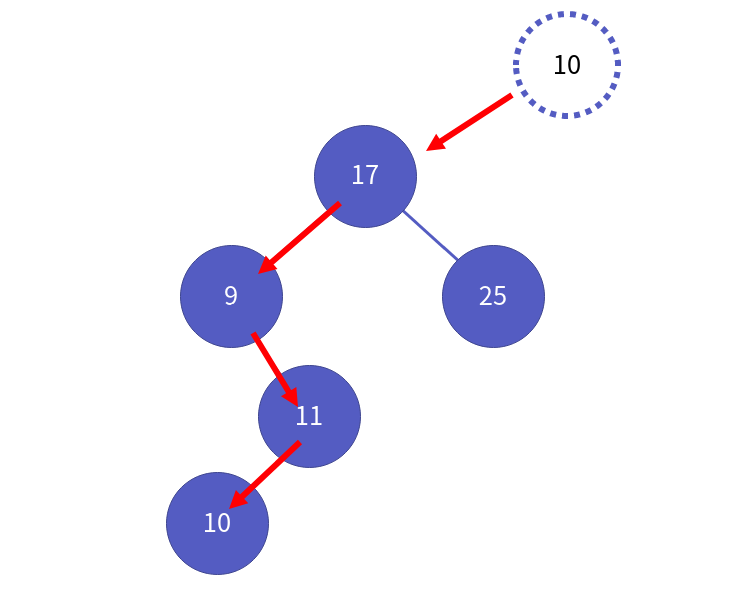

자료구조 이진 탐색 트리와 구현
===============

Contents
-------------------

1. 시작하며...
2. 이진 탐색 트리의 이해
    * 이진 탐색 트리 무엇이 좋은가?
    * 이진 탐색 트리 ADT
    * 구현하기 전에..
3. 이진 탐색 트리의 구현
    * 이진 탐색 트리 헤더
    * 이진 탐색 트리 생성
    * 이진 탐색 트리 파괴
    * 이진 탐색 트리 데이터 검색
    * 이진 탐색 트리 데이터 삽입
    * 이진 탐색 트리 데이터 삭제
    * 이진 탐색 트리 모든 데이터 출력
4. 마치며...


## 시작하며...

구르미의 "Computer Science 정복하기 - 자료구조"의 스무번째 장입니다. 이 장의 대략적인 내용은 다음과 같습니다. 

* 이진 탐색 트리의 이해
* 이진 탐색 트리의 구현

이 장의 소스코드는 다음을 참고해주세요.

    url: https://github.com/gurumee92/datastructure 
    branch: ch20
    code directory: src/ch20

자 시작합시다!


## 이진 탐색 트리의 이해

이번 장에서 우리는 **이진 탐색 트리(Binary Search Tree)**라는 자료구조를 공부해보겠습니다. 

### 이진 탐색 트리 무엇이 좋은가?

이진 탐색 트리, 말 그대로 탐색을 보다 쉽게 해주기 위한 트리입니다. 아주 예전에 공부했던 "순차 탐색" 혹은 "이진 탐색" 등을 기억하시나요? 이들처럼 실제 많은 프로그램들이 저장한 데이터를 **탐색**하는 작업을 많이 합니다.

배열은, 데이터를 저장하는 좋은 자료구조입니다만, 탐색에 최적화된 자료구조는 아닙니다. 반면, 트리는 탐색에 최적화된 자료구조라고 볼 수 있습니다. 특히 **이진 탐색 트리**가 말이죠. 그렇다면, 이진 트리와 이진 탐색 트리의 차이점은 무엇일까요?

> "이진 탐색 트리는 데이터를 저장하는 규칙이 존재한다!"

이진 탐색 트리가 되기 위한 조건은 다음과 같습니다.

* 이진 탐색 트리의 노드에 저장된 키는 유일합니다.
* 루트 노드의 키가 왼쪽 서브 트리를 구성하는 어떤 노드의 키보다 큽니다.
* 루트 노드의 키가 오른쪽 서브 트리를 구성하는 어떤 노드의 키보다 작습니다.
* 왼쪽, 오른쪽 서브 트리 역시, 이진 탐색 트리입니다.

다음 그림이 이진 탐색 트리의 예입니다.


그렇다면, 이진 탐색 트리는 무엇이 좋을까요? 만약, 10억개의 데이터가 저장되었다고 가정해봅시다. 이진 탐색 트리는 최대 몇 번만에 원하는 데이터를 찾아낼 수 있을까요?  **"놀랍게도, 32번이면 족합니다."** 정확히는, 루트 노드부터, 단말 노드까지 30 개의 노드를 지나는 과정에서 데이터를 찾을 수 있습니다. 

**바꿔 말하면, 이진 탐색 트리의 삽입/삭제/검색 연산의 시간 복잡도는 O(log(N))입니다.** 굉장히 뛰어난 탐색을 지원하는 자료구조로 정리할 수 있지요.


### 이진 탐색 트리 ADT

제가 정의한 이진 탐색 트리는 다음과 같습니다.

    ADT: BinarySearchTree

    void BSTMakeAndInit(BinarySearchTree * pBst, BSTCompareFunction compare)
    - 이진 탐색 트리를 생성합니다.
    - compare는 이진 탐색 트리에 데이터를 삽입/삭제/검색 할 때, 비교 함수로써 쓰입니다.
    - compare는 data1 > data2이면 1, data1 == data2면 0, data1 < data2 면 -1을 반환합니다. 

    void BSTDestroy(BinarySearchTree * pBst)
    - 이진 탐색 트리를 파괴합니다.

    void BSTInsert(BinarySearchTree * pBst, BSTData data)
    - 이진 탐색 트리에 데이터를 넣습니다.
    - 구성된 이진 탐색 트리에서 알맞은 자리에 데이터를 넣습니다.

    int BSTRemove(BinarySearchTree * pBst, BSTData target)
    - 이진 탐색 트리에 데이터를 삭제합니다.
    - 삭제 시, 이진 탐색 트리를 유지하도록 노드를 삭제합니다.
    - 데이터가 존재하면 1, 없으면 0을 반환합니다.

    int BSTSearch(BinarySearchTree * pBst, BSTData target)
    - 이진 탐색 트리에 데이터를 검색합니다.
    - 데이터가 존재하면 1, 없으면 0을 반환합니다.

    void BSTShowAll(BinarySearchTree * pBst, TraversalFuctionPtr action)
    - 이진 탐색 트리의 모든 데이터를 보여줍니다.
    - 중위 순회 방식을 이용합니다.


### 구현하기 전에..

본격적으로 이진 탐색 트리를 구현하기 전에, 우리는 지난 시간에 이진 트리에 대해서 공부하였습니다. 당시, 이진 트리의 핵심 내용만 기술하였기에, 삭제 기능에 대한 ADT 및 코드 구현을 생략하였습니다. 따라서 이진 탐색 트리를 구현하기 위해서는 한 차례 확장이 필요합니다. 다음은 확장한 이진 트리의 헤더와 소스 파일입니다. 자세한 설명은 구현부에서 설명하겠습니다.

src/ch20/BinaryTree.h
```c
#ifndef  __BINARY_TREE_H__
#define __BINARY_TREE_H__

typedef void * BTData;

typedef struct _binary_tree_node {
    BTData data;                       
    struct _binary_tree_node * left;   
    struct _binary_tree_node * right;  
} BinaryTreeNode;

typedef void TraversalFuctionPtr(BTData data);

BinaryTreeNode * MakeBinaryTreeNode();

BTData GetData(BinaryTreeNode * node);
void SetData(BinaryTreeNode * node, BTData data);

BinaryTreeNode * GetLeftSubTree(BinaryTreeNode * node);
BinaryTreeNode * GetRightSubTree(BinaryTreeNode * node);

void MakeLeftSubTree(BinaryTreeNode * parent, BinaryTreeNode * child);
void MakeRightSubTree(BinaryTreeNode * parent, BinaryTreeNode * child);

void RemoveTreeNode(BinaryTreeNode * root);

void PreOrderTraverse(BinaryTreeNode * root, TraversalFuctionPtr action);
void InOrderTraverse(BinaryTreeNode * root, TraversalFuctionPtr action);
void PostOrderTraverse(BinaryTreeNode * root, TraversalFuctionPtr action);

//밑에 4개가 추가된 함수입니다.
BinaryTreeNode * RemoveLeftSubTree(BinaryTreeNode * bt);
BinaryTreeNode * RemoveRightSubTree(BinaryTreeNode * bt);

void ChangeLeftSubTree(BinaryTreeNode * main, BinaryTreeNode * sub);
void ChangeRightSubTree(BinaryTreeNode * main, BinaryTreeNode * sub);

#endif // !__BINARY_TREE_H__
```

src/ch20/BinaryTree.c
```c
#include <stdlib.h>

#include "BinaryTree.h"

BinaryTreeNode * MakeBinaryTreeNode() {
    BinaryTreeNode * node = (BinaryTreeNode *) malloc (sizeof(BinaryTreeNode));
    node->data = NULL;
    node->left = NULL;
    node->right = NULL;
    return node;
}

BTData GetData(BinaryTreeNode * node) {
    return node->data;
}

void SetData(BinaryTreeNode * node, BTData data) {
    node->data = data;
}

BinaryTreeNode * GetLeftSubTree(BinaryTreeNode * node) {
    return node->left;
}

BinaryTreeNode * GetRightSubTree(BinaryTreeNode * node) {
    return node->right;
}

void MakeLeftSubTree(BinaryTreeNode * parent, BinaryTreeNode * child) {
    if (parent->left != NULL) {
        RemoveTreeNode(parent->left);
    }

    parent->left = child;
}

void MakeRightSubTree(BinaryTreeNode * parent, BinaryTreeNode * child) {
    if (parent->right != NULL) {
        RemoveTreeNode(parent->right);
    }

    parent->right = child;
}

void RemoveTreeNode(BinaryTreeNode * node) {
    if (node == NULL) {
        return;
    }

    RemoveTreeNode(node->left);
    RemoveTreeNode(node->right);
    free(node);
    node = NULL;
}

void PreOrderTraverse(BinaryTreeNode * node, TraversalFuctionPtr action) {
    if (node == NULL) {
        return;
    }

    action(node->data);
    PreOrderTraverse(node->left, action);
    PreOrderTraverse(node->right, action);
}

void InOrderTraverse(BinaryTreeNode * node, TraversalFuctionPtr action) {
    if (node == NULL) {
        return;
    }

    InOrderTraverse(node->left, action);
    action(node->data);
    InOrderTraverse(node->right, action);
}

void PostOrderTraverse(BinaryTreeNode * node, TraversalFuctionPtr action) {
    if (node == NULL) {
        return;
    }

    PostOrderTraverse(node->left, action);
    PostOrderTraverse(node->right, action);
    action(node->data);
}

//밑에 4개가 추가된 함수들입니다.
BinaryTreeNode * RemoveLeftSubTree(BinaryTreeNode * bt) {
    if (bt == NULL) {
        return NULL;
    }

    BinaryTreeNode * del = bt->left;
    bt->left = NULL;
    return del;
}

BinaryTreeNode * RemoveRightSubTree(BinaryTreeNode * bt) {
    if (bt == NULL) {
        return NULL;
    }

    BinaryTreeNode * del = bt->right;
    bt->right = NULL;
    return del;
}

void ChangeLeftSubTree(BinaryTreeNode * main, BinaryTreeNode * sub) {
    main->left = sub;
}

void ChangeRightSubTree(BinaryTreeNode * main, BinaryTreeNode * sub) {
    main->right = sub;
}
```


## 이진 탐색 트리의 구현

자 이제 본격적으로 이진 탐색 트리를 구현해봅시다.


### 이진 탐색 트리 헤더

먼저 **이진 탐색 트리의 구조체**입니다. 물론, 이진 트리처럼 `BinaryTreeNode` 구조체만을 이용해서 이진 탐색 트리를 구성할 수 있습니다. 그러나 필자 생각에는 포인터 연산이 복잡해지는 감이 있습니다. 데이터 삭제 시, 많은 포인터 연산이 필요하기 때문에 복잡도를 낮추기 위해 다음 구조체를 만듭니다.


이를 코드로 표현하면, 다음과 같습니다.

src/ch20/BinarySearchTree.h
```c
typedef BTData BSTData;                                 //이진 트리의 데이터를 그대로 이용한다.
typedef int BSTCompareFunction(BSTData d1, BSTData d2); //이진 탐색 트리의 비교 함수의 원형 재지정

typedef struct _binary_search_tree {
    BinaryTreeNode * root;          //이진 탐색 트리의 루트를 가리키는 포인터
    BSTCompareFunction * compare;   //삽입/삭제/검색 시 사용하는 비교 함수
} BinarySearchTree;
```

다음은, ADT에 대해서 함수 원형만 코드로써 표현한 것입니다.

src/ch20/BinarySearchTree.h
```c
void BSTMakeAndInit(BinarySearchTree * pBst, BSTCompareFunction compare);
void BSTDestroy(BinarySearchTree * pBst);
void BSTInsert(BinarySearchTree * pBst, BSTData data);
int BSTRemove(BinarySearchTree * pBst, BSTData target);
int BSTSearch(BinarySearchTree * pBst, BSTData target);
void BSTShowAll(BinarySearchTree * pBst, TraversalFuctionPtr action);
```

### 이진 탐색 트리 생성

먼저 이진 탐색트리의 생성입니다. 처음 생성 시, 비교 함수 부분만 초기화가 이루어지면 됩니다. 코드는 다음과 같습니다.

src/ch20/BinarySearchTree.c
```c
void BSTMakeAndInit(BinarySearchTree * pBst, BSTCompareFunction compare) {
    pBst->root = NULL;
    pBst->compare = compare;
}
```

### 이진 탐색 트리 파괴

파괴 함수는 root 가 가리키는 노드가 존재할 경우, 즉 트리가 있을 경우, 이 트리들을 모두 순회하여 삭제해주면 됩니다. 코드는 다음과 같습니다.

src/ch20/BinarySearchTree.c
```c
void BSTDestroy(BinarySearchTree * pBst) {
    if (pBst->root != NULL) {
        RemoveTreeNode(pBst->root);
    }
}
```


### 이진 탐색 트리 데이터 검색

자 이제 이진 탐색 트리 안에 데이터를 검색하는 함수를 구현해보겠습니다. 검색 함수는 의외로 쉽습니다. **루느 노드부터 시작해서 검색 데이터 "target"이 노드의 데이터보다 작으면 왼쪽, 크면 오른쪽 자식으로 내려가면 됩니다.** target과 데이터가 같은 노드에서 순회를 멈추면 됩니다. 

즉, target > data 면 오른쪽으로, target < data면 왼쪽으로 이동합니다. 만약, target == data 일 경우 1을 반환하면 됩니다. 트리를 모두 순회했음에도 못찾았다면 0을 반환하면 됩니다. 코드는 다음과 같습니다.

src/ch20/BinarySearchTree.c
```c
int BSTSearch(BinarySearchTree * pBst, BSTData target) {
    BinaryTreeNode * curr = pBst->root;

    while (curr != NULL) {
        BSTData data = GetData(curr);
        int compareResult = pBst->compare(target, data);
        
        if ( compareResult == 0 ) {
            return 1;
        } 

        curr = ( compareResult < 0 ) ? GetLeftSubTree(curr) : GetRightSubTree(curr);
    }

    return 0;
}
```


### 이진 탐색 트리 데이터 삽입

데이터 삽입의 경우, 새로운 노드를 트리에서 찾아주면 됩니다. 만약, 새 노드의 데이터가 현재 노드보다 크면 오른쪽 자식으로 반대라면 왼쪽 자식으로 내려보냅니다. 예를 들어서 생각해보죠. 다음 그림처럼 이진 탐색 트리가 있다고 가정합시다.


이 때, 11을 넣어보겠습니다. 


루트 노드의 데이터 17보다 작으니 왼쪽으로 내려갑니다.


현재 노드의 데이터 9보다 크니 오른쪽으로 내려갑니다. 


자리가 비었으니 여기에 새 노드를 배치시키면 됩니다.


다음은 10 ,29, 22를 위 트리에 데이터를 순서대로 삽입했을 때 모습입니다.

10을 넣었을 때,



29을 넣었을 때,


22을 넣었을 때,


**결국 삽입 함수는 비교 대상이 없을 때까지 노드들과 비교해서 내려가는 것**이 포인트입니다. 또한, 삽입된 데이터가 만약 트리 안에 존재하는 데이터라면, 삽입을 하지 않으면 됩니다. 코드 흐름은 다음과 같습니다.

1. 새로운 노드 생성
2. 루트 노드부터 더 이상 내려갈 수 없을 때까지 다음을 순회합니다.
    1. 노드의 데이터와 새 데이터를 비교합니다.
        1. 만약, 데이터가 같은 경우, 삽입을 하지 않습니다.
        2. 새로운 데이터 > 노드 데이터 일 경우 오른쪽으로 내려갑니다.
        3. 새로운 데이터 < 노드 데이터 일 경우 왼쪽으로 내려갑니다.
3. 더 이상 내려가지 못할 경우, 그 자리에 데이터를 삽입합니다.

코드는 다음과 같습니다.

src/ch20/BinarySearchTree.c
```c
void BSTInsert(BinarySearchTree * pBst, BSTData data) {

    //새로운 노드 생성

    BinaryTreeNode * new = MakeBinaryTreeNode();
    SetData(new, data);

    //루트 노드부터 시작.
    BinaryTreeNode * curr = pBst->root;
    BinaryTreeNode * parent = NULL;

    //자리를 찾을때까지 반복

    while (curr != NULL) {

        if ( pBst->compare(data, GetData(curr)) == 0 ) {
            return;
        }

        parent = curr;
        curr = ( pBst->compare( GetData(curr), data ) > 0 ) ? GetLeftSubTree(curr) : GetRightSubTree(curr);
    }

    // parent null? 은 루트 노드가 없을 때를 뜻함.
    if (parent == NULL) {
        pBst->root = new;
        return;
    }

    // 현재 노드보다 작을 경우 왼쪽 자식으로
    if ( pBst->compare(data, GetData(parent)) < 0 ) {
        MakeLeftSubTree(parent, new);
        return;
    } 

    // 아니라면 오른쪽 자식으로.

    MakeRightSubTree(parent, new);
}
```

### 이진 탐색 트리 데이터 삭제

이진 탐색 트리에서 가장 어려운 것은 **데이터 삭제**부분입니다. 데이터 삭제의 경우 다음의 3가지 상황을 살펴보아야 합니다.

1. 삭제할 노드가 단말 노드일 경우
2. 삭제할 노드가 하나의 자식 노드를 갖고 있는 경우
3. 삭제할 노드가 두개의 자식 노드를 갖고 있는 경우

먼저 다음의 트리가 있습니다.


3가지 상황을 순서대로 살펴보죠.

**1. 단말 노드일 경우**

아래 그림처럼 7을 갖고 있는 노드를 삭제한다고 해봅시다.


이 때는 그냥 삭제하면 됩니다.


**2. 자식 노드를 한개 갖고 있는 경우**

아래 그림처럼 9을 갖고 있는 노드를 삭제한다고 해봅시다.


그럼 9를 갖고 있는 노드 위치에서, 오른쪽 자식 노드를 다음과 같이 땡겨옵니다.


그리고 9를 삭제합니다.


**3. 자식 노드를 두개 갖고 있는 경우**

아래 그림처럼 8을 갖고 있는 루트 노드를 삭제한다고 가정해봅시다.


루트 노드를 삭제할 경우, 어떤 노드로 대체해야 이진 탐색 트리를 유지할 수 있을까요? 두가지 방법이 있습니다.

1. 왼쪽 서브 트리에서 가장 큰 값 즉, 7을 갖는 노드로 대체한다.
2. 오른쪽 서브 트리에서 가장 작은 값, 9를 갖는 노드로 대체한다.

여기서는 오른쪽 서브 트리에서 가장 작은 값으로 대체하도록 하겠습니다.


그리고 원래 루트 노드를 삭제하지요.


이진 탐색 트리의 삭제 연산은 보통 가상의 부모 노드를 생성하는 방법을 택합니다. 왜냐하면, 위의 3번째 예제처럼 노드를 삭제해야 할 때, 부모의 정보를 가져오는데, 이 때, 루트 노드인가에 대해서 분기 처리가 필요하거든요. 그러나 가상의 부모 노드를 만들면, 연산의 방법을 획일화 할 수 있습니다. 다음처럼 말이죠.

먼저, 가상의 부모 노드를 만듭니다.


그리고 루트 노드를 부모 노드의 오른쪽 자식으로 만듭니다.


노드를 가리키는 포인터 parent, curr를 지정합니다.


루트 노드 삭제이기 때문에 이 둘의 위치는 변하지 않습니다. **만약, 루트 노드가 아니라면, parent 는 curr의 부모 노드를 가리키게끔 같이 내려옵니다.** 이제 삭제할 노드를 가리키는 포인터 del을 curr과 같은 노드를 가리키게 합니다.


자식이 2개이기 때문에 오른쪽 서브트리에서 가장 작은 값을 지닌 노드를 찾습니다.


루트노드에 9를 갖게하고, del 이 가리키는 노드를 9를 갖고 있던 노드로 합니다. 


그 후, 루트 노드에서 10을 땡겨옵니다.


그리고, 가상의 부모 노드와, del이 가리키는 노드를 삭제합니다.


그러면 트리는 다음과 같아집니다.


이렇게 삭제를 했으면 1을, 삭제할 데이터가 없으면 0을 반환하게 합니다. 이것을 코드로 나타내면 다음과 같습니다.

src/ch20/BinarySearchTree.c
```c
int BSTRemove(BinarySearchTree * pBst, BSTData target) {
    BinaryTreeNode * pVRoot = MakeBinaryTreeNode();
    BinaryTreeNode * parent = pVRoot;
    BinaryTreeNode * curr = pBst->root;
    ChangeRightSubTree(pVRoot, pBst->root);
    
    while ( (curr != NULL) && (pBst->compare(GetData(curr), target) != 0) ){
        parent = curr;
        curr = (pBst->compare(target, GetData(curr)) < 0) ? GetLeftSubTree(curr) : GetRightSubTree(curr);
    }
    
    if (curr == NULL) {
        return 0;
    }

    BinaryTreeNode * del = curr;

    if (GetLeftSubTree(del) == NULL && GetRightSubTree(del) == NULL) {
        
        if (GetLeftSubTree(parent) == del) {
            RemoveLeftSubTree(parent);
        } else {
            RemoveRightSubTree(parent);
        }
    } else if ( GetLeftSubTree(del) == NULL || GetRightSubTree(del) == NULL ) {
        BinaryTreeNode * childOfDelete = (GetLeftSubTree(del) != NULL) ? GetLeftSubTree(del) : GetRightSubTree(del);

        if (GetLeftSubTree(parent) == del) {
            ChangeLeftSubTree(parent, childOfDelete);
        } else {
            ChangeRightSubTree(parent, childOfDelete);
        }
    } else {
        BinaryTreeNode * alternateNode = GetRightSubTree(del);
        BinaryTreeNode * parentOfAlternate = del;

        while (GetLeftSubTree(alternateNode) != NULL){
            parentOfAlternate = alternateNode;
            alternateNode = GetLeftSubTree(alternateNode);
        }
        
        BSTData delData = GetData(del);
        SetData(del, GetData(alternateNode));

        if (GetLeftSubTree(parentOfAlternate) == alternateNode) {
            ChangeLeftSubTree(parentOfAlternate, GetRightSubTree(alternateNode));
        } else {
            ChangeRightSubTree(parentOfAlternate, GetRightSubTree(alternateNode));
        }

        del = alternateNode;
        SetData(del, delData);
    }
    
    if (GetRightSubTree(pVRoot) != pBst->root) {
        pBst->root = GetRightSubTree(pVRoot);
    }

    free(pVRoot);
    free(del);    
    return 1;
}
```

### 이진 탐색 트리 모든 데이터 출력

모든 데이터 출력은 중위 순회를 이용하면 됩니다. 코드는 다음과 같습니다.

src/ch20/BinarySearchTree.c
```c
void BSTShowAll(BinarySearchTree * pBst, TraversalFuctionPtr action) {
    InOrderTraverse(pBst->root, action);
}
```


## 마치며...

이렇게 해서 **이진 탐색 트리**에 대한 내용이 끝났습니다. 이진 트리의 이해 없인, 이진 탐색 트리의 이해가 굉장히 어렵습니다. 저의 경우, 이진 트리를 이해하더라도, 이진 탐색 트리를 이해하는 것이 쉽지 않더라구요.. 

이렇게 어려움 속에서 공부한 이진 탐색 트리 역시, 아쉬운 점이 있습니다. 추가, 삭제 시 연산 순서에 따라서, 트리의 구조가 균형이 잡히지 않습니다. 예를 들어 다음의 데이터를 넣는다고 가정해봅시다.

> [ 1, 2, 3, 4, 5 ]

그럼 이진 탐색 트리의 경우 다음 구조가 될 것입니다.


이러면, 최악의 검색 시나리오가 되어 O(N)의 시간 복잡도를 갖게 됩니다. 다음 장에는 이진 탐색 트리를 조금 더 확장해서, 추가/삭제 시 트리의 균형을 알아서 잡는 **AVL 트리**에 대해서 공부하도록 하겠습니다.
