자료구조 AVL 트리와 구현
===============

Contents
-------------------

1. 시작하며...
2. AVL 트리의 이해
    * BST의 문제점
    * 균형을 잡기 위한 회전
        * LL 회전
        * RR 회전
        * LR 회전
        * RL 회전
3. AVL 트리의 구현
    * AVL 트리 헤더
    * AVL 트리 생성
    * AVL 트리 파괴
    * AVL 트리 데이터 출력
    * AVL 트리 데이터 검색
    * AVL 트리 데이터 삽입
    * AVL 트리 데이터 삭제
    * AVL 트리 균형 조정
4. 마치며...


## 시작하며...

구르미의 "Computer Science 정복하기 - 자료구조"의 스무 한 번째 장입니다. 이 장의 대략적인 내용은 다음과 같습니다. 

* AVL 트리의 이해
* AVL 트리의 구현

이 장의 소스코드는 다음을 참고해주세요.

    url: https://github.com/gurumee92/datastructure 
    branch: ch21
    code directory: src/ch21

자 시작합시다!


## AVL 트리의 이해

이번 시간에는 자가 균형 트리중 하나인 **AVL 트리**에 대해 공부하도록 하겠습니다.


### BST의 문제점

지난 시간에, BST의 아쉬웠던 점을 다시 살펴보도록 하겠습니다. 바로 추가, 삭제 시 연산 순서에 따라서, 트리의 구조가 균형이 잡히지 않습니다. 예를 들어 다음의 데이터를 넣는다고 가정해봅시다.

> [ 1, 2, 3, 4, 5 ]

그럼 이진 탐색 트리의 경우 다음 구조가 될 것입니다.

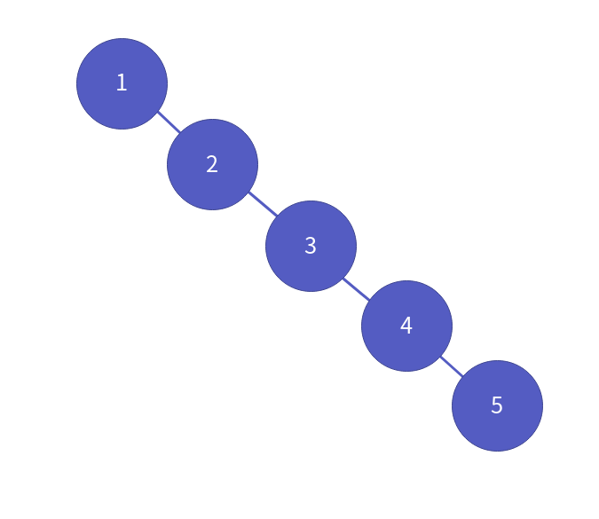

AVL 트리는 데이터 삽입/삭제 시, 자기가 알아서 트리의 균형을 맞춥니다. 아까 위의 데이터를 일련의 순서대로 넣을 때, 다음 그림과 같이 삽입이 일어납니다.

1 삽입 시,

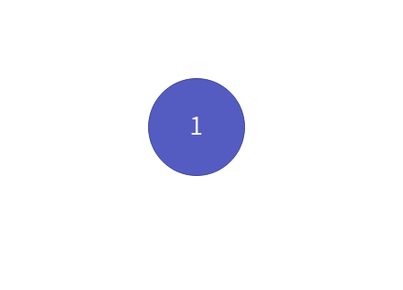

2 삽입 시,

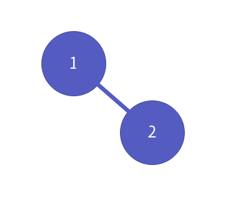

3 삽입 시,

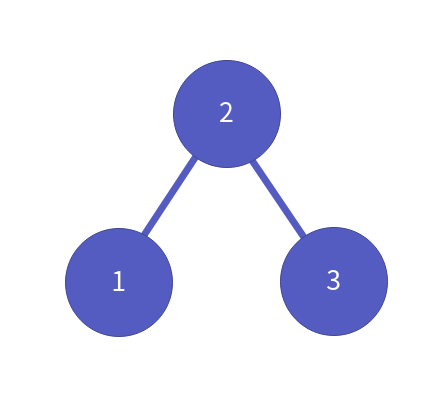

4 삽입 시,


5 삽입 시,

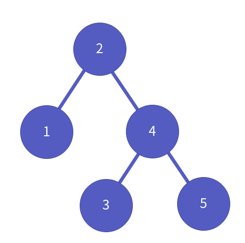

이게 어떻게 일어날 수 있을까요? 한 번 자세히 알아보도록 하겠습니다.


### 균형을 잡기 위한 회전

**기본적으로, AVL 트리는 BST, 이진 탐색 트리를 기본으로 합니다.** 다만, 다음 그림과 같이 트리의 균형이 깨질 때 4가지 회전을 통해서, 스스로 균형을 잡습니다.

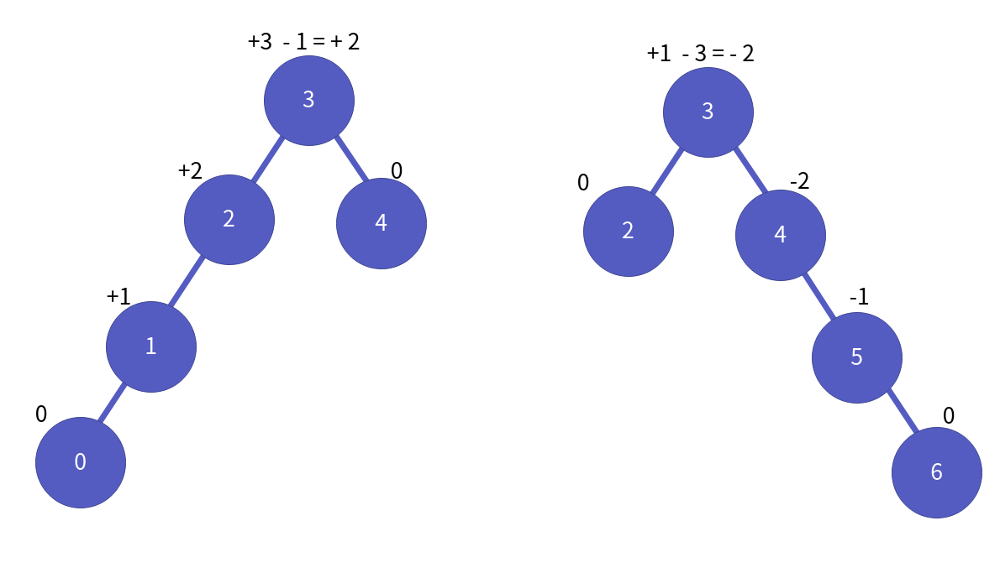

이 4가지 회전에 대해 알아보도록 하겠습니다.

**LL 회전**

먼저 다음 상태의 트리가 있다고 가정하지요. 이 상황에서, 루트 노드 기준으로, 왼쪽의 높이는 2, 오른쪽의 높이는 0입니다.

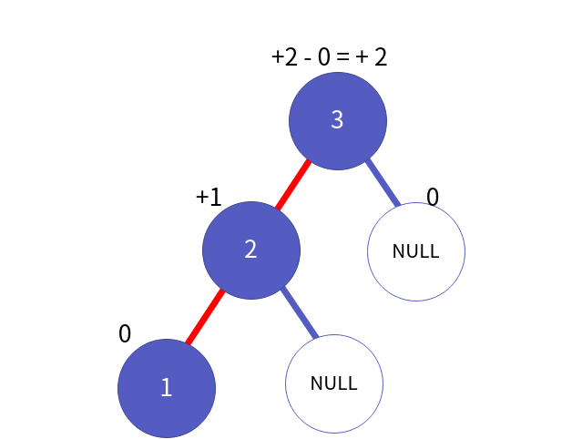

또한, 루느 노드의 왼쪽 자식 노드 기준으로는 왼쪽 높이는 1 오른쪽 높이는 0입니다.

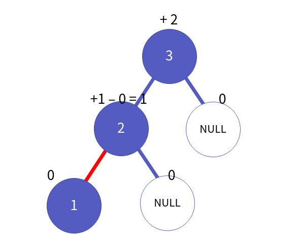

이런 상태 **루트 노드 기준으로 왼쪽 높이 - 오른쪽 높이 > 1, 왼쪽 자식 노드 기준에서 또, 왼쪽 높이 > 오른쪽 높이** "LL 상태"라고 합니다. 이 상황에서 LL 회전은 다음과 같이 일어납니다. 먼저 루트 노드를 p, 왼쪽 자식 노드를 c, 그 노드의 왼쪽 자식 노드를 g라고 합시다.

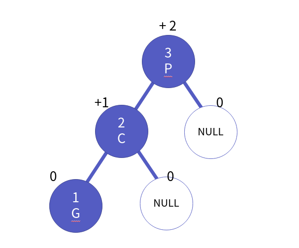

이 경우 LL 회전은 먼저 부모 노드 p의 왼쪽 자식 노드를, 자식 노드 c의 오른쪽 자식 노드로 바꿉니다.

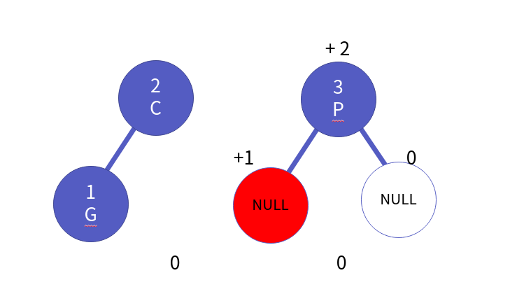

그 후, 자식 노드였던 c의 오른쪽 자식 노드를 부모 노드 p로 합니다.

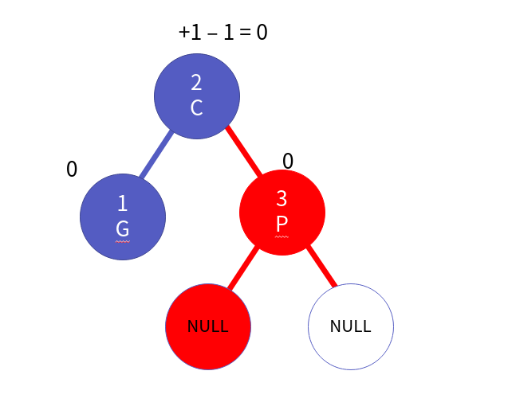

이것이 바로 LL 회전입니다.


**RR 회전**

RR회전은 RR 상태에서 일어납니다. 다음과 같이 **루느 노드 기준, 오른쪽 높이 - 왼쪽 높이 > 1, 오른쪽 자식 노드 기준에서 또, 오른쪽 높이 > 왼쪽 높이**인 상태를 RR 상태라고 합니다.

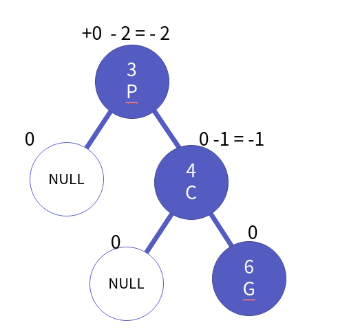

이 경우 RR 회전은 먼저 부모 노드 p의 오른쪽 자식 노드를, 자식 노드 c의 왼쪽 자식 노드로 바꿉니다.

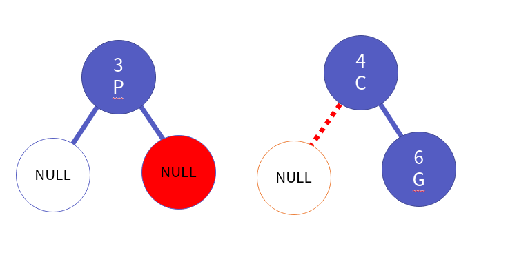

그 후, 자식 노드였던 c의 왼쪽 자식 노드를 부모 노드 p로 합니다.

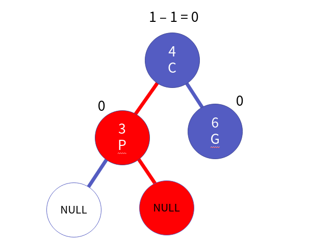

이것이 바로 RR 회전입니다.


**LR 회전**

LR회전은 LR 상태에서 일어납니다. 다음과 같이 **루트 노드 기준, 왼쪽 높이 - 오른쪽 높이 > 1, 왼쪽 자식 노드 기준에서 또, 오른쪽 높이 > 왼쪽 높이**인 상태를 LR 상태라고 합니다.

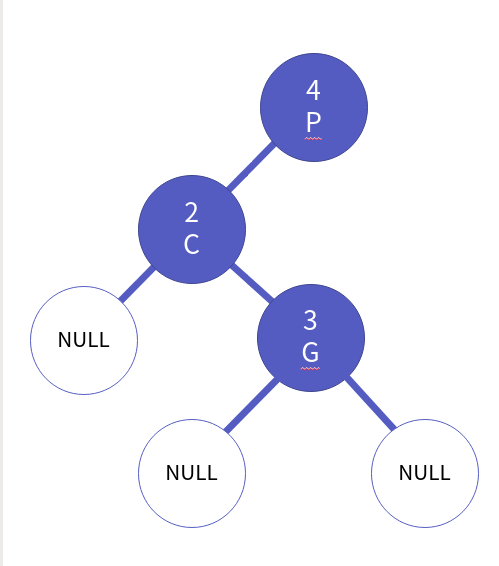

이 경우 LR 회전은 자식 노드 c에 대해서 RR회전을 진행합니다. 

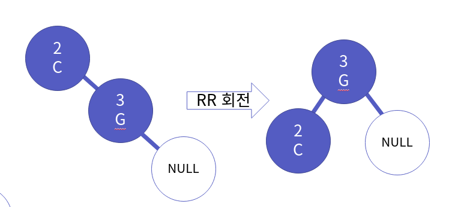

그러면 다음과 같아지겠죠?

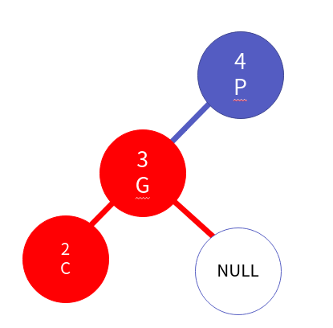

그 후, 부모 노드 p에 대해서 LL회전을 수행하면 됩니다.

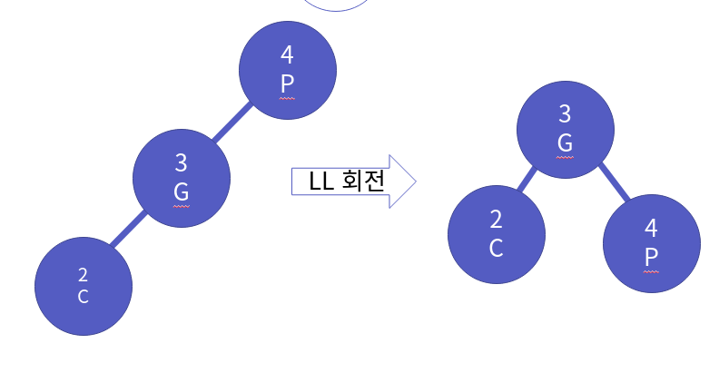

결국, LR 회전의 결과는 다음과 같습니다.

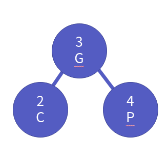


**RL 회전**

RL회전은 RL 상태에서 일어납니다. 다음과 같이 **루트 노드 기준, 오른쪽 높이 - 왼쪽 높이 > 1, 오른쪽 자식 노드 기준에서 또, 왼쪽 높이 > 오른쪽 높이**인 상태를 RL 상태라고 합니다.

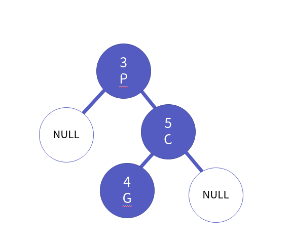

이 경우 RL 회전은 자식 노드 c에 대해서 LL회전을 진행합니다. 

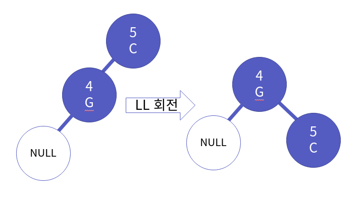

그러면 다음과 같아지겠죠?

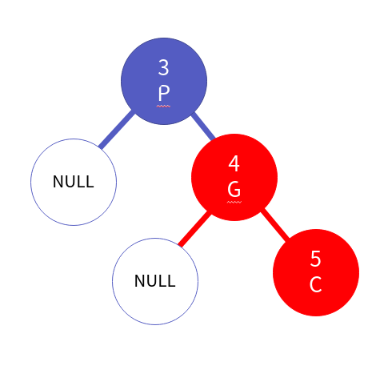

그 후, 부모 노드 p에 대해서 RR회전을 수행하면 됩니다.

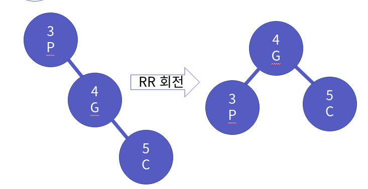

결국, RR 회전의 결과는 다음과 같습니다.

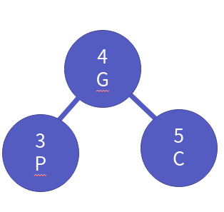

결국, AVL 트리는 이진 탐색 트리에서 삽입/삭제 연산에, 이런 균형을 잡는 회전을 전 노드에 대해서 재귀적으로 수행하는 과정을 추가하는 트리입니다.


## AVL 트리의 구현

이제 AVL 트리를 본격적으로 구현해봅시다. 기본적으로 AVL 트리는 BST의 확장이기 때문에, 먼저 지난 20장에서 썼던, `BinaryTree.h, BinaryTree.c, BinarySearchTree.h, BinarySearchTree.c`를 사용하도록 하겠습니다.


### AVL 트리 헤더

먼저, BST의 데이터, BST 구조체, BST 비교 함수 포인터의 타입을 다음과 같이 재지정하도록 하겠습니다.

src/ch21/AVLTree.h
```c
#include "BinarySearchTree.h"

typedef BSTData AVLData;
typedef BSTCompareFunction AVLComapreFunction;
typedef BinarySearchTree AVLTree;
```

AVL트리의 ADT는 BST와 같습니다. 따라서 함수 원형은 BST와 같습니다. 다만, C는 메소드 명이 겹치면 에러가 나기 때문에 앞에 "BST-"를 "AVLT-"로 바꾸도록 하겠습니다.

src/ch21/AVLTree.h
```c
void AVLTMakeAndInit(AVLTree * pTree, AVLComapreFunction compare);

void AVLTDestroy(AVLTree * pTree);

void AVLTInsert(AVLTree * pTree, AVLData data);

int AVLTRemove(AVLTree * pTree, AVLData target);

int AVLTSearch(AVLTree * pTree, AVLData target);

void AVLTShowAll(AVLTree * pTree, TraversalFuctionPtr action);
```


### AVL 트리 생성

먼저, AVL 트리의 생성은 BST의 생성과 같습니다. 코드는 다음과 같습니다.

src/ch21/AVLTree.c
```c
void AVLTMakeAndInit(AVLTree * pTree, AVLComapreFunction compare) {
    BSTMakeAndInit(pTree, compare);
}
```


### AVL 트리 파괴

AVL 트리의 파괴는 BST의 파괴와 같습니다. 코드는 다음과 같습니다.

src/ch21/AVLTree.c
```c
void AVLTDestroy(AVLTree * pTree) {
    BSTDestroy(pTree);
}
```


### AVL 트리 데이터 출력

AVL 트리의 데이터 출력은 BST의 데이터 출력과 같습니다. 코드는 다음과 같습니다.

src/ch21/AVLTree.c
```c
void AVLTShowAll(AVLTree * pTree, TraversalFuctionPtr action) {
    BSTShowAll(pTree, action);
}
```


### AVL 트리 데이터 검색

AVL 트리의 데이터 검색은 BST의 데이터 검색과 같습니다. 코드는 다음과 같습니다.

src/ch21/AVLTree.c
```c
int AVLTSearch(AVLTree * pTree, AVLData target) {
    return BSTSearch(pTree, target);
}
```


### AVL 트리 데이터 삽입

AVL 트리의 데이터 삽입은 기본적으로 BST의 데이터 삽입과 같습니다. 다만, 자기 균형을 맞추는 과정이 필요합니다. 이 균형을 맞추는 과정은 `rebalance` 함수가 진행합니다. 코드는 다음과 같습니다.

src/ch21/AVLTree.c
```c
void AVLTInsert(AVLTree * pTree, AVLData data){
    BSTInsert(pTree, data);
    pTree->root = rebalance(pTree->root);
}
```


### AVL 트리 데이터 삭제

AVL 트리의 데이터 삭제는 기본적으로 BST의 데이터 삭제와 같습니다. 다만, 실제 삭제가 일어났을 때, 자기 균형을 맞추는 과정이 필요합니다. 이 균형을 맞추는 과정은 `rebalance` 함수가 진행합니다. 코드는 다음과 같습니다.

src/ch21/AVLTree.c
```c
int AVLTRemove(AVLTree * pTree, AVLData target) {
    int result = BSTRemove(pTree, target);

    if (result) {
        pTree->root = rebalance(pTree->root);
    }

    return result;
}
```


### AVL 트리 균형 재조정

트리의 균형을 재조정하기 위해서는 꽤 많은 연산들이 필요합니다. 연산들은 다음과 같습니다.

1. 노드의 높이를 구하는 연산
2. 왼쪽 높이와 오른쪽 높이의 차이를 구하는 연산 (균형을 확인하는 연산)
3. LL 회전
4. RR 회전
5. LR 회전
6. RL 회전

하나 하나, 살펴보도록 하지요.


**노드의 높이를 구하는 연산**

먼저 트리의 높이를 구하는 연산이 필요합니다. 왜냐하면, **트리의 균형이 무너질 때가, 노드 기준으로, 왼쪽 높이와 오른쪽 높이의 차이가 2 이상일 때이기 때문입니다.** 노드를 기준으로 트리의 높이를 구하는 코드는 다음과 같습니다.

src/ch21/AVLTree.c
```c
int getHeight(BinaryTreeNode * pTree) {
    if (pTree == NULL) {
        return 0;
    }

    int left = getHeight(GetLeftSubTree(pTree));
    int right = getHeight(GetRightSubTree(pTree));    
    return ( (left > right) ? left : right ) + 1;
}
```


**왼쪽 높이와 오른쪽 높이의 차이를 구하는 연산**

이번엔 균형을 확인하는 연산입니다. 이전 `getHeight` 함수를 이용해서 왼쪽, 오른쪽 높이를 구한 후 왼쪽에서 오른쪽을 뺀 값을 반환하면 됩니다. 코드는 다음과 같습니다.

src/ch21/AVLTree.c
```c
int getHeightDifferent(BinaryTreeNode * pTree) {
    if (pTree == NULL) {
        return 0;
    }

    int left = getHeight(GetLeftSubTree(pTree));
    int right = getHeight(GetRightSubTree(pTree));    
    return left - right;
}
```


**LL 회전**

LL회전의 코드 흐름은 다음과 같습니다.

1. 부모 노드의 p의 왼쪽 서브 트리를 자식 노드 c의 오른쪽 서브 트리로 합니다.
2. 자식 노드였던 c의 오른쪽 서브 트리를 부모였던 p로 합니다.

코드는 다음과 같습니다.

src/ch21/AVLTree.c
```c
BinaryTreeNode * rotateLL (BinaryTreeNode * pTree) {
    BinaryTreeNode * parent = pTree;
    BinaryTreeNode * child = GetLeftSubTree(parent);
    ChangeLeftSubTree(parent, GetRightSubTree(child));
    ChangeRightSubTree(child, parent);
    return child;   
}
```


**RR 회전**

RR회전의 코드 흐름은 다음과 같습니다.

1. 부모 노드의 p의 오른쪽 서브 트리를 자식 노드 c의 왼쪽 서브 트리로 합니다.
2. 자식 노드였던 c의 왼쪽 서브 트리를 부모였던 p로 합니다.

코드는 다음과 같습니다.

src/ch21/AVLTree.c
```c
BinaryTreeNode * rotateRR (BinaryTreeNode * pTree) {
    BinaryTreeNode * parent = pTree;
    BinaryTreeNode * child = GetRightSubTree(parent);
    ChangeRightSubTree(parent, GetLeftSubTree(child));
    ChangeLeftSubTree(child, parent);
    return child;  
}
```


**LR 회전**

LR회전의 코드 흐름은 다음과 같습니다.

1. 부모 노드의 p의 왼쪽 서브 트리를 자식 노드 c에 대해서 RR 회전한 트리로 합니다.
2. 부모 노드에 대해서 LL 회전합니다.

코드는 다음과 같습니다.

src/ch21/AVLTree.c
```c
BinaryTreeNode * rotateLR (BinaryTreeNode * pTree) {
    BinaryTreeNode * parent = pTree;
    BinaryTreeNode * child = GetLeftSubTree(parent);
    ChangeLeftSubTree(parent, rotateRR(child)); //부분 RR회전
    return rotateLL(parent); //LL회전     
}
```


**RL 회전**

RL회전의 코드 흐름은 다음과 같습니다.

1. 부모 노드의 p의 오른쪽 서브 트리를 자식 노드 c에 대해서 LL 회전한 트리로 합니다.
2. 부모 노드에 대해서 RR 회전합니다.

코드는 다음과 같습니다.

src/ch21/AVLTree.c
```c
BinaryTreeNode * rotateRL (BinaryTreeNode * pTree) {
    BinaryTreeNode * parent = pTree;
    BinaryTreeNode * child = GetLeftSubTree(parent);
    ChangeRightSubTree(parent, rotateLL(child)); //부분 LL회전
    return rotateRR(parent); //RR 회전
}
```


**균형 재조정**

이제 균형을 재조정합시다. 균형 조정은 삽입/삭제 연산 이후 맨 아래 터미널 노드부터 루트 노드까지 역순으로 일어나야 합니다. 즉, **후위 순회** 방식을 이용해야 합니다. 코드 흐름은 다음과 같습니다.

1. 왼쪽 서브 트리에 대해서 균형을 조정합니다.
2. 오른쪽 서브 트리에 대해서 균형을 조정합니다.
3. 트리의 균형 (왼쪽 높이 - 오른쪽 높이)를 구합니다.
4. -1 과 1 사이라면, 그냥 root를 반환합니다.
5. 만약 1보다 크고, 왼쪽 서브 트리의 균형이 왼쪽으로 치우쳐져 있으면 LL 회전, 오른쪽으로 치우쳐져 있으면 LR 회전을 수행합니다.
6. 그 외의 경우 오른쪽 서브 트리의 균형이 오른쪽으로 치우쳐져 있으면 RR 회전, 왼쪽으로 치우쳐져 있으면, RL 회전을 수행합니다,
7. 균형이 조정된 root를 반환합니다.

src/ch21/AVLTree.c
```c
BinaryTreeNode * rebalance(BinaryTreeNode * root) {
    if (root == NULL) {
        return NULL;
    }

    root->left = rebalance(root->left);
    root->right = rebalance(root->right);
    int heightDiff = getHeightDifferent(root);

    if (-1 <= heightDiff && heightDiff <= 1) {
        return root;
    }

    if (heightDiff > 1) {
        root = ((getHeightDifferent(GetLeftSubTree(root)) > 0)) ? rotateLL(root) : rotateLR(root);
        return root;
    }

    root = (getHeightDifferent(GetRightSubTree(root)) < 0) ? rotateRR(root) : rotateRL(root);
    return root;
}
```

참고적으로 균형을 맞추기 위해 필요한 연산들 즉 함수들은 외부에 공개되지 않습니다. 트리 내부의 연산이기 때문이지요.


## 마치며...

지난 장에서는 이진 트리를, 검색에 조금 더 최적화된 자료구조 이진 탐색 트리를 만들었습니다. 이번 장에서는 이진 탐색 트리의 문제점이었던, 삽입/삭제 연산 시 균형이 깨지는 것을 해결하기 위해서 **자가 균형 트리의 일종인 AVL 트리**를 만들었습니다.

AVL 트리는 균형이 깨지는 4가지 상태 LL, LR, RR, RL 상태에 따른 회전 그리고 그들을 이용해서, 전 노드의 재귀적으로 트리의 균형을 맞추는 `rebalance` 함수도 구현해 보았습니다. 이 내용은 중요하니 그림과 함께 살펴보면서 이해를 해보도록 하세요!

개인적으로, 이진 탐색 트리부터 책 "열혈 자료구조"와 내용은 같지만 구현부를 달리 나갔었는데 생고생을 했네요. 아무튼 이렇게 해서 AVL 트리에 대한 내용을 마치도록 하겠습니다. 다음 장에서는 검색에 쓰이는 또 다른 자료구조 **해쉬 테이블**에 대해서 공부하도록 하겠습니다.

