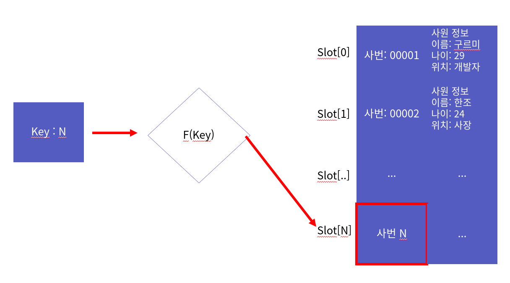
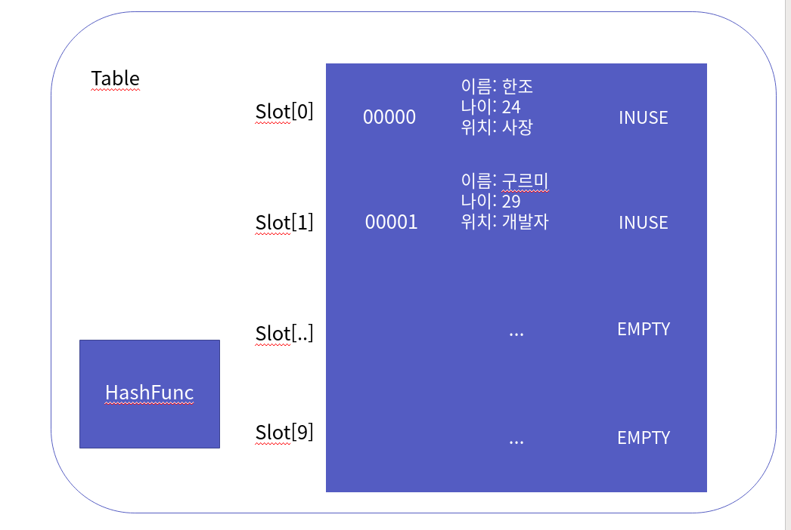
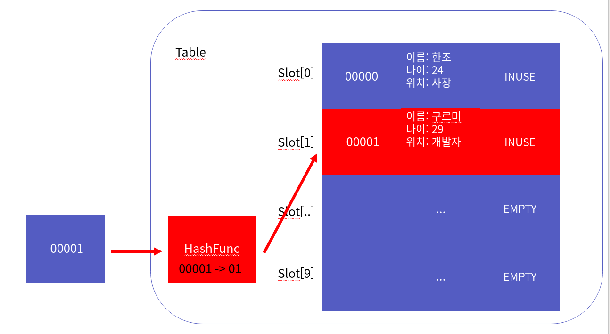
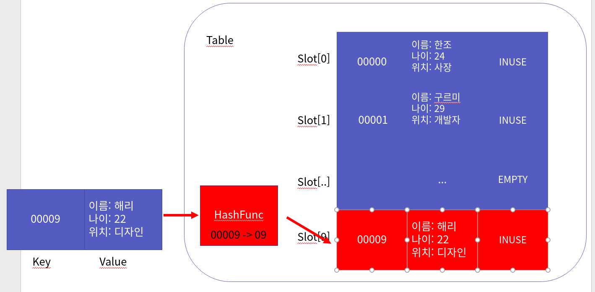
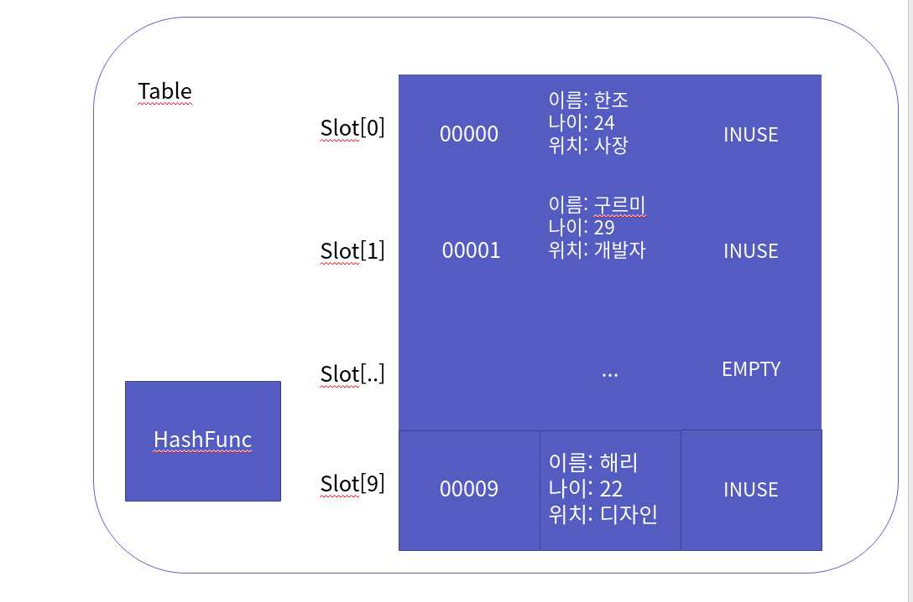

자료구조 해쉬 테이블과 구현
===============

Contents
-------------------

1. 시작하며...
2. 해쉬 테이블의 이해
    * 해쉬 테이블이란 무엇인가?
    * 해쉬란 무엇인가?
    * 해쉬 테이블 ADT
3. 간단한 해쉬 테이블의 구현
    * 해쉬 테이블 헤더
    * 해쉬 테이블 생성
    * 해쉬 테이블 파괴
    * 해쉬 테이블 데이터 검색
    * 해쉬 테이블 데이터 삽입
    * 해쉬 테이블 데이터 삭제
4. 간단한 해쉬 테이블의 문제점
    * 문제점
    * 해결 방안
5. 체인드 해쉬 테이블의 구현
    * 해쉬 테이블 헤더
    * 해쉬 테이블 생성
    * 해쉬 테이블 파괴
    * 해쉬 테이블 데이터 검색
    * 해쉬 테이블 데이터 삽입
    * 해쉬 테이블 데이터 삭제
6. 마치며...


## 시작하며...

구르미의 "Computer Science 정복하기 - 자료구조"의 스물 두 번째 장입니다. 이 장의 대략적인 내용은 다음과 같습니다. 

* 해쉬 테이블의 이해
* 간단한 해쉬 테이블 구현
* 간단한 해쉬 테이블의 문제점과 해결 방안
* 체인트 해쉬 테이블 구현

이 장의 소스코드는 다음을 참고해주세요.

    url: https://github.com/gurumee92/datastructure 
    branch: ch22
    code directory: src/ch22

자 시작합시다!


## 해쉬 테이블의 이해

우리는 "이진 트리", "이진 탐색 트리", "AVL 트리"를 공부하면서, 트리가 검색에 좋은 자료구조라는 것을 알게 되었습니다. 이번 장에서는 검색에 최적화된 또 다른 자료구조인 **해쉬 테이블**에 대해서 알아보겠습니다.


### 해쉬 테이블이란 무엇인가?

해쉬 테이블이란, 키와 값을 쌍으로 저장하는 자료 구조입니다. 예를 들어서, 회사가 있다고 가정해봅시다. 이 회사는 사원들을 관리하기 위해서 사원 번호와, 사원 정보를 쌍으로 저장하고 사원 검색 사이트가 있습니다.


만약, 사번 "00001"을 가진  "구르미"라는 사원의 정보를 검색한다고 합시다. 어떻게 검색할 수 있을까요? 그냥 사번을 검색란에 치면 됩니다.


사원이 늘어나서 수만, 수십만, 수백만이 존재하더라도 "00001"만으로 사원의 정보를 단 번에 찾아낼 수 있지요. 보통, **해쉬 테이블의 검색 연산의 시간 복잡도는 O(1)**이라고 말합니다. 키만 알고 있다면, 그 키와 쌍으로 저장된 값을 바로 얻어낼 수 있다는 것이지요.


### 해쉬란 무엇인가?

그렇다면, 해쉬란 무엇일까요? 일반적으로 키-쌍을 배열에 저장한다고 합시다. 


그렇다면, 키가 어디있는지 찾으려면, 배열 크기 N을 순회해야 하지요. 즉 시간 복잡도 O(N)입니다.


그러나 해쉬 테이블은 "해쉬"라는 특정 알고리즘을 갖는 함수를 통해서, 인덱스를 바로 찾아냅니다. 예를 들어, 다음 그림과 같이 말이죠.



만약 해쉬 함수가 사번 끝자릿수 2자리를 가지고 키에 대한 해쉬 값을 찾습니다. 즉, "00001"이면, "01"로 바로 접근이 되는 것이죠.


### 해쉬 테이블 ADT

제가 정의한 해쉬 테이블의 ADT는 다음과 같습니다.

    ADT: Table

    void TBLInit(Table * pT, HashFunc * hash)
    - 해쉬 테이블을 초기화합니다.
    - 이 때, 해싱 기능에 대한 정보를 넘겨주어야 합니다.

    void TBLInsert(Table *pT, Key k, Value v)
    - 테이블에 키-값 쌍의 데이터를 저장합니다.
    - 키에 대해 해싱 연산을 적용해 인덱스를 얻습니다.

    Value TBLDelete(Table * pT, Key k)
    - 테이블에 저장된 데이터 중, 키에 대한 데이터를 삭제합니다.
    - 키에 대해 해싱 연산을 적용해 인덱스를 얻습니다.

    int TBLSearch(Table * pT, Key k)
    - 테이블에 저장된 데이터 중, 키에 대한 데이터를 검색합니다.
    - 키에 대해 해싱 연산을 적용해 인덱스를 얻습니다.

    void TBLDestroy(Table * pT)
    - 해쉬 테이블을 파괴합니다.


## 간단한 해쉬 테이블의 구현

바로 해쉬 테이블을 구현해보도록 하겠습니다.


### 해쉬 테이블 헤더

우리가 구현할 "간단한 해쉬 테이블"은 **슬롯**이란 자료구조의 배열입니다. 슬롯이란, key, value 값을 저장합니다. 또한, 슬롯은 상태를 나타내는 status가 있습니다. 처음엔, EMPTY, 데이터가 채워지면 INUSE, 삭제된 경우 DELETED의 슬롯 상태를 표현하지요.


코드로 표현하면 다음과 같습니다.

src/ch22/SimpleHashTable/Slot.h
```c
typedef void * Key;   //슬롯에 저장될 키를 표현합니다.
typedef void * Value; //슬롯에 저장될 값을 표현합니다.

enum SlotStatus {EMPTY, DELETED, INUSE}; // 슬롯의 상태를 표현합니다.

typedef struct _slot {
    Key key;
    Value value;
    enum SlotStatus status;
}Slot;
```

우리는 이 자료구조를 저장하는 10개의 배열을 만들고 이를 테이블이라고 하겠습니다. 테이블은 또한, 입력값 키에 대해서 해슁할 수 있는 함수 포인터를 지니고 있습니다.


코드로 표현하면 다음과 같습니다.

src/ch22/SimpleHashTable/Table.h
```c
#include "Slot.h"

#define TABLE_LENGTH 10 //테이블 길이입니다.
 
typedef int HashFunc(Key key); //해슁 함수의 포인터입니다.

typedef struct _table{
    Slot table[TABLE_LENGTH];   //총 슬롯 10개를 저장합니다.
    HashFunc * hash;            //이 함수를 통해서 키를 해슁합니다.
} Table;
```

또한, ADT를 토대로 만든 함수 원형은 다음과 같습니다.

src/ch22/SimpleHashTable/Table.h
```c
void TBLInit(Table * pT, HashFunc * hash);
void TBLInsert(Table *pT, Key k, Value v);
Value TBLDelete(Table * pT, Key k);
int TBLSearch(Table * pT, Key k); 
void TBLDestroy(Table * pT);
```

자 본격적으로 구현해봅시다.

### 해쉬 테이블 생성

먼저 해쉬 테이블의 생성입니다. 먼저 10개의 슬롯을 모두 비어있다는 표시로 EMPTY로 만들어둡니다.


앞으로 슬롯에 데이터가 들어왔다면 INUSE, 삭제되없다면, DELETED가 될 것입니다. 코드는 다음과 같습니다.

src/ch22/SimpleHashTable/Table.c
```c
void TBLInit(Table * pT, HashFunc * hash) {
    for (int i=0; i<TABLE_LENGTH; i++) {
        (pT->table[i]).status = EMPTY;
    }

    pT->hash = hash;
}
```

### 해쉬 테이블 파괴

역시 모든 슬롯을 EMPTY로 만들어둡니다. 즉, INUSE, DELETED는 데이터가 들어왔음을 의미하는 것입니다. 각 슬롯들은 테이블의 메모리를 해제한다는 뜻으로 EMPTY가 되는 것입니다. 코드는 다음과 같습니다.

src/ch22/SimpleHashTable/Table.c
```c
void TBLDestroy(Table * pT) {
    for (int i=0; i<TABLE_LENGTH; i++) {
        (pT->table[i]).status = EMPTY;
    }

    pT->hash = NULL;
}
```

### 해쉬 테이블 데이터 검색

자 데이터를 검색 해봅시다. 코드 흐름은 다음과 같습니다.

1. 키를 해싱합니다.
2. 해싱한 인덱스에 속한 슬롯을 살펴봅니다.
3. 슬롯이 INUSE 라면 1을, 아니라면 0을 반환한다.

그러니까 "00001"을 해슁하면, "01", 테이블에서 01 인덱스의 데이터가 있는지 확인하는 것이죠.



src/ch22/SimpleHashTable/Table.c
```c
int TBLSearch(Table * pT, Key k) {
    int hash = pT->hash(k);
    Slot * slot = &(pT->table[hash]);
    return (slot->status == INUSE);
}
```

### 해쉬 테이블 데이터 삽입

데이터 삽입의 코드 흐름은 다음과 같습니다.

1. 키를 해싱한다.
2. 해싱한 인덱스에 속한 슬롯을 살펴본다.
3. 슬롯이 INUSE 즉, 데이터가 존재한다면, 삽입은 일어나지 않는다.
4. 아니라면, 슬롯에 입력값 k, v를 넣고 상태를 INSUE로 바꾼다.

현재 키인 k에 대해서 해슁된 인덱스에 슬롯의 상태가 INUSE의 경우, 즉, 데이터가 이미 저장된 경우를 **해슁 충돌**한 경우입니다. 



이 경우 따로 처리를 해야하지만, 일단은 삽입을 막는 것으로 하겠습니다. 코드는 다음과 같습니다.

src/ch22/SimpleHashTable/Table.c
```c
void TBLInsert(Table *pT, Key k, Value v) {
    if (TBLSearch(pT, k)) {
        return;
    }

    int hash = pT->hash(k);
    Slot * slot = &(pT->table[hash]);
    slot->key = k;
    slot->value = v;
    slot->status = INUSE;
}
```

### 해쉬 테이블 데이터 삭제

데이터 삭제의 코드흐름은 다음과 같습니다.

1. 테이블에 데이터가 없다면, NULL을 반환한다.
2. 키를 해싱한다.
3. 해싱한 인덱스의 슬롯 상태를 DELETED로 바꾼다.
4. 해당 슬롯의 값을 반환한다.


위의 그림에서 보듯이 간단한 해쉬 테이블의 경우 실제 데이터 삭제가 일어나는게 아니라, 삭제했다고 표시하는 것입니다. 코드는 다음과 같습니다.

src/ch22/SimpleHashTable/Table.c
```c
Value TBLDelete(Table * pT, Key k) {
    if (!TBLSearch(pT, k)) {
        return NULL;
    }

    int hash = pT->hash(k);
    Slot * slot = &(pT->table[hash]);

    if (slot->status != INUSE) {
        return NULL;
    }

    slot->status = DELETED;
    return slot->value;
}
```


## 간단한 해쉬 테이블의 문제점

현재 해쉬 테이블은 문제가 있습니다. 이것의 문제점과 해결 방안에 대해 알아보겠습니다.


### 문제점

현재 테이블은 해쉬에서 충돌난 경우, 삽입을 허용하지 않습니다. 물론 같은 키라면, 중복 방지를 위해, 데이터를 삽입하지 않는게, 합리적인 방법일 수 있습니다.

그러나 다른 키의 경우, 저장을 해주어야 합니다. 예를 들어봅시다. 

사번 "00001"을 가지고 있는 사원 정보를 이미 테이블에서 저장을 하고 있습니다. 그러나 사번 "10001"의 경우 어떻게 해야 할까요?


그림에서 보시다시피 위의 그림에서 각 사번의 해슁된 값은 01로 일치합니다. 이 경우 다른 곳에다 저장을 해주어야 합니다. 하지만, 우리가 구현한 간단한 해쉬 테이블은 이것을 하지 않습니다.


### 해결 방안

어떻게 해결할 수 있을까요? 대표적으로 3가지 방식이 있습니다.

* 선형 조사법
* 이중 해쉬
* 체이닝 해쉬

**선형 조사법**은 해쉬 충돌이 일어났을 때, 조금 떨어진 곳에 데이터를 넣는 것입니다. 해슁 함수가 다음과 같다고 가정해봅시다.

> hash = f(k)

그럼 충돌이 났을 때, 해슁 값을 찾는 경우를

> hash` = f(K) + coliision

즉 1번 충돌났으면 원래 해쉬값의 1을, 거기에도 들어있으면 2를 이런식으로 선형적으로 충돌난 횟수만큼 해슁 값을 선형적으로 증가시키는 방법입니다. 근본적인 해결책은 될 수 없지요.

**이중 해쉬**는 해슁한 값이 충돌이 나면, 다른 방식의 해슁 함수를 적용하는 방법입니다. 먼저 1차 해슁 함수는 다음과 같습니다.

> h1(k) = k % 15

그런데 이 해슁 함수에서 충돌이 났다고 판명이 되면, 다음 해슁 함수를 제공하는 방식입니다.

> h2(k) = 1 + (k % c) = 1 + (k % 7)

이 때, 2차 해슁 함수의 c는 **15보다 작으며, 소수여야 한다**라는 조건을 가지고 있습니다. 

이번에는 **체이닝 해쉬** 방벙을 알아보겠습니다. 체이닝 해쉬는 간단합니다. **해쉬 테이블을 슬롯의 배열이 아닌, 이중 연결리스트의 배열로 만드는 것**입니다. 해슁된 인덱스에 계속 데이터를 넣는겁니다. 



만약 해슁된 인덱스에 충돌이 난 경우, 그냥 해슁된 인덱스에 충돌된 데이터를 모두 저장하는 방식이지요. 이에 대한 자세한 설명은, 체인드 해쉬 테이블의 구현으로 넘기겠습니다.


## 체인드 해쉬 테이블의 구현

자 이제 조금 더 업그레이드 된 체인드 해쉬 테이블을 구현해봅시다.


### 해쉬 테이블 헤더

체인드 해쉬 테이블의 경우 이제, 슬롯의 상태를 저장할 필요가 없습니다. 왜냐하면, 연결 리스트가 이 데이터들을 가지고 있기 때문이지요. 그래서 다음의 형태로 변합니다.



코드는 다음과 같습니다.

src/ch22/ChainedHashTable/Slot.h
```c
typedef void * Key;
typedef void * Value;

typedef struct _slot {
    Key key;
    Value value;
}Slot;
```

테이블의 구조도 변합니다. 


검색 시 해슁된 인덱스에 존재하는 연결 리스트, "체인"을 순회하게 됩니다. 이 때 체인에서 "키를 비교하는 함수"를 테이블이 알고 있어야 하기 때문입니다. 코드는 다음과 같습니다.

src/ch22/ChainedHashTable/Table.h
```c
#include "Slot.h"
#include "DoubleLinkedList.h"

#define TABLE_LENGTH 100

typedef int HashFunc(Key key);
typedef int KeyCompareFunc(Key k1, Key k2);

typedef struct _table{
    List table[TABLE_LENGTH];
    HashFunc * hash;
    KeyCompareFunc * compare;
} Table;
```

ADT는 그대로입니다. 다만, TBLInit 원형에 키 비교 함수 포인터를 추가해주세요.

src/ch22/ChainedHashTable/Table.h
```c
void TBLInit(Table * pT, HashFunc * hash, KeyCompareFunc * compare);
// 나머진 그대로.
```

### 해쉬 테이블 생성

체인드 해쉬 테이블은 연결 리스트의 배열입니다. 즉, 배열 크기만큼 연결 리스트를 초기화 시키면 됩니다. 코드는 다음과 같습니다.

src/ch22/ChainedHashTable/Table.c
```c
void TBLInit(Table * pT, HashFunc * hash, KeyCompareFunc * compare) {
    for (int i=0; i<TABLE_LENGTH; i++) {
        LInit( &(pT->table[i]) );
    }

    pT->hash = hash;
    pT->compare = compare;
}
```


### 해쉬 테이블 파괴

체인드 해쉬 테이블의 파괴는 생성과 반대로 생성된 연결리스트들을 파괴시키면 됩니다. 코드는 다음과 같습니다.

src/ch22/ChainedHashTable/Table.c
```c
void TBLDestroy(Table * pT) {
    for (int i=0; i<TABLE_LENGTH; i++) {
        LDestroy( &(pT->table[i]) );
    }

    pT->hash = NULL;
    pT->compare = NULL;
}
```

### 해쉬 테이블 데이터 검색

데이터 검색의 코드 흐름은 다음과 같습니다.

1. 키를 해슁합니다.
2. 해쉬 테이블에서 해슁한 값의 인덱스에 저장된 연결 리스트를 가져옵니다.
3. 이 연결 리스트를 순회하면서, 슬롯들을 확인합니다.
4. 슬롯이 저장한 키와 입력값 키랑 비교해서 같으면 1을 반환합니다.
5. 같은 키를 가진 슬롯을 찾지 못했다면 0을 반환합니다.

코드는 다음과 같습니다.

src/ch22/ChainedHashTable/Table.c
```c
int TBLSearch(Table * pT, Key k) {
    int hash = pT->hash(k);
    List * chain = &(pT->table[hash]);
    int size = LSize(chain);

    for (int i=0; i<size; i++) {
        
        Slot * data = (Slot *) LGet(chain, i);
        
        if (pT->compare(k, data->key) == 0) {
            return 1;
        }
    }
    
    return 0;
}
```

### 해쉬 테이블 데이터 삽입

데이터 삽입의 코드 흐름은 다음과 같습니다.

1. 같은 키를 가진 데이터의 중복은 허용하지 않습니다.
2. k, v를 바탕으로 새로운 슬롯을 만듭니다.
3. k를 해슁합니다.
4. 해쉬 테이블에서 해슁한 값의 인덱스에 저장된 연결 리스트를 가져옵니다.
5. 이 연결 리스트의 꼬리에 슬롯을 삽입합니다.

src/ch22/ChainedHashTable/Table.c
```c
void TBLInsert(Table *pT, Key k, Value v) {
    if (TBLSearch(pT, k)) {
        return;
    }

    Slot * new = (Slot *) malloc( sizeof(Slot) );
    new->key = k;
    new->value = v;

    int hash = pT->hash(k);
    List * chain = &(pT->table[hash]);
    LInsertTail(chain, new);  
}
```

### 해쉬 테이블 데이터 삭제

데이터 삽입의 코드 흐름은 다음과 같습니다.

1. 해당 키에 대해서, 데이터가 존재하지 않으면 NULL을 반환합니다.
2. k를 해슁합니다.
3. 해쉬 테이블에서 해슁한 값의 인덱스에 저장된 연결 리스트를 가져옵니다.
4. 이 연결 리스트를 순회하면서 같은 키를 가진 슬롯을 찾아냅니다.
5. 슬롯의 Value 값을 받아옵니다.
6. 슬롯을 삭제합니다.

코드는 다음과 같습니다.

src/ch22/ChainedHashTable/Table.c
```c
Value TBLDelete(Table * pT, Key k) {
    if (!TBLSearch(pT, k)) {
        return NULL;
    }

    Value ret = NULL;
    int hash = pT->hash(k);
    List * chain = &(pT->table[hash]);
    int size = LSize(chain);
    
    for (int i=0; i<size; i++) {
        Slot * data = (Slot *) LGet(chain, i);
        
        if (pT->compare(k, data->key) == 0) {
            Slot * remove = (Slot *) LRemoveIndex(chain, i);
            ret = remove->value;
            free(remove);
            break;
        }
    }

    return ret;
}
```


## 마치며...

해쉬 테이블은 키가 충돌이 늘어날수록, 시간 복잡도가 늘어나는 구조입니다. 반대로 말하면, 키의 범위가 넓으면, 넓을 수록 검색 속도가 빨라집니다. 

현재 우리가 구현한 해쉬 테이블의 해슁 함수는 굉장히 간단한 형태로 구현됩니다. 그러나 실제로는 복잡한 방식으로 해슁 함수를 구현하여, 충돌이 덜 나게끔 만들어 줍니다. 대표적인 방법으론 다음의 2가지 방식이 있습니다.

* 비트 추출 방법
* 자릿수 폴딩

보통은 위의 방식을 통해 **테이블의 해쉬 함수가 구현이 잘 되어있고, 키의 범위가 넓다고 가정합니다.** 즉, 앞에서 말했던 것처럼 데이터 검색에 대해서 O(1)이라고 생각하시면 됩니다.

다음 장에서는 비선형 자료구조의 끝판왕! "그래프"에 대해서 공부하도록 하겠습니다.
