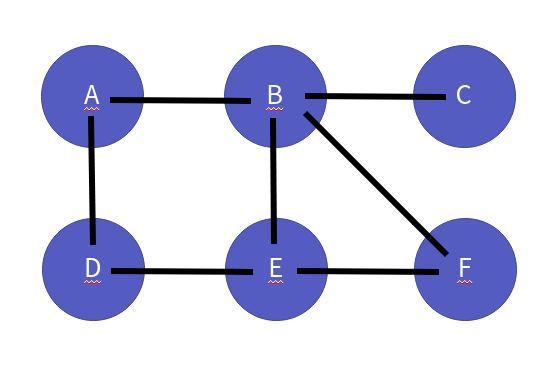
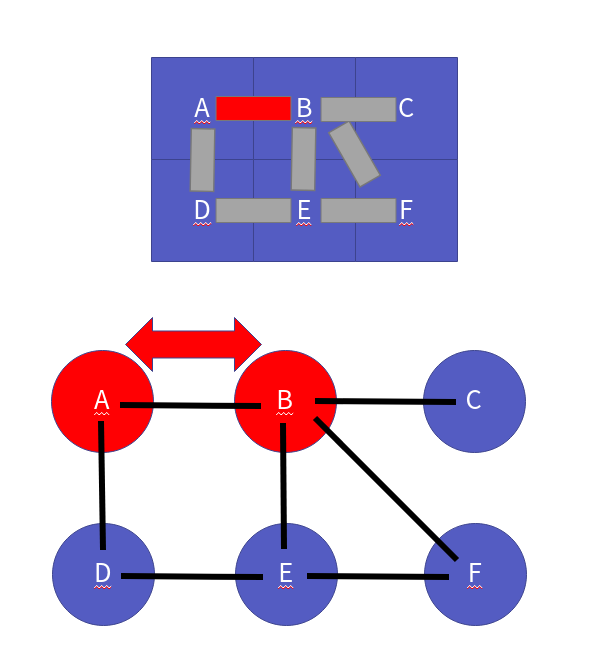

자료구조 그래프와 구현
===============

Contents
-------------------

1. 시작하며...
2. 그래프의 이해
    * 그래프란 무엇인가?
    * 방향 그래프 vs 무방향 그래프
    * 인접 리스트 기반 그래프 vs 인접 행렬 기반 그래프 
    * 그래프 ADT
3. 인접 리스트 기반 그래프의 구현
    * 그래프 헤더
    * 그래프 생성
    * 그래프 파괴
    * 그래프 간선 확인
    * 그래프 간선 추가
    * 그래프 간선 삭제
4. 인접 행렬 기반 그래프의 구현
    * 그래프 헤더
    * 그래프 생성
    * 그래프 파괴
    * 그래프 간선 확인
    * 그래프 간선 추가
    * 그래프 간선 삭제
5. 마치며...


## 시작하며...

구르미의 "Computer Science 정복하기 - 자료구조"의 스물 세 번째 장입니다. 이 장의 대략적인 내용은 다음과 같습니다. 

* 그래프의 이해
* 인접 리스트 기반 그래프의 구현
* 인접 행렬 기반 그래프의 구현

이 장의 소스코드는 다음을 참고해주세요.

    url: https://github.com/gurumee92/datastructure 
    branch: ch23
    code directory: src/ch23

자 시작합시다!


## 그래프의 이해

먼저 자료구조 그래프에 대해서 알아보겠습니다.

### 그래프란 무엇인가?

그래프란, 수학자 오일러가 만든 "그래프 이론"의 개념을 기초로 만든 자료구조입니다. 쾨니히스베르크의 다리 문제에 대해서 알고 있나요?


위의 그림에서, "**모든 다리를 한 번씩만 건너서 처음 출발했던 장소로 돌아올 수 있는가**"의 대한 답을 구하는 것이 쾨니히스베르크의 다리 문제입니다. 위의 그림을 그래프로 표현하면 다음과 같습니다.



여기서, 다리, 검은 색 실선은 간선(Edge)라고 부르며, 다리가 지나는 땅, 파란색 동그라미들을 정점(Vertex)라고 말합니다.


### 방향 그래프 vs 무방향 그래프

그래프의 종류는 다음의 2가지가 있습니다.

1. 방향 그래프
2. 무방향 그래프

방향 그래프는 간선의 방향이 존재하는것으로 예를 들면, SNS의 팔로우와 비슷합니다. 예를 들어 5명의 유저가 있습니다. 그리고 그들의 팔로우 관계를 다음과 같습니다.  


A는 B, C를 팔로우하고 있습니다. 그러나 B는 오로지 D를, C는 E를 팔로우하고 있죠. 그래서 A는 B를 통해서 D를 아니면, C를 통해서 E를 건너 건너 볼 수 있습니다. 


그러나, D,E는 팔로우를 한 친구가 없기 때문에, 아무도 볼 수가 없습니다.


반면 무방향 그래프는 쾨니히스베르크의 다리 문제와 같습니다. 


다리가 연결되어있으면, A->B로, B->A로 이동이 가능합니다.



정리하자면, 방향 그래프는 간선이 추가되면, 한쪽 정점에서 연결된 정점으로 이동은 가능하나, 연결된 정점에서 연결한 정점으로 이동은 불가능합니다. 이동하려면, 반대로 간선을 추가해야 하지요.

그러나, 무방햘 그래프는 간선이 추가되면, 연결된 양 정점에서 반대쪽으로 이동이 가능합니다. 

바꿔 말하면, 방향 그래프에서 간선을 이을때마다, 반대편도 간선을 이어주는게 무방향 그래프지요. **우리는 여기서 무방향 그래프만 다루도록 하겠습니다.**


### 인접 리스트 기반 그래프 vs 인접 행렬 기반 그래프 

그래프는 구현 방식에도 다음의 2가지 방식으로 나뉩니다.

1. 인접 리스트 기반 그래프
2. 인접 행렬 기반 그래프

먼저 다음 그래프가 있다고 가정해봅시다.


인접 리스트 기반 그래프는, 이를 위해 **연결 리스트 배열**을 만든 후, 다음과 같이 표현합니다.


인접 행렬 기반 그래프는 이를 위해 **이차원 배열**을 만든 후 연결된 곳은 1, 아닌 곳은 -1 같은 형식으로 표현하지요.


즉 그래프를 가지고 위의 2가지 방식으로 프로그래밍적으로 표현이 가능한 것이죠. 이는 구현 파트에서 자세히 알아봅니다.


### 그래프 ADT

제가 정의한 그래프의 ADT는 다음과 같습니다.

    ADT: Graph

    void GInit(Graph * pGraph, int numberOfVertex)
    - 정점의 numberOfVertex에 따라 그래프를 초기화합니다.

    void GDestroy(Graph * pGraph)
    - 그래프를 삭제합니다.

    void GAddEdge(Graph * pGraph, Vertex * from, Vertex * to)
    - 정점 from과 정점 to를 연결합니다.
    - 즉, 간선을 추가합니다.

    int GDeleteEdge(Graph * pGraph, Vertex * from, Vertex * to)
    - 정점 from과 정점 to를 연결을 해제합니다.
    - 즉, 간선을 삭제합니다.
    - 삭제가 성공적으로 이루어졌으면 1, 아니라면 0을 반환합니다.

    int GIsConnected(Graph * pGraph, int from, int to)
    - 정점 from과 정점 to가 연결되어있는지 확인합니다.
    - 즉, 정점 사이의 간선이 있는지 확인합니다.
    - 간선이 존재하면 1, 아니라면 0을 반환합니다.


## 인접 리스트 기반 그래프의 구현

먼저 인접 리스트 기반의 그래프를 구현하겠습니다. 인접 리스트 기반의 그래프는 앞서 설명에서 본 것처럼, 각 정점을 표현하는 연결 리스트에 연결된 정점들을 넣음으로써 연결을 표현합니다. 즉 **정점 개수만큼, 연결 리스트 배열이 필요합니다.** 이를 위해 6장에서 구현 했던 이중 연결 리스트를 사용하도록 하겠습니다.


### 그래프 헤더

그래프를 표현하는 구조체는 정점의 개수를 표현하는 `numberOfVertex`, 현재 그래프에서 연결된 간선의 개수를 표현하는 `numberOfEdge`, 그리고 각 정점간 연결 정보를 표현하는 리스트 배열인 `adjList`로 이루어져 있습니다. 이를 코드로 표현하면 다음과 같습니다.

src/ch23/AdjacentListGraph/ALGraph.h
```c
#include "DoubleLinkedList.h"

typedef struct _adjacent_list_graph {
    int numberOfVertex;
    int numberOfEdge;
    List * adjList;
} ALGraph;

typedef ALGraph Graph;
```

그리고 다음은 Graph ADT에 따른 함수 원형들입니다.

src/ch23/AdjacentListGraph/ALGraph.h
```c
void GInit(Graph * pGraph, int numberOfVertex);
void GDestroy(Graph * pGraph);
void GAddEdge(Graph * pGraph, int from, int to);
int GDeleteEdge(Graph * pGraph, int from, int to);
int GIsConnected(Graph * pGraph, int from, int to);
```


### 그래프 생성

그래프의 생성은, 정점의 개수의 정보를 토대로 만들어집니다. 정점 개수만큼 리스트 배열을 만들고, 그들을 초기화하면 됩니다.

src/ch23/AdjacentListGraph/ALGraph.c
```c
void GInit(Graph * pGraph, int numberOfVertex) {
    pGraph->numberOfEdge = 0;
    pGraph->numberOfVertex = numberOfVertex;
    pGraph->adjList = (List *) malloc( sizeof(List) * numberOfVertex );

    for (int i=0; i<numberOfVertex; i++) {
        LInit( &(pGraph->adjList[i]) );
    }
}
```


### 그래프 파괴

그래프의 파괴는, 동적 메모리 할당을 통해 만들었던 리스트 배열의 메모리를 모두 해제하면 됩니다.

src/ch23/AdjacentListGraph/ALGraph.c
```c
void GDestroy(Graph * pGraph) {
    if (pGraph->adjList == NULL) {
        return;
    }

    int numberOfVertex = pGraph->numberOfVertex;

    for (int i=0; i<numberOfVertex; i++) {
        LDestroy( &(pGraph->adjList[i]) );
    }

    free(pGraph->adjList);
}
```


### 그래프 간선 확인

그래프 간선을 확인합니다. 코드 흐름은 다음과 같습니다.

1. 정점 from 연결된 정점들의 정보를 담고 있는 리스트를 가져옵니다.
2. 그 리스트를 처음부터, 리스트 크기만큼 순회합니다.
3. 만약, 순회하는 동안 to의 데이터가 있다면 1을 아니라면 0을 반환합니다.

여기서 무방향 그래프는, 간선이 만들어질 때, from -> to, to -> from 양쪽의 간선이 이어집니다. 따라서, from -> to 가 있다면, to -> from도 있다고 충분히 추론할 수 있습니다. 따라서, 이들의 검사는 제거했습니다. 코드는 다음과 같습니다.

src/ch23/AdjacentListGraph/ALGraph.c
```c
int GIsConnected(Graph * pGraph, int from, int to) {
    List * connectedVertexList = &(pGraph->adjList[from]);
    int size = LSize(connectedVertexList);

    for (int i=0; i<size; i++) {
        int vertex = *((int *) LGet(connectedVertexList, i));
        
        if (vertex == to) {
            return 1;
        }
    }

    return 0;
}
```


### 그래프 간선 추가

그래프의 간선을 추가합니다. 무방향 그래프이니 from쪽에도, to쪽에도 그 정점 정보를 넣어주면 됩니다. 코드 흐름은 다음과 같습니다.

1. 정점 from에 연결된 정점들의 정보를 담고 있는 리스트 끝에 to에 대한 정보를 추가합니다.
2. 정점 to에 연결된 정점들의 정보를 담고 있는 리스트 끝에 from에 대한 정보를 추가합니다.
3. 간선의 개수를 늘립니다.

만약 이미 연결된 정점이라면, 간선 추가는 이루어지지 않습니다. 코드는 다음과 같습니다. 코드는 다음과 같습니다.

src/ch23/AdjacentListGraph/ALGraph.c
```c
void GAddEdge(Graph * pGraph, int from, int to) {
    if (GIsConnected(pGraph, from, to)) {
        return;
    }

    // 연결 리스트는 제네릭으로 만들어져 있기 때문에, 다음 코드가 필요하다.
    int * pFrom = (int *) malloc( sizeof(int) );
    int * pTo = (int *) malloc( sizeof(int) );
    *pFrom = from;
    *pTo = to;

    LInsertTail(&(pGraph->adjList[from]), pTo); 
    LInsertTail(&(pGraph->adjList[to]), pFrom);

    pGraph->numberOfEdge += 1; 
}
```


### 그래프 간선 삭제

그래프의 간선을 삭제합니다. 역시 무방향 그래프이기 때문에 from쪽에도, to쪽에도 그 정점 정보를 제거해주어야 합니다. 코드 흐름은 다음과 같습니다.

1. 정점 from에 연결된 정점들의 정보를 담고 있는 리스트를 순회합니다.
2. to 데이터를 가지고 있는 노드가 나오면 그 노드를 삭제합니다.
3. 정점 to에 연결된 정점들의 정보를 담고 있는 리스트를 순회합니다.
4. from 데이터를 가지고 있는 노드가 나오면 그 노드를 삭제합니다.
5. 간선의 개수를 하나 줄입니다.
6. 삭제가 성공적으로 이루어졌다면 1을 반환합니다.

만약 연결되어있지 않은 정점들이라면, 삭제 실패했다는 뜻으로 0을 반환합니다. 코드는 다음과 같습니다.

src/ch23/AdjacentListGraph/ALGraph.c
```c
int GDeleteEdge(Graph * pGraph, int from, int to) { 
    List * connectedVertexList = &(pGraph->adjList[from]);
    int size = LSize(connectedVertexList);
    
    if (!GIsConnected(pGraph, from ,to)) {
        return 0;
    }

    for (int i=0; i<size; i++) {
        int vertex =  *((int *) LGet(connectedVertexList, i));
        
        if (vertex == to) {
            LRemoveIndex(connectedVertexList, i);
            break;
        }
    }

    connectedVertexList = &(pGraph->adjList[to]);
    size = LSize(connectedVertexList);

    for (int i=0; i<size; i++) {
        int vertex =  *((int *) LGet(connectedVertexList, i));
        
        if (vertex == from) {
            LRemoveIndex(connectedVertexList, i);
            break;
        }
    }

    pGraph->numberOfEdge -= 1;
    return 1;
}
```


## 인접 행렬 기반 그래프의 구현

이제 인접 행렬 기반의 그래프를 구현하겠습니다. 개념에서 살펴 봤듯이 인접 행렬은 2차원 배열로 표현할 수 있습니다. 행렬의 경우, 그 공간의 크기가 1일 때, 연결되었다고 생각하면 됩니다. 예를 들어 정점 A인 2와, 정점 B인 3이 있고 이 둘이 연결되었다고 가정하겠습니다. 이 경우 행렬의 값은 다음과 같습니다.

> arr[2][3] = 1, arr[3][2] = 1

연결되어있지 않다면, -1이 표시되어있다고 보면 됩니다. 이것은 쉬우니 바로 들어가겠습니다.


### 그래프 헤더

그래프를 표현하는 구조체는 정점의 개수를 표현하는 `numberOfVertex`, 현재 그래프에서 연결된 간선의 개수를 표현하는 `numberOfEdge`, 그리고 각 정점간 연결 정보를 표현하는 행렬인 `matrix`로 이루어져 있습니다. 이를 코드로 표현하면 다음과 같습니다.

src/ch23/AdjacentMatrixGraph/AMGraph.h
```c
typedef struct _adjacent_matrix_graph {
    int numberOfVertex;
    int numberOfEdge;
    int ** matrix;
} AMGraph;

typedef AMGraph Graph;
```

그리고 다음은 ADT에 따른 함수 원형들입니다.

src/ch23/AdjacentMatrixGraph/AMGraph.h
```c
void GInit(Graph * pGraph, int numberOfVertex);
void GDestroy(Graph * pGraph);
void GAddEdge(Graph * pGraph, int from, int to);
int GDeleteEdge(Graph * pGraph, int from, int to);
int GIsConnected(Graph * pGraph, int from, int to);
```


### 그래프 생성

그래프의 생성은 인접 리스트와 비슷합니다. 다만 정점 개수만큼, 2차원 정수형 배열을 동적으로 만들어주는 것입니다. 그리고 아직은 연결된 정점이 없으니 모두 -1을 넣어주기로 하지요. 코드는 다음과 같습니다.

src/ch23/AdjacentMatrixGraph/AMGraph.c
```c
void GInit(Graph * pGraph, int numberOfVertex) {
    pGraph->numberOfEdge = 0;
    pGraph->numberOfVertex = numberOfVertex;
    pGraph->matrix = (int **) malloc( sizeof(int *) * numberOfVertex ); 

    for (int i=0; i<numberOfVertex; i++) {
        pGraph->matrix[i] = ( int * ) malloc( sizeof(int) * numberOfVertex );

        for (int j=0; j<numberOfVertex; j++) {
            pGraph->matrix[i][j] -1;
        }
    }
}
```


### 그래프 파괴

그래프의 파괴는 그래프 생성 시 동적 메모리 할당으로 만든 2차원 배열을 메모리 해제해주면 됩니다.

src/ch23/AdjacentMatrixGraph/AMGraph.c
```c
void GDestroy(Graph * pGraph) {
    if (pGraph->matrix == NULL) {
        return;
    }

    int numberOfVertex = pGraph->numberOfVertex;

    for (int i=0; i<numberOfVertex; i++) {
        free(pGraph->matrix[i]);
    }

    free(pGraph->matrix);
}
```


### 그래프 간선 확인

그래프의 간선 확인은 쉽습니다. 행렬에 대해서 from, to 값이 -1인지 여부를 보면 됩니다. 만약 -1이면, 연결이 안되있는 거고, 그 외의 값이라면, 연결이 되어있는 것으로 가정합니다. 코드는 다음과 같습니다.

src/ch23/AdjacentMatrixGraph/AMGraph.c
```c
int GIsConnected(Graph * pGraph, int from, int to) {
    return (pGraph->matrix[from][to] != -1);
}
```


### 그래프 간선 추가

간선 추가 역시 쉽습니다. 행렬 공간 (from, to), (to, from) 에 대해서 연결했다는 표시인 1을 넣어주면 됩니다. 코드 흐름은 다음과 같습니다.

1. 행렬 공간 (from, to) 에 값을 1 넣어줍니다.
2. 행렬 공간 (to), from) 에 값을 1 넣어줍니다.
3. 간선을 하나 더 늘립니다.

만약 이미 연결된 정점이라면, 간선 추가는 이루어지지 않습니다. 코드는 다음과 같습니다.

src/ch23/AdjacentMatrixGraph/AMGraph.c
```c
void GAddEdge(Graph * pGraph, int from, int to) {
    if (GIsConnected(pGraph, from, to)) {
        return;
    }

    pGraph->matrix[from][to] = 1;
    pGraph->matrix[to][from] = 1;
    pGraph->numberOfEdge += 1; 
}
```

### 그래프 간선 삭제

간선 삭제는 행렬 공간 (from, to), (to, from) 에 대해서 연결이 안되어있다는 표시인 -1을 넣어주면 됩니다. 코드 흐름은 다음과 같습니다.

1. 행렬 공간 (from, to) 에 값을 -1 넣어줍니다.
2. 행렬 공간 (to), from) 에 값을 -1 넣어줍니다.
3. 간선을 하나 줄입니다.
4. 성공적으로 삭제했으면 1을 반환합니다.

만약 연결되어있지 않은 정점들이라면, 삭제 실패했다는 뜻으로 0을 반환합니다. 코드는 다음과 같습니다.

src/ch23/AdjacentMatrixGraph/AMGraph.c
```c
int GDeleteEdge(Graph * pGraph, int from, int to) {
    
    if (!GIsConnected(pGraph, from, to)) {
        return 0;
    }

    pGraph->matrix[from][to] = -1;
    pGraph->matrix[to][from] = -1;
    pGraph->numberOfEdge -= 1;
    return 1;
}
```


## 마치며...

이번 장에서는 자료구조 그래프에 대해서 살펴보았습니다. 또한 인접 리스트 기반으로, 인접 행렬 기반으로 각각 무 방향 그래프를 구현하였습니다. 어때요 생각보다 쉽죠? 

**그래프란 자료구조는 자료구조 그 자체로도 중요하지만, 그것의 응용이 더 중요**합니다. 이들의 응용의 대표적인 예들은 다음과 같습니다.

* 깊이 우선 탐색 (DFS)
* 너비 우선 탐색 (BFS)
* 최소 신장 트리 (MST)

다음 시간에는 이들 중 깊이 우선 탐색을 공부하도록 하겠습니다.
