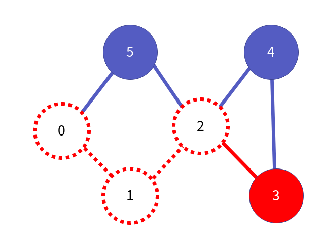
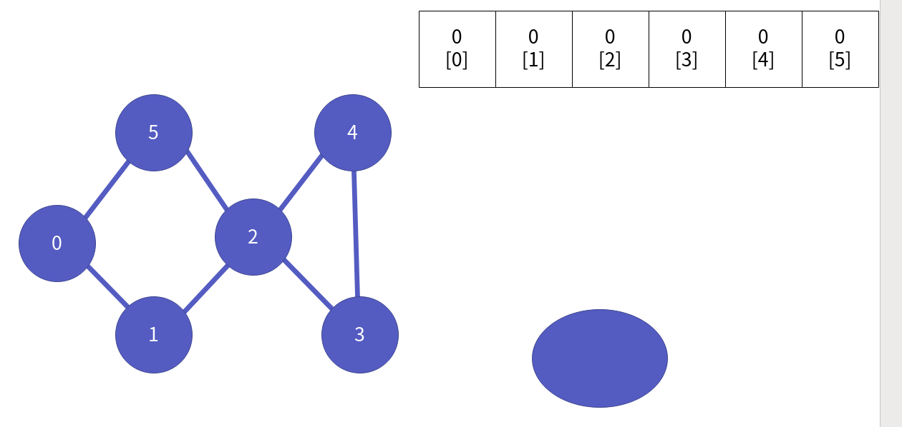
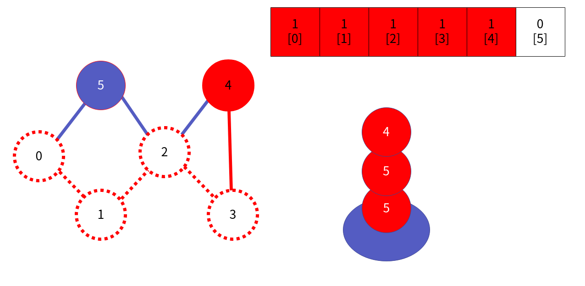
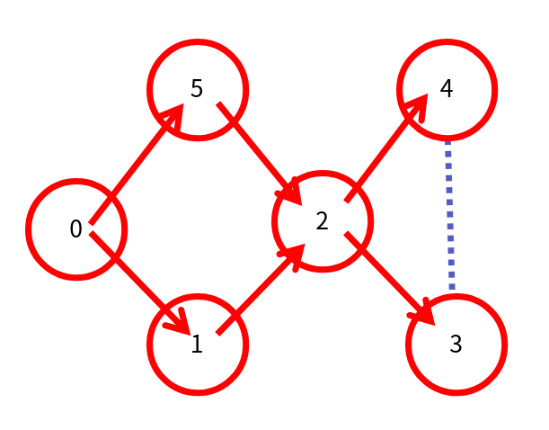

그래프 응용 1부 DFS와 BFS
===============

Contents
-------------------

1. 시작하며...
2. 깊이 우선 탐색 DFS
    * DFS 이해
    * DFS 구현 - 스택
    * DFS 구현 - 재귀
3. 너비 우선 탐색 BFS
    * BFS 이해
    * BFS 구현
4. 마치며...

## 시작하며...

구르미의 "Computer Science 정복하기 - 자료구조"의 스물 네 번째 장입니다. 이 장의 대략적인 내용은 다음과 같습니다. 

* DFS의 이해와 구현
* BFS의 이해와 구현

이 장의 소스코드는 다음을 참고해주세요.

    url: https://github.com/gurumee92/datastructure 
    branch: ch24
    code directory: src/ch24

자 시작합시다!


## 깊이 우선 탐색 DFS

먼저 그래프의 모든 정점을 탐색하는 방법 중 하나로 **깊이 우선 탐색**, 영어로는 "Depth First Search", 줄여서 DFS에 대해 알아보겠습니다.


### DFS 이해

DFS 탐색 방법은 "한 우물을 끝까지 파자" 전략입니다. 예를 들어보겠습니다. 다음 그래프가 있다고 가정하지요.


0번 정점부터 탐색을 시작한다고 가정하겠습니다.


이제 0번에 연결된 1번 혹은 5번 정점을 탐색합니다. 이렇게 한 개보다 많은 정점들과 연결되었을 땐, 번호가 낮은 정점을 선택하기로 하죠. 1번부터 탐색합니다.


1번 정점과 연결된 정점은 0번과 2번입니다. 그러나, 0번은 지나왔으니 2번 정점으로 이동합니다.


2번 정점과 연결된 정점은 지나온 1번 정점을 제외하고 3, 4, 5번 정점이 있습니다. 이 중, 제일 낮은 3번 정점으로 이동합니다.



3번 정점과 연결된 정점은, 2번, 4번 정점입니다. 그러나 2번은 지나왔으니 4번 정점으로 이동합니다.


4번 정점과 연결된 정점은 2번, 3번입니다. 이 경우, 어떻게 할까요? 이 경우는 지나온 3번 정점으로 돌아갑니다.


이제 3번 정점과 연결된 정점 2번 4번 역시 모두 지났습니다. 역시 지나온 2번 정점으로 돌아갑니다.


그리고 이제 2번과 연결된 정점들 중 안 지난 5번 정점으로 이동합니다. 


이제 0번 정점에서 갈 수 있는 모든 정점을 지났으니 탐색을 종료합니다. 이것이 DFS입니다. 결국 탐색 전체적인 탐색 방향은 다음과 같습니다.


### DFS 구현 - 스택

우리가 코드 레벨에서 DFS를 구현하기 위해서 필요한 것은 다음과 같습니다.

* 스택
* 각 정점들이 지났는지 여부를 저장하는 배열

또한, 이번에는 우리가 작성한 자료구조 그래프를 쓰지 않습니다. 그냥, 이차원 배열로 그래프를 표현하도록 하지요. 이제 코드 흐름을 그림으로 살펴보겠습니다. 먼저 위의 그래프에 대해서, 스택과 정점 개수만큼의 배열을 만들어둡니다.



위에서처럼 0번부터 시작합시다. 먼저 0번을 스택에 넣습니다.


그리고 이제 스택에서 0번을 빼냅니다. 이 때, 0번을 방문한 것으로 칩니다.


그리고 연결된 정점들을 거꾸로 스택에 저장합니다. 즉, 5번 1번 순으로 스택에 저장합니다.


이제 스택에 저장된 가장 맨 위의 정점 1번을 꺼냅니다. 1번에다 방문 표시를 합니다.


방문 정보를 저장하는 배열을 참고하여, 1번 정점과 연결 된 정점들 중 지나지 않은 2번 정점을 스택에 넣습니다.


이제 스택에 저장된 가장 맨 위의 정점 2번을 꺼냅니다. 2번에다 방문 표시를 합니다.


방문 정보를 저장하는 배열을 참고하여, 2번 정점과 연결 된 정점들 중 지나지 않은 3, 4, 5번 정점을 역순으로 스택에 넣습니다.


이제 스택에 저장된 가장 맨 위의 정점 3번을 꺼냅니다. 3번에다 방문 표시를 합니다.


방문 정보를 저장하는 배열을 참고하여, 3번 정점과 연결 된 정점 4번 정점을 스택에 넣습니다.


이제 스택에 저장된 가장 맨 위의 정점 4번을 꺼냅니다. 4번에다 방문 표시를 합니다.


방문 정보를 저장하는 배열을 참고합니다. 4번 정점과 연결된 정점들은 모두 방문했으니 스택에 넣지 않습니다.



이제 스택에서 다시 맨 위의 데이터를 꺼냅니다. 그런데 4번이지요? 4번은 이미 방문했습니다. 이 때는 그냥 넘깁니다.


다시 스택에 맨 위의 데이터를 꺼냅니다. 5번 정점입니다. 이제 5번에다 방문 표시를 합니다.


이제 모든 정점을 방문했습니다. 그럼 DFS를 종료하면 됩니다. 우리가 DFS를 위해 생성했던 스택과, 방문 정보를 담은 배열의 메모리를 회수해주어야 합니다. 결국 코드 흐름은 다음과 같습니다.

1. 먼저 시작 정점의 번호를 스택에 넣습니다.
2. 스택이 모두 비어지거나, 모든 정점을 방문할 때까지 다음을 반복합니다.
    1. 스택에서 가장 맨 위의 정점을 꺼냅니다.
    2. 만약, 방문한 정점이라면, 지나칩니다.
    3. 방문하지 않았다면, 방문 표시를 해둡니다.
    4. 정점과 연결된 정점 중, 방문하지 않은 정점들을 역순으로 스택에 넣습니다.

이를 토대로 만든 코드는 다음과 같습니다.

src/ch24/dfs/main.c
```c
#include "Stack.h"
void push(Stack * pStack, int data) {
    int * p = (int *) malloc(sizeof(int));
    *p = data;
    SPush(pStack, p);
}

int pop(Stack * pStack) {
    int data = *((int *) SPop(pStack));
    return data;
}

int isAllVisit(int * visitInfo) {
    for (int i=0; i<NUMBER_OF_VERTEX; i++) {
        if (visitInfo[i] != 1) {
            return 0;
        }
    }

    return 1;
}

void DFSWithStack(int (*graph)[NUMBER_OF_VERTEX], int * visitInfo, int start) {
    Stack stack;
    SInit(&stack);

    push(&stack, start);
    
    while (!SIsEmpty(&stack) && !isAllVisit(visitInfo)) {
        int visit = pop(&stack);

        if (visitInfo[visit]) {
            continue;
        }

        visitInfo[visit] = 1;
        printf("%d ", visit);
        
        for (int to=NUMBER_OF_VERTEX-1; to>=0; to--) {
            if (graph[visit][to] && !visitInfo[to]) {
                push(&stack, to);
            }
        }
    }

    printf("\n");
    SDestroy(&stack);
}
```


### DFS 구현 - 재귀

재귀 함수 호출의 원리는, **함수 호출 스택**에 있습니다. 결국, 스택을 쓰지 않고도, 재귀 함수만으로도 DFS를 작성할 수 있습니다. 코드 흐름은 거의 비슷합니다. 그러나 재귀 방식은 역순으로 정점 정보를 스택에다 올릴 필요가 없습니다. 그냥 **순서대로 방문한 정점에 대해 재귀 함수를 호출**하면 됩니다. 

재귀를 통해 작성한 DFS는 스택을 이용한 DFS보다 가독성이 뛰어나고 직관적이기 때문에 더 자주 쓰이는 것 같습니다. 한 번 호출 흐름이 어떻게 될지 직접 손으로 한 번 그려보세요. 그럼 DFS에 대해서 더 잘 이해하게 될 것입니다. 코드는 다음과 같습니다.

src/ch24/dfs/main.c
```c
void DFSWithRecursion(int (*graph)[NUMBER_OF_VERTEX], int * visitInfo, int visit) {
    if (visitInfo[visit] || isAllVisit(visitInfo)) {
        printf("\n");
        return;
    }

    visitInfo[visit] = 1;
    printf("%d " , visit);

    for (int to=0; to<NUMBER_OF_VERTEX; to++) {
        if (graph[visit][to] && !visitInfo[to]) {
            DFSWithRecursion(graph, visitInfo, to);
        }
    }
}
```


## 너비 우선 탐색 BFS

이제 그래프의 모든 정점을 탐색하는 다른 방법으로 **너비 우선 탐색**, 영어로는 "Breadth First Search", 줄여서 BFS에 대해 알아보겠습니다.


### BFS 이해

BFS 탐색 방법은 "여러 다리를 걸쳐놓자" 전략입니다. 예를 들어보겠습니다. 다음 그래프가 있다고 가정하지요.


0번 정점부터 탐색을 시작한다고 가정하겠습니다.


이제 0번 정점과 연결된 1번, 5번 정점을 방문합니다. 이렇게 한 개보다 많은 정점들과 연결되었을 땐 모든 정점을 방문한다고 하지요.


이제 1번, 5번 정점에 연결된 정점 2번을 방문합니다. 0번은 역시 지났기 때문에 DFS와 마찬가지로 생각하지 않습니다.


2번 정점과 연결된 정점은 지나온 1번, 5번 정점을 제외하고 3, 4 정점이 있습니다. 이 2개의 정점을 방문합니다.


이제 모든 정점을 방문했으니 탐색을 종료합니다. 결국 탐색 전체적인 탐색 방향은 다음과 같습니다.




### BFS 구현

우리가 코드 레벨에서 BFS를 구현하기 위해서 필요한 것은 다음과 같습니다.

* 큐
* 각 정점들이 지났는지 여부를 저장하는 배열

또한, 이번에도 우리가 작성한 자료구조 그래프를 쓰지 않습니다. 그냥, 이차원 배열로 그래프를 표현하도록 하지요. 이제 코드 흐름을 그림으로 살펴보겠습니다. 먼저 위의 그래프에 대해서, 큐와 정점 개수만큼의 배열을 만들어둡니다.


위에서처럼 0번부터 시작합시다. 먼저 0번을 큐에 넣습니다.


그리고 이제 큐에서 0번을 빼냅니다. 이 때, 0번 정점에 방문 표시를 합니다.


이제 0번과 연결된 정점 1번, 5번 정점을 큐에다 넣습니다.


큐에서 가장 맨 처음 저장된 1번을 빼냅니다. 이 때 1번 정점에 방문 표시를 합니다.


이제 1번 정점과 연결된 2번 정점을 큐에 넣습니다. 0번은 이미 지났으니 제외합니다.


큐에서 가장 맨 처음 저장된 5번을 빼냅니다. 이 때 5번 정점에 방문 표시를 합니다.


5번과 연결된 정점 2번 정점을 큐에 넣습니다. 0번은 이미 지났으니 제외합니다.


큐에서 가장 맨 처음 저장된 2번을 빼냅니다. 이 때 2번 정점에 방문 표시를 합니다.


2번 정점과 연결된 정점 1번, 5번 정점은 이미 지났으니 제외하고 나머지 3번, 4번 정점을 큐에 넣습니다. 


큐에서 가장 맨 처음 저장된 2번을 빼냅니다. 이 때 이미 2번을 방문했으니 넘어갑니다.


큐에서 가장 맨 처음 저장된 3번을 빼냅니다. 이 때 3번 정점에 방문 표시를 합니다.


3번 정점과 연결된 정점 2번 정점은 이미 지났으니 제외하고 나머지 4번 정점을 큐에 넣습니다. 


큐의 맨 처음 데이터 4번을 꺼냅니다. 이 때 4번 정점에 방문 표시를 합니다.


이제 모든 정점을 방문했습니다. 그럼 BFS를 종료하면 됩니다. 우리가 BFS를 위해 생성했던 큐와, 방문 정보를 담은 배열의 메모리를 회수해주어야 합니다. 결국 코드 흐름은 다음과 같습니다.

1. 먼저 시작 정점의 번호를 큐에 넣습니다.
2. 큐가 모두 비어지거나, 모든 정점을 방문할 때까지 다음을 반복합니다.
    1. 큐에서 가장 맨 처음 저장된 정점을 꺼냅니다.
    2. 만약, 방문한 정점이라면, 지나칩니다.
    3. 방문하지 않았다면, 방문 표시를 해둡니다.
    4. 정점과 연결된 정점 중, 방문하지 않은 정점들을 순서대로 큐에 넣습니다.

이를 토대로 만든 코드는 다음과 같습니다.

src/ch24/bfs/main.c
```c
#include "Queue.h"

void enqueue(Queue * pQueue, int data) {
    int * p = (int *) malloc(sizeof(int));
    *p = data;
    Enqueue(pQueue, p);
}

int dequeue(Queue * pQueue) {
    int data = *((int *) Dequeue(pQueue));
    return data;
}

int isAllVisit(int * visitInfo) {
    for (int i=0; i<NUMBER_OF_VERTEX; i++) {
        if (visitInfo[i] != 1) {
            return 0;
        }
    }

    return 1;
}

void BFS(int (*graph)[NUMBER_OF_VERTEX], int * visitInfo, int start) {
    Queue queue;
    QInit(&queue);

    enqueue(&queue, start);
    
    while (!QIsEmpty(&queue) && !isAllVisit(visitInfo)) {
        int visit = dequeue(&queue);

        if (visitInfo[visit]) {
            continue;
        }

        visitInfo[visit] = 1;
        printf("%d ", visit);
        
        for (int to=0; to < NUMBER_OF_VERTEX; to++) {
            if (graph[visit][to] && !visitInfo[to]) {
                enqueue(&queue, to);
            }
        }
    }

    printf("\n");
    QDestroy(&queue);
}
```


## 마치며...

이번 시간에는 그래프의 모든 정정을 탐색하는 2가지 방법, 깊이 우선 탐색(DFS)와, 너비 우선 탐색(BFS)에 대해 공부하였습니다. **깊이 우선 탐색은 보통, 완전 탐색 알고리즘에 자주 쓰이며, 너비 우선 탐색은 최단 거리 알고리즘에 쓰입니다.** 이들은, 매우 유용하고 중요합니다. 탐색 방버의 응용에 대해서는 추후 알고리즘 파트에서 다루도록 하겠습니다. 지금은 "DFS, BFS는 이런 방식으로 동작하는구나" 정도로 알고 넘어가시면 될 것 같습니다.

다음 시간에는 자료구조 파트의 마지막 장이자, 그래프의 다른 응용인 최소 신장 트리와, 그것을 만들게 하는 크루스칼 알고리즘에 대해서 공부하도록 하겠습니다.

