그래프 응용 2부 최소 신장 트리(MST)와 크루스칼 알고리즘
===============

Contents
-------------------

1. 시작하며...
2. 최소 신장 트리의 이해
3. 프림 알고리즘의 이해
4. 크루스칼 알고리즘의 이해와 구현
5. 마치며...


## 시작하며...

구르미의 "Computer Science 정복하기 - 자료구조"의 스물 다섯 번째 장입니다. 이 장의 대략적인 내용은 다음과 같습니다. 

* 최소 신장 트리의 이해
* 프림 알고리즘의 이해
* 크루스칼 알고리즘의 이해와 구현

이 장의 소스코드는 다음을 참고해주세요.

    url: https://github.com/gurumee92/datastructure 
    branch: ch25
    code directory: src/ch25

자 시작합시다!


## 최소 신장 트리의 이해

이번 시간에는 그래프의 응용중 하나인 **최소 신장 트리(Minimum Spanning Tree 이하 MST)**에 대해서 알아봅니다. "갑자기 왜 그래프에서 트리가 나오는거야!"라고 불멘소리를 하실 수도 있겠습니다. 이전에 제가 그래프를 소개할 때, 비선형 자료구조의 끝판왕이라고 한 것을 기억하시나요? 그 이유가 여기에 있습니다.

트리는 계층 구조를 표현하는 아주 좋은 자료구조입니다. 그래프는 이 트리의 개념을 포함합니다. 예를 들어 다음의 그래프가 있다고 가정해보겠습니다.

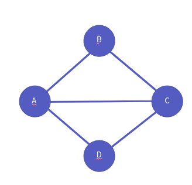

이 그래프에서 B -> D로 이동하는 경로가 무엇이 있을까요? 다음 경로들이 있겠죠?

* B -> A -> D
* B -> C -> D
* B -> A -> C -> D
* B -> C -> A -> D

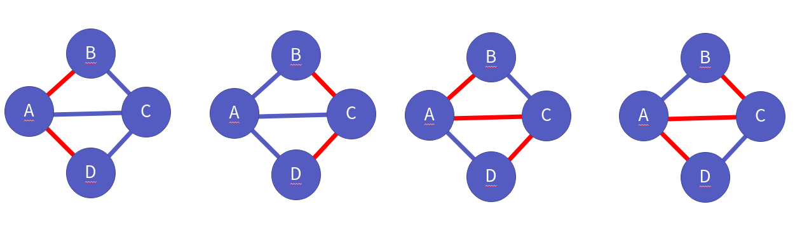

근데 이런 경로도 가능합니다.

* B -> A -> C -> B -> A -> D

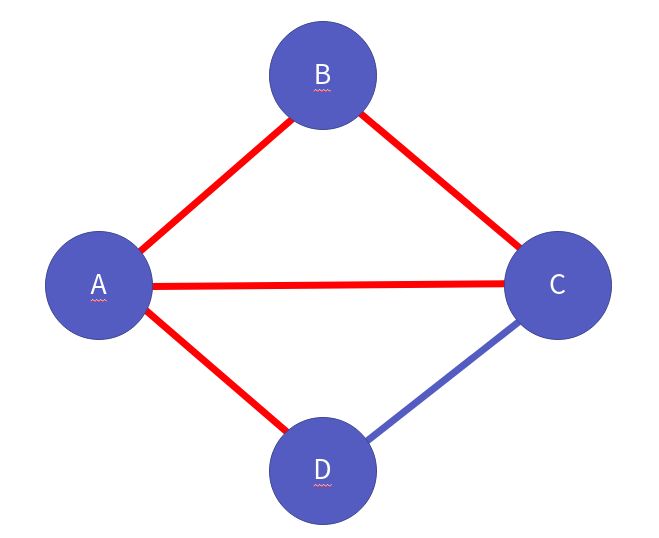

이런 경로를 **순환 경로**라고 하는데, **MST는 이런 순환 경로가 없고, 모든 정점이 연결된 그래프**를 말합니다. 다음과 같이 말이죠.

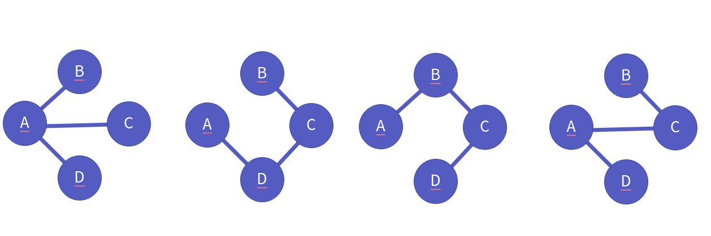

위 그래프들을 90도로 돌려볼까요?

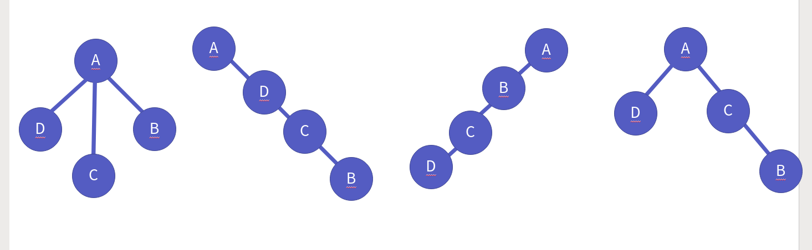

어떻습니까? 트리 구조와 같지 않나요? 그래서 최소 신장 트리라고 말합니다. MST가 되기 위한 조건은 다음과 같습니다.

1. 연결된 간선의 수 + 1 == 정점의 수
2. 모든 정점은 연결되어 있다.

보통 그래프를 MST로 만들 때, 다음의 제약 조건을 둡니다. 

> 간선의 "가중치"라는 정보가 저장된 그래프 구조

이 "가중치"라는 정보를 지닌 그래프 구조에서 MST로 만드는 알고리즘은 크게 다음의 2가지가 있습니다.

1. 프림 알고리즘
2. 크루스칼 알고리즘

이들에 대해 알아보도록 하지요.


## 프림 알고리즘의 이해

먼저 프림알고리즘의 전략은 **제일 작은 것부터 트리를 구성하기**입니다. 먼저 다음의 그래프가 있다고 합시다.

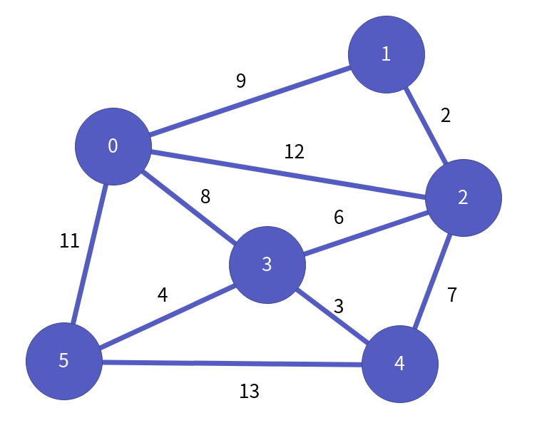

그래프가 지닌 모든 간선들에 대해서 가중치를 기준으로 오름차순으로 정렬합니다.

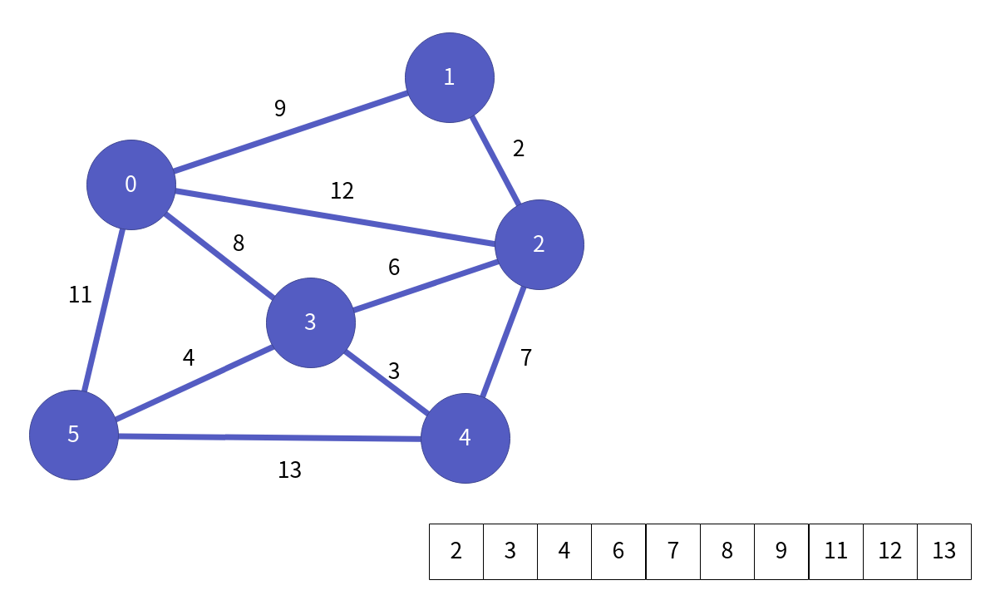

그래서 작은 것부터 그래프를 다시 연결합니다. 먼저 가중치 2, 정점 1과 정점 2를 잇는 간선을 추가합니다.

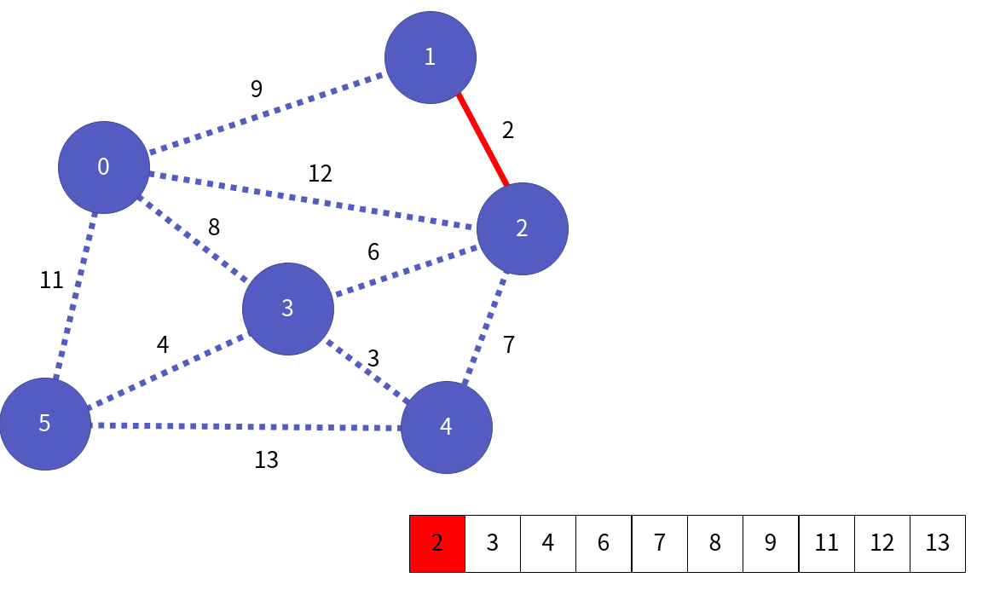

계속 이어나갑니다.

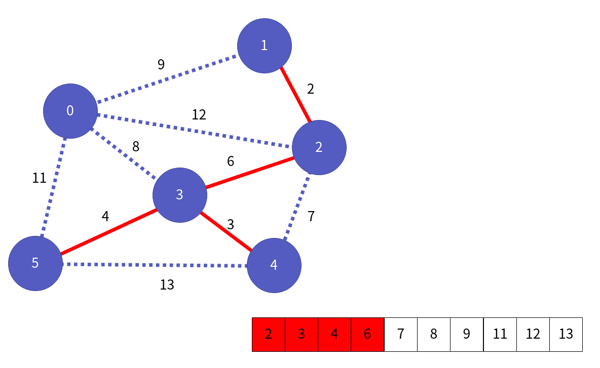

이어나가다보면, 가중치 7, 정점 2와 정점 5를 잇는 간선을 추가할 때, 순환 경로를 형성합니다.

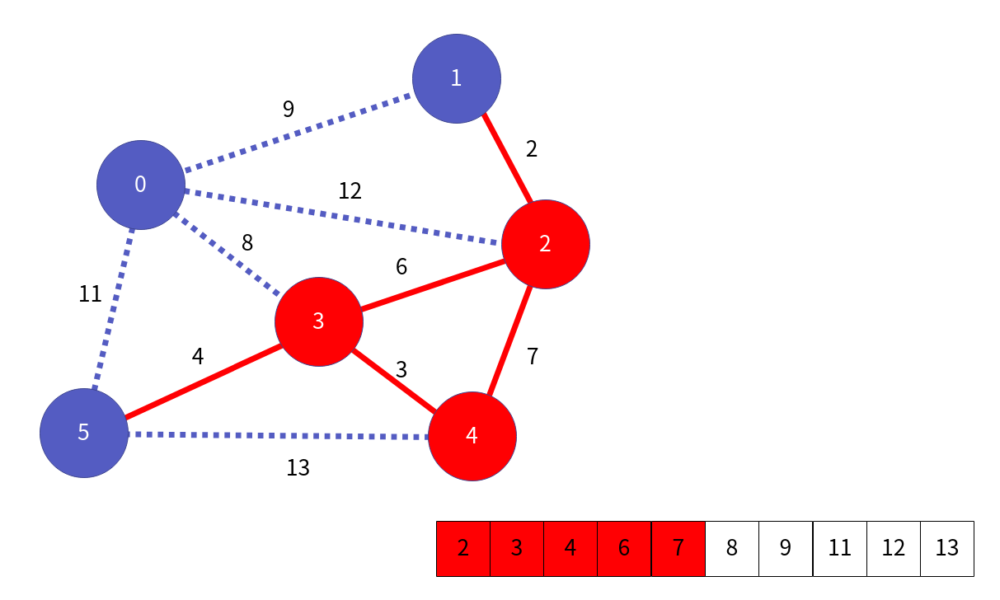 

이런 사이클을 형성하는 간선들을 빼고, 간선을 계속 연결합니다. 그럼 다음 모습이 됩니다.

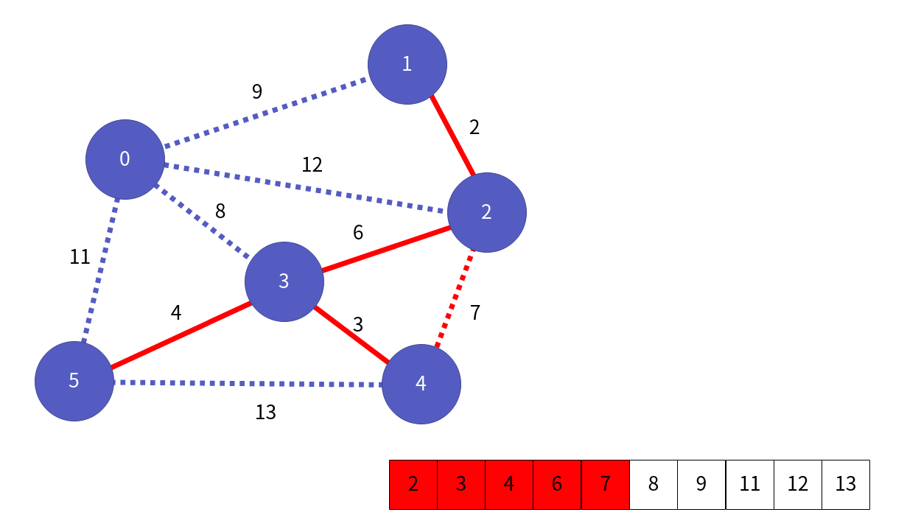 

이것이 바로, 프림 알고리즘입니다.


## 크루스칼 알고리즘의 이해와 구현

크루스칼 알고리즘은 프림 알고리즘과 정 반대로 **구성된 트리에서 가장 큰 것부터 제거하기** 전략입니다. 먼저 다음의 그래프가 있다고 하지요.


이번에는 가중치를 내림차순으로 정렬합니다.

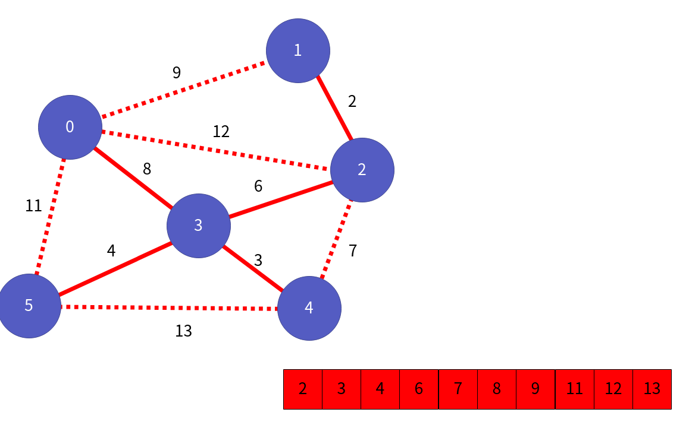

이제 큰 가중치를 갖는 간선(가중치 13, 정점 4와 정점 5를 잇는)을 제거합니다.

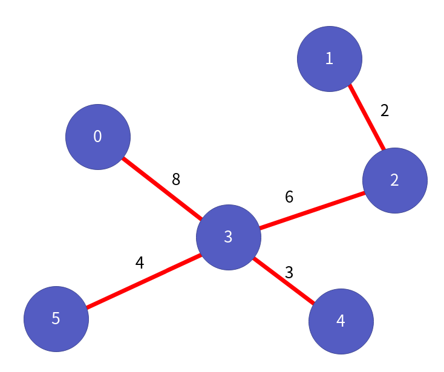

이 때, 정점 4와 정점 5는 간선이 제거되더라도 도달할 수 있습니다. 예를 들어 4 -> 3 -> 5 이동할 수가 있지요. 

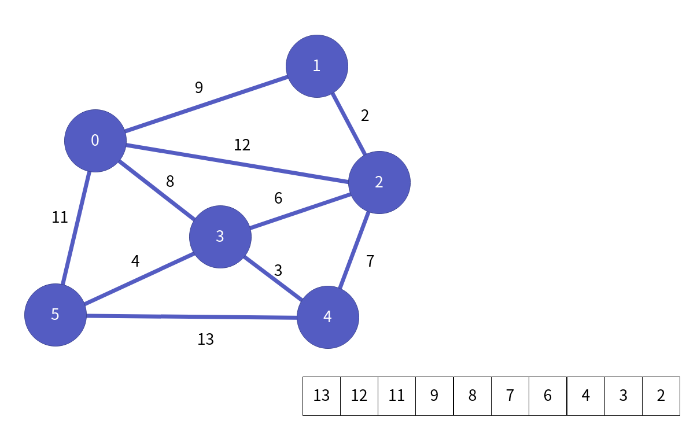

이런식으로 계속 지워나갑니다.

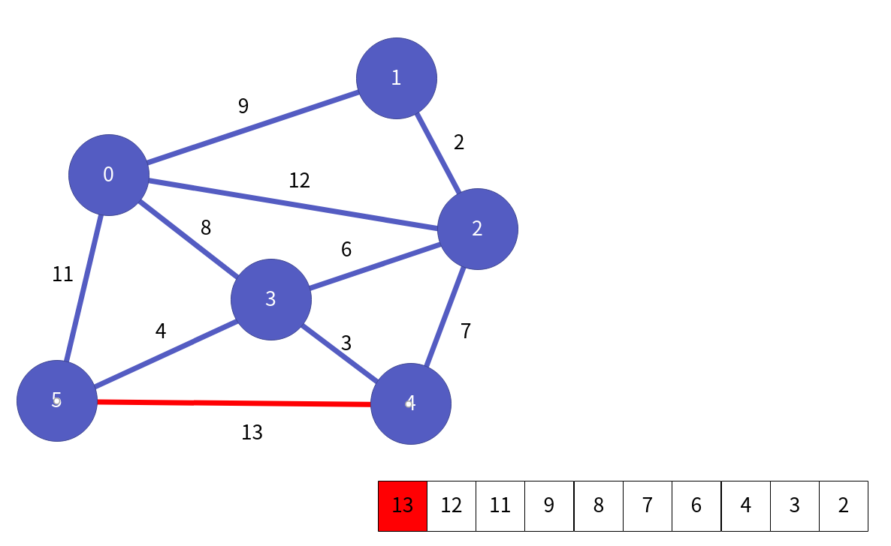

이 상황에서 만약 가중치 8, 정점 0과 정점 3번을 잇는 간선을 삭제하게 되면 어떻게 될까요? 아래 그림처럼 정점 0번에서 정점 3번을 갈 수 있는 방법이 없습니다.

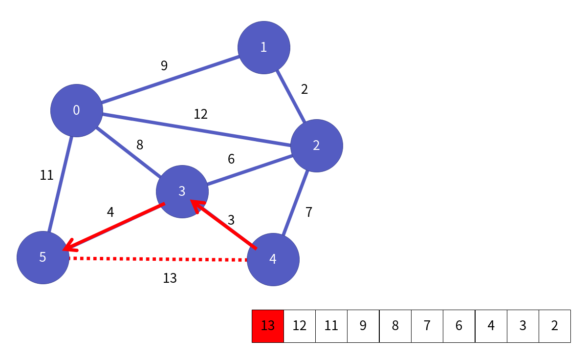

이런 경우는, 그냥 제거했던 간선을 다시 복구합니다. 그리고 계속 진행하는거죠. 결국 그럼 다음의 MST를 얻을 수 있습니다.

 

이제 크루스칼 알고리즘을 구현해보도록 하지요. 필요한 것은 다음과 같습니다.

* 우선순위 큐
* 스택 

우선 순위 큐는 그래프의 간선들에 대해서 **가중치를 기준으로 큰 것을 우선 순위**를 두어 저장하기 위해서 사용합니다. 스택은 간선을 삭제할 때, 그 간선이 없더라도, 정점과 정점 사이를 도달할 수 있어야 합니다. 그렇기 때문에 **DFS 방식을 이용하여 탐색**을 해야 합니다. 그래서 스택이 필요하지요. 코드 흐름은 다음과 같습니다.

1. 그래프의 모든 간선 정보를 토대로 우선 순위 큐에 저장합니다.
2. 간선의 개수를 셉니다.
3. "간선의 개수 + 1 == 정점 개수"가 될 때까지 다음을 반복합니다.
    1. 우선 순위 큐에서 간선을 빼옵니다.
    2. 해당 정점들의 연결을 해제합니다.
    3. 정점 v1에서 정점 v2로 이동할 수 있는지 확인합니다. (DFS를 이용해 탐색합니다)
    4. 만약 이동할 수 없으면, 다시 간선을 복구합니다. (이 땐, 우선순위 큐에 넣지 않습니다.)

코드는 다음과 같습니다.

src/ch25/main.c
```c
#include <stdio.h>
#include <stdlib.h>
#include <string.h>

#include "PriorityQueue.h"

#define NUMBER_OF_VERTEX 6

typedef struct _edge {
    int v1;
    int v2;
    int weight;
} Edge;

int isAllVisit(int * visitInfo) {
    for (int i=0; i<NUMBER_OF_VERTEX; i++) {
        if (visitInfo[i] != 1) {
            return 0;
        }
    }

    return 1;
}

//DFS를 이용해서 그래프에서 정점 v1과 정점 v2가 연결되는지 확인합니다.
int IsConnectedWithoutEdge(int (*graph)[NUMBER_OF_VERTEX], int * visitInfo, int visit, int dest) {
    if (visitInfo[visit]) {
        return 0;
    }

    if (visit == dest) {
        return 1;
    }

    int res = 0;

    visitInfo[visit] = 1;

    for (int to=0; to<NUMBER_OF_VERTEX; to++) {
        if (graph[visit][to] && !visitInfo[to]) {
            res |= IsConnectedWithoutEdge(graph, visitInfo, to, dest);
        }

        if (res) {
            break;
        }
    }

    return res;
}

//간선을 비교하는 함수
int edgeCompareFunc(void * p1, void * p2) {
    Edge * e1 = p1;
    Edge * e2 = p2;
    return (e1->weight) - (e2->weight);
}

//크루스칼 알고리즘을 통해서 Graph를 MST로 만드는 함수
void MakeMSTWithKruskal(int (*graph)[NUMBER_OF_VERTEX]) {
    PriorityQueue pq;
    QInit(&pq, edgeCompareFunc);

    int edgeCount = 0;
    // 간선 정보를 가중치가 큰 것을 우선순위로 하여 우선순위 큐에 모두 넣습니다.
    for (int i=0; i<NUMBER_OF_VERTEX; i++) {
        for (int j=i+1; j<NUMBER_OF_VERTEX; j++) {
            if (graph[i][j]) {
                Edge * edge = (Edge *) malloc(sizeof(Edge));
                edge->v1 = i;
                edge->v2 = j;
                edge->weight = graph[i][j];
                Enqueue(&pq, edge);
                edgeCount += 1;
            }
        }
    }

    //연결된 간선의 개수 + 1 == 정점의 개수가 될 때가지 다음을 반복합니다.
    //1. 우선 순위 큐에서 간선을 하나 빼옵니다.
    //2. 해당 간선을 제거합니다.
    //3. 그래프에서, 제거된 간선을 가진 두 정점이 연결될 수 있나 확인합니다.
    //4. 연결 될 수 없으면 다시 연결합니다.(이 때는 우선순위 큐에 넣지 않습니다.)
    while (edgeCount >= NUMBER_OF_VERTEX) {
        Edge * edge = (Edge *)Dequeue(&pq);
        int v1 = edge->v1;
        int v2 = edge->v2;
        int weight = edge->weight;

        graph[v1][v2] = 0;
        graph[v2][v1] = 0;
        edgeCount -= 1;

        int visitInfo[NUMBER_OF_VERTEX];
        memset(visitInfo, 0, sizeof(visitInfo));

        if (!IsConnectedWithoutEdge(graph, visitInfo, v1, v2)) {
            graph[v1][v2] = weight;
            graph[v2][v1] = weight;
            edgeCount += 1; 
        }
    }

    QDestory(&pq);
}

// 그래프 출력 함수
void ShowGraph(int (*graph)[NUMBER_OF_VERTEX]) {
    for (int i=0; i<NUMBER_OF_VERTEX; i++) {
        printf("정점 %d : ", i);

        for (int j=0; j<NUMBER_OF_VERTEX; j++) {
            if (graph[i][j]) {
                printf("%d ", j);
            }
        }
        printf("\n");
    }

    printf("\n");
}

int main () {
    int graph[NUMBER_OF_VERTEX][NUMBER_OF_VERTEX] = {
        {  0,  9, 12,  8,  0, 11 },
        {  9,  0,  2,  0,  0,  0 },
        { 12,  2,  0,  6,  7,  0 },
        {  8,  0,  6,  0,  3,  4 },
        {  0,  0,  7,  3,  0, 13 },
        { 11,  0,  0,  4, 13,  0 }
    };
    ShowGraph(graph);

    MakeMSTWithKruskal(graph);
    ShowGraph(graph);
    return 0;
}
```

## 마치며...

이번 장에서는 최소 신장 트리를 알아보았고, 그것을 만들기 위해 프림 알고리즘과, 크루스칼 알고리즘을 공부하였습니다. 특히 크루스칼 알고리즘에 중점을 두어서 구현까지 알아보았죠.

이렇게 해서 우리의 **자료구조의 마지막 장**을 마치도록 하겠습니다. 여기까지 오신 분들 너무 고생하셨습니다. 자료구조는 데이터를 표현하는 좋은 도구입니다. 하지만, 도구를 활용하는 방법을 모르면, 이것을 안다고 해도 별로 도움이 되지 않겠지요? 자료구조의 이해를 다 하셨다면, 자료구조를 이용해서 데이터를 처리하는 방법인 **알고리즘**에 대해서 공부해보는 것을 추천드립니다.

마지막으로, 부족한 글이지만 읽어주셔서 감사하다는 말 전하면서, 구르미의 "Computer Science 정복하기 - 자료구조" 마치도록 하겠습니다.